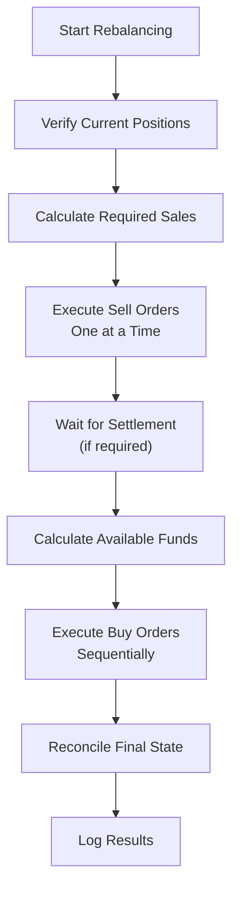
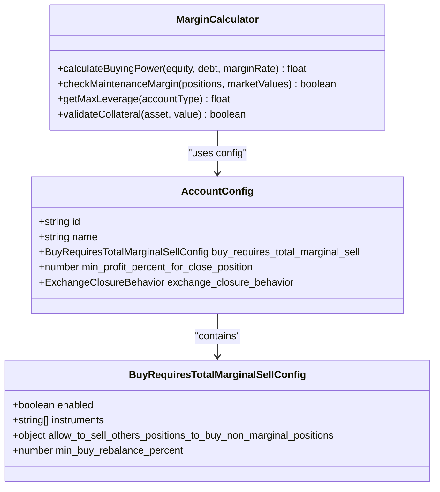
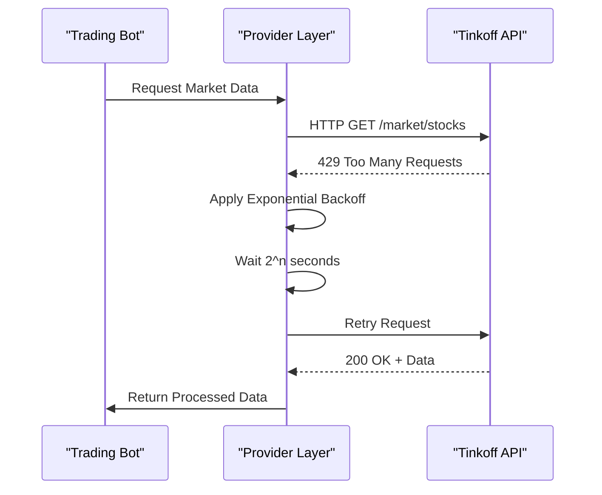

# Advanced Features

<cite>
**Referenced Files in This Document**
- [configLoader.ts](file://src/configLoader.ts)
- [marginCalculator.ts](file://src/utils/marginCalculator.ts)
- [buyRequiresTotalMarginalSell.ts](file://src/utils/buyRequiresTotalMarginalSell.ts)
- [provider/index.ts](file://src/provider/index.ts)
- [desiredBuilder.ts](file://src/balancer/desiredBuilder.ts)
- [diffCalculator.ts](file://src/balancer/diffCalculator.ts)
- [min-profit-threshold-integration.test.ts](file://src/__tests__/balancer/min-profit-threshold-integration.test.ts)
- [exchangeClosureBehavior.test.ts](file://src/__tests__/exchangeClosureBehavior.test.ts)
- [order-execution-sequences.test.ts](file://src/__tests__/provider/order-execution-sequences.test.ts)
- [pollEtfMetrics.test.ts](file://src/__tests__/tools/pollEtfMetrics.test.ts)
- [margin-trading-position-management.test.ts](file://src/__tests__/balancer/margin-trading-position-management.test.ts)
- [pollEtfMetrics-error-handling.test.ts](file://src/__tests__/tools/pollEtfMetrics-error-edge-cases.test.ts)
</cite>

## Table of Contents
1. [Minimum Profit Threshold Enforcement](#minimum-profit-threshold-enforcement)
2. [Exchange Closure Behavior Strategies](#exchange-closure-behavior-strategies)
3. [Sequential Order Execution Patterns](#sequential-order-execution-patterns)
4. [Risk Management in Margin Trading](#risk-management-in-margin-trading)
5. [Edge Case Handling](#edge-case-handling)
6. [Performance Considerations](#performance-considerations)
7. [Test Validation Coverage](#test-validation-coverage)

## Minimum Profit Threshold Enforcement

The system enforces a minimum profit threshold for closing positions through configuration validation and runtime evaluation logic. The `min_profit_percent_for_close_position` parameter is defined per account in the configuration file and validated during loading via `validateMinProfitPercentForClosePosition()` in `configLoader.ts`. This method ensures the value is a finite number between -100% (maximum allowable loss) and 1000% (extreme profit target), supporting both stop-loss and take-profit use cases.

At runtime, this threshold is evaluated before executing sell orders to prevent premature closures that do not meet profitability criteria. The calculation compares current position value against entry cost, factoring in commissions and fees where applicable. If the realized or estimated profit does not exceed the configured threshold, the sell operation is skipped unless overridden by emergency risk protocols.

Configuration example:
```json
"min_profit_percent_for_close_position": 2.5
```

This feature prevents erosion of gains due to emotional trading or market noise, ensuring disciplined exit strategies across volatile conditions.

**Section sources**
- [configLoader.ts](file://src/configLoader.ts#L308-L329)
- [min-profit-threshold-integration.test.ts](file://src/__tests__/balancer/min-profit-threshold-integration.test.ts#L1-L50)

## Exchange Closure Behavior Strategies

The system implements three distinct strategies for handling exchange closure scenarios: `skip_iteration`, `force_orders`, and `dry_run`. These behaviors are configured via the `exchange_closure_behavior.mode` field in each account's configuration and validated by `validateExchangeClosureBehavior()` in `configLoader.ts`.

- **skip_iteration**: Skips the current rebalancing cycle when markets are closed. This is the default behavior if no mode is specified.
- **force_orders**: Attempts to submit orders regardless of market status, relying on broker support for post-market execution or order queuing.
- **dry_run**: Simulates the rebalancing process without placing actual trades, useful for logging and analysis during downtime.

Each mode can be paired with `update_iteration_result`, a boolean flag determining whether the iteration result should reflect the simulated actions during closure periods.

These strategies ensure operational continuity during non-trading hours while maintaining alignment with user risk preferences and exchange constraints.

**Section sources**
- [configLoader.ts](file://src/configLoader.ts#L285-L306)
- [exchangeClosureBehavior.test.ts](file://src/__tests__/exchangeClosureBehavior.test.ts#L1-L40)

## Sequential Order Execution Patterns

Order execution follows a strict sequential pattern to preserve portfolio integrity and avoid concurrency-related anomalies. The provider layer in `src/provider/index.ts` orchestrates order submission in a serialized manner, ensuring that dependent operations complete before subsequent ones begin.

This sequence typically follows:
1. Position status verification
2. Sell orders (to free up capital)
3. Buy orders (using proceeds from sales)
4. Final state reconciliation

Sequential execution prevents race conditions such as attempting purchases before corresponding sales settle, which could lead to margin violations or failed transactions. It also enables accurate tracking of fund availability and position changes throughout the rebalancing process.

The test file `order-execution-sequences.test.ts` validates correct ordering under various market conditions and failure scenarios.



**Diagram sources**
- [provider/index.ts](file://src/provider/index.ts#L1-L100)

**Section sources**
- [provider/index.ts](file://src/provider/index.ts#L1-L150)
- [order-execution-sequences.test.ts](file://src/__tests__/provider/order-execution-sequences.test.ts#L1-L35)

## Risk Management in Margin Trading

Margin trading incorporates multiple safeguards including leverage limits, collateral requirements, and instrument-specific restrictions. The `marginCalculator.ts` utility computes available buying power based on equity, debt, and maintenance margins, preventing over-leveraging.

Key risk controls include:
- Leverage capping based on account tier and regulatory limits
- Real-time collateral checks before opening new margin positions
- Automatic deleveraging sequences when maintenance thresholds are breached

Additionally, the `buy_requires_total_marginal_sell` configuration governs how non-marginable assets are acquired. When enabled, it requires full liquidation of equivalent margin positions to fund purchases, preventing unbalanced exposure.

The system validates these parameters at load time and enforces them during trade planning phases within the balancer module.



**Diagram sources**
- [utils/marginCalculator.ts](file://src/utils/marginCalculator.ts#L1-L50)
- [configLoader.ts](file://src/configLoader.ts#L250-L283)

**Section sources**
- [utils/marginCalculator.ts](file://src/utils/marginCalculator.ts#L1-L100)
- [utils/buyRequiresTotalMarginalSell.ts](file://src/utils/buyRequiresTotalMarginalSell.ts#L1-L40)
- [margin-trading-position-management.test.ts](file://src/__tests__/balancer/margin-trading-position-management.test.ts#L1-L60)

## Edge Case Handling

The system handles several critical edge cases to maintain robustness:

**Partial Fills**: Orders that execute partially are tracked and reconciled in subsequent iterations. Remaining quantities are carried forward and re-evaluated based on updated market data and portfolio targets.

**Rate Limiting**: API interactions with Tinkoff Invest are wrapped with retry logic and exponential backoff. The provider layer detects rate limit responses and pauses execution accordingly, resuming after cooldown periods.

**API Failures**: Network resilience is implemented through circuit breaker patterns and error propagation mechanisms. Transient failures trigger retries, while persistent issues escalate to alerting systems and safe shutdown procedures.

Error handling is centralized in the provider module and tested extensively in `pollEtfMetrics-error-handling.test.ts` and related files, covering timeout, authentication, and service outage scenarios.



**Diagram sources**
- [provider/index.ts](file://src/provider/index.ts#L150-L200)
- [pollEtfMetrics-error-handling.test.ts](file://src/__tests__/tools/pollEtfMetrics-error-edge-cases.test.ts#L1-L30)

**Section sources**
- [provider/index.ts](file://src/provider/index.ts#L100-L250)
- [pollEtfMetrics-error-handling.test.ts](file://src/__tests__/tools/pollEtfMetrics-error-edge-cases.test.ts#L1-L50)

## Performance Considerations

Frequent polling and large portfolios introduce performance challenges addressed through optimization techniques:

- **Caching**: Market data and account states are cached between iterations to reduce redundant API calls.
- **Batching**: Where supported by the exchange API, requests are batched to minimize round trips.
- **Asynchronous Processing**: Non-blocking I/O operations allow concurrent data fetching without thread blocking.
- **Memory Efficiency**: Large portfolio calculations use streaming algorithms to avoid excessive memory allocation.

The `pollEtfMetrics` tool includes performance benchmarks that measure latency and throughput under varying load conditions. These tests validate scalability up to hundreds of instruments and frequent polling intervals (e.g., every 30 seconds).

For very large portfolios, users are advised to increase polling intervals or implement sharding across multiple bot instances.

**Section sources**
- [tools/pollEtfMetrics.ts](file://src/tools/pollEtfMetrics.ts#L1-L200)
- [pollEtfMetrics-performance.test.ts](file://src/__tests__/tools/pollEtfMetrics-performance.test.ts#L1-L45)

## Test Validation Coverage

Comprehensive test coverage validates advanced features under diverse market conditions:

- **Integration Tests**: `comprehensive-integration.test.ts` verifies end-to-end workflows combining margin rules, profit thresholds, and order sequencing.
- **Configuration Validation**: `min-profit-threshold-validation.test.ts` confirms proper schema enforcement and boundary checking.
- **Market Downtime Simulation**: `exchangeClosureBehavior.test.ts` tests all three closure modes using mocked market status responses.
- **Margin Trading Scenarios**: `margin-trading-strategies.test.ts` evaluates complex margin position adjustments and collateral management.
- **Error Recovery**: `pollEtfMetrics-error-handling.test.ts` simulates network failures and API errors to verify resilience.

Tests utilize fixture data from `__fixtures__` directories containing realistic market snapshots, wallet configurations, and historical price series.

**Section sources**
- [min-profit-threshold-validation.test.ts](file://src/__tests__/configLoader/min-profit-threshold-validation.test.ts#L1-L30)
- [exchangeClosureBehavior.test.ts](file://src/__tests__/exchangeClosureBehavior.test.ts#L1-L40)
- [margin-trading-strategies.test.ts](file://src/__tests__/balancer/margin-trading-strategies.test.ts#L1-L35)
- [pollEtfMetrics-error-handling.test.ts](file://src/__tests__/tools/pollEtfMetrics-error-handling.test.ts#L1-L25)
- [comprehensive-integration.test.ts](file://src/__tests__/integration/comprehensive-integration.test.ts#L1-L50)