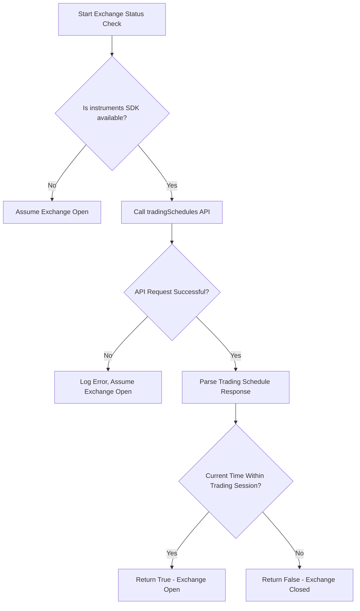
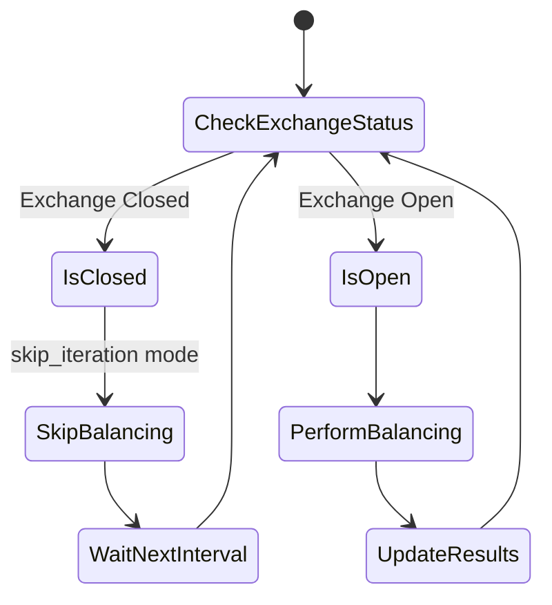
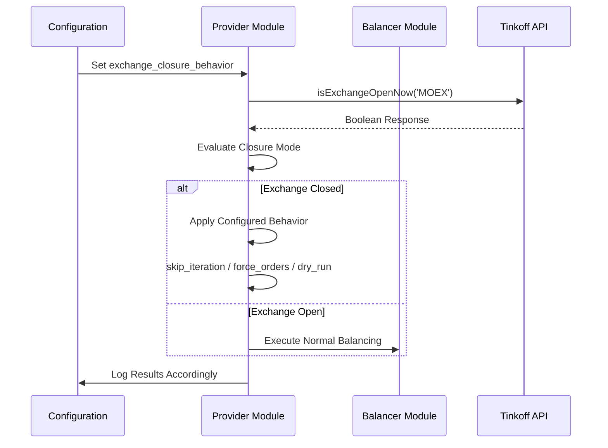

# Exchange Closure Behavior

<cite>
**Referenced Files in This Document**   
- [index.ts](file://src/provider/index.ts)
- [index.ts](file://src/balancer/index.ts)
- [market-closure-scenarios.test.ts](file://src/__tests__/provider/market-closure-scenarios.test.ts)
- [exchangeClosureBehavior.test.ts](file://src/__tests__/exchangeClosureBehavior.test.ts)
- [EXCHANGE_CLOSURE_IMPLEMENTATION.md](file://EXCHANGE_CLOSURE_IMPLEMENTATION.md)
</cite>

## Table of Contents
1. [Introduction](#introduction)
2. [Exchange Closure Detection Mechanism](#exchange-closure-detection-mechanism)
3. [Closure Behavior Modes](#closure-behavior-modes)
4. [Implementation in Provider Module](#implementation-in-provider-module)
5. [Balancer Workflow Adjustments](#balancer-workflow-adjustments)
6. [Integration with Margin Trading](#integration-with-margin-trading)
7. [Testing and Validation](#testing-and-validation)
8. [Troubleshooting Guide](#troubleshooting-guide)
9. [Performance Considerations](#performance-considerations)

## Introduction
The Tinkoff Invest ETF balancer bot implements configurable behavior strategies for handling exchange closure periods, including non-trading hours and market holidays. The system provides three distinct modes—skip_iteration, force_orders, and dry_run—that determine how the bot operates when the Moscow Exchange (MOEX) is closed. These strategies are configured through the `exchange_closure_behavior` setting in the account configuration, allowing users to customize their bot's response to market closure based on their trading preferences and risk tolerance.

**Section sources**
- [EXCHANGE_CLOSURE_IMPLEMENTATION.md](file://EXCHANGE_CLOSURE_IMPLEMENTATION.md#L1-L20)

## Exchange Closure Detection Mechanism
The bot detects exchange closure status through a combination of API-based schedule checks and time-based rules. The primary detection function `isExchangeOpenNow` queries the Tinkoff API's tradingSchedules endpoint to determine if the current time falls within active trading sessions for the specified exchange (default: MOEX).



**Diagram sources **
- [index.ts](file://src/provider/index.ts#L838-L904)

The detection logic examines both main and evening trading sessions, checking if the current timestamp falls within any active session boundaries. If the API request fails or the instruments SDK object is unavailable, the system defaults to assuming the exchange is open as a fail-safe mechanism. This approach ensures that temporary connectivity issues don't prevent legitimate trading during market hours.

**Section sources**
- [index.ts](file://src/provider/index.ts#L838-L904)

## Closure Behavior Modes
The bot supports three distinct modes for handling exchange closure scenarios, each designed for different trading strategies and risk profiles.

### Skip Iteration Mode
The default behavior that maintains backward compatibility with previous versions of the bot. When the exchange is closed, the entire balancing iteration is skipped, and the bot waits for the next scheduled interval.



**Diagram sources **
- [index.ts](file://src/provider/index.ts#L341-L820)

This conservative approach prevents any trading activity during non-market hours, reducing the risk of failed orders and unnecessary API calls. It's recommended for users who prefer to trade only during official market hours.

### Force Orders Mode
An aggressive strategy that attempts to place orders despite exchange closure. This mode performs full balancing calculations and proceeds with order execution regardless of the exchange status.

When enabled, the bot will:
- Proceed with portfolio analysis and rebalancing calculations
- Attempt to place all calculated buy and sell orders
- Handle API errors gracefully if order placement fails due to market closure
- Continue with subsequent iterations as scheduled

This mode may be useful for traders targeting extended trading sessions or those operating across multiple markets with different schedules.

### Dry Run Mode
A simulation mode that performs complete balancing calculations without placing actual orders. This allows users to monitor what trades would have been executed if the market were open.

In dry-run mode, the bot:
- Calculates target portfolio allocations
- Determines required buy/sell quantities
- Simulates order execution and resulting portfolio state
- Generates detailed output showing planned trades and expected outcomes
- Does not submit any orders to the exchange

This mode is particularly valuable for testing new configurations, analyzing trading strategies, or monitoring portfolio drift during market holidays without risking capital.

**Section sources**
- [EXCHANGE_CLOSURE_IMPLEMENTATION.md](file://EXCHANGE_CLOSURE_IMPLEMENTATION.md#L21-L70)

## Implementation in Provider Module
The exchange closure behavior is implemented in the provider module through conditional logic in the `getPositionsCycle` function. This function serves as the main control loop for the bot's balancing operations and incorporates the closure handling strategy.



**Diagram sources **
- [index.ts](file://src/provider/index.ts#L341-L820)

The implementation follows a structured decision process:
1. Retrieve the current exchange closure behavior configuration from the account settings
2. Check the current exchange status using the Tinkoff API
3. Based on the exchange status and configured mode, determine the appropriate action
4. Either skip the iteration, proceed with forced orders, or execute in dry-run mode
5. Update iteration results according to the `update_iteration_result` flag

The system includes comprehensive error handling, defaulting to safe behaviors when configuration values are invalid or missing. For example, unknown modes default to `skip_iteration`, and missing configurations use the backward-compatible default settings.

**Section sources**
- [index.ts](file://src/provider/index.ts#L341-L820)

## Balancer Workflow Adjustments
The balancer module adjusts its workflow based on the exchange closure settings, particularly in how it handles order queuing, state persistence, and retry logic.

### Order Queuing and Execution
When operating in `dry_run` mode, the balancer receives a `dryRun` parameter that prevents actual order generation while still performing all calculations. The order execution sequence follows a strict priority:


Sell orders are always executed first to ensure sufficient funds are available for subsequent purchases, particularly important for the `buy_requires_total_marginal_sell` feature. This sequential execution is maintained regardless of the closure mode, ensuring consistent behavior.

### State Persistence
During closure periods, the bot maintains state information that persists across iterations. This includes:
- Portfolio composition and valuations
- Calculated target allocations
- Simulated rebalancing results (in dry-run mode)
- Historical performance metrics

The state is updated only when `update_iteration_result` is true, which can be configured independently of the closure mode. This allows users to track portfolio evolution during market closure without executing trades.

### Retry Logic
The system implements intelligent retry mechanisms for failed operations:
- Temporary API failures trigger immediate retries with exponential backoff
- Market closure-related failures follow the configured behavior mode
- Critical configuration errors halt processing until resolved
- Network connectivity issues use progressive retry intervals

These mechanisms ensure robust operation during volatile market conditions and temporary service disruptions.

**Section sources**
- [index.ts](file://src/balancer/index.ts#L286-L813)

## Integration with Margin Trading
The exchange closure behavior integrates with margin trading decisions, affecting risk management and position adjustments during non-trading hours.

When margin trading is enabled, the closure mode influences:
- Margin position maintenance
- Leverage ratio adjustments
- Risk exposure during market closure
- Fund availability for next trading session

The system evaluates margin positions before applying closure behavior, ensuring that margin requirements are met even when skipping iterations. In `dry_run` mode, the bot simulates margin usage to help users assess potential leverage changes without actual position modifications.

Risk management implications include:
- Delayed executions potentially increasing overnight risk exposure
- Missed opportunities to adjust leverage ratios before market open
- Potential margin call risks if market conditions change significantly during closure
- Impact on profit/loss calculations due to unexecuted rebalancing

The integration ensures that margin positions are monitored continuously, with alerts generated if margin levels approach critical thresholds even when no trading occurs.

**Section sources**
- [index.ts](file://src/balancer/index.ts#L286-L813)

## Testing and Validation
The exchange closure behavior has been validated through comprehensive testing, including unit tests, integration tests, and real-world scenario simulations.

### Test Coverage
The test suite includes:
- Unit tests for individual closure mode logic
- Integration tests for end-to-end workflow validation
- Edge case scenarios for malformed configurations
- Performance tests for resource utilization
- Error handling verification

```mermaid
erDiagram
TEST_SUITE ||--o{ UNIT_TEST : contains
TEST_SUITE ||--o{ INTEGRATION_TEST : contains
TEST_SUITE ||--o{ EDGE_CASE : contains
UNIT_TEST }|--|| CLOSURE_MODE : validates
INTEGRATION_TEST }|--|| WORKFLOW : validates
EDGE_CASE }|--|| CONFIGURATION : validates
class TEST_SUITE {
+string name
+number totalTests
+number passingTests
}
class UNIT_TEST {
+string description
+boolean passes
+string modeTested
}
class INTEGRATION_TEST {
+string scenario
+boolean success
+string componentsTested
}
class EDGE_CASE {
+string condition
+expectedResult
+recoveryStrategy
}
class CLOSURE_MODE {
+string modeName
+string behaviorDescription
}
class WORKFLOW {
+string flowDescription
+string dependencies
}
class CONFIGURATION {
+string format
+validationRules
}
```

**Diagram sources **
- [market-closure-scenarios.test.ts](file://src/__tests__/provider/market-closure-scenarios.test.ts#L0-L611)
- [exchangeClosureBehavior.test.ts](file://src/__tests__/exchangeClosureBehavior.test.ts#L0-L210)

### Real-World Scenarios
The test files simulate various market closure situations:
- Regular non-trading hours (evenings and nights)
- Weekend closures
- Public holidays and special market closures
- Partial day closures (early closes)
- Extended holiday periods

These simulations verify that the bot correctly identifies closure periods and applies the configured behavior consistently across different timeframes and calendar events.

**Section sources**
- [market-closure-scenarios.test.ts](file://src/__tests__/provider/market-closure-scenarios.test.ts#L0-L611)
- [exchangeClosureBehavior.test.ts](file://src/__tests__/exchangeClosureBehavior.test.ts#L0-L210)

## Troubleshooting Guide
Common issues related to exchange closure handling and their solutions:

### Misconfigured Closure Handling
**Symptom**: Bot skips iterations unexpectedly or attempts trades during market closure
**Solution**: 
1. Verify the `exchange_closure_behavior` configuration syntax
2. Ensure valid mode values (`skip_iteration`, `force_orders`, `dry_run`)
3. Check that `update_iteration_result` is properly set as a boolean
4. Validate JSON structure in CONFIG.json

### Performance Impacts
Adjusting polling frequency affects both responsiveness and API rate limit consumption:
- Higher frequency: More responsive but increased API usage
- Lower frequency: Reduced API usage but delayed reaction to market opening
- Optimal setting: Balance between desired responsiveness and rate limit constraints

Monitor debug logs for `ITERATION #X FINISHED` messages to assess polling interval effectiveness.

### Common Errors
- **Invalid mode specified**: Use one of the three supported modes
- **Missing configuration**: Defaults to `skip_iteration` with no result updates
- **API connectivity issues**: System defaults to assuming market is open
- **Rate limiting**: Implement appropriate delays between requests

Always check the console output for diagnostic messages indicating exchange status and applied behavior mode.

**Section sources**
- [EXCHANGE_CLOSURE_IMPLEMENTATION.md](file://EXCHANGE_CLOSURE_IMPLEMENTATION.md#L140-L172)

## Performance Considerations
The exchange closure implementation has minimal performance impact on the overall system:

- **Runtime overhead**: Configuration check occurs once per cycle
- **Memory usage**: Negligible increase for storing closure behavior settings
- **API calls**: No additional requests beyond the standard trading schedule check
- **Processing time**: Sub-second evaluation of closure logic

The design prioritizes efficiency by:
- Caching configuration values
- Using lightweight conditional checks
- Avoiding redundant API calls
- Implementing fail-fast mechanisms for errors

These optimizations ensure that closure handling does not significantly affect the bot's primary balancing functions while providing flexible control over non-trading hour operations.

**Section sources**
- [EXCHANGE_CLOSURE_IMPLEMENTATION.md](file://EXCHANGE_CLOSURE_IMPLEMENTATION.md#L130-L139)