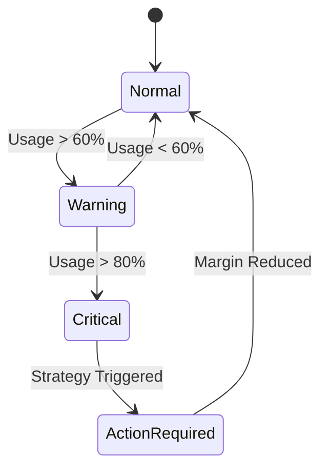
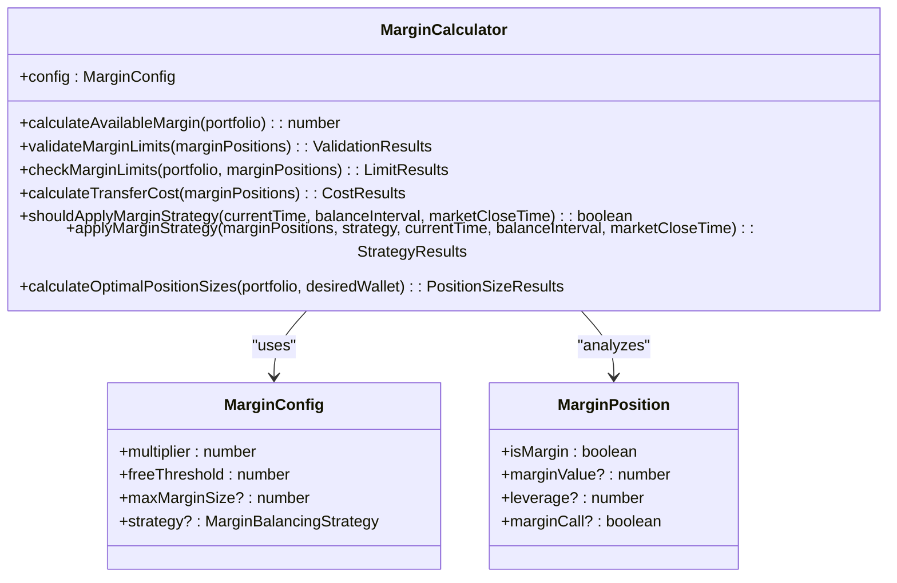
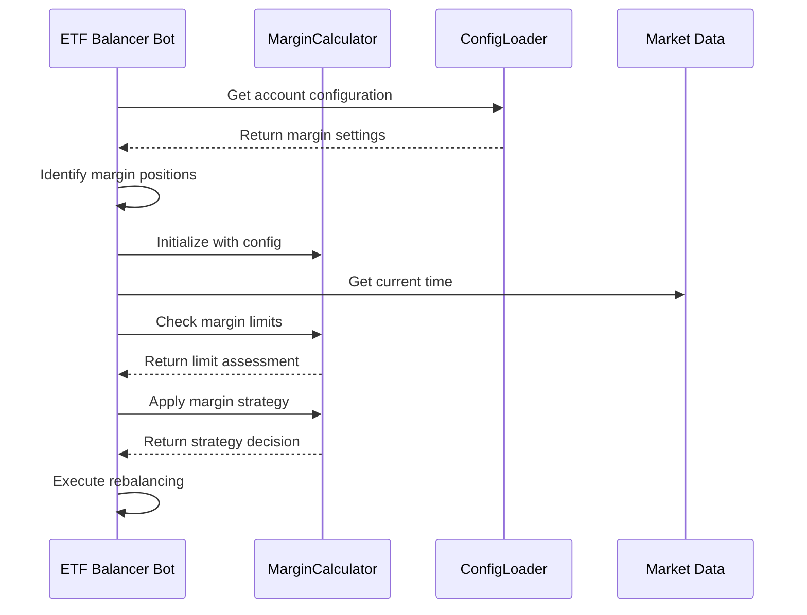

# Margin Trading Risk Management

<cite>
**Referenced Files in This Document**
- [marginCalculator.ts](file://src/utils/marginCalculator.ts)
- [configLoader.ts](file://src/configLoader.ts)
- [README.margin_trading.md](file://README.margin_trading.md)
- [MARGIN_TRADING_SUMMARY.md](file://MARGIN_TRADING_SUMMARY.md)
</cite>

## Table of Contents
1. [Introduction](#introduction)
2. [Leverage and Collateral Mechanics](#leverage-and-collateral-mechanics)
3. [Liquidation Risks and Mitigation](#liquidation-risks-and-mitigation)
4. [Margin Calculator Utility](#margin-calculator-utility)
5. [Configuration Parameters](#configuration-parameters)
6. [Position Management During Rebalancing](#position-management-during-rebalancing)
7. [Edge Case Handling](#edge-case-handling)
8. [Best Practices for Safe Configuration](#best-practices-for-safe-configuration)
9. [Monitoring and Reporting](#monitoring-and-reporting)

## Introduction
The ETF Balancer Bot implements a sophisticated margin trading system that allows portfolio expansion through borrowed funds with configurable leverage. The system provides automated risk management through conservative sizing algorithms, dynamic strategy application, and comprehensive monitoring capabilities. This document details the risk management features, focusing on leverage limits, collateral requirements, liquidation risks, and the mechanisms used to mitigate these risks.

**Section sources**
- [README.margin_trading.md](file://README.margin_trading.md#L1-L253)
- [MARGIN_TRADING_SUMMARY.md](file://MARGIN_TRADING_SUMMARY.md#L1-L123)

## Leverage and Collateral Mechanics
The margin trading system operates with a configurable portfolio multiplier ranging from 1 to 4, effectively providing leverage of up to 4x. The available margin is calculated as the total portfolio value multiplied by (multiplier - 1). For example, with a portfolio value of 1,000,000 RUB and a multiplier of 2, the available margin would be 1,000,000 RUB.

Collateral requirements are automatically managed by the system, which identifies margin positions based on the difference between the current position value and the base value (position value divided by the multiplier). The system ensures that margin usage remains within safe limits by continuously monitoring the margin usage ratio and available margin.

```mermaid
flowchart TD
A[Portfolio Value] --> B[Calculate Total Portfolio Value]
B --> C{Multiplier > 1?}
C --> |Yes| D[Available Margin = Portfolio Value × (Multiplier - 1)]
C --> |No| E[No Margin Available]
D --> F[Identify Margin Positions]
F --> G[Calculate Used Margin]
G --> H[Remaining Margin = Available - Used]
H --> I[Risk Level Assessment]
```

**Diagram sources**
- [marginCalculator.ts](file://src/utils/marginCalculator.ts#L16-L23)
- [marginCalculator.ts](file://src/utils/marginCalculator.ts#L53-L82)

**Section sources**
- [marginCalculator.ts](file://src/utils/marginCalculator.ts#L16-L23)
- [marginCalculator.ts](file://src/utils/marginCalculator.ts#L53-L82)

## Liquidation Risks and Mitigation
Liquidation risks are mitigated through multiple layers of protection. The system continuously monitors the margin usage ratio and classifies risk levels as low, medium, or high based on thresholds of 60% and 80% usage. When risk levels approach critical thresholds, the system can automatically trigger risk reduction measures.

The bot prevents excessive margin usage by validating all margin positions against maximum size limits. If the total margin used exceeds the configured maximum (default 5,000 RUB), the system flags this as invalid and prevents further margin expansion. This proactive validation helps prevent margin calls and forced liquidations.



**Diagram sources**
- [marginCalculator.ts](file://src/utils/marginCalculator.ts#L53-L82)
- [marginCalculator.ts](file://src/utils/marginCalculator.ts#L28-L48)

**Section sources**
- [marginCalculator.ts](file://src/utils/marginCalculator.ts#L53-L82)
- [marginCalculator.ts](file://src/utils/marginCalculator.ts#L28-L48)

## Margin Calculator Utility
The `MarginCalculator` utility is the core component responsible for all margin-related calculations and decisions. It provides several key functions for assessing available buying power and determining optimal position sizes while respecting account constraints.

The calculator determines available buying power by multiplying the total portfolio value by (multiplier - 1). It then calculates optimal position sizes by distributing the target portfolio size (portfolio value × multiplier) across assets according to the desired wallet allocation. The system ensures non-negative margin values and respects the portfolio's overall constraints.



**Diagram sources**
- [marginCalculator.ts](file://src/utils/marginCalculator.ts#L6-L275)
- [types.d.ts](file://src/types.d.ts#L40-L54)

**Section sources**
- [marginCalculator.ts](file://src/utils/marginCalculator.ts#L6-L275)
- [types.d.ts](file://src/types.d.ts#L40-L54)

## Configuration Parameters
The margin trading behavior is controlled by several configuration parameters that directly impact risk exposure. These parameters are defined in the account configuration and can be adjusted based on risk tolerance and trading strategy.

### Key Configuration Parameters
| Parameter | Description | Default Value | Valid Range |
|---------|-------------|---------------|-------------|
| `margin_trading.enabled` | Enables/disables margin trading | true | boolean |
| `margin_trading.multiplier` | Portfolio multiplier (leverage) | 2 | 1-4 |
| `margin_trading.free_threshold` | Threshold for free position transfers | 5,000 RUB | positive number |
| `margin_trading.max_margin_size` | Maximum allowed margin size | 5,000 RUB | positive number |
| `margin_trading.balancing_strategy` | Strategy for end-of-day margin handling | keep_if_small | remove/keep/keep_if_small |

The `marginStrategy` parameter (implemented as `balancing_strategy`) significantly affects risk exposure by determining how margin positions are handled at the end of the trading day. The three available strategies provide different risk profiles:

- **remove**: Eliminates all margin positions before market close, minimizing overnight risk
- **keep**: Maintains all margin positions, maximizing potential returns but increasing risk
- **keep_if_small**: Preserves margin positions only if their total value is below the maximum threshold, balancing risk and reward

**Section sources**
- [configLoader.ts](file://src/configLoader.ts#L341-L341)
- [README.margin_trading.md](file://README.margin_trading.md#L1-L253)

## Position Management During Rebalancing
During rebalancing cycles, margin positions are identified, evaluated, and managed through a systematic process. The bot first identifies margin positions by comparing each position's value to its base value (position value divided by the multiplier). Only positions with positive margin value are considered true margin positions.

The evaluation process involves checking margin limits, calculating transfer costs, and determining whether to maintain or remove margin positions based on the configured strategy. The decision to remove margin positions is made dynamically based on time-to-market-close calculations and the configured balancing strategy.



**Diagram sources**
- [marginCalculator.ts](file://src/utils/marginCalculator.ts#L161-L243)
- [index.ts](file://src/balancer/index.ts#L102-L192)

**Section sources**
- [marginCalculator.ts](file://src/utils/marginCalculator.ts#L161-L243)
- [index.ts](file://src/balancer/index.ts#L102-L192)

## Edge Case Handling
The system includes robust handling for various edge cases that could impact margin trading, including sudden volatility spikes and funding rate changes. The most critical edge case is the timing of strategy application, which uses a dynamic algorithm to determine when it's the last rebalancing cycle of the day.

The `shouldApplyMarginStrategy` method evaluates two conditions to determine if a margin strategy should be applied:
1. Time until market close is less than the time until the next rebalancing interval
2. Time until market close is less than 15 minutes (indicating the final balance of the day)

This dual-condition approach ensures that margin strategies are applied appropriately regardless of the rebalancing interval configuration. Additionally, the system handles market closure scenarios by treating post-closure times as the end of the trading day, triggering appropriate margin actions.

For sudden market volatility, the system's conservative sizing algorithms naturally reduce position sizes when portfolio values fluctuate significantly, helping to maintain margin stability. The maximum margin size limit also acts as a circuit breaker, preventing excessive margin usage during volatile periods.

**Section sources**
- [marginCalculator.ts](file://src/utils/marginCalculator.ts#L128-L156)
- [marginCalculator.ts](file://src/utils/marginCalculator.ts#L161-L243)

## Best Practices for Safe Configuration
To ensure safe operation of the margin trading features, several best practices should be followed when configuring the system:

### Conservative Sizing Recommendations
- Start with a multiplier of 2 rather than the maximum 4 to limit initial risk exposure
- Set the `max_margin_size` parameter to a level that represents an acceptable risk threshold
- Use the `keep_if_small` strategy as the default, as it automatically reduces risk when margin positions grow too large
- Regularly review and adjust the free transfer threshold based on actual trading costs

### Risk Management Guidelines
- Monitor the risk level indicator (low/medium/high) and investigate any transitions to medium or high levels
- Implement regular audits of margin position accuracy and valuation
- Test configuration changes in a simulated environment before applying them to live accounts
- Establish clear thresholds for manual intervention when automated systems reach predefined risk levels

### Configuration Validation
The system performs automatic validation of margin configuration parameters to prevent unsafe settings. This includes:
- Validating that the multiplier is within the 1-4 range
- Ensuring percentage allocations sum to reasonable totals (50-150%)
- Checking that maximum margin size is a positive, finite number
- Verifying that strategy parameters use valid enum values

**Section sources**
- [configLoader.ts](file://src/configLoader.ts#L200-L300)
- [README.margin_trading.md](file://README.margin_trading.md#L1-L253)

## Monitoring and Reporting
The bot provides comprehensive monitoring capabilities for tracking key risk indicators through its reporting tools. All margin-related operations are logged with detailed information about decisions, costs, and timing.

Key metrics available for monitoring include:
- Available and used margin amounts
- Margin usage ratio and risk level classification
- Transfer costs for margin position adjustments
- Strategy application timing and reasons
- Historical trends in margin utilization

The reporting system captures snapshots of the desired wallet at each rebalancing iteration, allowing for detailed analysis of how margin positions evolve over time. This data can be used to evaluate the effectiveness of different margin strategies and identify optimization opportunities.

Additionally, the system generates detailed logs for all margin-related decisions, including the specific reasons for applying or not applying margin strategies. These logs serve as an audit trail and help users understand the bot's decision-making process in various market conditions.

**Section sources**
- [diffManager.ts](file://src/balancer/diffManager.ts#L1-L256)
- [README.margin_trading.md](file://README.margin_trading.md#L1-L253)