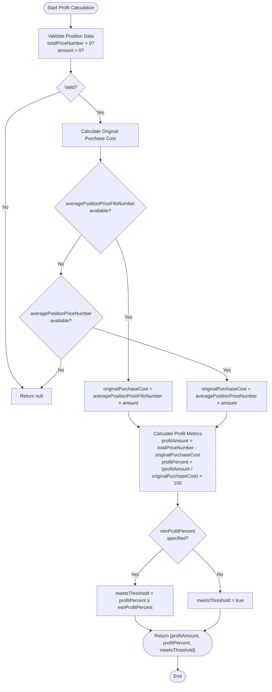
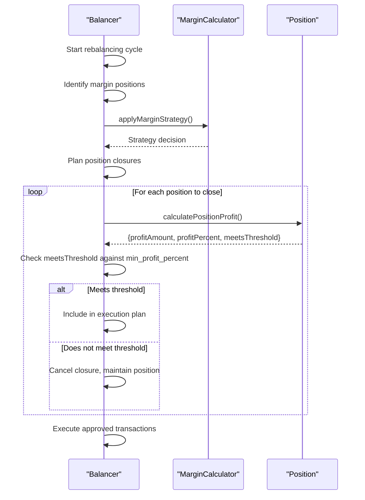

# Minimum Profit Threshold

<cite>
**Referenced Files in This Document **   
- [CONFIG.example.json](file://CONFIG.example.json)
- [buyRequiresTotalMarginalSell.ts](file://src/utils/buyRequiresTotalMarginalSell.ts)
- [marginCalculator.ts](file://src/utils/marginCalculator.ts)
- [index.ts](file://src/balancer/index.ts)
- [min-profit-threshold-logic.test.ts](file://src/__tests__/min-profit-threshold-logic.test.ts)
</cite>

## Table of Contents
1. [Introduction](#introduction)
2. [Profit Calculation Logic](#profit-calculation-logic)
3. [Configuration Options](#configuration-options)
4. [Integration with Margin Trading](#integration-with-margin-trading)
5. [Edge Cases and Error Handling](#edge-cases-and-error-handling)
6. [Performance Considerations](#performance-considerations)

## Introduction
The minimum profit threshold feature enables the trading bot to make intelligent decisions about when to close positions based on profitability criteria. This mechanism prevents premature selling of positions that haven't reached desired profit targets while allowing strategic exits from unprofitable positions when configured with negative thresholds (stop-loss functionality). The system integrates with margin trading strategies and rebalancing workflows to ensure optimal portfolio management.

**Section sources**
- [CONFIG.example.json](file://CONFIG.example.json#L0-L51)

## Profit Calculation Logic
The core profit calculation determines whether a position meets the minimum profit threshold before it can be closed. The algorithm uses the following formula:

```
profitAmount = currentMarketValue - originalPurchaseCost
profitPercent = (profitAmount / originalPurchaseCost) * 100
meetsThreshold = profitPercent >= minProfitPercent
```

The system prioritizes FIFO (First-In, First-Out) cost basis when available through `averagePositionPriceFifoNumber`, falling back to average cost basis via `averagePositionPriceNumber` if FIFO data is unavailable. The calculation requires valid values for `totalPriceNumber` (current market value) and `amount` (position size), returning null if these values are missing or invalid.



**Diagram sources **
- [buyRequiresTotalMarginalSell.ts](file://src/utils/buyRequiresTotalMarginalSell.ts#L13-L60)

**Section sources**
- [buyRequiresTotalMarginalSell.ts](file://src/utils/buyRequiresTotalMarginalSell.ts#L13-L60)
- [min-profit-threshold-logic.test.ts](file://src/__tests__/min-profit-threshold-logic.test.ts#L0-L287)

## Configuration Options
The minimum profit threshold is configured through the `min_profit_percent_for_close_position` parameter in the account configuration within CONFIG.json. This setting applies globally to all sell decisions for the specified account.

### Configuration Schema
The configuration supports both positive thresholds (minimum profit requirements) and negative thresholds (stop-loss protection):

| Parameter | Type | Description | Example Values |
|---------|------|-------------|----------------|
| `min_profit_percent_for_close_position` | number | Minimum profit percentage required to close a position | 5 (5% minimum profit)<br>-5 (5% maximum loss)<br>0 (break-even only)<br>undefined (no threshold) |

### Example Configuration
```json
{
  "accounts": [
    {
      "id": "account_1",
      "name": "Основной брокерский счет",
      "desired_wallet": {
        "TGLD": 8.33,
        "TRUR": 8.33
      },
      "min_profit_percent_for_close_position": 5,
      "margin_trading": {
        "enabled": false,
        "multiplier": 2,
        "balancing_strategy": "keep_if_small"
      }
    }
  ]
}
```

When set to a positive value (e.g., 5), the system will only close positions that have achieved at least 5% profit. When set to a negative value (e.g., -5), the system implements a stop-loss strategy, allowing positions to be closed if losses exceed 5%. A value of 0 requires positions to at least break even before closing.

**Section sources**
- [CONFIG.example.json](file://CONFIG.example.json#L0-L51)

## Integration with Margin Trading
The minimum profit threshold feature integrates with the margin trading system through the `MarginCalculator` class and rebalancing workflow. During portfolio rebalancing, the system evaluates profit thresholds before executing any margin position adjustments.

### Workflow Integration
When margin trading is enabled, the system follows this sequence during rebalancing:

1. Identify current margin positions using `identifyMarginPositions`
2. Apply margin strategy based on configured balancing strategy
3. Evaluate minimum profit thresholds for any positions scheduled for closure
4. Execute transactions according to the validated plan

The integration ensures that margin positions are not closed prematurely unless they meet the configured profit criteria. This prevents unnecessary transfer costs and maintains optimal leverage positioning.



**Diagram sources **
- [index.ts](file://src/balancer/index.ts#L74-L111)
- [marginCalculator.ts](file://src/utils/marginCalculator.ts#L6-L275)

**Section sources**
- [index.ts](file://src/balancer/index.ts#L74-L111)
- [marginCalculator.ts](file://src/utils/marginCalculator.ts#L6-L275)

## Edge Cases and Error Handling
The implementation includes comprehensive error handling for various edge cases that could affect profit calculations and trading decisions.

### Invalid Data Conditions
The system gracefully handles missing or invalid data by returning null when critical information is unavailable:
- Returns null if `totalPriceNumber` is missing or ≤ 0
- Returns null if `amount` is missing or ≤ 0  
- Returns null if neither `averagePositionPriceFifoNumber` nor `averagePositionPriceNumber` is available

### Floating-Point Precision
The system accounts for floating-point precision issues in financial calculations by using appropriate rounding methods and comparison tolerances. The tests verify boundary conditions where profit percentages exactly match threshold values, ensuring consistent behavior.

### Special Scenarios
The implementation handles several special scenarios:
- **Zero-profit positions**: Positions at break-even point (0% profit) do not meet positive thresholds
- **Exact threshold matches**: Positions with profit exactly equal to the threshold are considered to meet the criteria (≥ comparison)
- **Disabled threshold**: When `min_profit_percent_for_close_position` is undefined, all positions can be closed regardless of profitability
- **Negative thresholds**: Allows closing positions at a loss up to the specified percentage

These edge cases are thoroughly tested in the `min-profit-threshold-logic.test.ts` file, which includes test cases for extreme values, decimal thresholds, and business logic validation.

**Section sources**
- [min-profit-threshold-logic.test.ts](file://src/__tests__/min-profit-threshold-logic.test.ts#L0-L287)
- [buyRequiresTotalMarginalSell.ts](file://src/utils/buyRequiresTotalMarginalSell.ts#L13-L60)

## Performance Considerations
The minimum profit threshold feature is designed for efficient operation across large portfolios with frequent rebalancing cycles.

### Optimization Strategies
The system employs several optimization techniques:
- **Caching**: Position data is processed once per rebalancing cycle and reused throughout the workflow
- **Early termination**: The calculation returns immediately when insufficient data is available
- **Batch processing**: All position evaluations occur within a single iteration through the portfolio

### Execution Frequency
The feature is evaluated during each rebalancing cycle, which typically occurs every hour (configurable via `balance_interval`). For high-frequency trading scenarios, the system minimizes computational overhead by:
- Using simple arithmetic operations without complex dependencies
- Avoiding external API calls during profit calculations
- Implementing the logic synchronously to prevent promise overhead

The performance impact is minimal, with profit calculations adding negligible latency to the overall rebalancing process. The system can efficiently handle portfolios with dozens of positions without significant performance degradation.

**Section sources**
- [index.ts](file://src/balancer/index.ts#L74-L111)
- [buyRequiresTotalMarginalSell.ts](file://src/utils/buyRequiresTotalMarginalSell.ts#L13-L60)