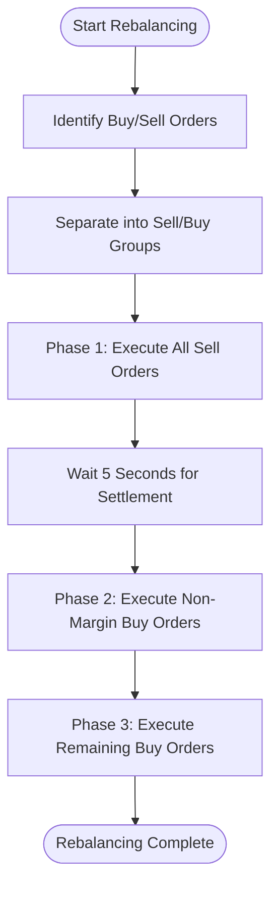
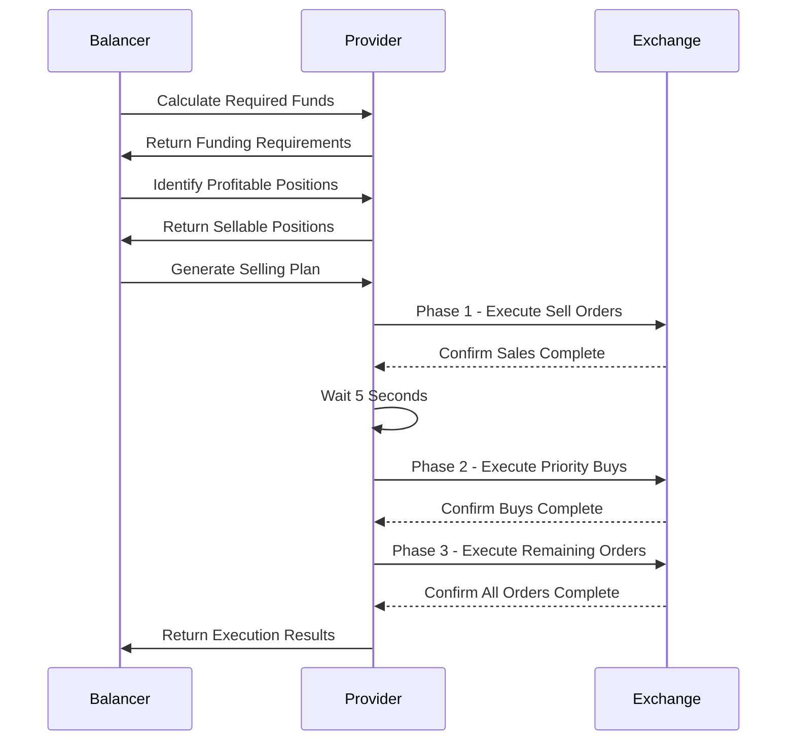
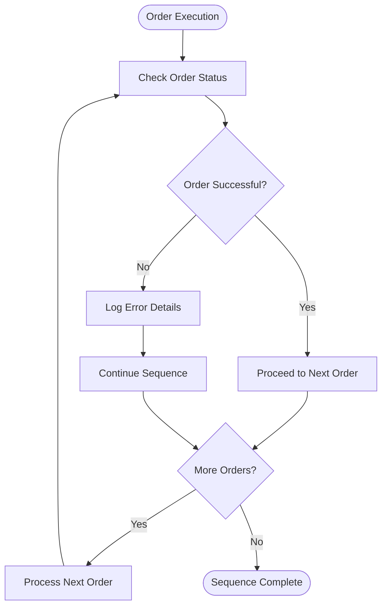
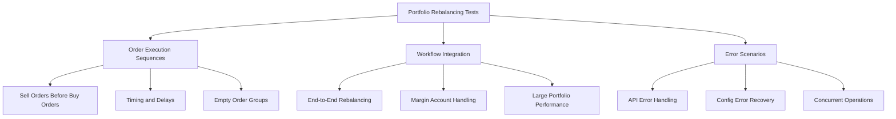
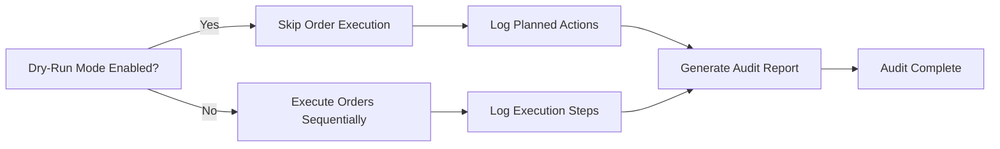
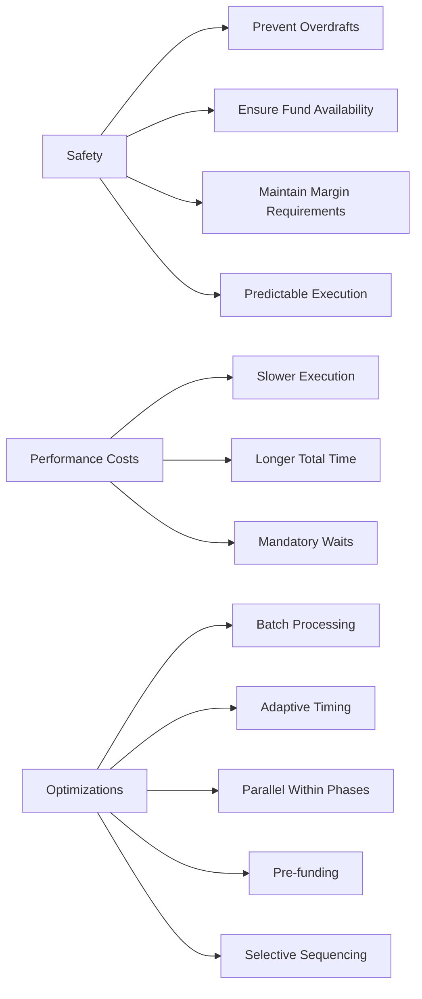

# Sequential Order Execution

<cite>
**Referenced Files in This Document**   
- [index.ts](file://src/balancer/index.ts)
- [index.ts](file://src/provider/index.ts)
- [buyRequiresTotalMarginalSell.ts](file://src/utils/buyRequiresTotalMarginalSell.ts)
- [order-execution-sequences.test.ts](file://src/__tests__/provider/order-execution-sequences.test.ts)
- [portfolio-rebalancing-workflow.test.ts](file://src/__tests__/integration/portfolio-rebalancing-workflow.test.ts)
</cite>

## Table of Contents
1. [Introduction](#introduction)
2. [Sequential Execution Pattern](#sequential-execution-pattern)
3. [Execution Phases and Portfolio Integrity](#execution-phases-and-portfolio-integrity)
4. [Error Handling During Sequence Processing](#error-handling-during-sequence-processing)
5. [Integration Testing and Market Condition Validation](#integration-testing-and-market-condition-validation)
6. [Dry-Run Mode and Auditability](#dry-run-mode-and-auditability)
7. [Performance Trade-offs and Optimization](#performance-trade-offs-and-optimization)
8. [Conclusion](#conclusion)

## Introduction

The sequential order execution pattern is a critical component of the portfolio rebalancing system, ensuring financial integrity when managing interdependent buy/sell operations in margin accounts. This document details how the balancer enforces strict execution ordering to maintain portfolio stability, prevent overdrafts, and ensure proper fund availability before executing purchases. The implementation uses a phased approach with status verification between steps, comprehensive error handling for partial fills and API limitations, and integration with dry-run mode for auditability.

**Section sources**
- [index.ts](file://src/balancer/index.ts#L286-L813)
- [index.ts](file://src/provider/index.ts#L119-L159)

## Sequential Execution Pattern

The system implements a three-phase sequential execution pattern that ensures sell orders are completed before buy orders, maintaining proper fund availability throughout the rebalancing process. This pattern is particularly important for margin accounts where improper sequencing could lead to insufficient funds or margin violations.

The execution follows a strict order:
1. All sell orders are executed first to raise necessary funds
2. Priority non-margin buy orders are executed using the raised funds
3. Remaining buy orders are executed normally

This approach prevents race conditions and ensures that funds from sales are available before any purchases are attempted. The `generateOrdersSequential` function in the provider module orchestrates this process, processing each phase sequentially with explicit waits between phases to allow for settlement.

**Diagram sources**
- [index.ts](file://src/provider/index.ts#L119-L159)
- [index.ts](file://src/balancer/index.ts#L286-L813)

**Section sources**
- [index.ts](file://src/provider/index.ts#L119-L159)
- [index.ts](file://src/balancer/index.ts#L286-L813)

## Execution Phases and Portfolio Integrity

The sequential execution maintains portfolio integrity through a well-defined three-phase process that handles interdependent operations safely. Each phase serves a specific purpose in the rebalancing workflow:

### Phase 1: Sell Orders Execution
All sell orders are processed first to generate the necessary liquidity for subsequent purchases. This phase executes market sell orders for positions identified for reduction, with each order awaiting completion before the next begins. After completing all sell orders, the system waits for 5 seconds to ensure funds are available in the account.

### Phase 2: Priority Non-Margin Purchases
Non-margin instrument purchases (such as TMON) are executed next, using the funds generated from the sell phase. These purchases have priority because they don't require margin financing and help maintain the desired portfolio composition without increasing leverage.

### Phase 3: Remaining Purchases
All remaining buy orders are executed in this final phase, including margin-enabled purchases. By this point, funds from sales are confirmed to be available, reducing the risk of margin calls or insufficient funds.

The system also implements special handling for the "buy_requires_total_marginal_sell" feature, which requires selling marginal positions to fund non-marginal instrument purchases. This involves calculating required funds, identifying profitable positions for sale, and creating a selling plan that meets minimum profit thresholds.

**Diagram sources**
- [index.ts](file://src/provider/index.ts#L119-L159)
- [buyRequiresTotalMarginalSell.ts](file://src/utils/buyRequiresTotalMarginalSell.ts#L213-L266)
- [buyRequiresTotalMarginalSell.ts](file://src/utils/buyRequiresTotalMarginalSell.ts#L276-L409)

**Section sources**
- [index.ts](file://src/provider/index.ts#L119-L159)
- [buyRequiresTotalMarginalSell.ts](file://src/utils/buyRequiresTotalMarginalSell.ts#L213-L266)
- [buyRequiresTotalMarginalSell.ts](file://src/utils/buyRequiresTotalMarginalSell.ts#L276-L409)

## Error Handling During Sequence Processing

The system implements comprehensive error handling mechanisms to manage various failure scenarios during sequential order processing. These mechanisms ensure robust operation even under adverse conditions such as partial fills, order rejections, and API rate limiting.

### Partial Fill Handling
When orders are partially filled, the system continues with the sequence rather than aborting. Each order attempt is logged, and the execution proceeds to the next order in the sequence regardless of individual order success. This fault-tolerant approach ensures that as many transactions as possible are completed even if some fail.

### Order Rejection Management
For rejected orders, the system logs the error but continues processing subsequent orders in the sequence. The error information is captured for auditing purposes, but it does not halt the overall rebalancing process. This prevents a single failed order from blocking the entire portfolio adjustment.

### API Rate Limiting
The implementation includes built-in delays between order executions to avoid triggering API rate limits. The `sleep_between_orders` configuration parameter controls the delay between consecutive orders, typically set to 1000ms (1 second). Additionally, a 5-second wait period between execution phases helps prevent overwhelming the API with rapid successive requests.

### Minimum Profit Threshold Enforcement
The system enforces minimum profit thresholds for sell orders when configured. Positions that don't meet the specified profit percentage are excluded from selling plans. This is implemented through the `calculatePositionProfit` function, which compares current profit against the threshold and only includes positions that meet or exceed it.

**Diagram sources**
- [index.ts](file://src/provider/index.ts#L119-L159)
- [buyRequiresTotalMarginalSell.ts](file://src/utils/buyRequiresTotalMarginalSell.ts#L13-L60)
- [index.ts](file://src/balancer/index.ts#L286-L813)

**Section sources**
- [index.ts](file://src/provider/index.ts#L119-L159)
- [buyRequiresTotalMarginalSell.ts](file://src/utils/buyRequiresTotalMarginalSell.ts#L13-L60)
- [index.ts](file://src/balancer/index.ts#L286-L813)

## Integration Testing and Market Condition Validation

Comprehensive integration tests validate the correct sequencing behavior under various market conditions and edge cases. These tests ensure the reliability and correctness of the sequential execution pattern across different scenarios.

### Order Execution Sequence Tests
The `order-execution-sequences.test.ts` file contains tests that verify the proper ordering of buy and sell operations. Key test cases include:
- Verification that sell orders execute before buy orders
- Confirmation of the 5-second wait period between sell and buy phases
- Testing empty order groups to ensure graceful handling
- Validation of execution timing to confirm proper sequencing

### Portfolio Rebalancing Workflow Tests
The `portfolio-rebalancing-workflow.test.ts` file validates the complete end-to-end rebalancing process. These tests cover:
- Full portfolio rebalancing from start to finish
- Margin trading scenarios with leveraged positions
- Error handling during API failures
- Performance with large portfolios containing numerous positions

### Market Condition Scenarios
Tests simulate various market conditions to ensure robust operation:
- Exchange closure scenarios with different handling modes
- API error conditions to test fault tolerance
- Concurrent rebalancing operations
- Large portfolio processing efficiency

The testing framework uses mocks for external dependencies, allowing controlled testing of the sequential execution logic without relying on actual market data or trading APIs.

**Diagram sources**
- [order-execution-sequences.test.ts](file://src/__tests__/provider/order-execution-sequences.test.ts)
- [portfolio-rebalancing-workflow.test.ts](file://src/__tests__/integration/portfolio-rebalancing-workflow.test.ts)

**Section sources**
- [order-execution-sequences.test.ts](file://src/__tests__/provider/order-execution-sequences.test.ts)
- [portfolio-rebalancing-workflow.test.ts](file://src/__tests__/integration/portfolio-rebalancing-workflow.test.ts)

## Dry-Run Mode and Auditability

The system provides comprehensive dry-run mode functionality and logging capabilities that enhance auditability and allow for safe testing of rebalancing strategies without executing actual trades.

### Dry-Run Mode Implementation
When `dryRun` is enabled, the system skips actual order generation while still performing all calculations and planning. This allows users to:
- Preview the exact orders that would be placed
- Verify the expected portfolio changes
- Test configuration changes safely
- Analyze potential outcomes without market impact

During dry-run mode, the system logs detailed information about planned actions, including:
- The number and type of orders that would be placed
- Specific quantities and instruments involved
- Expected execution sequence
- Projected portfolio composition after rebalancing

### Comprehensive Logging
The system implements extensive logging throughout the execution process, providing a complete audit trail of all activities. Key log entries include:
- Phase transitions in the sequential execution
- Individual order details before execution
- Error messages and exception handling
- Timing information for performance analysis
- Final results and portfolio state

### Audit Trail Features
The logging system creates a detailed record that can be used for:
- Post-execution analysis and verification
- Compliance reporting
- Debugging and troubleshooting
- Performance optimization
- Strategy validation

The combination of dry-run mode and comprehensive logging ensures complete transparency and accountability in the rebalancing process.

**Diagram sources**
- [index.ts](file://src/balancer/index.ts#L286-L813)
- [index.ts](file://src/provider/index.ts#L119-L159)

**Section sources**
- [index.ts](file://src/balancer/index.ts#L286-L813)
- [index.ts](file://src/provider/index.ts#L119-L159)

## Performance Trade-offs and Optimization

The sequential execution pattern involves important trade-offs between safety and performance, with several optimization opportunities for high-frequency use cases.

### Safety vs. Speed Trade-offs
The primary trade-off is between execution safety and speed:
- **Safety Benefits**: Prevents overdrafts, ensures fund availability, maintains margin requirements, and provides predictable execution
- **Performance Costs**: Slower execution due to sequential processing, longer total execution time, and mandatory waiting periods between phases

The current implementation prioritizes safety over speed, using a 5-second wait between sell and buy phases to ensure settlement. While this adds latency, it significantly reduces the risk of failed transactions due to insufficient funds.

### Optimization Recommendations
For high-frequency use cases, several optimization strategies can improve performance while maintaining safety:

#### Batch Processing
Group multiple rebalancing cycles into batches to amortize fixed costs and reduce API call frequency. This approach processes multiple adjustments in a single execution window.

#### Adaptive Timing
Implement dynamic wait times based on market conditions and order size rather than using a fixed 5-second delay. Smaller orders might require shorter settlement times.

#### Parallel Processing Within Phases
While maintaining the overall sequential pattern, execute independent orders within each phase in parallel where possible, with appropriate rate limiting.

#### Pre-funding Strategies
Maintain a small cash buffer to cover anticipated purchase amounts, reducing dependency on immediate sale settlements.

#### Selective Sequencing
Only apply strict sequential execution when necessary (e.g., when selling is required to fund purchases), using parallel execution for independent transactions.

These optimizations can significantly improve throughput for high-frequency trading scenarios while preserving the core safety benefits of the sequential execution pattern.

**Diagram sources**
- [index.ts](file://src/balancer/index.ts#L286-L813)
- [index.ts](file://src/provider/index.ts#L119-L159)

**Section sources**
- [index.ts](file://src/balancer/index.ts#L286-L813)
- [index.ts](file://src/provider/index.ts#L119-L159)

## Conclusion

The sequential order execution pattern is a fundamental component of the portfolio rebalancing system, ensuring financial integrity and preventing errors in margin account management. By enforcing a strict three-phase execution process—sell orders first, followed by priority buys, then remaining purchases—the system guarantees that funds are available before executing purchases, maintaining portfolio stability.

Key strengths of the implementation include comprehensive error handling, support for dry-run mode, detailed logging for auditability, and robust integration testing. The system effectively balances safety and performance, with clear optimization paths for high-frequency use cases. Future enhancements could focus on adaptive timing, selective parallelization, and improved pre-funding strategies to further optimize performance while maintaining the essential safety guarantees of the sequential execution pattern.