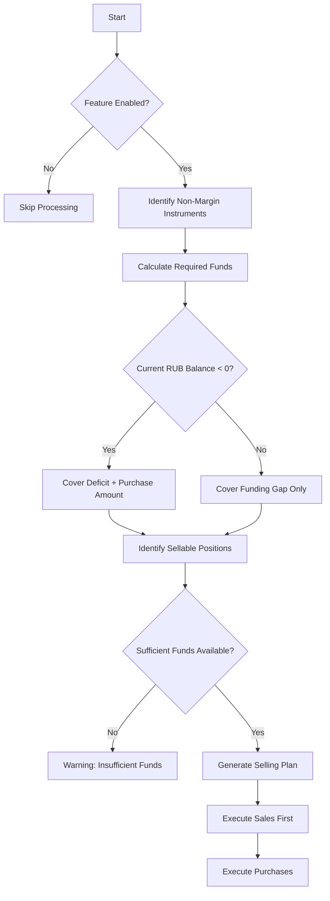
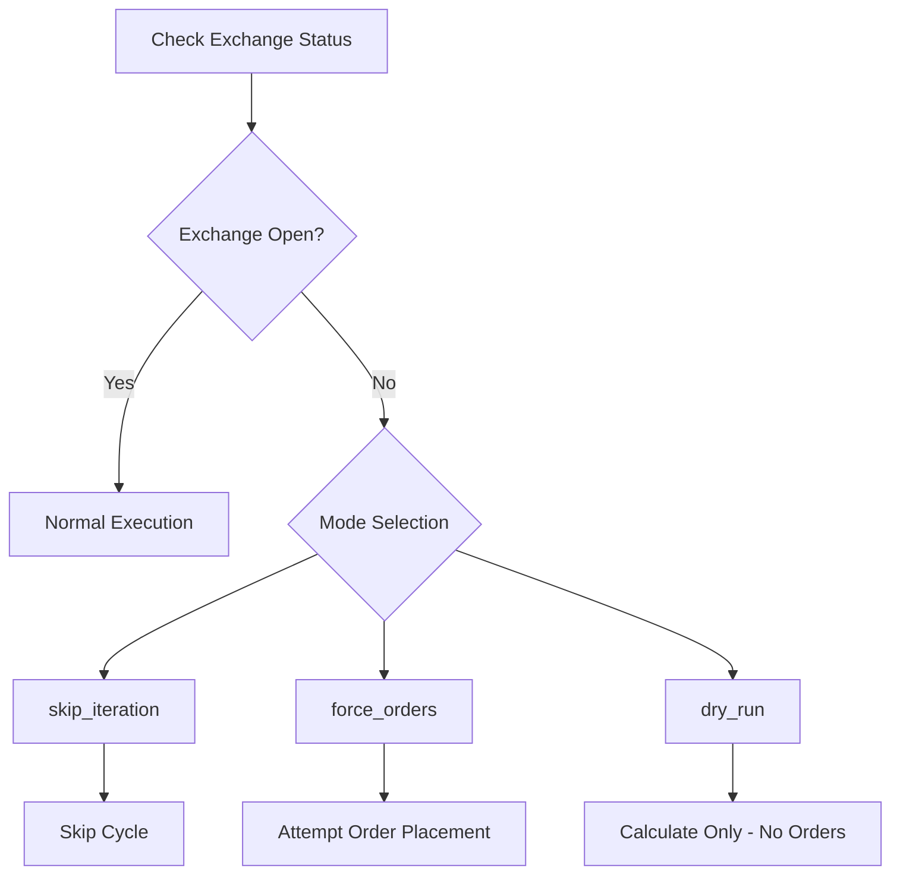
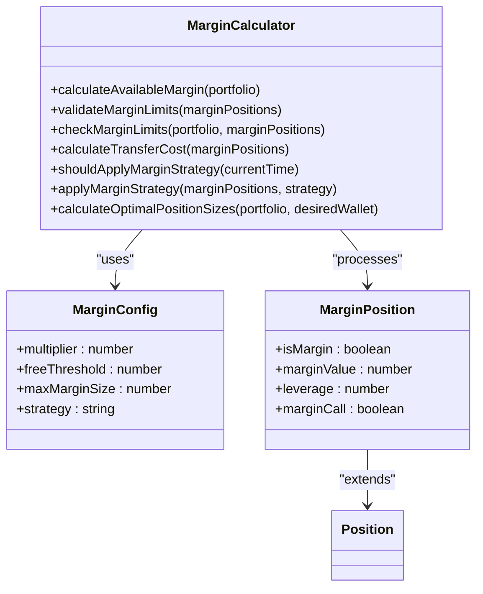
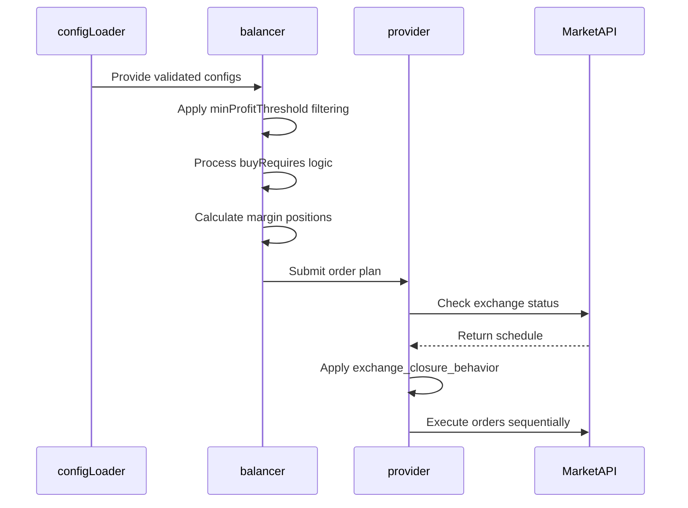

# Advanced Configuration Options

<cite>
**Referenced Files in This Document**   
- [configLoader.ts](file://src/configLoader.ts)
- [buyRequiresTotalMarginalSell.ts](file://src/utils/buyRequiresTotalMarginalSell.ts)
- [marginCalculator.ts](file://src/utils/marginCalculator.ts)
- [index.ts](file://src/balancer/index.ts)
- [provider/index.ts](file://src/provider/index.ts)
</cite>

## Table of Contents
1. [Introduction](#introduction)
2. [MinProfitThreshold Enforcement Logic](#minprofitthreshold-enforcement-logic)
3. [BuyRequiresTotalMarginalSell Functionality](#buyrequirestotalmarginalsell-functionality)
4. [ExchangeClosureBehavior Configurations](#exchangeclosurebehavior-configurations)
5. [Margin Trading Parameters](#margin-trading-parameters)
6. [Component Interactions](#component-interactions)
7. [Real-World Usage Scenarios](#real-world-usage-scenarios)
8. [Safety Considerations](#safety-considerations)

## Introduction
This document provides comprehensive coverage of advanced configuration options for the Tinkoff Invest ETF Balancer Bot. It details critical features including profit threshold enforcement, non-margin instrument handling, exchange closure behaviors, and margin trading parameters. These configurations enable sophisticated portfolio management strategies while maintaining risk control and operational reliability.

## MinProfitThreshold Enforcement Logic
The `min_profit_percent_for_close_position` parameter enforces a minimum profitability requirement before allowing position closures. This configuration prevents premature selling of underperforming assets and ensures that only positions meeting specified profit targets are liquidated.

When configured, the system evaluates each potential sell order against the threshold using the `calculatePositionProfit` function. The profit calculation uses FIFO (First-In, First-Out) average purchase price when available, falling back to standard average cost basis if FIFO data is unavailable. Positions without sufficient cost basis information are excluded from automated selling.

The enforcement logic operates during the balancer execution phase, filtering out any sell recommendations that don't meet the threshold criteria. If a position's calculated profit percentage is below the configured threshold, its sell order is canceled and logged accordingly. This mechanism applies globally to all sell decisions within the account.

Negative values can be used to implement stop-loss functionality, where `-5` represents a maximum allowable loss of 5%. The valid range spans from -100% (complete loss tolerance) to 1000% (10x profit target), providing flexibility for various risk profiles.

**Section sources**
- [configLoader.ts](file://src/configLoader.ts#L271-L287)
- [buyRequiresTotalMarginalSell.ts](file://src/utils/buyRequiresTotalMarginalSell.ts#L13-L60)
- [index.ts](file://src/balancer/index.ts#L286-L813)

## BuyRequiresTotalMarginalSell Functionality
The `buy_requires_total_marginal_sell` feature implements a funding mechanism for purchasing non-margin eligible instruments by requiring the sale of profitable margin positions. This ensures adequate liquidity for rebalancing while maintaining margin compliance.

Configuration requires specifying:
- **enabled**: Boolean flag to activate the feature
- **instruments**: Array of ticker symbols that cannot be traded on margin
- **allow_to_sell_others_positions_to_buy_non_marginal_positions.mode**: Selling strategy mode
- **min_buy_rebalance_percent**: Minimum portfolio percentage threshold for triggering purchases

Three selling modes are supported:
- `only_positive_positions_sell`: Sells only profitable positions meeting the minimum profit threshold
- `equal_in_percents`: Proportionally sells all eligible positions regardless of profitability
- `none`: Disables automatic selling for funding purposes

The system calculates required funds based on pending purchases of non-margin instruments, considering the current RUB balance (including negative balances from margin usage). A shortfall warning system alerts users when insufficient profitable positions exist to cover required purchases.

**Diagram sources**
- [buyRequiresTotalMarginalSell.ts](file://src/utils/buyRequiresTotalMarginalSell.ts#L213-L409)
- [index.ts](file://src/balancer/index.ts#L286-L813)

**Section sources**
- [configLoader.ts](file://src/configLoader.ts#L226-L269)
- [buyRequiresTotalMarginalSell.ts](file://src/utils/buyRequiresTotalMarginalSell.ts#L69-L204)
- [index.ts](file://src/balancer/index.ts#L286-L813)

## ExchangeClosureBehavior Configurations
The `exchange_closure_behavior` setting determines system behavior when the Moscow Exchange (MOEX) is closed. Three operational modes provide different levels of automation continuity:

### skip_iteration
Default behavior that skips the current balancing cycle when the exchange is closed. No calculations or order placements occur, preserving the previous state until market reopening. This conservative approach prevents unnecessary processing during non-trading hours.

### force_orders
Attempts to execute all recommended orders despite exchange closure. While actual trade execution will fail due to market status, this mode processes the full balancing logic and generates order attempts. Useful for testing configuration changes or simulating next-day execution without waiting for market open.

### dry_run
Performs complete balancing calculations but refrains from placing any orders. All internal computations, position evaluations, and order planning proceed normally, with results logged for review. This enables verification of intended trades before market opening without risking unintended executions.

Each mode supports the `update_iteration_result` boolean flag, which controls whether iteration statistics and logging should reflect the current cycle's outcome regardless of exchange status.

**Diagram sources**
- [provider/index.ts](file://src/provider/index.ts#L838-L904)
- [configLoader.ts](file://src/configLoader.ts#L208-L224)

**Section sources**
- [configLoader.ts](file://src/configLoader.ts#L208-L224)
- [provider/index.ts](file://src/provider/index.ts#L838-L904)

## Margin Trading Parameters
Margin trading capabilities are controlled through comprehensive configuration parameters that manage leverage, position sizing, and risk limits.

### Leverage Limits
The `multiplier` parameter defines the leverage factor applied to the portfolio value. A multiplier of 2.0 enables 2x leverage, effectively doubling the investable capital. The system calculates available margin as `(total_portfolio_value * (multiplier - 1))`, representing the additional buying power beyond the base equity.

### Position Sizing Rules
Optimal position sizes consider the leveraged portfolio value rather than just available cash. The `calculateOptimalPositionSizes` method computes target allocations using the multiplied portfolio size, ensuring proper distribution across both base and margin components.

### Risk Management
Key risk parameters include:
- `free_threshold`: Position value below which transfer fees are waived
- `max_margin_size`: Absolute limit on total margin exposure
- `balancing_strategy`: Controls end-of-day margin position handling

Three balancing strategies are available:
- `keep`: Maintains all margin positions overnight
- `remove`: Closes all margin positions before market close
- `keep_if_small`: Retains margin positions only if total value remains below `max_margin_size`

The system validates margin limits during each balancing cycle, preventing violations of configured constraints. Transfer costs are estimated based on position values exceeding the free threshold, with a 1% fee applied to amounts above this limit.

**Diagram sources**
- [marginCalculator.ts](file://src/utils/marginCalculator.ts#L6-L275)
- [index.ts](file://src/balancer/index.ts#L142-L229)

**Section sources**
- [marginCalculator.ts](file://src/utils/marginCalculator.ts#L6-L275)
- [index.ts](file://src/balancer/index.ts#L142-L229)

## Component Interactions
Advanced configuration options interact with core system components through well-defined interfaces, creating an integrated decision-making framework.

The `configLoader` serves as the central configuration repository, validating all advanced parameters during initialization and providing runtime access to their values. The `balancer` component consumes these configurations to modify its decision logic, while the `provider` handles execution according to the specified behaviors.

Key interaction patterns include:
- Configuration validation occurs at load time, preventing invalid settings from entering the system
- Runtime evaluation of exchange status informs execution strategy selection
- Sequential order execution ensures proper fund availability for non-margin purchases
- Margin calculations integrate with position sizing to maintain leverage targets

The system maintains separation between configuration management, decision logic, and execution layers, enabling independent evolution of each component while preserving overall coherence.

**Diagram sources**
- [configLoader.ts](file://src/configLoader.ts#L341-L341)
- [index.ts](file://src/balancer/index.ts#L286-L813)
- [provider/index.ts](file://src/provider/index.ts#L119-L159)

**Section sources**
- [configLoader.ts](file://src/configLoader.ts#L341-L341)
- [index.ts](file://src/balancer/index.ts#L286-L813)
- [provider/index.ts](file://src/provider/index.ts#L119-L159)

## Real-World Usage Scenarios
Practical applications of advanced configurations demonstrate their value in managing complex investment strategies.

For ETF portfolios containing both margin-eligible and non-margin instruments like TMON, the `buy_requires_total_marginal_sell` feature ensures systematic rebalancing by automatically generating sales of profitable positions to fund purchases. This maintains target allocations without manual intervention.

Day traders utilize the `dry_run` exchange closure behavior to prepare tomorrow's trades during evening hours, reviewing optimal adjustments without attempting execution. Upon market opening, the system automatically implements the pre-calculated plan.

Conservative investors set `min_profit_percent_for_close_position` to 10-15% to lock in gains, preventing profitable positions from being sold prematurely during routine rebalancing. Conversely, risk-managed approaches use negative thresholds (-2% to -5%) as stop-loss mechanisms.

High-leverage strategies employ the `keep_if_small` margin balancing strategy with a generous `max_margin_size`, allowing beneficial positions to remain open overnight while automatically closing excessive exposures before market close.

## Safety Considerations
Implementing advanced configurations requires careful attention to risk management and system stability.

Configuration validation prevents invalid settings from disrupting operations, with clear error messages guiding correction of malformed parameters. The system defaults to conservative behaviors when optional configurations are omitted, such as skipping iterations during exchange closure.

Financial safeguards include:
- Portfolio weight sum validation (50-150% range)
- Reasonable bounds on profit thresholds (-100% to 1000%)
- Maximum margin size limits with default fallbacks
- Fee estimation for margin position transfers

Operational safety features encompass:
- Frozen asset detection and reporting
- Comprehensive debug logging for troubleshooting
- Dry-run capability for configuration testing
- Sequential order execution to prevent fund shortages

Users should regularly monitor system logs for warnings about insufficient funds, frozen assets, or configuration issues. Testing new configurations in dry-run mode before live deployment is strongly recommended to verify expected behavior.