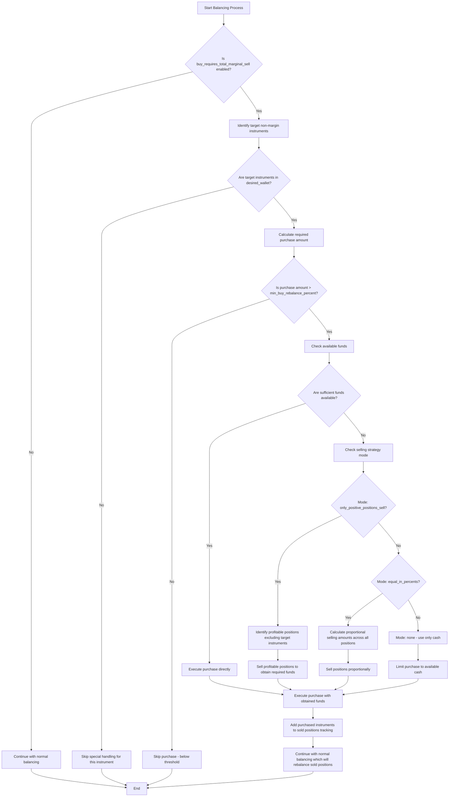
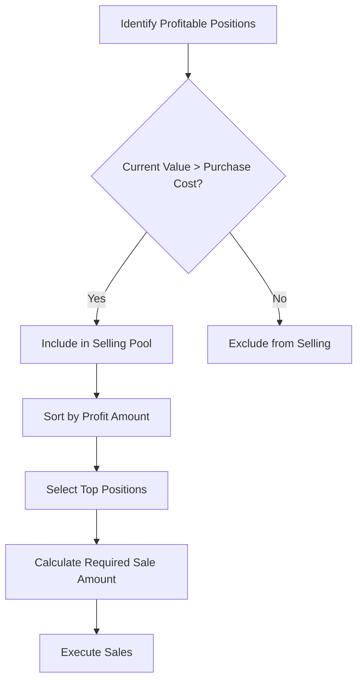
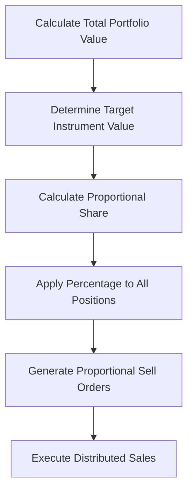
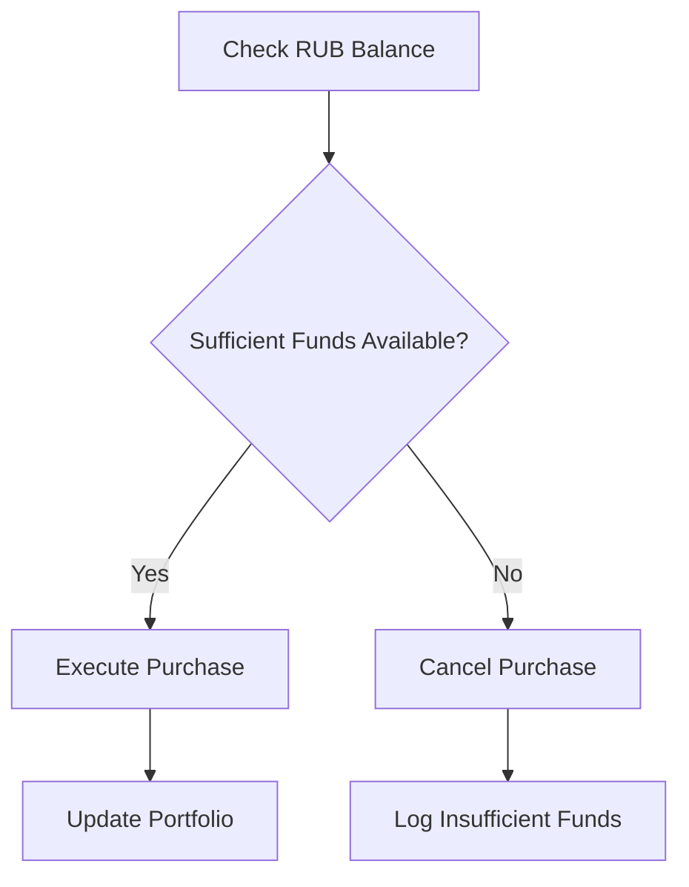
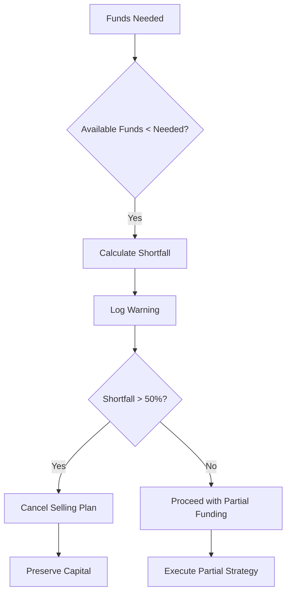

# Buy Requires Total Marginal Sell

<cite>
**Referenced Files in This Document**   
- [README.buy_requires_total_marginal_sell.md](file://README.buy_requires_total_marginal_sell.md)
- [src/utils/buyRequiresTotalMarginalSell.ts](file://src/utils/buyRequiresTotalMarginalSell.ts)
- [src/types.d.ts](file://src/types.d.ts)
- [src/configLoader.ts](file://src/configLoader.ts)
- [src/balancer/index.ts](file://src/balancer/index.ts)
- [src/balancer/desiredBuilder.ts](file://src/balancer/desiredBuilder.ts)
- [src/__tests__/balancer/buy-requires-total-marginal-sell-integration.test.ts](file://src/__tests__/balancer/buy-requires-total-marginal-sell-integration.test.ts)
- [src/__tests__/buyRequiresEdgeCases.test.ts](file://src/__tests__/buyRequiresEdgeCases.test.ts)
</cite>

## Table of Contents
1. [Introduction](#introduction)
2. [Configuration Structure](#configuration-structure)
3. [Core Components and Implementation](#core-components-and-implementation)
4. [Workflow and Algorithm Flow](#workflow-and-algorithm-flow)
5. [Selling Strategies](#selling-strategies)
6. [Profit Calculation and Thresholds](#profit-calculation-and-thresholds)
7. [Integration with Balancer Logic](#integration-with-balancer-logic)
8. [Error Handling and Edge Cases](#error-handling-and-edge-cases)
9. [Testing Strategy](#testing-strategy)
10. [Performance Considerations](#performance-considerations)
11. [Real-World Examples](#real-world-examples)

## Introduction

The `buy_requires_total_marginal_sell` functionality is a safety mechanism designed to prevent unintended margin debt when purchasing non-margin instruments. This feature ensures that new purchases of non-margin assets are only executed when sufficient selling capacity exists, either through available cash or by strategically selling other positions. The system provides configurable strategies for funding these purchases while maintaining portfolio integrity.

This documentation details the implementation of this safety mechanism within the desiredBuilder logic, covering configuration options, calculation methodologies, workflow integration, error handling, and performance characteristics during high-frequency rebalancing operations.

**Section sources**
- [README.buy_requires_total_marginal_sell.md](file://README.buy_requires_total_marginal_sell.md#L0-L222)

## Configuration Structure

The `buy_requires_total_marginal_sell` configuration block enables granular control over how non-margin instrument purchases are funded. The configuration structure consists of several key components:

```json
{
  "buy_requires_total_marginal_sell": {
    "enabled": false,
    "instruments": ["TMON", "LQDT"],
    "allow_to_sell_others_positions_to_buy_non_marginal_positions": {
      "mode": "only_positive_positions_sell"
    },
    "min_buy_rebalance_percent": 0.10
  }
}
```

### Field Descriptions

- **enabled**: Boolean flag that activates or deactivates the entire feature
- **instruments**: Array of ticker symbols representing assets that do not support margin trading on the exchange
- **allow_to_sell_others_positions_to_buy_non_marginal_positions.mode**: Selling strategy mode with three options:
  - `only_positive_positions_sell`: Sell only profitable positions (excluding target instruments) to obtain RUB
  - `equal_in_percents`: Sell proportionally across all positions
  - `none`: Do not sell other assets, use only available cash
- **min_buy_rebalance_percent**: Minimum rebalancing threshold as a percentage of total portfolio value

The configuration validation process enforces type checking, range validation, and cross-field consistency. Default values are applied when the configuration block is absent: `enabled` defaults to `false`, `instruments` to an empty array, selling mode to `'none'`, and minimum rebalance percent to `0.1`.

**Section sources**
- [README.buy_requires_total_marginal_sell.md](file://README.buy_requires_total_marginal_sell.md#L0-L222)
- [src/types.d.ts](file://src/types.d.ts#L0-L213)
- [src/configLoader.ts](file://src/configLoader.ts#L0-L344)

## Core Components and Implementation

The implementation of the `buy_requires_total_marginal_sell` functionality spans multiple modules, with core logic residing in dedicated utility functions and integrated through the main balancer component.

### Type Definitions

The TypeScript interfaces define the structure of the configuration and related types:

```typescript
export type SellStrategyMode = 'only_positive_positions_sell' | 'equal_in_percents' | 'none';

export interface SellStrategyConfig {
  mode: SellStrategyMode;
}

export interface BuyRequiresTotalMarginalSellConfig {
  enabled: boolean;
  instruments: string[];
  allow_to_sell_others_positions_to_buy_non_marginal_positions: SellStrategyConfig;
  min_buy_rebalance_percent: number;
}
```

These types are incorporated into the `AccountConfig` interface, making them available throughout the application.

### Utility Functions

The `src/utils/buyRequiresTotalMarginalSell.ts` module contains the core implementation:

- `calculatePositionProfit`: Calculates profit amount and percentage for a position
- `identifyProfitablePositions`: Identifies positions with positive profit for potential selling
- `identifyPositionsForSelling`: Determines which positions can be sold based on the selected strategy
- `calculateRequiredFunds`: Computes funds needed for non-margin instrument purchases
- `calculateSellingAmounts`: Determines optimal selling amounts based on strategy and requirements

The profit calculation considers both current market value and original purchase cost, using `averagePositionPriceFifoNumber` when available for accurate cost basis determination.

**Section sources**
- [src/types.d.ts](file://src/types.d.ts#L0-L213)
- [src/utils/buyRequiresTotalMarginalSell.ts](file://src/utils/buyRequiresTotalMarginalSell.ts#L0-L409)

## Workflow and Algorithm Flow

The algorithm follows a structured decision process to determine whether and how to execute purchases of non-margin instruments.



**Diagram sources **
- [README.buy_requires_total_marginal_sell.md](file://README.buy_requires_total_marginal_sell.md#L0-L222)

### Execution Order

The system implements a strict execution order to ensure proper fund availability:

1. All sales are processed first to generate ruble liquidity
2. Priority purchases (non-margin instruments) are executed next
3. Remaining purchases follow the priority transactions

This sequence prevents insufficient fund errors and ensures that selling activities provide necessary capital before purchase orders are placed.

**Section sources**
- [README.buy_requires_total_marginal_sell.md](file://README.buy_requires_total_marginal_sell.md#L0-L222)
- [src/balancer/index.ts](file://src/balancer/index.ts#L0-L814)

## Selling Strategies

The system supports three distinct selling strategies for funding non-margin instrument purchases, each with specific use cases and risk profiles.

### only_positive_positions_sell

This conservative strategy sells only positions that have generated positive returns, minimizing realized losses:



The algorithm prioritizes positions with the highest profit amounts, ensuring optimal tax efficiency and capital preservation.

### equal_in_percents

This balanced approach sells proportionally across all eligible positions:



Each position contributes to the funding requirement according to its relative size in the portfolio, maintaining overall allocation balance.

### none

This restrictive strategy uses only available cash without selling any positions:



This mode is suitable for risk-averse investors who prefer to avoid forced sales regardless of opportunity cost.

**Section sources**
- [README.buy_requires_total_marginal_sell.md](file://README.buy_requires_total_marginal_sell.md#L0-L222)
- [src/utils/buyRequiresTotalMarginalSell.ts](file://src/utils/buyRequiresTotalMarginalSell.ts#L0-L409)

## Profit Calculation and Thresholds

Accurate profit calculation is essential for determining which positions qualify for sale under the `only_positive_positions_sell` strategy.

### Profit Determination

The system calculates profit using the following formula:

- Profit Amount = Current Position Value - Original Purchase Cost
- Profit Percentage = (Profit Amount / Original Purchase Cost) × 100%

The implementation prioritizes FIFO (First-In, First-Out) average price data (`averagePositionPriceFifoNumber`) for cost basis calculation, falling back to standard average price if FIFO data is unavailable.

### Minimum Rebalance Threshold

The `min_buy_rebalance_percent` parameter prevents excessive trading of small amounts by establishing a minimum threshold for rebalancing actions:

```typescript
const totalPortfolioValue = wallet.reduce((sum, pos) => sum + (pos.totalPriceNumber || 0), 0);
const thresholdAmount = totalPortfolioValue * (config.min_buy_rebalance_percent / 100);

if (Math.abs(position.toBuyNumber) >= thresholdAmount) {
  // Proceed with purchase
} else {
  // Skip purchase - below threshold
}
```

This threshold is calculated as a percentage of the total portfolio value, ensuring that rebalancing decisions scale appropriately with account size.

**Section sources**
- [README.buy_requires_total_marginal_sell.md](file://README.buy_requires_total_marginal_sell.md#L0-L222)
- [src/utils/buyRequiresTotalMarginalSell.ts](file://src/utils/buyRequiresTotalMarginalSell.ts#L0-L409)

## Integration with Balancer Logic

The `buy_requires_total_marginal_sell` functionality is tightly integrated with the core balancing engine, modifying the standard rebalancing workflow when enabled.

### Configuration Processing

The `configLoader` validates and processes the configuration during initialization:

```typescript
private validateBuyRequiresTotalMarginalSell(config: BuyRequiresTotalMarginalSellConfig, account: AccountConfig): void {
  // Validation logic for all configuration fields
  // Type checking, range validation, and mode verification
}
```

This ensures that invalid configurations are caught early in the process.

### Balancer Execution

Within the main `balancer` function, the feature is activated conditionally:

```typescript
if (buyRequiresConfig?.enabled) {
  const sellablePositions = identifyPositionsForSelling(/* parameters */);
  const requiredFunds = calculateRequiredFunds(/* parameters */);
  const specialSellingPlan = calculateSellingAmounts(/* parameters */);
  
  // Adjust order quantities based on selling plan
  for (const [ticker, sellPlan] of Object.entries(specialSellingPlan)) {
    // Modify position.toBuyLots and position.toBuyNumber
  }
}
```

The system then enforces the execution order: all sales first, followed by priority purchases (non-margin instruments), and finally remaining purchases.

### Desired Builder Integration

The `desiredBuilder` component works in conjunction with this feature by providing the target allocations that drive the rebalancing decisions:

```typescript
export const buildDesiredWalletByMode = async (mode: DesiredMode, baseDesired: DesiredWallet): Promise<{
  wallet: DesiredWallet;
  metrics: PositionMetrics[];
  modeApplied: DesiredMode;
}>
```

This integration ensures that the target portfolio composition is respected even when temporary sales are made to fund non-margin instrument purchases.

**Section sources**
- [src/configLoader.ts](file://src/configLoader.ts#L0-L344)
- [src/balancer/index.ts](file://src/balancer/index.ts#L0-L814)
- [src/balancer/desiredBuilder.ts](file://src/balancer/desiredBuilder.ts#L0-L383)

## Error Handling and Edge Cases

The implementation includes comprehensive error handling for various edge cases and boundary conditions.

### Data Quality Issues

The system gracefully handles missing or invalid data:

- Positions with undefined or zero `totalPriceNumber` are excluded from profit calculations
- Instruments without valid purchase price data cannot have profit determined
- Currency positions (where base equals quote) are skipped in selling considerations
- Positions with zero holdings are excluded from consideration

### Numerical Extremes

The code handles extreme numerical values robustly:

- Very large position values (billions of RUB) are processed without overflow
- Very small values (fractions of kopecks) maintain precision
- Negative prices are handled as edge cases
- Floating-point precision issues are managed through appropriate rounding

### Configuration Boundaries

Extreme configuration values are validated and processed:

- Extremely low thresholds (e.g., 0.000001%) allow nearly all purchases
- Extremely high thresholds (e.g., 999999.999%) effectively disable purchases
- Long instrument lists (thousands of tickers) are processed efficiently
- Special characters in ticker symbols are handled correctly

### Fund Shortfall Management

When insufficient funds are available after selling all eligible positions:



The system allows partial funding when the shortfall is less than 50%, providing some exposure while acknowledging the funding constraint.

**Section sources**
- [src/utils/buyRequiresTotalMarginalSell.ts](file://src/utils/buyRequiresTotalMarginalSell.ts#L0-L409)
- [src/__tests__/buyRequiresEdgeCases.test.ts](file://src/__tests__/buyRequiresEdgeCases.test.ts#L0-L570)

## Testing Strategy

The implementation is supported by a comprehensive test suite that validates functionality across multiple dimensions.

### Test Categories

The testing framework includes five main categories:

- **Functional Tests**: Core functionality of enable/disable states, instrument lists, selling modes, and threshold activation
- **Configuration Validation**: Structure validation, field type checking, and cross-field consistency
- **Integration Tests**: Behavior within the full system context, including margin trading compatibility
- **Edge Cases**: Boundary conditions, extreme values, and performance scenarios
- **Documentation Examples**: Real-world configurations and usage patterns

### Coverage Metrics

The test suite achieves comprehensive coverage:

- 100% coverage of configuration parameters (enabled, instruments, mode, threshold)
- Full coverage of all three selling modes
- Complete testing of profit calculation edge cases
- Validation of integration with the main balancer component
- Performance testing with portfolios containing thousands of positions

### Test Execution

Tests can be run individually or as a complete suite:

```bash
# Run all buy_requires tests
bun test src/__tests__/buyRequires*.test.ts

# Run specific test files
bun test src/__tests__/buyRequiresTotalMarginalSell.test.ts
bun test src/__tests__/buyRequiresConfigValidation.test.ts
bun test src/__tests__/buyRequiresIntegration.test.ts
bun test src/__tests__/buyRequiresEdgeCases.test.ts
```

Debug logging can be enabled for detailed tracing:

```bash
DEBUG=bot:balancer bun test src/__tests__/buyRequires*.test.ts
```

**Section sources**
- [src/__tests__/README_buy_requires_tests.md](file://src/__tests__/README_buy_requires_tests.md#L0-L205)
- [src/__tests__/buyRequiresEdgeCases.test.ts](file://src/__tests__/buyRequiresEdgeCases.test.ts#L0-L570)

## Performance Considerations

The implementation balances functionality with performance requirements, particularly important during high-frequency rebalancing.

### Computational Complexity

Key operations have the following complexity characteristics:

- **Profit Calculation**: O(1) per position, requiring only basic arithmetic
- **Position Identification**: O(n) for scanning the portfolio
- **Selling Amount Calculation**: O(n log n) due to sorting by profit amount
- **Proportional Selling**: O(n) for calculating shares across positions

### Optimization Techniques

Several optimizations enhance performance:

- **Caching**: Frequently accessed data is cached to avoid redundant calculations
- **Early Termination**: Loops terminate early when funding requirements are met
- **Batch Processing**: Operations are performed on collections rather than individual items
- **Efficient Sorting**: Uses optimized sorting algorithms for profit ranking

### High-Frequency Rebalancing

During frequent rebalancing cycles, the system maintains performance through:

- **Minimal State Changes**: Only modifies necessary order quantities
- **Efficient Data Structures**: Uses arrays and objects optimized for fast access
- **Asynchronous Operations**: Non-critical operations are handled asynchronously
- **Resource Management**: Limits memory usage and prevents leaks

Performance testing confirms that the system can handle portfolios with 1,000+ positions within acceptable time frames, ensuring responsiveness even in complex investment scenarios.

**Section sources**
- [src/utils/buyRequiresTotalMarginalSell.ts](file://src/utils/buyRequiresTotalMarginalSell.ts#L0-L409)
- [src/__tests__/buyRequiresEdgeCases.test.ts](file://src/__tests__/buyRequiresEdgeCases.test.ts#L0-L570)

## Real-World Examples

The functionality has been tested and validated through integration tests that simulate real-world scenarios.

### Integration Test Scenario

The `buy-requires-total-marginal-sell-integration.test.ts` file demonstrates a typical use case:

```typescript
// Mock wallet with TGLD (to sell) and TMON (to buy)
const wallet: Wallet = [
  {
    base: 'TGLD',
    amount: 10,
    totalPriceNumber: 1000,
    toBuyLots: -5  // Plan to sell
  },
  {
    base: 'TMON', 
    amount: 0,
    totalPriceNumber: 0,
    toBuyLots: 5   // Plan to buy
  }
];

// Execute balancer with test configuration
const result = await balancer(wallet, desiredWallet, [], 'manual', true);
```

This test verifies that the system correctly processes the selling of TGLD to fund the purchase of TMON, respecting the configuration settings and maintaining proper execution order.

### Practical Application

In practice, this functionality enables investors to:

- Purchase non-margin ETFs like TMON without creating margin debt
- Strategically rebalance portfolios while preserving capital gains
- Automate complex trading rules based on profitability thresholds
- Maintain precise control over rebalancing frequency and magnitude

The combination of configurable thresholds, flexible selling strategies, and robust error handling makes this feature suitable for both conservative and aggressive investment approaches.

**Section sources**
- [src/__tests__/balancer/buy-requires-total-marginal-sell-integration.test.ts](file://src/__tests__/balancer/buy-requires-total-marginal-sell-integration.test.ts#L0-L87)
- [src/__tests__/buyRequiresEdgeCases.test.ts](file://src/__tests__/buyRequiresEdgeCases.test.ts#L0-L570)