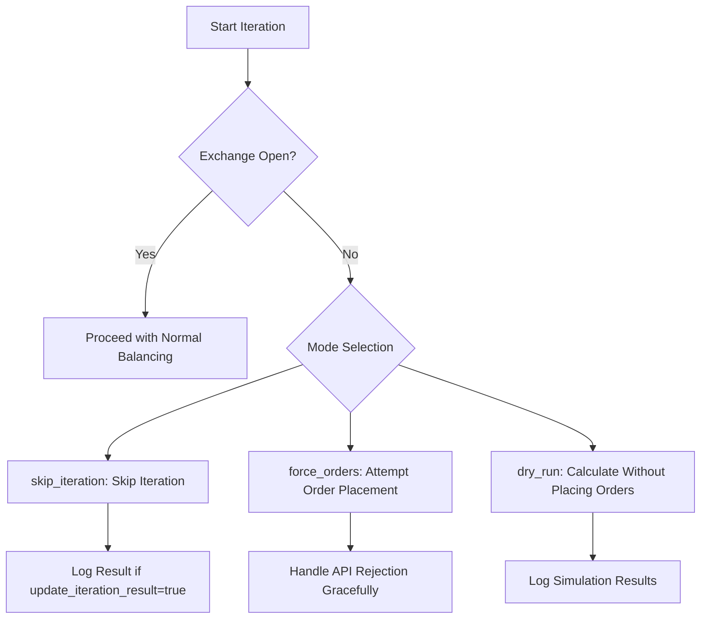
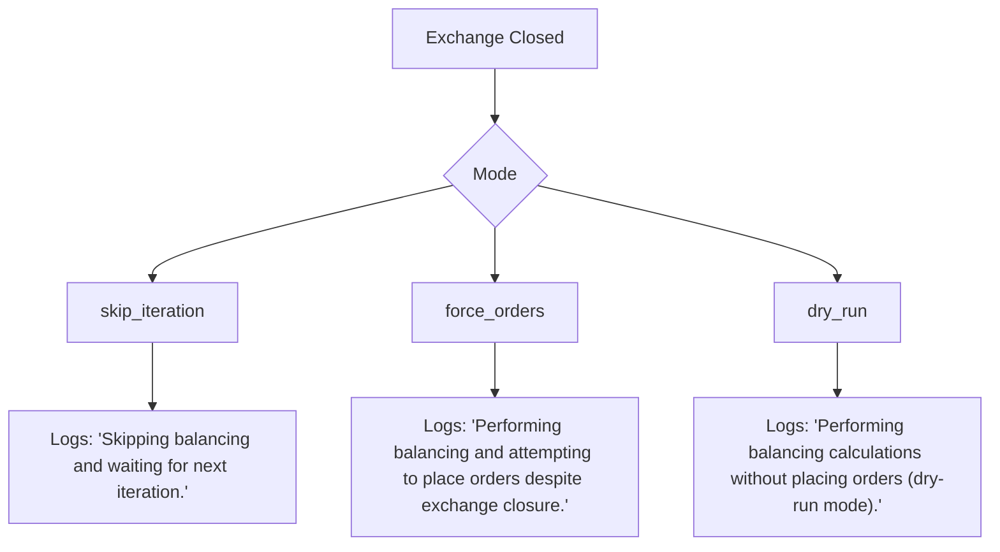
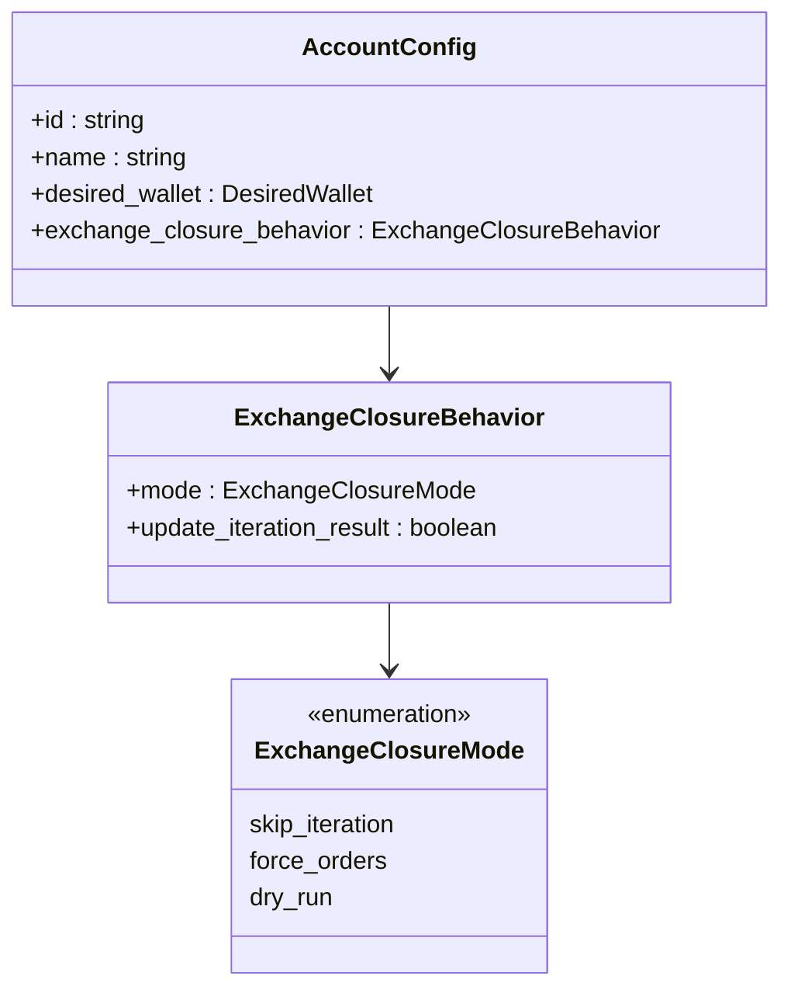
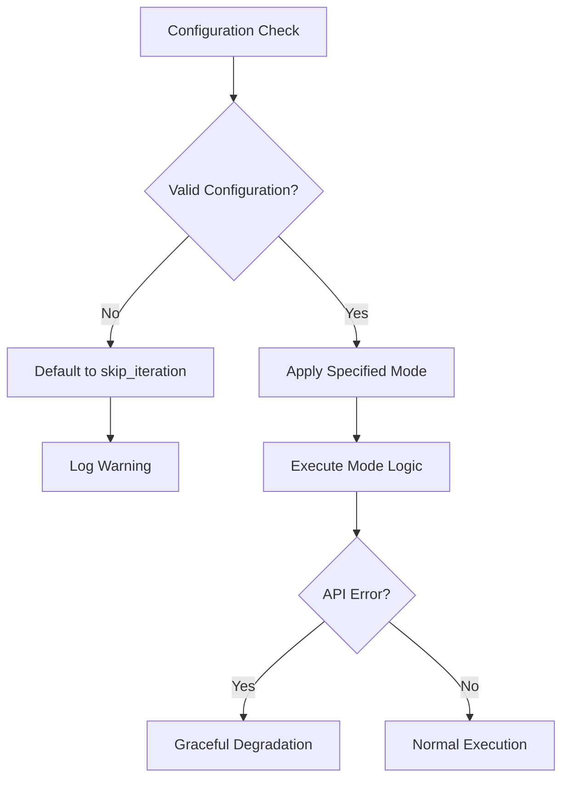

# Exchange Closure Behavior

<cite>
**Referenced Files in This Document**   
- [index.ts](file://src/provider/index.ts)
- [market-closure-scenarios.test.ts](file://src/__tests__/provider/market-closure-scenarios.test.ts)
- [provider-network-resilience.test.ts](file://src/__tests__/provider/provider-network-resilience.test.ts)
- [types.d.ts](file://src/types.d.ts)
- [EXCHANGE_CLOSURE_IMPLEMENTATION.md](file://EXCHANGE_CLOSURE_IMPLEMENTATION.md)
- [CONFIG.example.json](file://CONFIG.example.json)
</cite>

## Table of Contents
1. [Introduction](#introduction)
2. [Configuration Overview](#configuration-overview)
3. [Behavior Modes](#behavior-modes)
4. [Decision Logic in Provider Module](#decision-logic-in-provider-module)
5. [Use Cases and Strategy Guidance](#use-cases-and-strategy-guidance)
6. [Logging and Monitoring](#logging-and-monitoring)
7. [Implementation Details](#implementation-details)
8. [Error Handling and Edge Cases](#error-handling-and-edge-cases)

## Introduction
The exchange closure behavior configuration provides three distinct modes for handling market closure scenarios: skip_iteration, force_orders, and dry_run. These modes allow the trading bot to adapt its behavior based on market conditions, trading strategy requirements, and risk tolerance. The implementation is designed to maintain backward compatibility while providing enhanced flexibility for different trading scenarios.

**Section sources**
- [EXCHANGE_CLOSURE_IMPLEMENTATION.md](file://EXCHANGE_CLOSURE_IMPLEMENTATION.md#L1-L20)

## Configuration Overview
The exchange closure behavior is configured through the `exchange_closure_behavior` field in the account configuration, which contains two properties: `mode` and `update_iteration_result`. The mode determines the primary behavior during market closure, while update_iteration_result controls whether iteration results are logged and tracked when the exchange is closed.

```json
{
  "exchange_closure_behavior": {
    "mode": "dry_run",
    "update_iteration_result": true
  }
}
```

When not specified, the system defaults to `skip_iteration` mode with `update_iteration_result` set to false, maintaining backward compatibility with previous versions.

**Section sources**
- [types.d.ts](file://src/types.d.ts#L82-L98)
- [CONFIG.example.json](file://CONFIG.example.json#L25-L28)

## Behavior Modes

### Skip Iteration Mode
In skip_iteration mode, the bot completely skips the balancing iteration when the exchange is closed. This conservative approach prevents any trading activity during non-trading hours and maintains the portfolio state until the next iteration when the exchange is open.

This mode is ideal for risk-averse strategies that prioritize capital preservation over continuous market participation. It ensures no unintended trades occur outside regular trading hours and minimizes API usage during periods when orders cannot be executed.

**Section sources**
- [market-closure-scenarios.test.ts](file://src/__tests__/provider/market-closure-scenarios.test.ts#L100-L130)
- [index.ts](file://src/provider/index.ts#L341-L350)

### Force Orders Mode
The force_orders mode instructs the bot to proceed with order placement attempts even when the exchange is detected as closed. This aggressive approach is suitable for time-sensitive strategies or when trading across multiple exchanges with different schedules.

While the Tinkoff platform will reject orders placed outside trading hours, this mode allows the bot to prepare and submit orders immediately when the market opens, potentially gaining execution priority. It's particularly useful for strategies that rely on opening price movements or need to react quickly to overnight news.

**Section sources**
- [market-closure-scenarios.test.ts](file://src/__tests__/provider/market-closure-scenarios.test.ts#L170-L190)
- [index.ts](file://src/provider/index.ts#L360-L365)

### Dry Run Mode
Dry run mode enables the bot to perform full balancing calculations without placing actual orders when the exchange is closed. This simulation mode provides valuable insights into portfolio adjustments needed for the next trading session while preserving capital.

The mode is particularly useful for monitoring strategy performance, analyzing potential trades, and preparing for market opening without executing any transactions. When combined with update_iteration_result=true, it provides comprehensive logging and metrics collection for analysis purposes.

**Section sources**
- [market-closure-scenarios.test.ts](file://src/__tests__/provider/market-closure-scenarios.test.ts#L140-L160)
- [index.ts](file://src/provider/index.ts#L355-L358)

## Decision Logic in Provider Module
The decision logic for exchange closure behavior is implemented in the getPositionsCycle function within the provider module. The process begins with checking the current exchange status using the isExchangeOpenNow function, which queries the Tinkoff API for the current trading schedule.



**Diagram sources**
- [index.ts](file://src/provider/index.ts#L341-L400)

The isExchangeOpenNow function determines exchange status by comparing the current time against the official trading schedule obtained from the Tinkoff API. It considers both regular trading sessions and evening sessions, returning true only when the current time falls within an active trading period.

If the exchange status check fails due to API errors, the system defaults to treating the exchange as open to avoid blocking legitimate trading opportunities during temporary connectivity issues.

**Section sources**
- [index.ts](file://src/provider/index.ts#L838-L904)

## Use Cases and Strategy Guidance

### Conservative Operation with Skip Iteration
The skip_iteration mode is recommended for conservative investment strategies, long-term portfolios, and accounts with limited risk tolerance. It aligns with traditional investment principles of avoiding trading outside regular market hours.

This mode is particularly suitable for:
- Retirement accounts and other long-term investments
- Strategies focused on capital preservation
- Accounts with limited liquidity needs
- Users who prefer minimal intervention and automated conservative management

**Section sources**
- [EXCHANGE_CLOSURE_IMPLEMENTATION.md](file://EXCHANGE_CLOSURE_IMPLEMENTATION.md#L50-L60)

### Time-Sensitive Strategies with Force Orders
Force orders mode serves time-sensitive trading strategies that require immediate execution at market open. This includes momentum strategies, earnings reaction systems, and arbitrage approaches that depend on first-mover advantage.

Recommended for:
- High-frequency trading strategies
- News-driven trading systems
- Opening gap exploitation strategies
- Accounts with high risk tolerance and active management requirements

**Section sources**
- [EXCHANGE_CLOSURE_IMPLEMENTATION.md](file://EXCHANGE_CLOSURE_IMPLEMENTATION.md#L62-L70)

### Simulation Purposes with Dry Run
Dry run mode provides a powerful tool for strategy testing, performance monitoring, and educational purposes. It allows users to observe how their portfolio would rebalance without risking capital, making it ideal for:

- Testing new configuration changes safely
- Monitoring strategy performance during market closure
- Educational purposes and strategy development
- Preparing for market opening with complete information

When combined with update_iteration_result=true, this mode creates comprehensive logs that can be analyzed to refine trading strategies over time.

**Section sources**
- [EXCHANGE_CLOSURE_IMPLEMENTATION.md](file://EXCHANGE_CLOSURE_IMPLEMENTATION.md#L72-L80)

## Logging and Monitoring
Each exchange closure mode generates specific logging outputs to aid in monitoring and troubleshooting. The system provides clear indicators of the current mode and exchange status, enabling effective oversight of bot operations.



**Diagram sources**
- [market-closure-scenarios.test.ts](file://src/__tests__/provider/market-closurescenarios.test.ts#L400-L430)

The logging system also includes visual indicators in the console output, such as warning symbols and colored text, to immediately draw attention to the current operating mode. This enhances situational awareness and facilitates quick identification of the bot's behavior during market closure periods.

Monitoring implications vary by mode:
- skip_iteration: Minimal resource consumption, no order activity
- force_orders: Higher API usage, potential error logs from rejected orders
- dry_run: Full computational load for calculations, no actual trading impact

**Section sources**
- [market-closure-scenarios.test.ts](file://src/__tests__/provider/market-closure-scenarios.test.ts#L350-L380)

## Implementation Details
The exchange closure behavior is implemented as an extension to the AccountConfig interface, adding the exchange_closure_behavior field with type safety through the ExchangeClosureBehavior interface and ExchangeClosureMode type.

The core logic resides in the getPositionsCycle function, where the exchange status check is integrated with the configuration-driven behavior selection. The implementation maintains backward compatibility by providing safe defaults for missing configuration fields and gracefully handling invalid values.



**Diagram sources**
- [types.d.ts](file://src/types.d.ts#L82-L135)

The provider module coordinates the behavior through a decision tree that evaluates the exchange status and configuration settings before proceeding with the appropriate action. Error handling is robust, with fallback mechanisms ensuring the bot continues to operate safely even when encountering unexpected conditions.

**Section sources**
- [index.ts](file://src/provider/index.ts#L341-L400)

## Error Handling and Edge Cases
The implementation includes comprehensive error handling for various edge cases and invalid configurations. When encountering malformed or invalid exchange_closure_behavior configurations, the system defaults to safe behavior rather than failing outright.

Invalid mode values are handled gracefully, with the system logging a warning about the unknown mode and defaulting to skip_iteration behavior. Missing or malformed configuration fields trigger automatic assignment of default values, ensuring consistent operation across all accounts.

The system also handles API failures during exchange status checks by defaulting to treating the exchange as open, preventing the bot from being unnecessarily blocked during temporary connectivity issues.



**Diagram sources**
- [market-closure-scenarios.test.ts](file://src/__tests__/provider/market-closure-scenarios.test.ts#L200-L230)

These robust error handling mechanisms ensure reliable operation across diverse network conditions and configuration scenarios, making the system resilient to both user errors and external service disruptions.

**Section sources**
- [market-closure-scenarios.test.ts](file://src/__tests__/provider/market-closure-scenarios.test.ts#L200-L250)