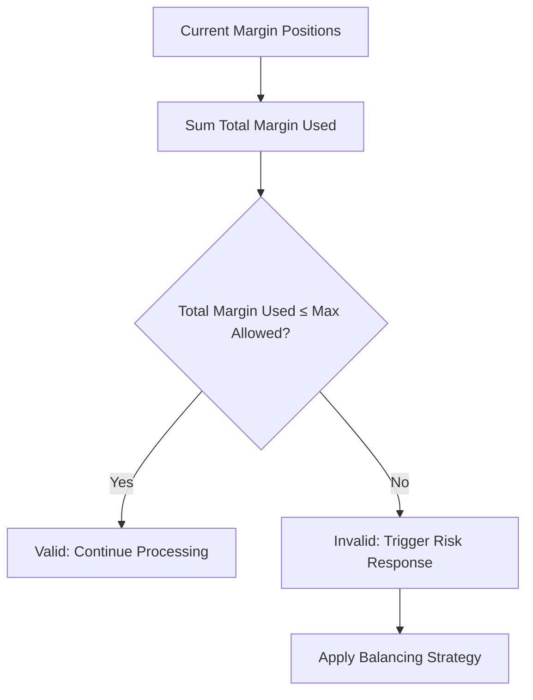
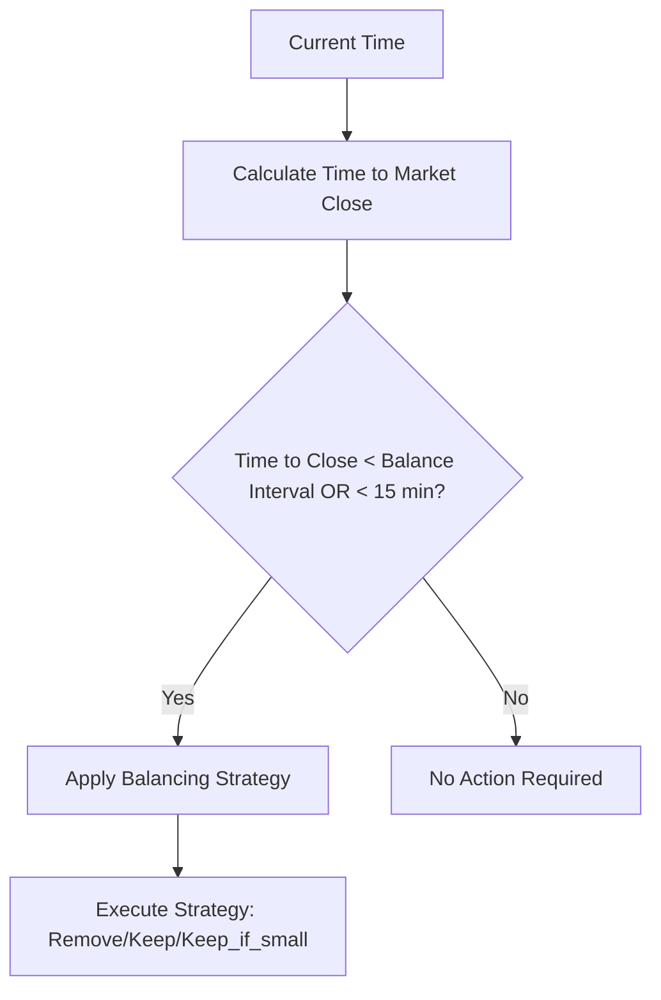
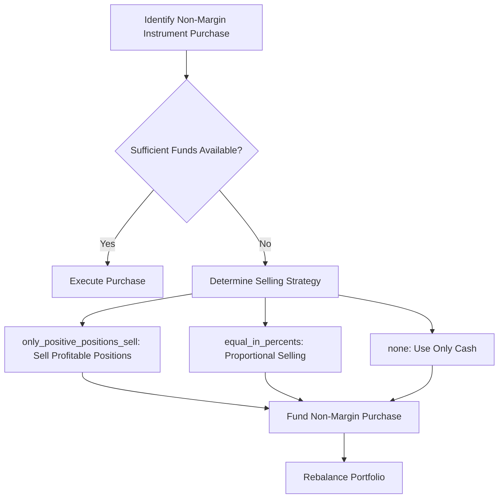
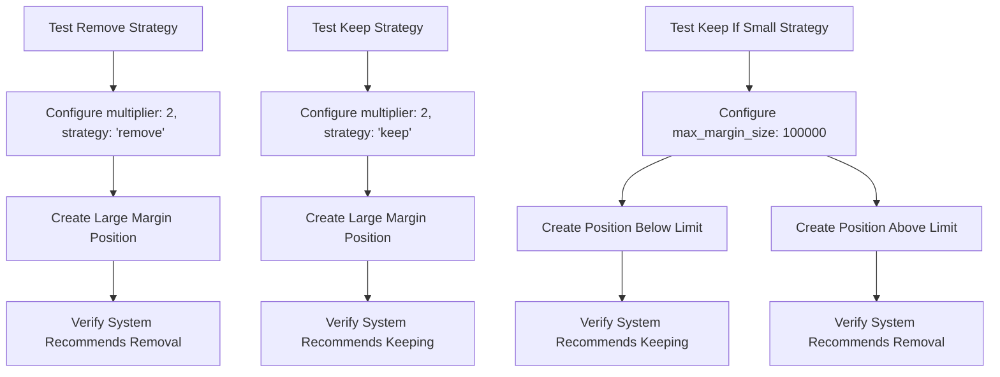

# Margin Trading Configuration

<cite>
**Referenced Files in This Document**   
- [CONFIG.json](file://CONFIG.json)
- [marginCalculator.ts](file://src/utils/marginCalculator.ts)
- [margin-trading-strategies.test.ts](file://src/__tests__/balancer/margin-trading-strategies.test.ts)
- [margin-trading-position-management.test.ts](file://src/__tests__/balancer/margin-trading-position-management.test.ts)
- [index.ts](file://src/balancer/index.ts)
</cite>

## Table of Contents
1. [Introduction](#introduction)
2. [Configuration Structure](#configuration-structure)
3. [Leverage Limits and Position Sizing](#leverage-limits-and-position-sizing)
4. [Risk Thresholds and Validation](#risk-thresholds-and-validation)
5. [Margin Balancing Strategies](#margin-balancing-strategies)
6. [Integration with Other Features](#integration-with-other-features)
7. [Best Practices for Configuration](#best-practices-for-configuration)
8. [Test Scenarios and Examples](#test-scenarios-and-examples)

## Introduction
This document provides comprehensive guidance on configuring margin trading parameters within the ETF balancer bot system. It covers leverage limits, position sizing rules, risk thresholds, and their integration with the marginCalculator and balancer modules to ensure safe trading practices. The configuration structure in CONFIG.json is detailed, including key parameters such as maxLeverage, maintenanceMargin, and auto-deleverage triggers. The document also explains how these settings interact with other features like minProfitThreshold and buyRequiresTotalMarginalSell, providing best practices for optimal configuration based on volatility, asset class, and investment horizon.

## Configuration Structure
The margin trading configuration is defined within the account-level settings in CONFIG.json. The structure includes several key parameters that control margin behavior:

```json
"margin_trading": {
  "enabled": false,
  "multiplier": 2,
  "free_threshold": 5000,
  "max_margin_size": 15000,
  "balancing_strategy": "keep_if_small"
}
```

The configuration parameters serve specific purposes:
- **enabled**: Boolean flag to activate margin trading functionality
- **multiplier**: Leverage multiplier applied to portfolio value (e.g., 2x, 4x)
- **free_threshold**: Position value threshold below which transfer costs are waived
- **max_margin_size**: Maximum allowed margin size in RUB before triggering actions
- **balancing_strategy**: Strategy for handling margin positions at market close

These settings are integrated into the balancer module through the marginCalculator, which enforces the configured limits and strategies during portfolio rebalancing operations.

**Section sources**
- [CONFIG.json](file://CONFIG.json#L20-L30)
- [index.ts](file://src/balancer/index.ts#L219-L224)

## Leverage Limits and Position Sizing
The leverage limits are controlled by the multiplier parameter in the margin trading configuration. This multiplier determines the maximum leverage that can be applied to the portfolio. For example, a multiplier of 2 enables 2x leverage, effectively doubling the purchasing power of the portfolio.

The marginCalculator class implements the logic for calculating available margin based on the portfolio's total value and the configured multiplier:

```mermaid
flowchart TD
A[Portfolio Total Value] --> B[Calculate Available Margin]
B --> C{Available Margin = Total Value × (Multiplier - 1)}
C --> D[Apply to Position Sizing]
```

Position sizing is determined by considering both the base portfolio value and the available margin. The calculateOptimalPositionSizes method in the MarginCalculator computes optimal position sizes by:

1. Calculating the target portfolio size using the margin multiplier
2. Determining the base size from the current portfolio value
3. Calculating the additional margin size needed to reach the target
4. Ensuring non-negative margin values

The system prevents over-leveraging by validating that the total margin used does not exceed the max_margin_size limit. When this limit is approached or exceeded, the system triggers appropriate actions based on the configured balancing strategy.

**Diagram sources**
- [marginCalculator.ts](file://src/utils/marginCalculator.ts#L248-L274)

**Section sources**
- [marginCalculator.ts](file://src/utils/marginCalculator.ts#L6-L275)
- [index.ts](file://src/balancer/index.ts#L180-L180)

## Risk Thresholds and Validation
The system implements multiple layers of risk validation to prevent excessive exposure and maintain safe trading practices. These validations occur at different stages of the margin trading process.

The validateMarginLimits method checks whether the total margin used exceeds the configured maximum:



Additional risk assessment is performed through the checkMarginLimits method, which evaluates the margin usage ratio and assigns a risk level:

- **Low risk**: Margin usage ratio ≤ 60%
- **Medium risk**: Margin usage ratio > 60% and ≤ 80%
- **High risk**: Margin usage ratio > 80%

The system also validates individual position transfers through the calculateTransferCost method, which considers the free_threshold parameter. Positions with values at or below this threshold incur no transfer costs, while positions above the threshold are charged 1% of their value.

These validation mechanisms work together to ensure that margin trading remains within safe boundaries and that risk is actively managed throughout the trading process.

**Diagram sources**
- [marginCalculator.ts](file://src/utils/marginCalculator.ts#L34-L58)

**Section sources**
- [marginCalculator.ts](file://src/utils/marginCalculator.ts#L34-L88)
- [margin-trading-position-management.test.ts](file://src/__tests__/balancer/margin-trading-position-management.test.ts#L300-L350)

## Margin Balancing Strategies
The system supports three distinct margin balancing strategies that determine how margin positions are handled, particularly as the market approaches closing time. These strategies are configured through the balancing_strategy parameter and provide flexibility in managing end-of-day margin exposure.

### Remove Strategy
The 'remove' strategy automatically closes all margin positions before market close. This approach eliminates overnight margin risk but may incur transfer costs for positions above the free_threshold. The strategy is recommended for conservative traders who prefer to avoid holding leveraged positions overnight.

### Keep Strategy
The 'keep' strategy maintains all margin positions regardless of size or market conditions. This approach maximizes leverage benefits but exposes the portfolio to overnight risk. It is suitable for experienced traders with high risk tolerance and confidence in their positions.

### Keep If Small Strategy
The 'keep_if_small' strategy provides a balanced approach by keeping margin positions only if their total value is at or below the max_margin_size threshold. Positions exceeding this limit are closed before market close. This strategy offers a compromise between leveraging opportunities and risk management.

The shouldApplyMarginStrategy method determines when to apply these strategies based on time proximity to market close. Strategies are applied when either:
1. Less than one balance interval until market close
2. Less than 15 minutes until market close

This timing ensures that margin adjustments are made proactively rather than reactively.



**Diagram sources**
- [marginCalculator.ts](file://src/utils/marginCalculator.ts#L161-L243)

**Section sources**
- [marginCalculator.ts](file://src/utils/marginCalculator.ts#L100-L158)
- [margin-trading-strategies.test.ts](file://src/__tests__/balancer/margin-trading-strategies.test.ts#L100-L300)

## Integration with Other Features
The margin trading system integrates with several other features to create a comprehensive trading framework. These integrations ensure that margin decisions are coordinated with other portfolio management functions.

### Integration with buyRequiresTotalMarginalSell
The buyRequiresTotalMarginalSell feature interacts with margin trading when purchasing non-margin instruments. When enabled, the system coordinates margin position management with the purchase of instruments that don't support margin trading:



This integration ensures that purchases of non-margin instruments like TMON are properly funded while maintaining overall portfolio balance.

### Integration with minProfitThreshold
The minProfitThreshold feature works in conjunction with margin trading by preventing the sale of positions that haven't reached a minimum profit percentage. When configured, the system validates that any planned sales of margin positions meet the minimum profit requirement before executing trades.

The interaction occurs during the rebalancing process:
1. The system identifies positions scheduled for sale
2. For each position, it calculates the current profit percentage
3. If the profit percentage is below the threshold, the sale is canceled
4. Only positions meeting or exceeding the threshold are sold

This integration protects gains in margin positions and prevents premature exits that could undermine the leverage strategy.

**Diagram sources**
- [README.buy_requires_total_marginal_sell.md](file://README.buy_requires_total_marginal_sell.md#L100-L200)

**Section sources**
- [index.ts](file://src/balancer/index.ts#L286-L813)
- [README.buy_requires_total_marginal_sell.md](file://README.buy_requires_total_marginal_sell.md#L0-L222)

## Best Practices for Configuration
Configuring margin trading parameters requires careful consideration of risk tolerance, market conditions, and investment goals. The following best practices provide guidance for optimal configuration based on different scenarios.

### Volatility-Based Configuration
For highly volatile assets, conservative margin settings are recommended:
- Lower multiplier (2x instead of 4x)
- Smaller max_margin_size relative to portfolio value
- Conservative balancing strategy ('keep_if_small')
- Higher free_threshold to minimize transaction costs

For less volatile assets, more aggressive settings may be appropriate:
- Higher multiplier (4x)
- Larger max_margin_size
- 'keep' strategy for continuous leverage
- Lower free_threshold

### Asset Class Considerations
Different asset classes require tailored margin approaches:
- **ETFs**: Moderate leverage with regular rebalancing
- **Commodities**: Lower leverage due to higher volatility
- **Bonds**: Higher leverage possible due to lower volatility
- **Stocks**: Varies by sector and individual stock characteristics

### Investment Horizon Guidelines
Short-term traders should consider:
- Higher multipliers to maximize short-term gains
- 'remove' strategy to avoid overnight risk
- Frequent rebalancing intervals
- Tight risk thresholds

Long-term investors might prefer:
- Moderate multipliers for sustainable growth
- 'keep' or 'keep_if_small' strategies
- Less frequent rebalancing
- Higher risk thresholds to avoid unnecessary trading

### General Recommendations
1. Start with conservative settings and gradually increase leverage as confidence grows
2. Regularly review and adjust configurations based on performance and market conditions
3. Monitor transfer costs and optimize free_threshold accordingly
4. Coordinate margin strategy with overall portfolio allocation
5. Test configurations in dry-run mode before live implementation

**Section sources**
- [CONFIG.json](file://CONFIG.json#L20-L30)
- [margin-trading-strategies.test.ts](file://src/__tests__/balancer/margin-trading-strategies.test.ts#L500-L700)

## Test Scenarios and Examples
The system includes comprehensive test coverage for margin trading configurations, ensuring reliable operation under various scenarios. These tests validate both valid and invalid configurations to verify proper system behavior.

### Valid Configurations
The margin-trading-strategies.test.ts file contains examples of valid configurations for each balancing strategy:



### Invalid Configurations
The testing framework also validates error handling for invalid configurations:
- Missing required fields
- Invalid strategy names
- Extreme multiplier values
- Negative margin size limits
- Conflicting parameter combinations

### Edge Cases
Comprehensive testing includes edge cases such as:
- Empty margin positions
- Zero-value positions
- Maximum JavaScript number values
- Rapid succession of rebalancing operations
- Network latency during strategy evaluation

These test scenarios ensure that the margin trading system behaves predictably and safely across the full range of possible configurations and market conditions.

**Section sources**
- [margin-trading-strategies.test.ts](file://src/__tests__/balancer/margin-trading-strategies.test.ts#L0-L782)
- [margin-trading-position-management.test.ts](file://src/__tests__/balancer/margin-trading-position-management.test.ts#L0-L799)