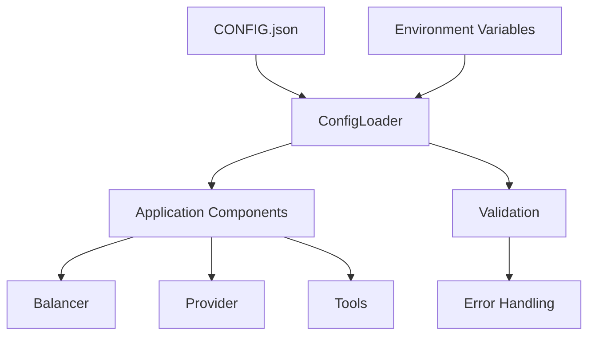
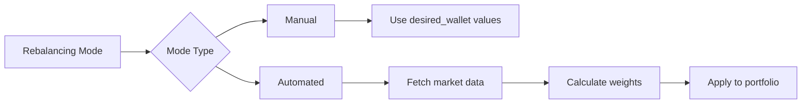
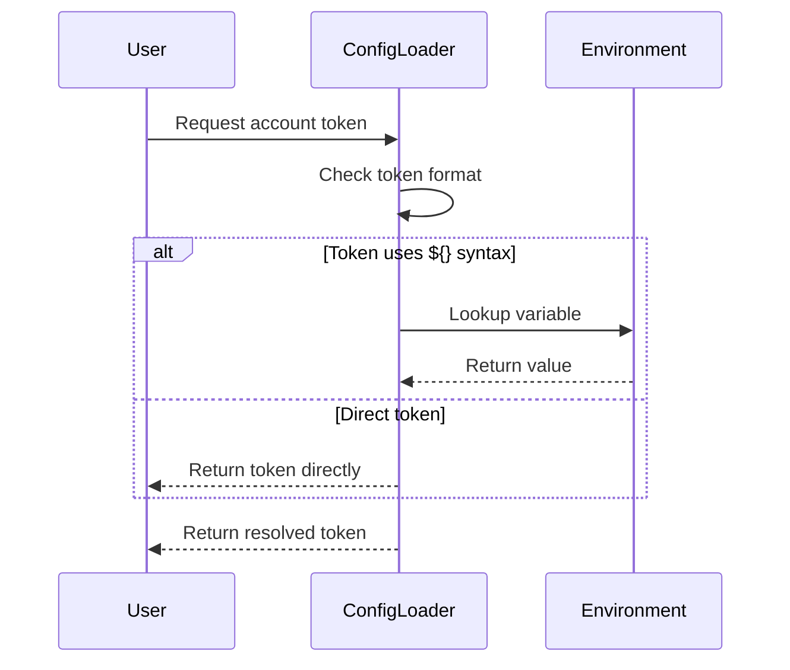
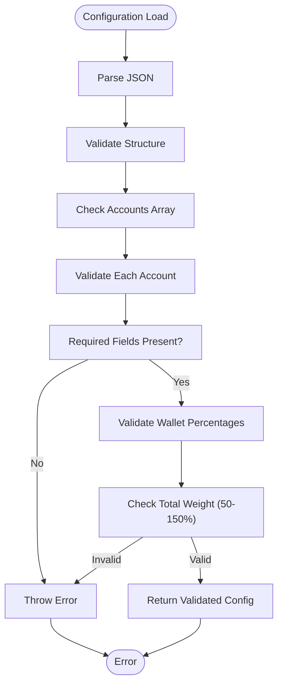
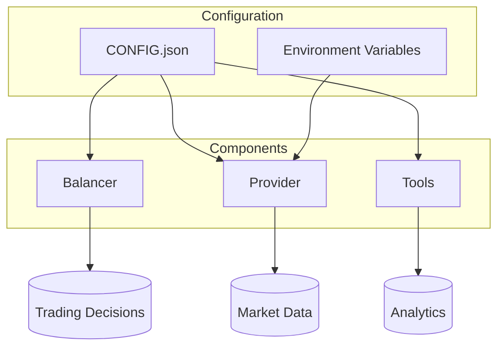

# Configuration Guide

<cite>
**Referenced Files in This Document**   
- [CONFIG.example.json](file://CONFIG.example.json)
- [src/configLoader.ts](file://src/configLoader.ts)
- [src/__tests__/__fixtures__/configurations.ts](file://src/__tests__/__fixtures__/configurations.ts)
- [src/types.d.ts](file://src/types.d.ts)
- [README.config.md](file://README.config.md)
</cite>

## Table of Contents
1. [Configuration System Overview](#configuration-system-overview)
2. [Core Configuration Structure](#core-configuration-structure)
3. [Account-Level Configuration](#account-level-configuration)
4. [Rebalancing Modes](#rebalancing-modes)
5. [Margin Trading Configuration](#margin-trading-configuration)
6. [Advanced Configuration Options](#advanced-configuration-options)
7. [Environment Variable Interpolation](#environment-variable-interpolation)
8. [Configuration Validation Rules](#configuration-validation-rules)
9. [Annotated Configuration Examples](#annotated-configuration-examples)
10. [Configuration-Driven Components](#configuration-driven-components)
11. [Testing and Troubleshooting](#testing-and-troubleshooting)

## Configuration System Overview

The configuration system for the Tinkoff Invest ETF Balancer Bot is designed to support multiple accounts with flexible portfolio management strategies. The system uses a JSON-based configuration file (CONFIG.json) that replaces the previous hardcoded settings in src/config.ts, providing enhanced flexibility, validation, and multi-account support.

The configuration loader implements a singleton pattern through ConfigLoader.getInstance(), ensuring consistent access to configuration data across the application. The system supports both production (CONFIG.json) and test (CONFIG.test.json) environments, with automatic selection based on the NODE_ENV variable.



**Diagram sources**
- [src/configLoader.ts](file://src/configLoader.ts#L26-L43)
- [README.config.md](file://README.config.md#L1-L200)

**Section sources**
- [src/configLoader.ts](file://src/configLoader.ts#L1-L50)
- [README.config.md](file://README.config.md#L1-L50)

## Core Configuration Structure

The root structure of CONFIG.json consists of a ProjectConfig object containing an array of AccountConfig objects. The top-level structure supports optional AUM/capitalization cache configuration and mandatory account definitions.

```json
{
  "aum_cache": {
    "enabled": true,
    "ttl_hours": 24
  },
  "accounts": [
    {
      "id": "account_1",
      "name": "Primary Brokerage Account",
      "t_invest_token": "${T_INVEST_TOKEN}",
      "account_id": "BROKER",
      "desired_wallet": {
        "TGLD": 8.33,
        "TRUR": 8.33,
        "TRND": 8.33
      },
      "desired_mode": "manual"
    }
  ]
}
```

The ProjectConfig interface defines the overall structure with two primary properties: aum_cache (optional) and accounts (required array). Each account represents a separate Tinkoff Invest account with its own rebalancing strategy and parameters.

**Section sources**
- [src/types.d.ts](file://src/types.d.ts#L137-L146)
- [CONFIG.example.json](file://CONFIG.example.json#L1-L52)

## Account-Level Configuration

Each AccountConfig object contains comprehensive settings for individual brokerage accounts. The configuration includes identification, authentication, portfolio targets, timing parameters, and advanced trading features.

### Required Fields
All account configurations must include these essential fields:
- `id`: Unique identifier for the account
- `name`: Human-readable account name
- `t_invest_token`: API token reference (direct or environment variable)
- `account_id`: Account type or specific ID (BROKER, ISS, etc.)
- `desired_wallet`: Target portfolio allocation percentages
- `desired_mode`: Portfolio construction strategy
- `balance_interval`: Rebalancing frequency in milliseconds
- `sleep_between_orders`: Delay between order executions in milliseconds

### Timing Parameters
The balance_interval parameter controls how frequently the balancer checks and adjusts the portfolio. Common values range from 900,000 ms (15 minutes) for aggressive strategies to 3,600,000 ms (1 hour) for conservative approaches. The sleep_between_orders parameter prevents rate limiting by introducing delays between individual order placements.

**Section sources**
- [src/types.d.ts](file://src/types.d.ts#L102-L135)
- [README.config.md](file://README.config.md#L50-L100)

## Rebalancing Modes

The system supports multiple portfolio construction strategies through the desired_mode parameter, allowing users to choose between manual allocation and automated weighting methods.

### Supported Modes
- `manual`: Use explicitly defined weights in desired_wallet
- `default`: Synonym for manual mode
- `marketcap`: Weight instruments by market capitalization
- `aum`: Weight instruments by Assets Under Management
- `marketcap_aum`: Market cap weighting with AUM fallback
- `decorrelation`: Allocate based on correlation analysis

The decorrelation mode implements sophisticated statistical analysis to minimize portfolio volatility by reducing exposure to highly correlated assets. The marketcap and aum modes automatically fetch current data to calculate appropriate weightings, while manual mode relies solely on user-defined percentages.



**Diagram sources**
- [src/types.d.ts](file://src/types.d.ts#L71-L71)
- [README.config.md](file://README.config.md#L150-L170)

**Section sources**
- [src/types.d.ts](file://src/types.d.ts#L71-L71)
- [README.config.md](file://README.config.md#L150-L170)

## Margin Trading Configuration

The margin_trading object enables sophisticated leverage strategies with comprehensive risk controls. This feature allows the bot to utilize borrowed funds for enhanced returns while maintaining strict safety parameters.

```typescript
interface AccountMarginConfig {
  enabled: boolean;
  multiplier: number; // 1-4
  free_threshold: number; // RUB
  max_margin_size: number; // Maximum margin in RUB
  balancing_strategy: MarginBalancingStrategy;
}
```

### Key Parameters
- `enabled`: Toggle margin trading functionality
- `multiplier`: Portfolio leverage factor (1-4x)
- `free_threshold`: Minimum equity level before margin fees apply
- `max_margin_size`: Absolute limit on borrowed funds
- `balancing_strategy`: Method for handling margin positions during rebalancing

The balancing_strategy accepts three values: 'remove' (close margin positions), 'keep' (maintain existing margin), and 'keep_if_small' (preserve small margin positions). These strategies help manage risk exposure during portfolio adjustments.

**Section sources**
- [src/types.d.ts](file://src/types.d.ts#L73-L79)
- [CONFIG.example.json](file://CONFIG.example.json#L20-L30)

## Advanced Configuration Options

The system includes several advanced features that enhance trading precision and risk management.

### Exchange Closure Behavior
The exchange_closure_behavior configuration determines how the bot responds when markets are closed:

```typescript
interface ExchangeClosureBehavior {
  mode: 'skip_iteration' | 'force_orders' | 'dry_run';
  update_iteration_result: boolean;
}
```

- `skip_iteration`: Skip rebalancing entirely (default)
- `force_orders`: Attempt to place orders despite closure
- `dry_run`: Calculate rebalancing without executing trades

### Minimum Profit Threshold
The min_profit_percent_for_close_position parameter sets profit targets for position closures. Positive values specify minimum profit percentages (e.g., 5 = 5% minimum profit), while negative values represent maximum allowable losses (e.g., -2 = close if loss exceeds 2%).

### Difference Calculation
The diff and diff_multiplier parameters control adaptive rebalancing:
- `diff`: 'off', 'iteration', or 'day' (calculation method)
- `diff_multiplier`: Influence strength (0-100%)

When enabled, difference calculation adjusts target allocations based on recent performance deviations.

**Section sources**
- [src/types.d.ts](file://src/types.d.ts#L84-L98)
- [src/types.d.ts](file://src/types.d.ts#L100-L100)
- [CONFIG.example.json](file://CONFIG.example.json#L15-L18)

## Environment Variable Interpolation

The configuration system supports secure token management through environment variable interpolation. Tokens can be referenced using the ${VARIABLE_NAME} syntax, which the configLoader resolves at runtime.

```json
{
  "t_invest_token": "${T_INVEST_TOKEN}"
}
```

The getAccountToken method handles this interpolation by checking if the token value follows the ${} pattern. If so, it extracts the variable name and retrieves its value from process.env. This approach enhances security by preventing API tokens from being stored in version-controlled files.



**Diagram sources**
- [src/configLoader.ts](file://src/configLoader.ts#L60-L74)
- [README.config.md](file://README.config.md#L100-L120)

**Section sources**
- [src/configLoader.ts](file://src/configLoader.ts#L60-L74)
- [README.config.md](file://README.config.md#L100-L120)

## Configuration Validation Rules

The ConfigLoader implements comprehensive validation to ensure configuration integrity and prevent runtime errors.

### Account Validation
The validateAccount method checks for:
- Presence of all required fields
- Valid percentage ranges (0-100%) in desired_wallet
- Reasonable total weight sum (50-150%)
- Properly formatted exchange_closure_behavior
- Correct buy_requires_total_marginal_sell configuration

### Percentage Validation
Individual instrument percentages must be finite numbers between 0 and 100. The total sum of desired_wallet percentages should be between 50% and 150%, as the balancer normalizes weights to 100%. This range allows for strategic over/under-weighting while preventing extreme allocations.

### Advanced Feature Validation
Specialized validation methods handle complex features:
- validateExchangeClosureBehavior: Ensures valid modes and boolean flags
- validateBuyRequiresTotalMarginalSell: Validates instrument lists and sell strategies
- validateMinProfitPercentForClosePosition: Checks bounds (-100 to 1000)



**Diagram sources**
- [src/configLoader.ts](file://src/configLoader.ts#L94-L102)
- [src/configLoader.ts](file://src/configLoader.ts#L104-L200)

**Section sources**
- [src/configLoader.ts](file://src/configLoader.ts#L104-L200)
- [src/__tests__/__fixtures__/configurations.ts](file://src/__tests__/__fixtures__/configurations.ts#L300-L350)

## Annotated Configuration Examples

### Basic Manual Rebalancing
```json
{
  "accounts": [
    {
      "id": "primary",
      "name": "Main Investment Account",
      "t_invest_token": "${T_INVEST_TOKEN_MAIN}",
      "account_id": "BROKER",
      "desired_wallet": {
        "TRUR": 40,
        "TMOS": 30,
        "TGLD": 20,
        "TRAY": 10
      },
      "desired_mode": "manual",
      "balance_interval": 3600000,
      "sleep_between_orders": 3000
    }
  ]
}
```

### Advanced Margin Configuration
```json
{
  "accounts": [
    {
      "id": "aggressive",
      "name": "Aggressive Growth Account",
      "t_invest_token": "${T_INVEST_TOKEN_AGGRESSIVE}",
      "account_id": "BROKER",
      "desired_wallet": {
        "TRUR": 50,
        "TMOS": 30,
        "TECH": 20
      },
      "desired_mode": "marketcap",
      "balance_interval": 1800000,
      "sleep_between_orders": 1500,
      "margin_trading": {
        "enabled": true,
        "multiplier": 3,
        "free_threshold": 25000,
        "max_margin_size": 500000,
        "balancing_strategy": "keep_if_small"
      },
      "exchange_closure_behavior": {
        "mode": "dry_run",
        "update_iteration_result": true
      }
    }
  ]
}
```

### Multi-Account Setup
```json
{
  "aum_cache": {
    "enabled": true,
    "ttl_hours": 12
  },
  "accounts": [
    {
      "id": "conservative",
      "name": "Conservative Portfolio",
      "t_invest_token": "${T_INVEST_TOKEN_CONSERVATIVE}",
      "account_id": "BROKER",
      "desired_wallet": {
        "TRUR": 60,
        "TGLD": 40
      },
      "desired_mode": "manual"
    },
    {
      "id": "growth",
      "name": "Growth Portfolio",
      "t_invest_token": "${T_INVEST_TOKEN_GROWTH}",
      "account_id": "ISS",
      "desired_wallet": {
        "TECH": 50,
        "HEALTH": 30,
        "GREEN": 20
      },
      "desired_mode": "aum"
    }
  ]
}
```

**Section sources**
- [CONFIG.example.json](file://CONFIG.example.json#L1-L52)
- [src/__tests__/__fixtures__/configurations.ts](file://src/__tests__/__fixtures__/configurations.ts#L100-L200)

## Configuration-Driven Components

The configuration system drives multiple components throughout the application architecture.

### Balancer Component
The balancer uses desired_mode and desired_wallet to determine target allocations. For automated modes (marketcap, aum, decorrelation), it fetches current market data to calculate weights. The balance_interval parameter controls execution frequency.

### Provider Component
The provider utilizes account_id and t_invest_token to authenticate with the Tinkoff Invest API. The sleep_between_orders setting regulates request pacing to avoid rate limits.

### Tools Component
Various tools leverage configuration data:
- configManager: Reads and updates configuration
- pollEtfMetrics: Uses account credentials for data collection
- debugBalancer: Applies configuration to simulation environments



**Diagram sources**
- [src/configLoader.ts](file://src/configLoader.ts#L1-L50)
- [README.config.md](file://README.config.md#L180-L200)

**Section sources**
- [src/configLoader.ts](file://src/configLoader.ts#L1-L50)
- [README.config.md](file://README.config.md#L180-L200)

## Testing and Troubleshooting

The system includes comprehensive testing infrastructure and diagnostic tools.

### Test Fixtures
The __fixtures__ directory contains mock configurations for various scenarios:
- Valid configurations with different margin settings
- Invalid configurations for error handling tests
- Multi-account setups
- Edge cases for validation testing

### Common Validation Errors
- **Missing required fields**: Ensure all accounts have id, name, t_invest_token, etc.
- **Invalid percentage values**: Check that desired_wallet values are 0-100
- **Sum outside range**: Verify total desired_wallet sum is 50-150%
- **Invalid enum values**: Confirm desired_mode and other enums use valid options
- **Token resolution failure**: Verify environment variables are properly set

### Troubleshooting Steps
1. Run `bun run config validate` to check configuration syntax
2. Verify environment variables are loaded correctly
3. Check file permissions for CONFIG.json
4. Validate JSON syntax using online validators
5. Review console output for specific error messages

The config validation tests in src/__tests__/configLoader cover numerous error scenarios, including malformed JSON, missing fields, invalid values, and edge cases.

**Section sources**
- [src/__tests__/__fixtures__/configurations.ts](file://src/__tests__/__fixtures__/configurations.ts#L1-L362)
- [README.config.md](file://README.config.md#L180-L200)
- [src/configLoader.ts](file://src/configLoader.ts#L200-L344)