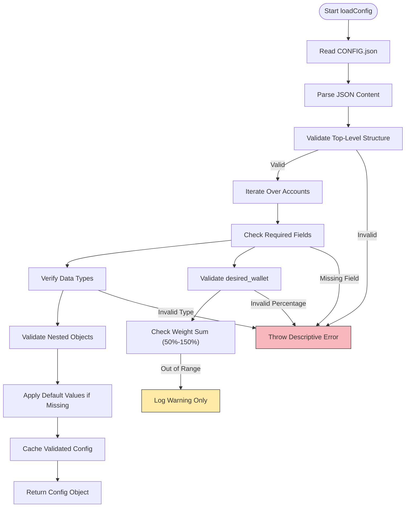
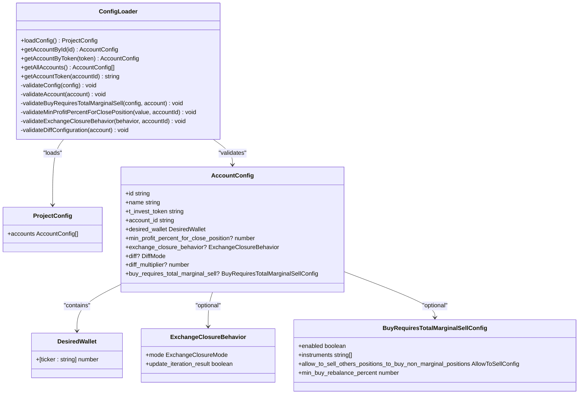
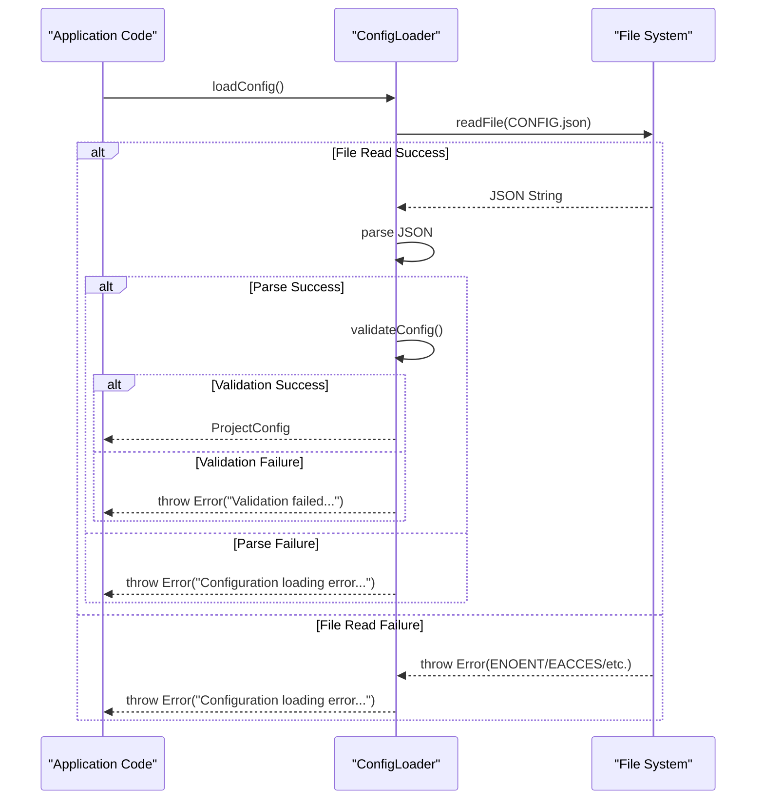

# Configuration Validation

<cite>
**Referenced Files in This Document **   
- [configLoader.ts](file://src/configLoader.ts)
- [config-validation-scenarios.test.ts](file://src/__tests__/configLoader/config-validation-scenarios.test.ts)
- [config-error-handling.test.ts](file://src/__tests__/configLoader/config-error-handling.test.ts)
- [config-performance-scenarios.test.ts](file://src/__tests__/configLoader/config-performance-scenarios.test.ts)
- [configLoader.test.ts](file://src/__tests__/configLoader/configLoader.test.ts)
- [configurations.ts](file://src/__tests__/__fixtures__/configurations.ts)
- [types.d.ts](file://src/types.d.ts)
</cite>

## Table of Contents
1. [Configuration Validation Pipeline](#configuration-validation-pipeline)  
2. [Type Checking and Field Verification](#type-checking-and-field-verification)  
3. [Semantic Validation Rules](#semantic-validation-rules)  
4. [Error Handling Strategies](#error-handling-strategies)  
5. [Test Suite Coverage](#test-suite-coverage)  
6. [Using Test Fixtures for Custom Configurations](#using-test-fixtures-for-custom-configurations)  
7. [Debugging Validation Failures](#debugging-validation-failures)

## Configuration Validation Pipeline

The configuration validation pipeline implemented in `configLoader.ts` ensures that all user-defined configurations meet structural, syntactic, and semantic requirements before being used by the application. The process begins when the `loadConfig()` method is invoked, which reads the JSON configuration file from disk and parses it into a JavaScript object. If the configuration has already been loaded, the cached version is returned to optimize performance.

Following successful parsing, the `validateConfig()` method is called to initiate a hierarchical validation sequence. This method first verifies the presence and type of the top-level `accounts` array. It then iterates over each account, invoking `validateAccount()` to perform deep validation on individual account structures. Each validation step is designed to fail fast with descriptive error messages, enabling users to quickly identify and correct issues.

The validation pipeline supports both strict schema enforcement and backward compatibility through default value injection. For example, if `exchange_closure_behavior` is omitted from an account configuration, the system automatically applies safe defaults rather than rejecting the entire config. This design balances robustness with usability, allowing incremental adoption of new features without breaking existing setups.



**Diagram sources**
- [configLoader.ts](file://src/configLoader.ts#L150-L340)

**Section sources**
- [configLoader.ts](file://src/configLoader.ts#L1-L344)

## Type Checking and Field Verification

The validation mechanism enforces strict type checking and required field verification at multiple levels within the configuration hierarchy. At the account level, five core fields are mandatory: `id`, `name`, `t_invest_token`, `account_id`, and `desired_wallet`. The absence of any of these triggers an immediate validation failure with a clear message identifying the missing field and associated account ID.

Each field undergoes rigorous type validation. For instance, `t_invest_token` must be a string, while `balance_interval` and `sleep_between_orders` must be valid numbers. Boolean flags such as `margin_trading.enabled` are explicitly checked using `typeof value === 'boolean'` to prevent common pitfalls like treating strings or integers as booleans.

Token resolution logic includes additional validation for environment variable references. When a token value follows the `${VARIABLE_NAME}` format, the system confirms proper syntax (starting with `${` and ending with `}`). Malformed patterns result in warnings but do not cause full validation failure—instead, the raw string is preserved to avoid blocking legitimate use cases during debugging.

For nested objects like `buy_requires_total_marginal_sell`, comprehensive type checks ensure every subfield adheres to its expected type. Arrays are verified using `Array.isArray()`, and their elements are individually validated—for example, ensuring all entries in `instruments` are strings. Numeric values are further validated using `Number.isFinite()` to reject `Infinity`, `-Infinity`, and `NaN`.



**Diagram sources**
- [configLoader.ts](file://src/configLoader.ts#L50-L340)
- [types.d.ts](file://src/types.d.ts)

**Section sources**
- [configLoader.ts](file://src/configLoader.ts#L200-L220)
- [configurations.ts](file://src/__tests__/__fixtures__/configurations.ts)

## Semantic Validation Rules

Beyond basic type and presence checks, the system implements several semantic validation rules to ensure financial and operational correctness. The most critical of these governs the sum of percentages defined in the `desired_wallet`. While the rebalancer normalizes weights to 100%, the validator requires that the total weight fall between 50% and 150%. Values outside this range trigger errors because they likely indicate configuration mistakes—such as accidentally specifying basis points instead of percentages.

Individual percentage values are constrained to the 0–100 range and must be finite numbers. Negative allocations are prohibited, as are excessively large values that could overflow numeric limits. These constraints prevent invalid trading decisions based on corrupted input data.

Specialized configurations undergo domain-specific validation:
- `min_profit_percent_for_close_position` accepts values from -100 (total loss tolerance) to 1000 (10x profit target), supporting both risk management and aggressive growth strategies.
- `exchange_closure_behavior.mode` must be one of three allowed values: `skip_iteration`, `force_orders`, or `dry_run`.
- `diff_multiplier` is restricted to 0–100, representing a percentage adjustment factor applied during differential rebalancing calculations.

When `buy_requires_total_marginal_sell` is enabled, its internal structure is validated recursively. The `allow_to_sell_others_positions_to_buy_non_marginal_positions.mode` field must be one of: `only_positive_positions_sell`, `equal_in_percents`, or `none`. Additionally, `min_buy_rebalance_percent` must be a number between 0 and 100, defining the minimum deviation threshold that triggers rebalancing actions.

A notable feature is the warning system for logically inconsistent settings. For example, if `diff_multiplier` is set above zero but `diff` mode is `'off'`, a console warning is issued indicating that the multiplier will have no effect. This helps users detect misconfigurations without halting execution.

**Section sources**
- [configLoader.ts](file://src/configLoader.ts#L225-L295)
- [config-validation-scenarios.test.ts](file://src/__tests__/configLoader/config-validation-scenarios.test.ts)

## Error Handling Strategies

The system employs a layered error handling strategy designed to provide actionable feedback while maintaining resilience. All validation failures throw descriptive `Error` objects containing contextual information such as account IDs, field names, and actual vs. expected values. These messages are structured to guide users toward correction without exposing sensitive internals.

For file system and parsing errors, the system wraps underlying exceptions with higher-level messages. A missing configuration file results in `"Configuration loading error: ENOENT: no such file or directory"`, while invalid JSON produces `"Configuration loading error: Unexpected token"` followed by the parser’s specific message. This preserves diagnostic detail while standardizing the error surface.

During testing, mocks simulate various failure modes including permission denied (`EACCES`), disk full (`ENOSPC`), and network unreachable (`ENETUNREACH`) conditions. The system responds uniformly by throwing configuration loading errors, allowing upstream components to handle them consistently regardless of root cause.

Warnings are used selectively for non-critical issues. For example, setting a `diff_multiplier` without enabling `diff` mode generates a console log but does not interrupt processing. Similarly, omitting `exchange_closure_behavior` results in an informational message about default values being applied.

The test suite verifies that all error paths produce meaningful output. Tests confirm that malformed JSON, missing accounts arrays, and invalid enum values generate distinct, human-readable messages. Recovery mechanisms are also tested—when possible, the system continues operation with partial configurations or retries transient failures.



**Diagram sources**
- [configLoader.ts](file://src/configLoader.ts#L150-L180)
- [config-error-handling.test.ts](file://src/__tests__/configLoader/config-error-handling.test.ts)

**Section sources**
- [config-error-handling.test.ts](file://src/__tests__/configLoader/config-error-handling.test.ts)
- [configLoader.test.ts](file://src/__tests__/configLoader/configLoader.test.ts)

## Test Suite Coverage

The validation logic is comprehensively tested across multiple dimensions, ensuring reliability under diverse scenarios. Unit tests in `config-validation-scenarios.test.ts` cover edge cases such as zero-weight allocations, over-allocated wallets (>100%), and Unicode symbol names. These tests verify both acceptance of valid edge cases and rejection of clearly invalid ones.

Error handling is rigorously validated in `config-error-handling.test.ts`, which simulates file system failures (missing files, permission errors), parsing errors (malformed JSON, control characters), and structural issues (missing accounts array). Each scenario confirms that appropriate error messages are generated and logged.

Performance characteristics are evaluated in `config-performance-scenarios.test.ts`, testing how the system handles large configurations with many accounts or deeply nested structures. Although current implementations are synchronous, benchmarks ensure that typical real-world configs load within acceptable timeframes.

Integration tests in `configLoader.test.ts` validate end-to-end behavior, including singleton pattern enforcement, caching, and environment-based config selection. These tests use mock file systems to isolate I/O dependencies while verifying correct interaction between loading, parsing, and validation phases.

All test fixtures reside in `configurations.ts`, providing reusable valid and invalid configurations. These include minimal accounts, multi-account setups, margin-enabled profiles, and legacy formats for backward compatibility testing. Invalid configurations systematically exercise each validation rule, ensuring complete branch coverage.

**Section sources**
- [config-validation-scenarios.test.ts](file://src/__tests__/configLoader/config-validation-scenarios.test.ts)
- [config-error-handling.test.ts](file://src/__tests__/configLoader/config-error-handling.test.ts)
- [config-performance-scenarios.test.ts](file://src/__tests__/configLoader/config-performance-scenarios.test.ts)
- [configLoader.test.ts](file://src/__tests__/configLoader/configLoader.test.ts)
- [configurations.ts](file://src/__tests__/__fixtures__/configurations.ts)

## Using Test Fixtures for Custom Configurations

Developers can leverage the provided test fixtures in `configurations.ts` to validate custom configurations during development and testing. These fixtures offer representative examples of valid account structures, wallet distributions, and advanced features like margin trading and exchange closure behaviors.

To test a new configuration, import the relevant mock objects and extend them as needed:

```typescript
import { mockAccountConfigs, mockDesiredWallets } from '../__fixtures__/configurations';

const customAccount = {
  ...mockAccountConfigs.basic,
  id: 'custom-account',
  name: 'Custom Test Account',
  desired_wallet: {
    ...mockDesiredWallets.simple,
    TSPX: 20 // Add new ETF
  },
  min_profit_percent_for_close_position: 5.5
};
```

These fixtures are used throughout the test suite and serve as canonical examples of properly structured data. They include variations for different trading strategies, risk profiles, and operational modes.

For integration testing, the `mockConfigFiles` export provides pre-serialized JSON strings representing valid and invalid configurations. These can be written to temporary files and loaded via `configLoader` to simulate real-world usage patterns.

Additionally, the `validationTestCases` object enumerates all valid and invalid values for enumerated fields, making it easy to write parameterized tests that cover boundary conditions and invalid inputs.

**Section sources**
- [configurations.ts](file://src/__tests__/__fixtures__/configurations.ts)

## Debugging Validation Failures

When encountering validation failures, follow this systematic approach to diagnose and resolve issues:

1. **Check Error Message Context**: Examine the full error text for account ID, field name, and actual/expected values. For example:  
   `Account test-account must contain field t_invest_token`

2. **Verify JSON Syntax**: Use a JSON validator to confirm your configuration file is syntactically correct. Common issues include trailing commas, unquoted keys, and mismatched brackets.

3. **Review Required Fields**: Ensure all accounts contain the five mandatory fields: `id`, `name`, `t_invest_token`, `account_id`, and `desired_wallet`.

4. **Validate Percentage Ranges**: Confirm all `desired_wallet` values are numbers between 0 and 100, and that their sum falls between 50% and 150%.

5. **Inspect Environment Variables**: If using `${VAR}` syntax, verify the corresponding environment variable exists and contains the expected value.

6. **Enable Logging**: Run the application with debug logging enabled to see informational messages about default values being applied.

7. **Use Test Fixtures as Reference**: Compare your configuration against the valid examples in `configurations.ts`.

8. **Run Validation Tests Locally**: Execute `bun test config-validation-scenarios` to reproduce the issue in a controlled environment.

For complex debugging sessions, consider using `debug-configloader.ts` or running `simple-debug.test.ts` with breakpoints to step through the validation pipeline and observe intermediate states.

**Section sources**
- [config-error-handling.test.ts](file://src/__tests__/configLoader/config-error-handling.test.ts)
- [configLoader.test.ts](file://src/__tests__/configLoader/configLoader.test.ts)
- [configurations.ts](file://src/__tests__/__fixtures__/configurations.ts)