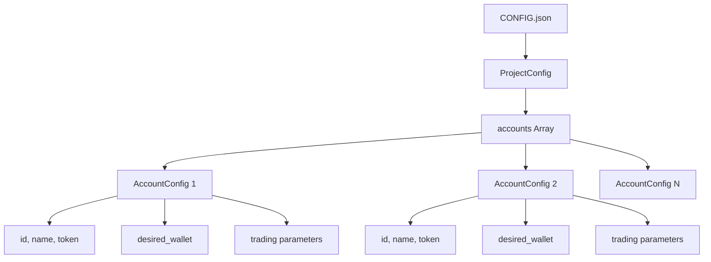

# Multi-Account Management

<cite>
**Referenced Files in This Document**   
- [CONFIG.example.json](file://CONFIG.example.json)
- [CONFIG.json](file://CONFIG.json)
- [src/configLoader.ts](file://src/configLoader.ts)
- [src/types.d.ts](file://src/types.d.ts)
- [README.config.md](file://README.config.md)
- [test-configs/CONFIG.test-final.json](file://test-configs/CONFIG.test-final.json)
</cite>

## Table of Contents
1. [Introduction](#introduction)
2. [Multi-Account Configuration Structure](#multi-account-configuration-structure)
3. [Account Identifier System](#account-identifier-system)
4. [Selective Configuration with --account Flag](#selective-configuration-with---account-flag)
5. [Mixed Account Type Scenarios](#mixed-account-type-scenarios)
6. [Configuration Inheritance and Overrides](#configuration-inheritance-and-overrides)
7. [ConfigLoader Role in Account Management](#configloader-role-in-account-management)
8. [Complex Multi-Account Setup Examples](#complex-multi-account-setup-examples)

## Introduction
The Tinkoff Invest ETF Balancer Bot supports multi-account management through a flexible JSON-based configuration system. This document details how the system enables simultaneous management of multiple brokerage accounts with independent configurations, including different rebalancing strategies, margin settings, and account-specific parameters. The architecture allows for selective processing of accounts using command-line flags while maintaining strict validation and isolation between account configurations.

**Section sources**
- [README.config.md](file://README.config.md#L0-L200)

## Multi-Account Configuration Structure
The core of multi-account support lies in the `accounts` array within the CONFIG.json file. Each account is defined as an object with comprehensive configuration parameters including unique identifiers, API tokens, desired portfolio allocations, and specialized trading behaviors. The configuration structure follows the ProjectConfig interface which mandates an accounts array containing AccountConfig objects.

Each account must specify essential fields: id (unique identifier), name (human-readable label), t_invest_token (authentication token reference), account_id (brokerage account type or number), and desired_wallet (target ETF allocation percentages). Additional parameters control rebalancing frequency, order execution delays, margin trading capabilities, and exchange closure behavior.

The system validates that each account's desired wallet percentages are numeric values between 0-100% and that the total sum falls within a reasonable range of 50-150% (automatically normalized to 100% during processing). This validation ensures mathematical integrity while allowing flexibility in configuration.



**Diagram sources**
- [src/types.d.ts](file://src/types.d.ts#L137-L146)
- [CONFIG.example.json](file://CONFIG.example.json#L0-L51)

**Section sources**
- [src/types.d.ts](file://src/types.d.ts#L102-L135)
- [CONFIG.example.json](file://CONFIG.example.json#L0-L51)

## Account Identifier System
Accounts are uniquely identified through a string-based ID system specified in the `id` field of each AccountConfig object. This identifier serves as the primary key for account lookup and manipulation throughout the system. The account identifier is completely independent of the brokerage account number (specified in `account_id`) and exists solely for internal configuration management purposes.

The system provides multiple methods for retrieving account configurations based on different criteria:
- `getAccountById(accountId: string)`: Retrieves configuration by the internal account identifier
- `getAccountByToken(token: string)`: Finds account by its authentication token value
- `getAllAccounts()`: Returns configurations for all defined accounts

This identifier system enables scripts and commands to reference accounts consistently regardless of their actual brokerage account numbers or token values. The identifiers appear in logs, error messages, and CLI operations, providing clear tracking of which account is being processed.

**Section sources**
- [src/configLoader.ts](file://src/configLoader.ts#L45-L58)
- [src/types.d.ts](file://src/types.d.ts#L103-L103)

## Selective Configuration with --account Flag
The system supports selective processing of specific accounts through the `--account` command-line flag. This feature allows users to target individual accounts for operations such as balance checks, configuration validation, or manual rebalancing without affecting other configured accounts.

When the `--account` flag is provided with an account identifier, the application filters its operations to affect only that specific account. For example, running `bun run balance --account account_1` would execute the balancing algorithm exclusively for the account with id "account_1". This selective processing is implemented at the application level by passing the account identifier to the ConfigLoader, which then returns only the relevant account configuration for processing.

The implementation ensures complete isolation between accounts, meaning that operations on one account cannot inadvertently affect another. This isolation extends to all aspects of account management including API calls, order execution, and state tracking.

**Section sources**
- [src/__tests__/integration/integration.test.ts](file://src/__tests__/integration/integration.test.ts#L186-L226)

## Mixed Account Type Scenarios
The configuration system supports mixed account types through the `account_id` field, which can represent different kinds of Tinkoff brokerage accounts. While the sample configurations primarily show standard brokerage accounts (BROKER), the system architecture allows for different account types to be managed simultaneously.

Different account types may have varying constraints and capabilities:
- Standard brokerage accounts support full trading functionality
- IRA-style accounts may have tax implications and withdrawal restrictions
- Specialized accounts might have different margin rules or instrument availability

Each account maintains independent settings for margin trading (`margin_trading.enabled`), allowing some accounts to operate with leverage while others remain conservative. The `buy_requires_total_marginal_sell` configuration can also vary by account, enabling different risk management approaches across the portfolio.

For example, a user might configure one account as aggressive with margin trading enabled (multiplier: 3) while keeping another as conservative with margin disabled entirely. Both accounts can coexist in the same CONFIG.json file and be processed according to their individual risk profiles.

**Section sources**
- [test-configs/CONFIG.test-final.json](file://test-configs/CONFIG.test-final.json#L0-L110)

## Configuration Inheritance and Overrides
The system implements a flat configuration model without traditional inheritance, but provides effective override capabilities through account-specific settings. All configuration parameters are defined at the account level, giving each account complete autonomy in its settings.

While there is no hierarchical inheritance from global to account-level settings, the system does provide default values for certain optional parameters:
- `exchange_closure_behavior` defaults to {mode: 'skip_iteration', update_iteration_result: false} if not specified
- `diff` defaults to 'off' when not explicitly set
- `diff_multiplier` defaults to 0 when omitted

These defaults serve as fallbacks rather than inherited values, ensuring that each account has a complete and self-contained configuration. The validation process enforces this completeness by checking for required fields and applying defaults only when necessary.

Account configurations can effectively "override" global assumptions by specifying their own values for shared parameters like rebalancing intervals, sleep times between orders, and portfolio construction methodologies (`desired_mode`).

**Section sources**
- [src/configLoader.ts](file://src/configLoader.ts#L104-L161)

## ConfigLoader Role in Account Management
The ConfigLoader class serves as the central authority for configuration management, providing singleton access to account configurations with built-in validation and caching. Implemented as a singleton pattern, it ensures consistent configuration access across the application while preventing redundant file reads.

Key responsibilities of ConfigLoader include:
- Loading and parsing the CONFIG.json file
- Validating the entire configuration structure
- Providing account-specific configuration retrieval
- Resolving token references from environment variables
- Enforcing configuration constraints

The loader handles token resolution by detecting environment variable references in the format `${VARIABLE_NAME}` and substituting them with actual values from process.env. Direct token specifications are used as-is, providing flexibility in security practices.

Configuration validation occurs at multiple levels:
1. Project-level validation ensuring the presence of the accounts array
2. Account-level validation checking required fields and data types
3. Domain-specific validation for parameters like wallet percentages and margin settings

The loader also supports dynamic configuration updates through `updateAccountConfig` and `updateConfig` methods, allowing runtime modifications that are persisted to disk.

```mermaid
classDiagram
class ConfigLoader {
+static getInstance(configPath? : string) ConfigLoader
+static resetInstance() void
+loadConfig() ProjectConfig
+getAccountById(accountId : string) AccountConfig | undefined
+getAccountByToken(token : string) AccountConfig | undefined
+getAllAccounts() AccountConfig[]
+getAccountToken(accountId : string) string | undefined
+updateAccountConfig(accountId : string, updates : Partial~AccountConfig~) Promise~void~
+updateConfig(config : ProjectConfig) Promise~void~
}
class ProjectConfig {
+aum_cache? {enabled : boolean, ttl_hours : number}
+accounts AccountConfig[]
}
class AccountConfig {
+id string
+name string
+t_invest_token string
+account_id string
+desired_wallet DesiredWallet
+desired_mode DesiredMode
+balance_interval number
+sleep_between_orders number
+margin_trading AccountMarginConfig
+exchange_closure_behavior ExchangeClosureBehavior
+min_profit_percent_for_close_position? number
+diff? DiffMode
+diff_multiplier? number
}
ConfigLoader --> ProjectConfig : "loads"
ProjectConfig --> AccountConfig : "contains"
```

**Diagram sources**
- [src/configLoader.ts](file://src/configLoader.ts#L4-L338)
- [src/types.d.ts](file://src/types.d.ts#L102-L135)

**Section sources**
- [src/configLoader.ts](file://src/configLoader.ts#L4-L338)

## Complex Multi-Account Setup Examples
The system supports sophisticated multi-account setups with varying rebalancing strategies, risk profiles, and operational parameters. Consider a scenario with three accounts:

1. **Conservative Account**: Uses `desired_mode: "manual"` with simple equal-weighted ETF allocation (25% each for TRUR, TMOS, TGLD, RUB), margin trading disabled, and longer rebalancing interval (3600 seconds)

2. **Aggressive Margin Account**: Employs `desired_mode: "decorrelation"` with nine different ETFs weighted from 5-15%, margin trading enabled with multiplier 3, short rebalancing interval (900 seconds), and aggressive `exchange_closure_behavior` set to "force_orders"

3. **Market-Cap Weighted Account**: Utilizes `desired_mode: "marketcap"` with four ETFs at varying weights (40%, 30%, 20%, 10%), moderate margin multiplier (1.5), and "dry_run" behavior during exchange closures

Each account can have different token management approaches—one using direct token specification, another referencing environment variables, and a third potentially using encrypted storage (though not shown in current configuration). The system processes these accounts independently, applying their respective rebalancing algorithms without interference.

The configuration also supports advanced features like the `buy_requires_total_marginal_sell` rule, which can be enabled selectively on accounts to prevent buying non-marginable assets unless sufficient marginal positions exist to cover potential losses.

**Section sources**
- [test-configs/CONFIG.test-final.json](file://test-configs/CONFIG.test-final.json#L0-L110)
- [README.config.md](file://README.config.md#L0-L200)