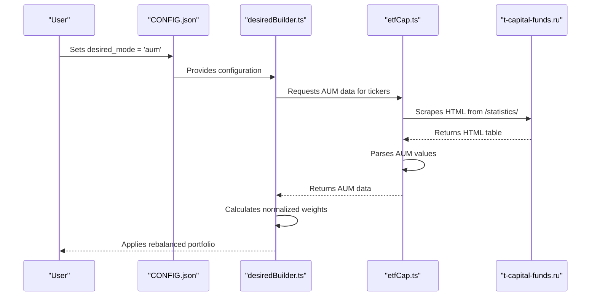
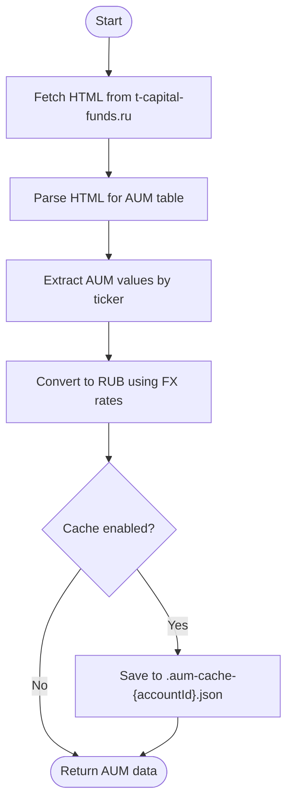
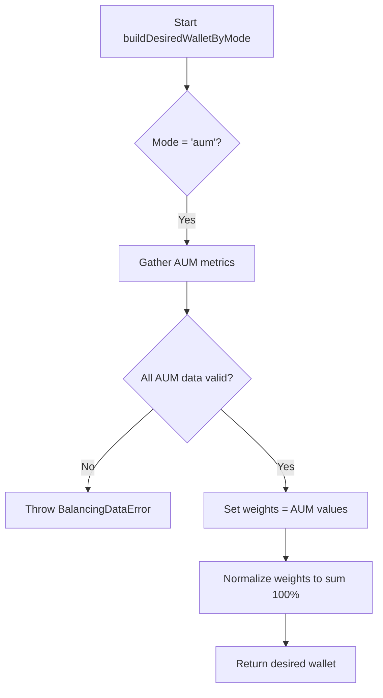

# AUM Mode Configuration

<cite>
**Referenced Files in This Document **   
- [etfCap.ts](file://src/tools/etfCap.ts)
- [desiredBuilder.ts](file://src/balancer/desiredBuilder.ts)
- [configLoader.ts](file://src/configLoader.ts)
- [pollEtfMetrics.ts](file://src/tools/pollEtfMetrics.ts)
- [CONFIG.json](file://CONFIG.json)
- [CONFIG.example.json](file://CONFIG.example.json)
</cite>

## Table of Contents
1. [Introduction](#introduction)
2. [AUM-Based Rebalancing Overview](#aum-based-rebalancing-overview)
3. [Configuration Parameters](#configuration-parameters)
4. [Data Acquisition Process](#data-acquisition-process)
5. [Weight Calculation Logic](#weight-calculation-logic)
6. [Validation and Error Handling](#validation-and-error-handling)
7. [Common Challenges and Solutions](#common-challenges-and-solutions)
8. [Realistic Configuration Example](#realistic-configuration-example)

## Introduction
This document details the Assets Under Management (AUM) based rebalancing mode for the Tinkoff Invest ETF Balancer Bot. The AUM mode leverages real-time investor interest data from T-Capital's website to dynamically adjust portfolio allocations, favoring ETFs that are experiencing growing investment inflows. This approach aims to align the portfolio with current market sentiment and capital flows within the T-Capital fund family.

**Section sources**
- [README.config.md](file://README.config.md#L14-L16)

## AUM-Based Rebalancing Overview
The AUM mode operates by retrieving the latest Assets Under Management figures for specified ETFs from T-Capital's public statistics page. These AUM values serve as a proxy for investor interest and confidence in each fund. The system then uses these figures to calculate normalized allocation percentages for the portfolio. ETFs with higher AUM growth are assigned larger weights, enabling the portfolio to automatically overweight funds that are attracting more capital from investors.



**Diagram sources **
- [etfCap.ts](file://src/tools/etfCap.ts#L57-L68)
- [desiredBuilder.ts](file://src/balancer/desiredBuilder.ts#L125-L328)

## Configuration Parameters
To enable AUM-based rebalancing, specific configuration parameters must be set in the account configuration within CONFIG.json.

### Required Parameters
- **mode**: Must be set to `'aum'` to activate AUM-based weighting.
- **aumSource**: Specifies the source for AUM data. Currently, only `'tcapital'` is supported, which retrieves data from `https://t-capital-funds.ru/statistics/`.

### Caching Configuration
The project-level configuration supports AUM data caching to reduce load on the target website and improve performance:
- **aum_cache.enabled**: Boolean flag to enable or disable caching (default: true).
- **aum_cache.ttl_hours**: Time-to-live for cached data in hours (default: 1).

**Section sources**
- [CONFIG.json](file://CONFIG.json#L1-L88)
- [CONFIG.example.json](file://CONFIG.example.json#L1-L52)

## Data Acquisition Process
The AUM data acquisition process involves several steps to retrieve and process information from T-Capital's website.

### Web Scraping Mechanism
The `etfCap.ts` module is responsible for scraping AUM data. It performs an HTTP GET request to `https://t-capital-funds.ru/statistics/` with appropriate headers to mimic a legitimate browser request. The response is parsed to locate the HTML table containing AUM figures.



**Diagram sources **
- [etfCap.ts](file://src/tools/etfCap.ts#L352-L428)
- [etfCap.ts](file://src/tools/etfCap.ts#L218-L281)

### Currency Conversion
AUM values may be reported in RUB, USD, or EUR. The system converts all values to RUB using current exchange rates obtained from the Tinkoff API. This ensures consistent comparison across all ETFs regardless of their reporting currency.

**Section sources**
- [etfCap.ts](file://src/tools/etfCap.ts#L352-L428)
- [pollEtfMetrics.ts](file://src/tools/pollEtfMetrics.ts#L237-L246)

## Weight Calculation Logic
The weight calculation is performed by the `desiredBuilder.ts` module, which orchestrates the entire rebalancing process.

### Workflow
1. The system collects AUM data for all ETFs listed in the `desired_wallet`.
2. It validates that AUM data is available for all requested tickers.
3. The raw AUM values are used as weights before normalization.
4. Weights are normalized so that the sum of all allocations equals 100%.

### Validation Check
Before proceeding with weight calculation, the system performs a validation check to ensure AUM data is available for all configured ETFs. If any ETF lacks AUM data, a `BalancingDataError` is thrown, preventing potentially incorrect rebalancing.



**Diagram sources **
- [desiredBuilder.ts](file://src/balancer/desiredBuilder.ts#L30-L123)
- [desiredBuilder.ts](file://src/balancer/desiredBuilder.ts#L125-L328)

## Validation and Error Handling
Robust validation and error handling are implemented at multiple levels to ensure system reliability.

### Configuration Validation
The `configLoader.ts` module validates the overall configuration structure during loading. While it does not specifically validate the `aumSource` parameter, it ensures the basic integrity of the configuration file, including required fields and data types for account settings.

### Runtime Error Handling
During AUM data retrieval, network errors, parsing failures, or missing data are caught and handled gracefully. The system will return partial or empty results rather than crashing, allowing the main application to decide how to proceed with incomplete data.

**Section sources**
- [configLoader.ts](file://src/configLoader.ts#L104-L161)
- [etfCap.ts](file://src/tools/etfCap.ts#L352-L428)

## Common Challenges and Solutions
Several challenges can arise when using AUM-based rebalancing, along with corresponding solutions.

### Website Structure Changes
If T-Capital modifies the HTML structure of their statistics page, the scraper may fail to locate the AUM table. The system employs multiple strategies to mitigate this:
- Using flexible regex patterns to identify the correct table.
- Implementing fallback mechanisms to search by ETF name if ticker-based lookup fails.
- Detailed logging to aid in debugging parsing issues.

### Missing AUM Data
Some ETFs might not have published AUM data. The system handles this by:
- Attempting to find data through alternative methods (e.g., searching by fund name).
- Providing detailed debug logs for specific problematic ETFs like TBRU, TOFZ, etc.
- Throwing explicit errors if critical data is missing, preventing erroneous rebalancing.

### Data Update Delays
AUM data on the website may not be updated in real-time. To address this:
- The system implements caching with a configurable TTL (Time-To-Live).
- Users can adjust the cache duration based on their tolerance for stale data versus the need for fresh information.
- Direct fetching can be forced by clearing the cache when up-to-date information is critical.

**Section sources**
- [etfCap.ts](file://src/tools/etfCap.ts#L352-L428)
- [etfCap.ts](file://src/tools/etfCap.ts#L218-L281)

## Realistic Configuration Example
Below is a realistic example of a CONFIG.json configuration using AUM-based rebalancing:

```json
{
  "aum_cache": {
    "enabled": true,
    "ttl_hours": 1
  },
  "accounts": [
    {
      "id": "2272547076",
      "name": "Main Brokerage Account",
      "t_invest_token": "${T_INVEST_TOKEN_4}",
      "account_id": "BROKER",
      "desired_wallet": {
        "TGLD": 8.33,
        "TRUR": 8.33,
        "TRND": 8.33,
        "TBRU": 8.33,
        "TDIV": 8.33,
        "TITR": 8.33,
        "TLCB": 8.33,
        "TOFZ": 8.33,
        "TPAY": 8.33
      },
      "desired_mode": "aum",
      "balance_interval": 3600000,
      "sleep_between_orders": 3000
    }
  ]
}
```

This configuration enables AUM-based rebalancing with a one-hour cache TTL, applying equal initial weights that will be dynamically adjusted based on the latest AUM data from T-Capital.

**Section sources**
- [CONFIG.json](file://CONFIG.json#L1-L88)
- [CONFIG.example.json](file://CONFIG.example.json#L1-L52)