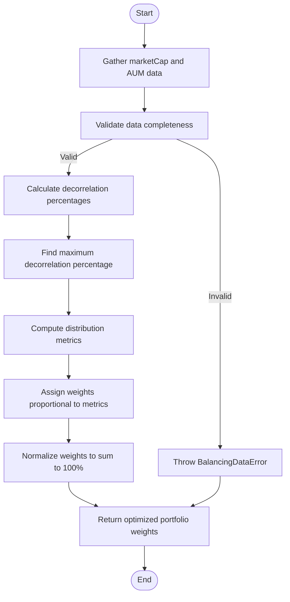

# Decorrelation Mode Configuration

<cite>
**Referenced Files in This Document**
- [CONFIG.example.json](file://CONFIG.example.json)
- [configLoader.ts](file://src/configLoader.ts)
- [desiredBuilder.ts](file://src/balancer/desiredBuilder.ts)
</cite>

## Table of Contents
1. [Introduction](#introduction)
2. [Decorrelation Mode Overview](#decorrelation-mode-overview)
3. [Configuration Parameters](#configuration-parameters)
4. [Practical Configuration Example](#practical-configuration-example)
5. [Correlation Matrix Computation](#correlation-matrix-computation)
6. [Data Validation and Error Handling](#data-validation-and-error-handling)
7. [Potential Issues and Mitigation Strategies](#potential-issues-and-mitigation-strategies)

## Introduction
This document provides comprehensive documentation for the decorrelation-based rebalancing mode in the Tinkoff Invest ETF Balancer Bot. The decorrelation mode is an advanced portfolio optimization strategy that enhances diversification by minimizing correlation between ETFs, thereby reducing overall portfolio risk. This document details the configuration requirements, implementation logic, data validation processes, and potential challenges associated with this sophisticated rebalancing approach.

## Decorrelation Mode Overview
The decorrelation mode optimizes portfolio allocation by analyzing the relationship between market capitalization (marketCap) and assets under management (AUM) for each ETF in the portfolio. This strategy aims to identify mispriced assets and allocate weights accordingly to maximize portfolio independence. The core principle is that when an ETF's market price deviates significantly from its fundamental value (represented by AUM), it presents an opportunity for strategic allocation.

The algorithm calculates a decorrelation percentage for each ETF using the formula: `(marketCap - AUM) / AUM * 100`. This percentage indicates whether an ETF is overvalued (positive percentage) or undervalued (negative percentage). The system then creates distribution metrics by subtracting each ETF's decorrelation percentage from the maximum observed percentage across all ETFs in the portfolio. These metrics are used to determine optimal weights, with higher weights assigned to ETFs exhibiting greater deviation from the market norm.

**Section sources**
- [desiredBuilder.ts](file://src/balancer/desiredBuilder.ts#L30-L123)
- [desiredBuilder.ts](file://src/balancer/desiredBuilder.ts#L125-L328)

## Configuration Parameters
To enable decorrelation mode, specific configuration fields must be set in the account configuration. The primary parameter is `desired_mode`, which must be set to `'decorrelation'`. This mode requires both market capitalization and AUM data for all ETFs in the portfolio to function correctly.

The configuration also includes several supporting parameters that influence the rebalancing process:
- `balance_interval`: Specifies the frequency (in milliseconds) at which portfolio rebalancing occurs
- `sleep_between_orders`: Defines the delay (in milliseconds) between consecutive trading orders
- `min_profit_percent_for_close_position`: Sets the minimum profit threshold required before closing a position

All instruments included in the decorrelation analysis must have sufficient historical data available, as the system validates the presence of both marketCap and AUM metrics before proceeding with weight calculations.

**Section sources**
- [CONFIG.example.json](file://CONFIG.example.json#L1-L51)
- [configLoader.ts](file://src/configLoader.ts#L150-L190)

## Practical Configuration Example
Below is an example configuration demonstrating how to set up decorrelation mode in the CONFIG.json file:

```json
{
  "accounts": [
    {
      "id": "account_1",
      "name": "Main Brokerage Account",
      "t_invest_token": "${T_INVEST_TOKEN}",
      "account_id": "BROKER",
      "desired_wallet": {
        "TGLD": 10,
        "TRUR": 10,
        "TRND": 10,
        "TBRU": 10,
        "TDIV": 10,
        "TITR": 10,
        "TLCB": 10,
        "TMON": 10,
        "TMOS": 10,
        "TOFZ": 10
      },
      "desired_mode": "decorrelation",
      "balance_interval": 3600000,
      "sleep_between_orders": 3000,
      "min_profit_percent_for_close_position": 5
    }
  ]
}
```

In this example, ten ETFs are included in the desired wallet, and the `desired_mode` is explicitly set to `'decorrelation'`. The system will analyze the marketCap and AUM data for each of these ETFs, calculate their decorrelation percentages, and derive optimal weights that enhance portfolio diversification. The rebalancing process will occur hourly (3,600,000 milliseconds), with a 3-second delay between order executions.

**Section sources**
- [CONFIG.example.json](file://CONFIG.example.json#L1-L51)
- [desiredBuilder.ts](file://src/balancer/desiredBuilder.ts#L125-L328)

## Correlation Matrix Computation
The decorrelation mode computes optimal weights through a systematic process implemented in the `buildDesiredWalletByMode` function. The computation begins by gathering marketCap and AUM data for each ETF from multiple sources, including local JSON files in the `etf_metrics` directory and live data from external APIs.

The algorithm follows these steps:
1. Normalize ticker symbols for consistent processing
2. Retrieve marketCap and AUM values for each ETF in Russian rubles
3. Validate that both metrics are available and positive for all ETFs
4. Calculate decorrelation percentages using the formula `(marketCap - AUM) / AUM * 100`
5. Determine the maximum decorrelation percentage across all ETFs
6. Create distribution metrics by subtracting each ETF's decorrelation percentage from the maximum
7. Assign weights proportional to these distribution metrics
8. Normalize weights to sum to 100%

The resulting weights favor ETFs with lower decorrelation percentages, effectively overweighting potentially undervalued assets and underweighting overvalued ones. This approach systematically reduces portfolio concentration in overpriced securities while maintaining exposure to fundamentally sound investments.



**Diagram sources**
- [desiredBuilder.ts](file://src/balancer/desiredBuilder.ts#L125-L328)

**Section sources**
- [desiredBuilder.ts](file://src/balancer/desiredBuilder.ts#L125-L328)

## Data Validation and Error Handling
The system implements rigorous validation logic to ensure data quality before performing decorrelation calculations. The `validateModeData` function specifically checks for the presence of both marketCap and AUM data when decorrelation mode is enabled. If any ETF lacks complete data, the system throws a `BalancingDataError` with details about the missing metrics and affected tickers.

The validation process occurs in the `configLoader.ts` file, which ensures that all configuration parameters are present and valid. For decorrelation mode, this includes verifying that the `desired_mode` field is correctly set and that the `desired_wallet` contains non-empty allocations. The system also checks that individual percentage allocations are numeric values between 0 and 100, and that the total sum of weights falls within a reasonable range (50-150%).

When insufficient data is detected, the system prevents rebalancing execution and provides detailed error messages to assist with troubleshooting. This proactive validation helps maintain portfolio integrity by avoiding decisions based on incomplete or unreliable data.

**Section sources**
- [configLoader.ts](file://src/configLoader.ts#L150-L190)
- [desiredBuilder.ts](file://src/balancer/desiredBuilder.ts#L30-L123)

## Potential Issues and Mitigation Strategies
Several potential issues may arise when implementing decorrelation-based rebalancing, along with corresponding mitigation strategies:

### Insufficient Price History
When historical price data is unavailable for certain ETFs, the system cannot calculate reliable marketCap or AUM values. To address this:
- Implement minimum holding periods requiring ETFs to have at least six months of price history before inclusion
- Use simplified correlation models that rely on alternative metrics when primary data is unavailable
- Fall back to manual mode for portfolios containing ETFs with insufficient historical data

### Highly Correlated Markets
During market stress events, correlations between ETFs may increase dramatically, reducing the effectiveness of decorrelation strategies. Mitigation approaches include:
- Temporarily switching to marketCap or AUM-based modes during periods of extreme market volatility
- Implementing correlation thresholds that trigger alerts when portfolio-wide correlation exceeds predefined levels
- Diversifying across asset classes and geographies to maintain meaningful decorrelation opportunities

### Computational Complexity
Calculating decorrelation metrics for large portfolios can be computationally intensive. Optimization strategies include:
- Caching frequently accessed market data to reduce API calls
- Implementing incremental updates rather than full recalculation on each iteration
- Using simplified correlation models for preliminary screening before applying the full decorrelation algorithm

These strategies help ensure the robustness and reliability of the decorrelation mode while maintaining acceptable performance characteristics.

**Section sources**
- [desiredBuilder.ts](file://src/balancer/desiredBuilder.ts#L30-L123)
- [desiredBuilder.ts](file://src/balancer/desiredBuilder.ts#L125-L328)
- [configLoader.ts](file://src/configLoader.ts#L150-L190)