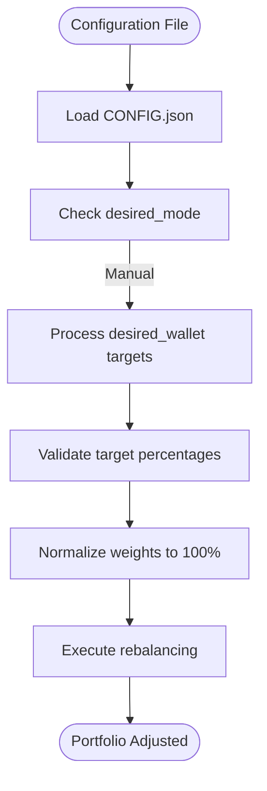
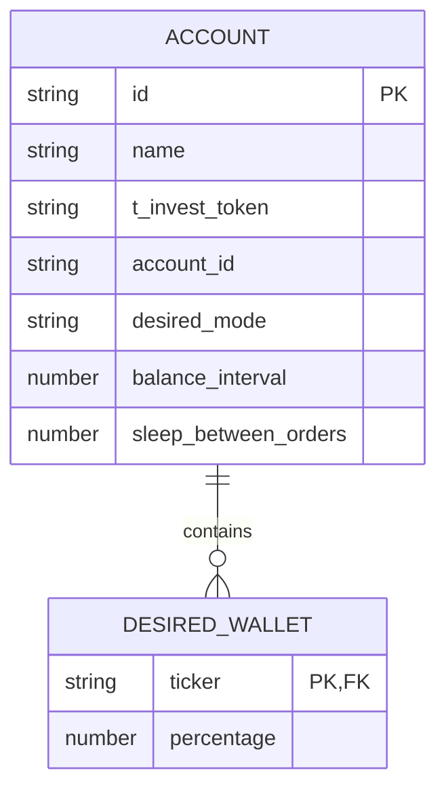
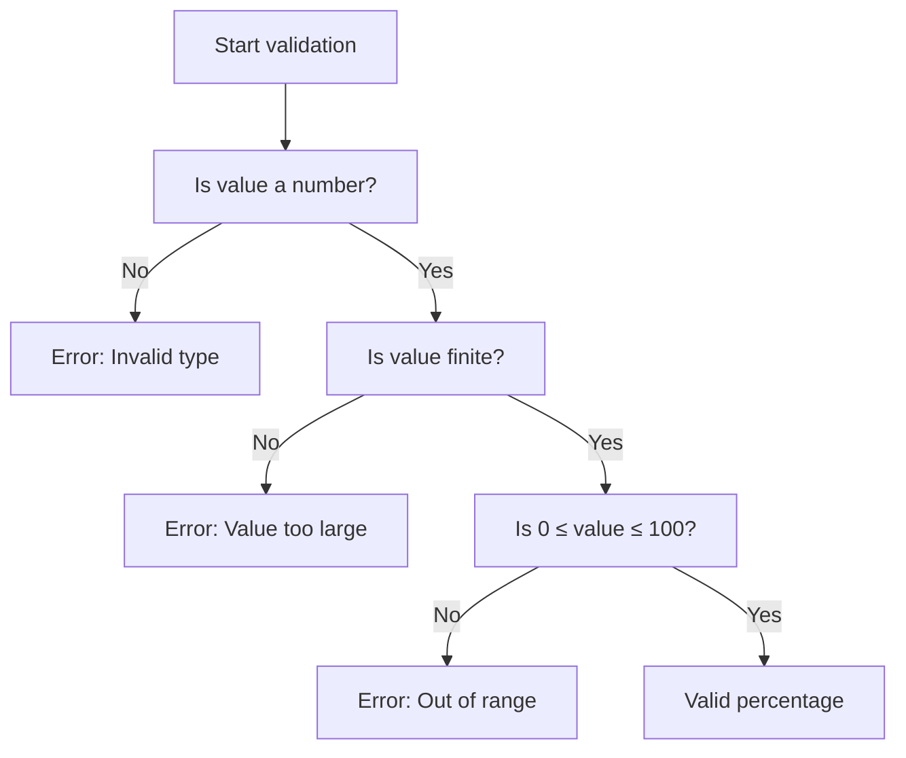

# Manual Mode Configuration

<cite>
**Referenced Files in This Document **   
- [CONFIG.example.json](file://CONFIG.example.json)
- [src/configLoader.ts](file://src/configLoader.ts)
- [src/types.d.ts](file://src/types.d.ts)
- [test-configs/CONFIG.test-simple.json](file://test-configs/CONFIG.test-simple.json)
</cite>

## Table of Contents
1. [Introduction](#introduction)
2. [Manual Rebalancing Mode Overview](#manual-rebalancing-mode-overview)
3. [Configuration Structure](#configuration-structure)
4. [Target Percentage Definition](#target-percentage-definition)
5. [Validation Logic](#validation-logic)
6. [Example Configuration](#example-configuration)
7. [Common Misconfigurations](#common-misconfigurations)
8. [Use Cases and Recommendations](#use-cases-and-recommendations)

## Introduction
This document provides comprehensive guidance on configuring manual rebalancing mode for the ETF portfolio balancer. It details how users can define fixed target allocations for their ETF portfolios using static percentage values, explains the validation mechanisms that ensure configuration integrity, and provides practical examples and troubleshooting advice.

**Section sources**
- [CONFIG.example.json](file://CONFIG.example.json)
- [src/configLoader.ts](file://src/configLoader.ts)

## Manual Rebalancing Mode Overview
Manual rebalancing mode allows users to define fixed target percentages for each ETF in their portfolio through the `desired_wallet` field in the configuration file. This mode operates independently of external market data or dynamic allocation algorithms, providing complete user control over portfolio composition.

When `desired_mode` is set to "manual", the balancer interprets the static allocations specified in `desired_wallet` to calculate the desired portfolio distribution. The system uses these predefined percentages to determine buy and sell actions during rebalancing cycles without requiring real-time market capitalization or asset under management (AUM) data.

The manual mode is particularly valuable for investors who prefer stable, predetermined allocations and want to maintain consistent portfolio weights regardless of market fluctuations.



**Diagram sources **
- [src/configLoader.ts](file://src/configLoader.ts#L200-L250)
- [CONFIG.example.json](file://CONFIG.example.json#L10-L22)

**Section sources**
- [src/configLoader.ts](file://src/configLoader.ts#L71-L75)
- [src/types.d.ts](file://src/types.d.ts#L71-L71)

## Configuration Structure
The configuration structure for manual rebalancing is defined within the account-level configuration object. Each account in the `accounts` array contains a `desired_wallet` property that maps ETF ticker symbols to their target allocation percentages.

The key components of the manual mode configuration include:
- `id`: Unique identifier for the account
- `name`: Descriptive name for the account
- `t_invest_token`: Authentication token for Tinkoff Invest API
- `account_id`: Broker account identifier
- `desired_wallet`: Object containing ETF tickers as keys and target percentages as values
- `desired_mode`: Set to "manual" to enable static allocation mode
- `balance_interval`: Frequency of rebalancing in milliseconds



**Diagram sources **
- [src/types.d.ts](file://src/types.d.ts#L102-L135)
- [CONFIG.example.json](file://CONFIG.example.json#L2-L22)

**Section sources**
- [src/types.d.ts](file://src/types.d.ts#L102-L135)
- [CONFIG.example.json](file://CONFIG.example.json)

## Target Percentage Definition
Users define fixed target percentages for each ETF through the `target` field (referred to as `desired_wallet` in the configuration) using a simple key-value structure where ETF ticker symbols map to numerical percentage values. These percentages represent the desired proportion of the total portfolio value that should be allocated to each ETF.

The balancer interprets these static allocations by:
1. Reading the `desired_wallet` object from the configuration
2. Validating each percentage value for correctness
3. Normalizing the sum of all percentages to 100% if necessary
4. Using the normalized percentages to calculate target positions during rebalancing

Percentage values are specified as whole numbers or decimals representing percentage points (e.g., 25 for 25%, 8.33 for 8.33%). The system automatically handles the conversion to decimal format for internal calculations.

**Section sources**
- [CONFIG.example.json](file://CONFIG.example.json#L10-L22)
- [src/configLoader.ts](file://src/configLoader.ts#L220-L230)

## Validation Logic
The configLoader module implements comprehensive validation logic to ensure that manual mode configurations are valid and reliable. The validation process occurs in the `validateAccount` method of the `ConfigLoader` class and includes several critical checks.

### Percentage Value Validation
Each target percentage undergoes individual validation to ensure it meets the following criteria:
- Must be a valid number (not NaN)
- Must be finite (not infinite)
- Must be between 0 and 100 (inclusive)
- Must not exceed JavaScript's safe integer limit



**Diagram sources **
- [src/configLoader.ts](file://src/configLoader.ts#L220-L235)

### Sum Validation
After validating individual percentages, the system checks that the sum of all weights falls within an acceptable range (between 50% and 150%). This tolerance allows for minor rounding errors while preventing gross misconfigurations. The balancer automatically normalizes the weights to sum to 100% during the rebalancing calculation.

If the sum is outside this range, the validation throws an error with specific information about the actual sum and expected range.

**Section sources**
- [src/configLoader.ts](file://src/configLoader.ts#L237-L245)

## Example Configuration
The following example demonstrates a realistic manual mode configuration with multiple ETFs and their respective target allocations:

```json
{
  "accounts": [
    {
      "id": "personal-investment",
      "name": "Personal Investment Portfolio",
      "t_invest_token": "${INVEST_TOKEN}",
      "account_id": "BROKER_123",
      "desired_wallet": {
        "TGLD": 20,
        "TRUR": 30,
        "TRND": 15,
        "TBRU": 15,
        "TDIV": 10,
        "TITR": 10
      },
      "desired_mode": "manual",
      "balance_interval": 86400000,
      "sleep_between_orders": 5000,
      "margin_trading": {
        "enabled": false,
        "multiplier": 1,
        "free_threshold": 10000,
        "max_margin_size": 0,
        "balancing_strategy": "remove"
      },
      "exchange_closure_behavior": {
        "mode": "skip_iteration",
        "update_iteration_result": false
      }
    }
  ]
}
```

This configuration establishes a diversified portfolio with six different ETFs, with Russian market exposure (TRUR) having the largest allocation at 30%, followed by gold (TGLD) at 20%. The remaining ETFs are allocated between 10-15% each, creating a balanced distribution across different asset classes.

**Section sources**
- [test-configs/CONFIG.test-simple.json](file://test-configs/CONFIG.test-simple.json)
- [CONFIG.example.json](file://CONFIG.example.json)

## Common Misconfigurations
Several common misconfigurations can occur when setting up manual rebalancing mode. Understanding these issues and their resolution strategies is crucial for maintaining a properly functioning portfolio.

### Invalid Percentage Ranges
One frequent error is specifying percentage values outside the valid range of 0-100. For example, entering 150 instead of 15 for a 15% allocation will trigger validation failure.

**Resolution**: Ensure all percentage values are between 0 and 100. If intending to specify decimal percentages, use the correct format (e.g., 0.5 for 0.5%, not 50).

### Non-Existent Instrument IDs
Referencing ETF ticker symbols that do not exist on the exchange or are misspelled will prevent successful trading operations.

**Resolution**: Verify all ticker symbols against the broker's available instruments list. Common mistakes include incorrect capitalization or using alternative ticker formats.

### Missing Required Fields
Omitting required fields such as `id`, `name`, `t_invest_token`, `account_id`, or `desired_wallet` will cause configuration loading to fail.

**Resolution**: Ensure all required fields are present in the account configuration. Use the CONFIG.example.json file as a template for proper structure.

### Sum Outside Acceptable Range
While the system normalizes percentages, configurations with sums far from 100% (outside 50-150% range) indicate potential errors.

**Resolution**: Review all percentage values to ensure they collectively represent the intended portfolio distribution. Correct any arithmetic errors in the allocation calculations.

**Section sources**
- [src/configLoader.ts](file://src/configLoader.ts#L220-L245)
- [src/__tests__/configLoader/config-error-handling.test.ts](file://src/__tests__/configLoader/config-error-handling.test.ts)

## Use Cases and Recommendations
Manual rebalancing mode is most appropriate for specific investment scenarios where simplicity and predictability are prioritized over dynamic optimization.

### Ideal Use Cases
- **Simple Portfolios**: Investors with straightforward allocation preferences involving a small number of ETFs
- **Stable Allocation Preferences**: Users who have determined optimal portfolio weights through analysis and wish to maintain them consistently
- **Beginner Investors**: Those new to automated portfolio management who prefer to start with basic, understandable configurations
- **Tax-Efficient Strategies**: Situations where minimizing trades is important to reduce tax implications

### Implementation Recommendations
- Start with round percentage values to minimize rounding errors
- Regularly review portfolio performance to ensure the static allocation remains appropriate
- Consider the impact of dividends and corporate actions on portfolio weights
- Test configurations in a sandbox environment before deploying with real funds
- Document the rationale behind allocation decisions for future reference

The manual mode provides a robust foundation for portfolio management, offering reliability and transparency in rebalancing operations while giving investors complete control over their asset allocation strategy.

**Section sources**
- [CONFIG.example.json](file://CONFIG.example.json)
- [test-configs/CONFIG.test-simple.json](file://test-configs/CONFIG.test-simple.json)