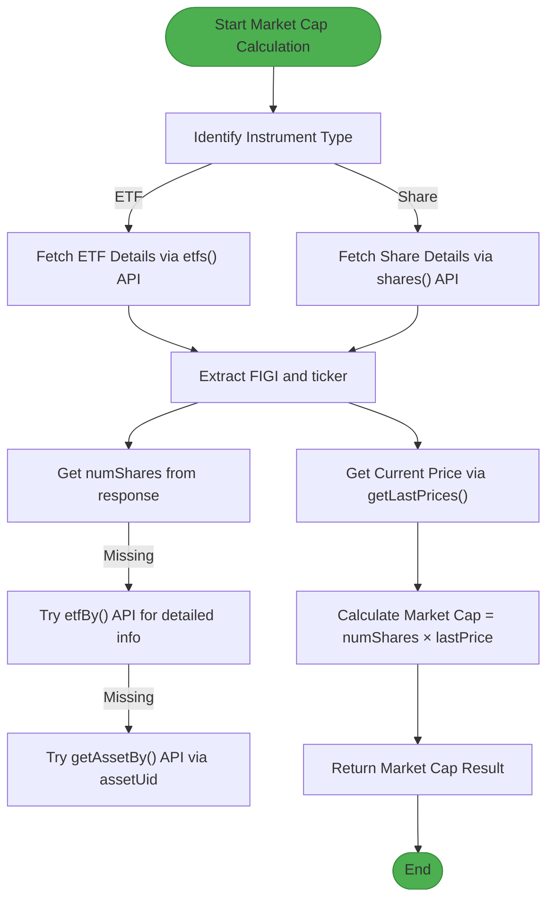
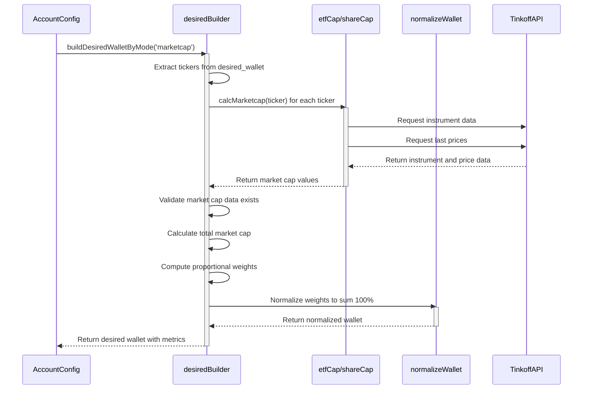
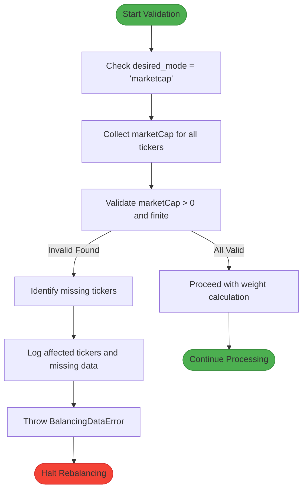

# MarketCap Mode Configuration

<cite>
**Referenced Files in This Document**   
- [desiredBuilder.ts](file://src/balancer/desiredBuilder.ts)
- [configLoader.ts](file://src/configLoader.ts)
- [etfCap.ts](file://src/tools/etfCap.ts)
- [pollEtfMetrics.ts](file://src/tools/pollEtfMetrics.ts)
- [CONFIG.example.json](file://CONFIG.example.json)
</cite>

## Table of Contents
1. [Introduction](#introduction)
2. [Configuration Requirements](#configuration-requirements)
3. [Market Capitalization Data Flow](#market-capitalization-data-flow)
4. [Weight Calculation Process](#weight-calculation-process)
5. [Validation and Error Handling](#validation-and-error-handling)
6. [Example Configuration](#example-configuration)
7. [Resilience and Fallback Strategies](#resilience-and-fallback-strategies)

## Introduction
The market capitalization-based rebalancing mode dynamically adjusts ETF portfolio allocations according to real-time market capitalization data. This approach ensures that portfolio weights reflect the current market value distribution of the underlying assets. The system fetches market cap data from external sources through automated processes, calculates proportional weights, and normalizes them into target portfolio percentages. This documentation details the configuration, implementation, and operational aspects of the marketcap mode.

## Configuration Requirements
To enable market capitalization-based rebalancing, specific configuration fields must be set in the account configuration. The `desired_mode` field must be set to 'marketcap' to activate this rebalancing strategy. No additional URL configuration is required as the system automatically determines the appropriate data sources based on instrument type.

**Section sources**
- [desiredBuilder.ts](file://src/balancer/desiredBuilder.ts#L125-L328)
- [configLoader.ts](file://src/configLoader.ts#L30-L123)

## Market Capitalization Data Flow
The system follows a hierarchical approach to obtain market capitalization data for different instrument types. For ETFs, it retrieves data through the Tinkoff Invest API by combining share count and current price information. For shares, it uses issue size and current market price to calculate market capitalization. The process involves multiple fallback mechanisms to ensure data availability.



**Diagram sources **
- [etfCap.ts](file://src/tools/etfCap.ts#L451-L525)
- [etfCap.ts](file://src/tools/etfCap.ts#L527-L572)

**Section sources**
- [etfCap.ts](file://src/tools/etfCap.ts#L451-L572)

## Weight Calculation Process
The desiredBuilder component calculates portfolio weights based on market capitalization values. It first collects market cap data for all tickers in the desired wallet, validates the data quality, and then computes proportional weights. The weights are normalized to sum to 100% to create the final portfolio allocation targets.



**Diagram sources **
- [desiredBuilder.ts](file://src/balancer/desiredBuilder.ts#L125-L328)
- [diffCalculator.ts](file://src/balancer/diffCalculator.ts#L78-L100)

**Section sources**
- [desiredBuilder.ts](file://src/balancer/desiredBuilder.ts#L125-L328)

## Validation and Error Handling
The system implements comprehensive validation to ensure data quality before calculating portfolio allocations. When operating in marketcap mode, it verifies that valid market capitalization data exists for all tickers in the desired wallet. If any ticker lacks valid market cap data, the system throws a BalancingDataError with details about the missing data and affected tickers.



**Diagram sources **
- [desiredBuilder.ts](file://src/balancer/desiredBuilder.ts#L30-L123)
- [types.d.ts](file://src/types.d.ts#L179-L188)

**Section sources**
- [desiredBuilder.ts](file://src/balancer/desiredBuilder.ts#L30-L123)

## Example Configuration
The following example demonstrates how to configure an account to use market capitalization-based rebalancing. Note that no marketCapUrl is required as the system automatically determines data sources. The desired_wallet specifies the instruments to include in the portfolio, and the desired_mode is set to 'marketcap' to enable dynamic allocation based on market values.

```json
{
  "accounts": [
    {
      "id": "account_1",
      "name": "Market Cap Portfolio",
      "t_invest_token": "${T_INVEST_TOKEN}",
      "account_id": "BROKER",
      "desired_wallet": {
        "TGLD": 0,
        "TRUR": 0,
        "TRND": 0,
        "TBRU": 0,
        "TDIV": 0,
        "TITR": 0,
        "TLCB": 0,
        "TMON": 0,
        "TMOS": 0,
        "TOFZ": 0,
        "TPAY": 0
      },
      "desired_mode": "marketcap",
      "balance_interval": 3600000,
      "sleep_between_orders": 3000
    }
  ]
}
```

**Section sources**
- [CONFIG.example.json](file://CONFIG.example.json#L1-L51)

## Resilience and Fallback Strategies
The system incorporates multiple resilience mechanisms to handle potential data availability issues. It attempts to retrieve market cap data from three different sources in sequence: direct API response, detailed instrument endpoint, and asset-level information. Additionally, the system can derive market capitalization from AUM (Net Asset Value) when direct share count data is unavailable by dividing AUM by the current share price.

For enhanced reliability, the system supports caching of both AUM and market capitalization data. When caching is enabled in the project configuration, frequently accessed data is stored locally with configurable TTL (time-to-live). This reduces dependency on external APIs and improves performance during subsequent calculations.

**Section sources**
- [etfCap.ts](file://src/tools/etfCap.ts#L352-L428)
- [etfCap.ts](file://src/tools/etfCap.ts#L451-L572)