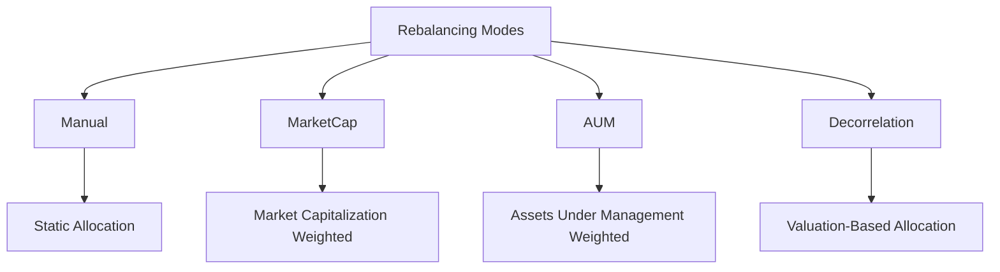
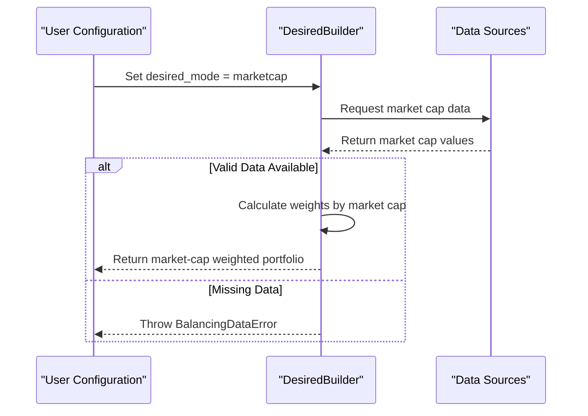
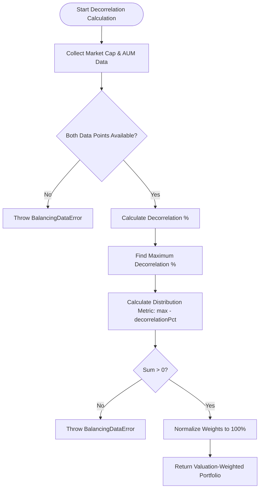
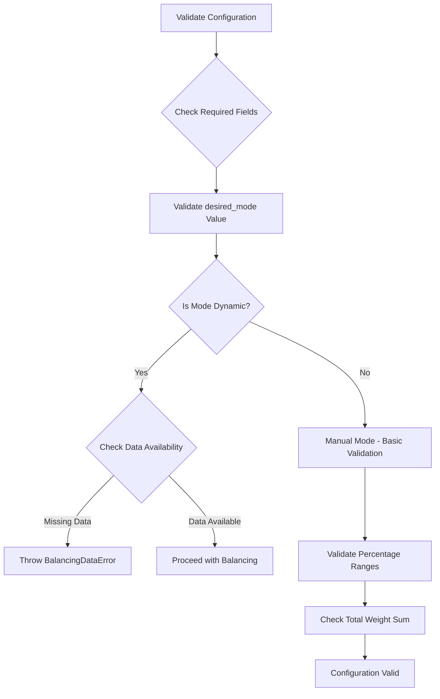

# Rebalancing Modes Configuration

<cite>
**Referenced Files in This Document**   
- [configLoader.ts](file://src/configLoader.ts)
- [desiredBuilder.ts](file://src/balancer/desiredBuilder.ts)
- [types.d.ts](file://src/types.d.ts)
- [CONFIG.example.json](file://CONFIG.example.json)
</cite>

## Table of Contents
1. [Introduction](#introduction)
2. [Rebalancing Mode Overview](#rebalancing-mode-overview)
3. [Manual Mode Configuration](#manual-mode-configuration)
4. [MarketCap Mode Configuration](#marketcap-mode-configuration)
5. [AUM Mode Configuration](#aum-mode-configuration)
6. [Decorrelation Mode Configuration](#decorrelation-mode-configuration)
7. [Configuration Validation Logic](#configuration-validation-logic)
8. [Common Misconfigurations and Solutions](#common-misconfigurations-and-solutions)

## Introduction
This document provides comprehensive guidance on configuring rebalancing modes for the Tinkoff Invest ETF Balancer Bot. It details the four primary rebalancing strategies: manual, marketcap, aum, and decorrelation. Each mode offers distinct portfolio calculation methodologies based on different financial metrics. The configuration system allows users to define desired portfolio allocations that are dynamically adjusted according to the selected rebalancing strategy. Understanding these modes is essential for optimizing portfolio performance and aligning investment strategies with market conditions.

## Rebalancing Mode Overview
The rebalancing system supports multiple strategies through the `desired_mode` parameter in account configurations. These modes determine how the balancer calculates target portfolio allocations during each rebalancing iteration. The available modes include manual (static allocation), marketcap (based on market capitalization), aum (based on assets under management), and decorrelation (based on valuation discrepancies between market cap and AUM). Each mode requires specific data sources and has unique behavioral characteristics that affect portfolio composition.



**Diagram sources**
- [types.d.ts](file://src/types.d.ts#L71-L71)
- [desiredBuilder.ts](file://src/balancer/desiredBuilder.ts#L125-L328)

**Section sources**
- [types.d.ts](file://src/types.d.ts#L71-L71)
- [desiredBuilder.ts](file://src/balancer/desiredBuilder.ts#L125-L328)

## Manual Mode Configuration
Manual mode maintains static portfolio allocations as defined in the `desired_wallet` configuration. This mode ignores external market data and preserves the exact percentage distribution specified by the user. It is ideal for investors who prefer consistent asset allocation regardless of market fluctuations. No additional parameters beyond the standard configuration are required for this mode, making it the simplest to implement and understand.

```json
{
  "accounts": [
    {
      "id": "account_1",
      "name": "Основной брокерский счет",
      "t_invest_token": "${T_INVEST_TOKEN}",
      "account_id": "BROKER",
      "desired_wallet": {
        "TGLD": 8.33,
        "TRUR": 8.33,
        "TRND": 8.33,
        "TBRU": 8.33,
        "TDIV": 8.33,
        "TITR": 8.33,
        "TLCB": 8.33,
        "TMON": 8.33,
        "TMOS": 8.33,
        "TOFZ": 8.33,
        "TPAY": 8.33
      },
      "desired_mode": "manual"
    }
  ]
}
```

**Section sources**
- [CONFIG.example.json](file://CONFIG.example.json#L0-L51)
- [desiredBuilder.ts](file://src/balancer/desiredBuilder.ts#L125-L135)

## MarketCap Mode Configuration
MarketCap mode allocates portfolio weights based on the market capitalization of each ETF or security. This approach follows a passive indexing strategy where larger companies receive higher weightings. The balancer retrieves market capitalization data from multiple sources including local JSON files, T-Capital API for ETFs, and direct calculations for shares using outstanding shares multiplied by current price. This mode requires valid market cap data for all tickers in the desired wallet.

The configuration requires no additional fields beyond setting `desired_mode` to "marketcap". However, successful operation depends on the availability of market capitalization data for all specified tickers. The system attempts to source this data from various locations, prioritizing local cache before making API calls.



**Diagram sources**
- [desiredBuilder.ts](file://src/balancer/desiredBuilder.ts#L200-L220)
- [etfCap.ts](file://src/tools/etfCap.ts#L451-L525)

**Section sources**
- [desiredBuilder.ts](file://src/balancer/desiredBuilder.ts#L200-L220)
- [etfCap.ts](file://src/tools/etfCap.ts#L451-L525)

## AUM Mode Configuration
AUM (Assets Under Management) mode allocates portfolio weights based on the total assets managed by each ETF. This approach emphasizes fund size and investor confidence, assuming larger funds have better management and resources. The system retrieves AUM data through multiple methods: reading from local JSON files, fetching from T-Capital API, or calculating based on share price and number of shares. An optional caching mechanism can be configured to reduce API calls and improve performance.

The configuration requires setting `desired_mode` to "aum" with no additional mandatory fields. However, the system validates that AUM data exists for all tickers in the desired wallet. The project-level `aum_cache` configuration allows enabling/disabling caching and setting time-to-live (TTL) for cached data.

Example configuration with AUM caching:
```json
{
  "aum_cache": {
    "enabled": true,
    "ttl_hours": 1
  },
  "accounts": [
    {
      "id": "account_1",
      "name": "ETF Portfolio",
      "t_invest_token": "${T_INVEST_TOKEN}",
      "account_id": "BROKER",
      "desired_wallet": {
        "TGLD": 20,
        "TRUR": 20,
        "TRND": 20,
        "TBRU": 20,
        "TDIV": 20
      },
      "desired_mode": "aum"
    }
  ]
}
```

**Section sources**
- [types.d.ts](file://src/types.d.ts#L137-L142)
- [etfCap.ts](file://src/tools/etfCap.ts#L352-L428)
- [desiredBuilder.ts](file://src/balancer/desiredBuilder.ts#L220-L240)

## Decorrelation Mode Configuration
Decorrelation mode implements a valuation-based strategy that identifies mispriced ETFs by comparing market capitalization to assets under management. This sophisticated approach assumes that significant deviations between market cap and AUM indicate potential overvaluation or undervaluation. The algorithm calculates a decorrelation percentage for each ticker and assigns higher weights to potentially undervalued assets.

The mode uses the formula: `(marketCap - AUM) / AUM * 100` to determine valuation discrepancies. Weights are assigned inversely to these percentages, giving preference to ETFs trading below their intrinsic value. This mode requires both market cap and AUM data for all tickers in the desired wallet, making it the most data-intensive rebalancing strategy.

Behavioral characteristics:
- Positive decorrelation (>5%): Classified as "overvalued"
- Negative decorrelation (<-5%): Classified as "undervalued" 
- Neutral range (-5% to 5%): Classified as "neutral"



**Diagram sources**
- [desiredBuilder.ts](file://src/balancer/desiredBuilder.ts#L260-L300)
- [types.d.ts](file://src/types.d.ts#L159-L170)

**Section sources**
- [desiredBuilder.ts](file://src/balancer/desiredBuilder.ts#L260-L300)
- [types.d.ts](file://src/types.d.ts#L159-L170)

## Configuration Validation Logic
The configLoader performs comprehensive validation of rebalancing mode configurations to ensure data integrity and prevent runtime errors. The validation process occurs during configuration loading and includes type checking, range validation, and mode-specific requirements verification. For dynamic modes (marketcap, aum, decorrelation), the system verifies that required financial data is available before allowing the balancer to proceed.

Key validation rules:
- Manual mode: Only requires valid percentage ranges (0-100%) and non-empty desired_wallet
- MarketCap mode: Validates presence of market capitalization data for all tickers
- AUM mode: Ensures AUM data exists for all specified instruments  
- Decorrelation mode: Requires both market cap and AUM data for complete validation

The validation process also checks for reasonable total weight sums (between 50% and 150%) to catch configuration errors while allowing flexibility in specifying relative weights that will be normalized to 100%.



**Diagram sources**
- [configLoader.ts](file://src/configLoader.ts#L104-L161)
- [desiredBuilder.ts](file://src/balancer/desiredBuilder.ts#L30-L123)

**Section sources**
- [configLoader.ts](file://src/configLoader.ts#L104-L161)
- [desiredBuilder.ts](file://src/balancer/desiredBuilder.ts#L30-L123)

## Common Misconfigurations and Solutions
Several common misconfigurations can prevent successful rebalancing operations. Understanding these issues and their solutions is critical for maintaining portfolio stability.

**Missing Financial Data**: When using marketcap, aum, or decorrelation modes without available data for specified tickers, the system throws a `BalancingDataError`. Solution: Ensure data sources are accessible or switch to manual mode.

**Invalid Mode Selection**: Specifying unsupported mode values results in validation errors. Solution: Use only supported modes: manual, default, marketcap, aum, marketcap_aum, or decorrelation.

**Incomplete Decorrelation Data**: Decorrelation mode requires both market cap and AUM data. If either is missing, balancing fails. Solution: Verify both data points exist or use alternative modes.

**Extreme Weight Sums**: Desired wallet allocations summing outside 50-150% trigger validation warnings. While not fatal, this indicates potential configuration issues. Solution: Review and adjust percentage allocations.

**Cache Configuration Errors**: Incorrect AUM cache settings can lead to stale data usage. Solution: Properly configure `aum_cache.enabled` and `aum_cache.ttl_hours` based on update frequency requirements.

Troubleshooting steps:
1. Verify mode spelling and case sensitivity
2. Check data source availability for dynamic modes
3. Validate percentage ranges and total sum
4. Review error messages for specific missing data indications
5. Test with manual mode as baseline before switching to dynamic strategies

**Section sources**
- [configLoader.ts](file://src/configLoader.ts#L104-L161)
- [desiredBuilder.ts](file://src/balancer/desiredBuilder.ts#L30-L123)
- [types.d.ts](file://src/types.d.ts#L71-L71)