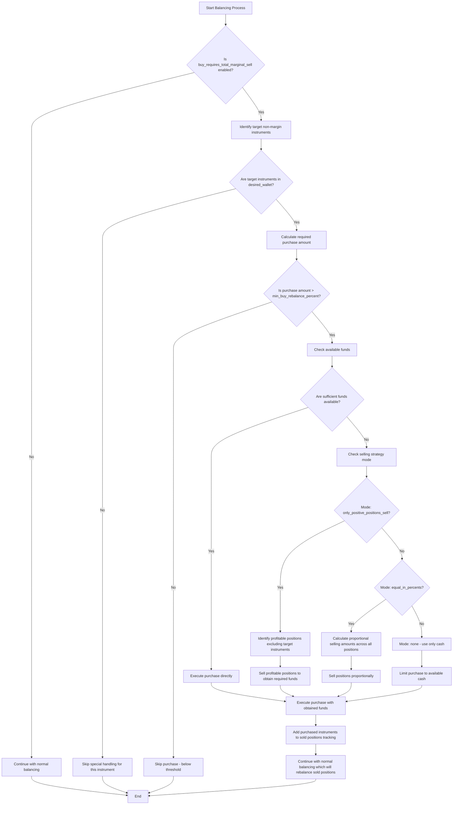
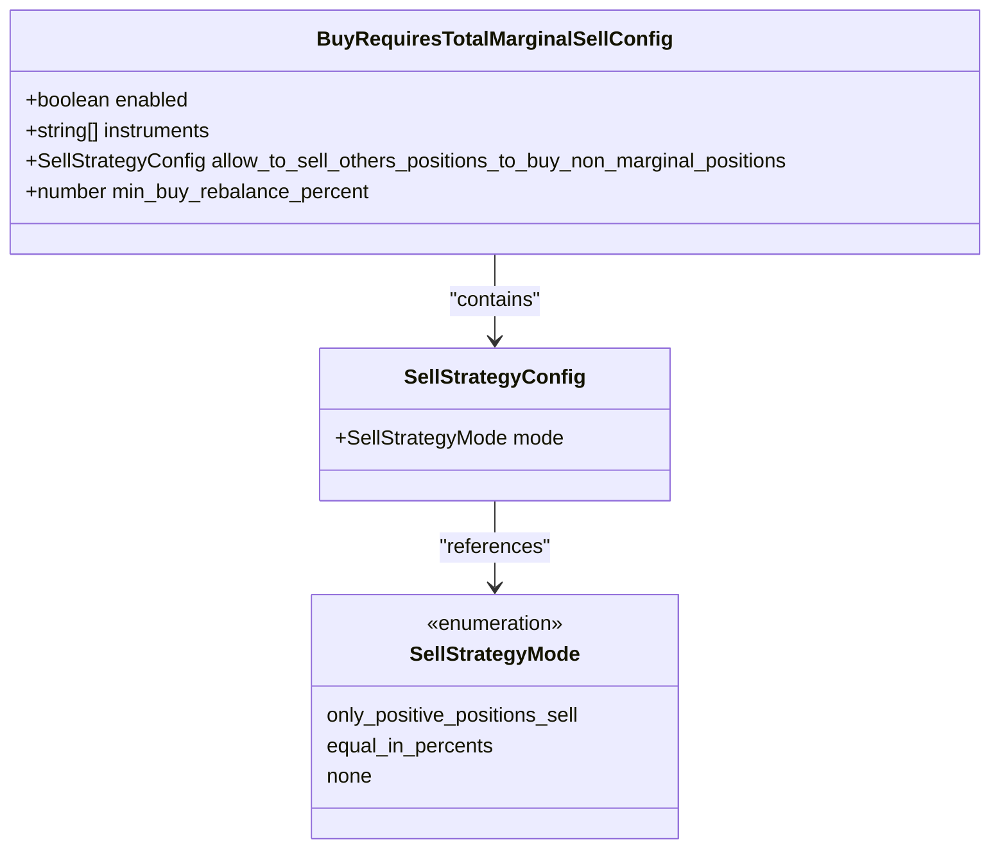
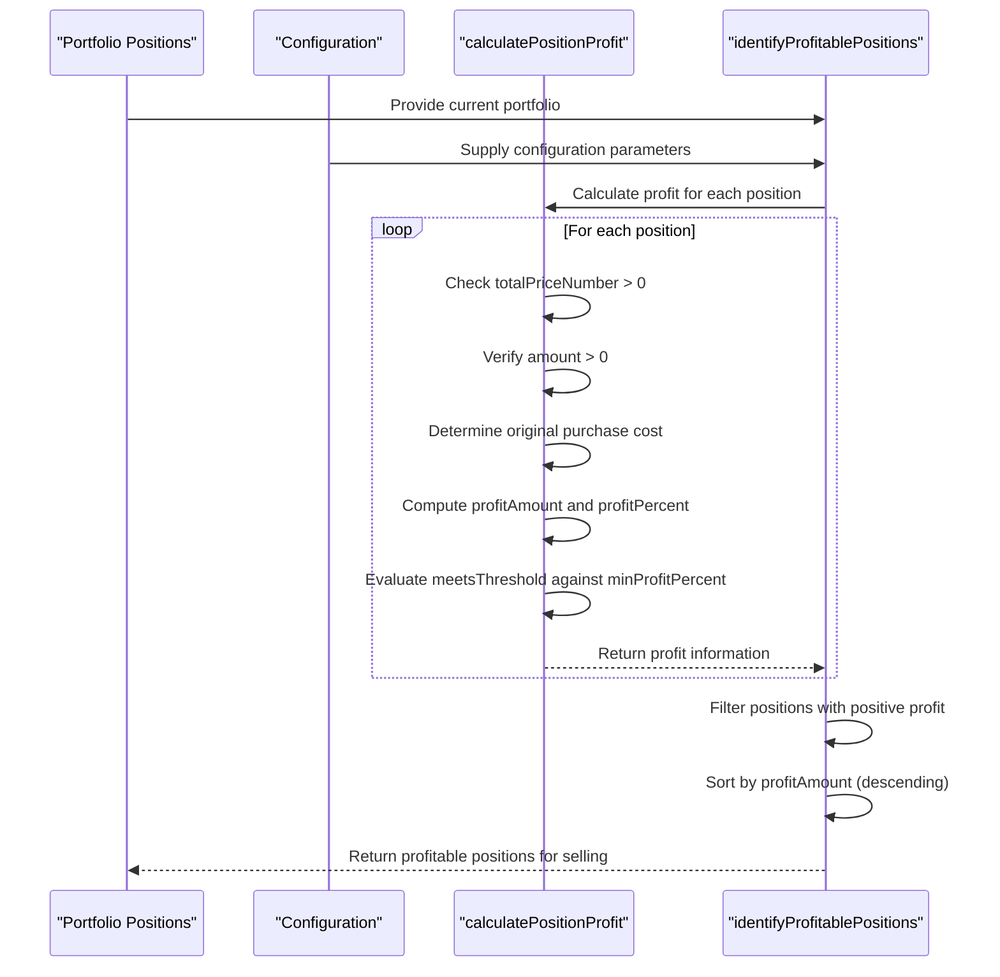
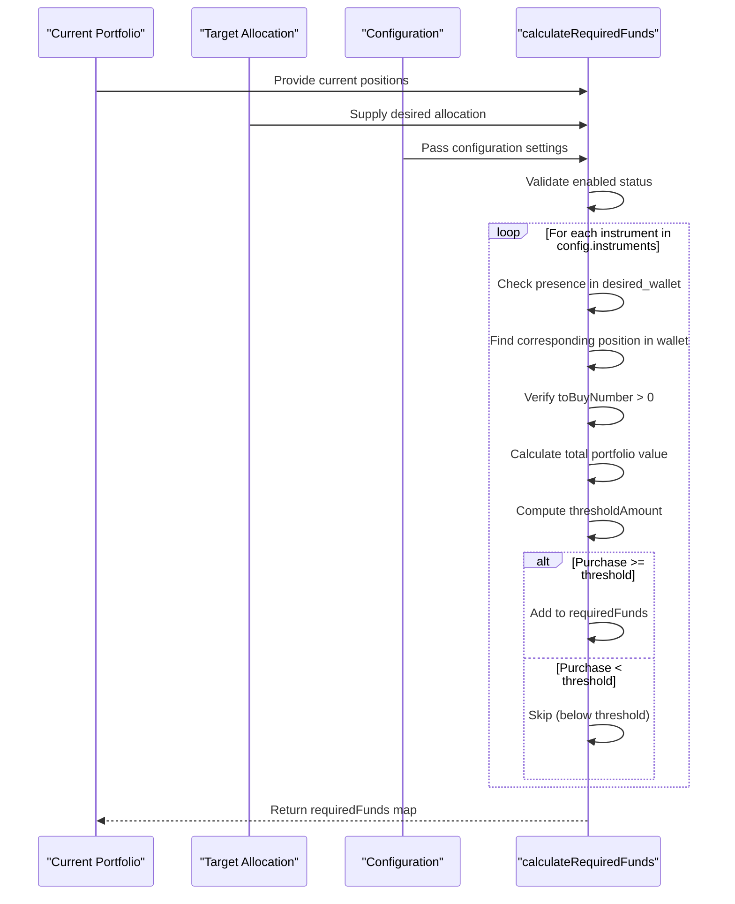
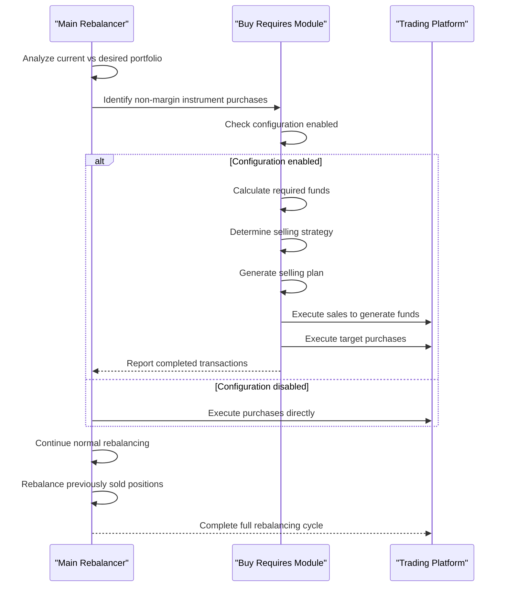

# Buy Requires Total Marginal Sell

<cite>
**Referenced Files in This Document **   
- [buyRequiresTotalMarginalSell.ts](file://src/utils/buyRequiresTotalMarginalSell.ts)
- [buyRequiresEdgeCases.test.ts](file://src/__tests__/buyRequiresEdgeCases.test.ts)
- [buyRequiresIntegration.test.ts](file://src/__tests__/buyRequiresIntegration.test.ts)
- [README.buy_requires_total_marginal_sell.md](file://README.buy_requires_total_marginal_sell.md)
</cite>

## Table of Contents
1. [Introduction](#introduction)
2. [Core Mechanism Overview](#core-mechanism-overview)
3. [Configuration Parameters](#configuration-parameters)
4. [Profit Calculation and Position Identification](#profit-calculation-and-position-identification)
5. [Selling Strategies](#selling-strategies)
6. [Fund Requirements and Thresholds](#fund-requirements-and-thresholds)
7. [Real-World Scenarios](#real-world-scenarios)
8. [Integration with Rebalancing Engine](#integration-with-rebalancing-engine)
9. [Test Coverage and Edge Cases](#test-coverage-and-edge-cases)
10. [Performance Considerations](#performance-considerations)

## Introduction
The "Buy Requires Total Marginal Sell" mechanism is a safety feature designed to prevent new purchases of non-margin instruments unless existing margin positions can be fully liquidated to fund these purchases. This system ensures that the trading bot maintains proper risk management by preventing over-leveraging during market downturns. The mechanism operates through a series of coordinated functions that calculate profit potential, identify sellable positions, determine funding requirements, and execute selling strategies based on configurable parameters.

**Section sources**
- [README.buy_requires_total_marginal_sell.md](file://README.buy_requires_total_marginal_sell.md#L1-L223)

## Core Mechanism Overview
The buy requires total marginal sell mechanism prevents new purchases of non-margin instruments unless all existing margin positions can be fully liquidated to fund these purchases. This safety feature operates as a gatekeeper for portfolio rebalancing, ensuring that the system doesn't overextend itself financially. When enabled, the mechanism intercepts purchase requests for non-margin instruments and evaluates whether sufficient funds are available or can be generated through strategic selling of profitable margin positions.

The core workflow begins when the rebalancing engine identifies a need to purchase non-margin instruments listed in the configuration. Instead of executing the purchase directly, the system calculates the required funds and assesses the current RUB balance. If insufficient funds are available, the mechanism triggers a selling strategy to generate the necessary capital by liquidating profitable margin positions. This process ensures that the portfolio maintains adequate liquidity while pursuing its target allocation.



**Diagram sources **
- [README.buy_requires_total_marginal_sell.md](file://README.buy_requires_total_marginal_sell.md#L118-L222)

**Section sources**
- [buyRequiresTotalMarginalSell.ts](file://src/utils/buyRequiresTotalMarginalSell.ts#L1-L410)
- [README.buy_requires_total_marginal_sell.md](file://README.buy_requires_total_marginal_sell.md#L1-L223)

## Configuration Parameters
The behavior of the buy requires total marginal sell mechanism is controlled by several configuration parameters that allow fine-tuning of the trading strategy. These parameters are defined in the `BuyRequiresTotalMarginalSellConfig` interface and include:

- `enabled`: Boolean flag that activates or deactivates the entire mechanism
- `instruments`: Array of ticker symbols representing non-margin instruments that require special purchase handling
- `allow_to_sell_others_positions_to_buy_non_marginal_positions.mode`: Selling strategy mode that determines how other positions are sold to fund purchases
- `min_buy_rebalance_percent`: Minimum percentage threshold that a purchase must exceed to trigger the mechanism

The `mode` parameter supports three distinct selling strategies: `only_positive_positions_sell`, `equal_in_percents`, and `none`. Each mode represents a different approach to generating funds for non-margin instrument purchases. The `min_buy_rebalance_percent` parameter acts as a filter to prevent insignificant rebalancing actions, calculated as a percentage of the total portfolio value. This threshold ensures that only meaningful rebalancing operations are executed, reducing transaction costs and market impact.



**Diagram sources **
- [types.d.ts](file://src/types.d.ts#L57-L68)

**Section sources**
- [buyRequiresTotalMarginalSell.ts](file://src/utils/buyRequiresTotalMarginalSell.ts#L1-L410)
- [README.buy_requires_total_marginal_sell.md](file://README.buy_requires_total_marginal_sell.md#L1-L223)

## Profit Calculation and Position Identification
The mechanism employs a sophisticated profit calculation system to identify which positions can be sold to fund non-margin instrument purchases. The `calculatePositionProfit` function determines profitability by comparing the current market value of a position against its original purchase cost. The calculation prioritizes the use of `averagePositionPriceFifoNumber` as it represents the actual purchase cost using the First-In-First-Out accounting method, falling back to `averagePositionPriceNumber` if FIFO data is unavailable.

Positions are considered profitable only when both the profit amount and percentage meet specified thresholds. The system excludes currency positions (where base equals quote) and positions with zero holdings from consideration. For each position evaluated, the algorithm checks whether it belongs to the list of non-margin instruments defined in the configuration, skipping these from potential sale since they are the targets of purchase rather than sources of funding.

The identification process returns positions sorted by profit amount in descending order, prioritizing those that generate the highest returns when liquidated. This sorting ensures that the most valuable opportunities are utilized first when generating funds for non-margin instrument purchases. The debug output provides detailed information about each position's profitability status, including profit amounts, percentages, and threshold compliance.



**Diagram sources **
- [buyRequiresTotalMarginalSell.ts](file://src/utils/buyRequiresTotalMarginalSell.ts#L13-L118)

**Section sources**
- [buyRequiresTotalMarginalSell.ts](file://src/utils/buyRequiresTotalMarginalSell.ts#L13-L118)
- [buyRequiresEdgeCases.test.ts](file://src/__tests__/buyRequiresEdgeCases.test.ts#L1-L571)

## Selling Strategies
The mechanism implements three distinct selling strategies through the `identifyPositionsForSelling` and `calculateSellingAmounts` functions, each tailored to different risk profiles and market conditions. The `only_positive_positions_sell` mode exclusively targets profitable positions that meet the minimum profit threshold, ensuring that only winning trades are closed to fund new purchases. This conservative approach protects the portfolio from realizing losses while still providing liquidity for strategic acquisitions.

The `equal_in_percents` mode adopts a more balanced approach by selling proportionally across all eligible positions based on their current value relative to the total portfolio. This strategy maintains the overall portfolio composition while generating the necessary funds, making it suitable for gradual rebalancing in stable market conditions. The proportional calculation ensures that larger positions contribute more to the funding requirement while smaller positions are affected proportionally less.

The `none` mode represents the most conservative strategy, prohibiting the sale of any positions to fund purchases. In this mode, purchases are limited to the available RUB balance, effectively preventing any new leverage. This approach is appropriate for risk-averse strategies or during periods of high market volatility when preserving existing positions is paramount. Each strategy includes comprehensive edge case handling, including scenarios with insufficient funds, zero lot prices, and extreme numerical values.

```mermaid
flowchart TD
A[Start Selling Strategy Selection] --> B{Determine Mode}
B --> C[only_positive_positions_sell]
B --> D[equal_in_percents]
B --> E[none]
C --> F[Filter positions with positive profit]
F --> G[Sort by profit amount (descending)]
G --> H[Calculate minimum lots needed]
H --> I[Sell from highest profit positions first]
I --> J[Stop when funds requirement met]
D --> K[Calculate total value of eligible positions]
K --> L[Determine proportional share for each position]
L --> M[Calculate target sell amount per position]
M --> N[Convert to whole lots]
N --> O[Execute proportional sales]
E --> P[Do not sell any positions]
P --> Q[Use only available RUB balance]
Q --> R[Limited purchasing power]
J --> S[Return selling plan]
O --> S
R --> S
S --> T[End]
```

**Diagram sources **
- [buyRequiresTotalMarginalSell.ts](file://src/utils/buyRequiresTotalMarginalSell.ts#L128-L204)
- [buyRequiresTotalMarginalSell.ts](file://src/utils/buyRequiresTotalMarginalSell.ts#L276-L409)

**Section sources**
- [buyRequiresTotalMarginalSell.ts](file://src/utils/buyRequiresTotalMarginalSell.ts#L128-L409)
- [buyRequiresIntegration.test.ts](file://src/__tests__/buyRequiresIntegration.test.ts#L1-L492)

## Fund Requirements and Thresholds
The fund requirements calculation is a critical component of the mechanism, determining exactly how much capital needs to be generated to execute non-margin instrument purchases. The `calculateRequiredFunds` function evaluates each instrument in the configuration's instruments list, checking whether it appears in the desired wallet and whether a purchase is needed based on the current position's toBuyNumber value. This targeted approach ensures that only relevant instruments trigger the funding mechanism.

A key aspect of the fund calculation is the minimum rebalancing threshold, which prevents insignificant transactions that could erode returns through transaction costs. The threshold is calculated as a percentage of the total portfolio value, creating a dynamic barrier that scales with the account size. For example, with a 0.5% threshold on a 100,000 RUB portfolio, only purchases exceeding 500 RUB will proceed. This prevents whipsawing from minor market fluctuations while still allowing meaningful rebalancing.

The system accounts for both the purchase amount and any negative RUB balance (margin usage) when calculating total funds needed. When the RUB balance is negative, the required funds equal the sum of the absolute deficit and the purchase amount. When the balance is positive but insufficient, only the shortfall is required. This comprehensive calculation ensures accurate funding requirements regardless of the current margin position. The debug output provides transparency into these calculations, showing the current RUB balance, funds needed for purchases, and total funds required after accounting for deficits.



**Diagram sources **
- [buyRequiresTotalMarginalSell.ts](file://src/utils/buyRequiresTotalMarginalSell.ts#L213-L266)

**Section sources**
- [buyRequiresTotalMarginalSell.ts](file://src/utils/buyRequiresTotalMarginalSell.ts#L213-L266)
- [buyRequiresEdgeCases.test.ts](file://src/__tests__/buyRequiresEdgeCases.test.ts#L1-L571)

## Real-World Scenarios
The buy requires total marginal sell mechanism proves particularly valuable during market downturns when over-leveraging poses significant risks to portfolio stability. In a scenario where multiple positions have declined in value, creating unrealized losses, the mechanism prevents the compounding of losses by restricting purchases to only those funded by profitable positions. This selective approach ensures that the portfolio doesn't double down on losing positions while still allowing strategic acquisitions of non-margin instruments like gold ETFs (TMON) during market corrections.

During periods of high volatility, the mechanism acts as a circuit breaker, preventing impulsive rebalancing that could lock in losses. For example, if the portfolio contains several technology stocks that have declined significantly while maintaining a small position in a stable dividend ETF, the system would allow selling the profitable dividend position to purchase additional gold exposure as a hedge, but would prevent selling the losing tech positions at depressed prices. This counter-cyclical approach aligns with sound investment principles of buying low and selling high.

In bull markets, the mechanism facilitates disciplined profit-taking by systematically selling winners to fund new opportunities. As certain positions appreciate beyond their target allocation, the system identifies them as candidates for partial liquidation to fund underweight positions. This automated profit-taking removes emotional bias from the decision-making process and enforces a disciplined rebalancing strategy. The threshold parameter prevents excessive trading from minor fluctuations, focusing the mechanism on meaningful rebalancing opportunities that justify transaction costs.

**Section sources**
- [README.buy_requires_total_marginal_sell.md](file://README.buy_requires_total_marginal_sell.md#L1-L223)
- [buyRequiresIntegration.test.ts](file://src/__tests__/buyRequiresIntegration.test.ts#L1-L492)

## Integration with Rebalancing Engine
The buy requires total marginal sell mechanism integrates seamlessly with the broader rebalancing engine, modifying sell priorities and blocking buy orders when margin exposure exceeds predefined thresholds. When the rebalancer identifies a need to purchase non-margin instruments, it first consults the buy requires configuration before proceeding with execution. If the mechanism is enabled and the target instrument is in the configuration, the standard rebalancing flow is intercepted and redirected through the specialized funding process.

This integration creates a two-phase rebalancing approach: first addressing the purchase of priority non-margin instruments through strategic selling, then continuing with normal rebalancing to restore the previously sold positions to their target allocations. The mechanism adds purchased instruments to a tracking list of "sold positions," ensuring that the subsequent rebalancing phase recognizes these as temporary adjustments rather than permanent changes to the portfolio composition.

The interaction between the buy requires mechanism and the rebalancing engine is designed to be transparent to the overall strategy while providing enhanced risk management. The engine continues to operate according to its normal logic, with the buy requires feature acting as an intelligent filter that modifies execution priorities based on real-time market conditions and portfolio performance. This layered approach allows for sophisticated risk management without compromising the simplicity and clarity of the core rebalancing strategy.



**Diagram sources **
- [buyRequiresIntegration.test.ts](file://src/__tests__/buyRequiresIntegration.test.ts#L1-L492)

**Section sources**
- [buyRequiresIntegration.test.ts](file://src/__tests__/buyRequiresIntegration.test.ts#L1-L492)
- [README.buy_requires_total_marginal_sell.md](file://README.buy_requires_total_marginal_sell.md#L1-L223)

## Test Coverage and Edge Cases
The implementation includes comprehensive test coverage that validates the mechanism's behavior under various stress conditions and edge cases. The test suite verifies functionality across multiple dimensions, including empty and null data inputs, extreme numerical values, precision issues, and configuration boundaries. Tests confirm that the system handles portfolios with no profitable positions, very large negative RUB balances, and instruments with zero lot sizes without errors.

Edge case testing includes scenarios with floating-point precision issues, fractional lot calculations, and threshold calculations near boundaries. The tests verify that purchases just below the minimum threshold are correctly rejected while those just above are processed, ensuring precise threshold enforcement. Performance testing confirms that the mechanism can handle portfolios with many positions efficiently, with response times remaining acceptable even with 1000+ positions.

The test suite also validates integration with the broader rebalancing engine, confirming that the buy requires mechanism works correctly with margin trading enabled and disabled. Real-world scenario tests simulate typical rebalancing situations, portfolio optimization, and cases with insufficient funds, ensuring that the system behaves predictably under realistic conditions. Error handling tests verify graceful degradation when configuration is missing or invalid, preventing the entire rebalancing process from failing due to issues with this specific feature.

**Section sources**
- [buyRequiresEdgeCases.test.ts](file://src/__tests__/buyRequiresEdgeCases.test.ts#L1-L571)
- [buyRequiresIntegration.test.ts](file://src/__tests__/buyRequiresIntegration.test.ts#L1-L492)

## Performance Considerations
The buy requires total marginal sell mechanism is designed with performance efficiency in mind, minimizing computational overhead while maintaining accuracy. The implementation uses lodash's orderBy function for sorting profitable positions, which provides optimized sorting algorithms suitable for the expected dataset sizes. The code avoids unnecessary calculations by short-circuiting evaluation when the mechanism is disabled or when no funds are required.

Memory usage is optimized by processing positions iteratively rather than creating multiple intermediate arrays, and by reusing variables where possible. The debug logging system provides detailed insights into the decision-making process without impacting production performance when debug mode is disabled. The algorithm's time complexity is primarily determined by the number of positions in the portfolio, with linear O(n) complexity for most operations and O(n log n) for the sorting step.

The mechanism includes safeguards against performance degradation with large portfolios, with tests confirming that even portfolios with thousands of positions can be processed within acceptable time limits. The integration tests verify that the complete rebalancing cycle, including the buy requires processing, completes within five seconds for large portfolios, ensuring that the trading bot can respond promptly to market opportunities without being bottlenecked by the safety mechanism.

**Section sources**
- [buyRequiresEdgeCases.test.ts](file://src/__tests__/buyRequiresEdgeCases.test.ts#L1-L571)
- [buyRequiresIntegration.test.ts](file://src/__tests__/buyRequiresIntegration.test.ts#L1-L492)