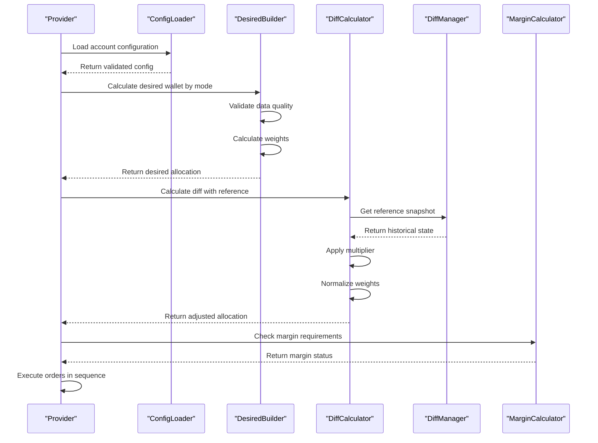

# Core Features

<cite>
**Referenced Files in This Document **   
- [desiredBuilder.ts](file://src/balancer/desiredBuilder.ts)
- [diffCalculator.ts](file://src/balancer/diffCalculator.ts)
- [diffManager.ts](file://src/balancer/diffManager.ts)
- [marginCalculator.ts](file://src/utils/marginCalculator.ts)
- [buyRequiresTotalMarginalSell.ts](file://src/utils/buyRequiresTotalMarginalSell.ts)
- [configLoader.ts](file://src/configLoader.ts)
- [index.ts](file://src/provider/index.ts)
</cite>

## Table of Contents
1. [Portfolio Rebalancing Engine Architecture](#portfolio-rebalancing-engine-architecture)
2. [Rebalancing Strategies Implementation](#rebalancing-strategies-implementation)
3. [Diff Calculation and Management](#diff-calculation-and-management)
4. [Margin Trading Support](#margin-trading-support)
5. [Buy Requires Total Marginal Sell Mechanism](#buy-requires-total-marginal-sell-mechanism)
6. [Component Interaction Workflow](#component-interaction-workflow)

## Portfolio Rebalancing Engine Architecture

The portfolio rebalancing engine follows a structured workflow to maintain optimal portfolio allocation. The process begins with fetching current positions from the Tinkoff Invest API through the provider component, which serves as the interface between the application and external services.

The core rebalancing cycle is orchestrated by the balancer module, which coordinates between configuration management, desired portfolio calculation, difference analysis, and order execution. The engine first retrieves the current account configuration through configLoader, which validates and provides access to account-specific settings including desired allocations, rebalancing modes, and risk parameters.

Once configuration is loaded, the desiredBuilder component calculates the target portfolio allocation based on the selected strategy (manual, marketcap, aum, or decorrelation). This desired allocation is then compared against the current portfolio state using the diffCalculator to determine necessary adjustments. The resulting differences are processed by diffManager to generate an optimal trade sequence that minimizes transaction costs while achieving the target allocation.

Order execution is handled by the provider, which translates the calculated trades into API calls to the Tinkoff Invest platform. Throughout this process, various components enforce business rules and risk constraints, ensuring that all operations comply with configured parameters and exchange regulations.

**Section sources**
- [index.ts](file://src/provider/index.ts#L85-L106)
- [configLoader.ts](file://src/configLoader.ts#L4-L338)

## Rebalancing Strategies Implementation

The rebalancing engine supports multiple strategies for calculating desired portfolio allocations, each implemented in the desiredBuilder.ts module. These strategies determine how weights are assigned to different financial instruments based on market data and user preferences.

### Manual Strategy
The manual strategy uses fixed percentages specified directly in the configuration file. When mode is set to 'manual' or 'default', the system returns the base desired wallet without any modifications. This approach gives users complete control over their portfolio composition.

### Market Capitalization Strategy
The marketcap strategy allocates weights proportionally to each instrument's market capitalization. The system gathers market cap data from multiple sources including local JSON files, ETF market cap calculations via etfCap tool, and share market cap calculations via shareCap tool. Instruments with higher market capitalization receive larger allocation percentages.

### Assets Under Management Strategy
The aum strategy bases allocations on the assets under management for each instrument. The system collects AUM data from local JSON files when available, otherwise it fetches live data through the buildAumMapSmart function and converts values to RUB using toRubFromAum. This strategy favors funds with larger asset bases.

### Market Cap and AUM Hybrid Strategy
The marketcap_aum strategy combines both approaches, using market capitalization when available and falling back to AUM data when market cap information is missing. This hybrid approach ensures robustness in cases where one data source might be temporarily unavailable.

### Decorrelation Strategy
The decorrelation strategy implements a sophisticated algorithm that identifies mispriced assets by comparing market capitalization to assets under management. It calculates a decorrelation percentage as (marketCap - AUM) / AUM * 100, then builds distribution metrics where undervalued assets (negative decorrelation) receive higher weights. This contrarian approach seeks to capitalize on market inefficiencies.

All strategies include comprehensive data validation to ensure quality requirements are met before proceeding with rebalancing calculations. The system validates that required metrics exist and are within acceptable ranges, throwing BalancingDataError if validation fails.

**Section sources**
- [desiredBuilder.ts](file://src/balancer/desiredBuilder.ts#L0-L383)

## Diff Calculation and Management

The diffCalculator and diffManager components work together to determine optimal trade sequences by analyzing differences between current and desired portfolio states. This system enables incremental adjustments based on historical reference points rather than absolute rebalancing.

### Diff Calculator Functionality
The diffCalculator performs several key functions:
- Calculates percentage differences between current and reference wallet allocations
- Applies configurable multipliers to adjust the aggressiveness of rebalancing
- Normalizes adjusted weights to ensure they sum to 100%
- Integrates with diffManager to retrieve reference snapshots

The calculateDiffPercentages function computes the relative difference for each ticker, handling edge cases where reference weights are zero by using absolute differences. The applyDiffMultiplier function adjusts base weights using the formula: adjusted_weight = base_weight + (diff_percentage * multiplier / 100), ensuring no weight becomes negative.

### Diff Manager Implementation
The diffManager maintains historical snapshots of portfolio states in a persistent storage system. It implements a singleton pattern through getInstance() to ensure consistent state management across the application.

Key features include:
- Memory caching of recently accessed data for performance optimization
- Disk persistence using JSON files in the diff_data directory
- Support for two snapshot types: iteration-based and daily (at 00:00)
- Automatic cleanup of old data files beyond a configurable retention period

The storeSnapshot method saves portfolio states with appropriate keys: "00:00" for midnight snapshots used in day mode, and incrementing "iteration_n" keys for sequential tracking. The getReferenceSnapshot method retrieves the appropriate reference point based on the configured diff mode ('day' or 'iteration').

This system allows for sophisticated rebalancing approaches where adjustments are made relative to previous states rather than absolute targets, reducing unnecessary trading activity and associated costs.

**Section sources**
- [diffCalculator.ts](file://src/balancer/diffCalculator.ts#L0-L241)
- [diffManager.ts](file://src/balancer/diffManager.ts#L0-L255)

## Margin Trading Support

The margin trading system enables leveraged portfolio management through the marginCalculator component, providing enhanced position sizing capabilities while enforcing risk parameters.

### Position Management
The MarginCalculator class manages margin positions by:
- Calculating available margin as total portfolio value multiplied by (multiplier - 1)
- Validating margin limits against maximum allowed margin size
- Checking margin usage ratios to assess risk levels
- Calculating transfer costs for moving margin positions

Available margin is determined by the configured multiplier (typically 2-4x), allowing the portfolio to exceed the actual account balance. For example, with a 2x multiplier, a 1,000,000 RUB portfolio can utilize up to 1,000,000 RUB in margin funding.

### Risk Parameter Enforcement
The system enforces several risk parameters:
- Maximum margin size limit (default 5,000 RUB)
- Free transfer threshold for small positions
- Dynamic risk level assessment (low/medium/high)
- Strategy-based margin removal at market close

Risk levels are determined by margin usage ratio: below 60% is low risk, 60-80% is medium risk, and above 80% is high risk. This helps prevent excessive leverage that could lead to margin calls.

### Buy Requires Total Marginal Sell Mechanism
For non-margin instruments, the system implements a "buy requires total marginal sell" mechanism that prevents purchasing these assets unless sufficient funds are generated by selling profitable margin positions. This ensures proper fund management and prevents liquidity issues.

The mechanism works by:
1. Identifying profitable positions that can be sold
2. Calculating required funds for non-margin instrument purchases
3. Determining optimal selling amounts based on configured strategy
4. Executing sales before proceeding with purchases

This creates a dependency chain where buying non-margin instruments is contingent upon successful sale of margin positions, maintaining proper capital flow within the portfolio.

**Section sources**
- [marginCalculator.ts](file://src/utils/marginCalculator.ts#L0-L276)
- [buyRequiresTotalMarginalSell.ts](file://src/utils/buyRequiresTotalMarginalSell.ts#L0-L409)

## Buy Requires Total Marginal Sell Mechanism

The buy requires total marginal sell mechanism enforces strict capital discipline when purchasing non-margin instruments by requiring that funds be generated through the sale of profitable margin positions. This system prevents the use of external capital injections and ensures portfolio self-sufficiency.

### Profit Calculation
The calculatePositionProfit function determines profitability by comparing current position value to original purchase cost. It uses averagePositionPriceFifo when available for accurate cost basis calculation, falling back to averagePositionPrice if FIFO data is unavailable. Positions are considered profitable only when both profit amount and percentage meet configured thresholds.

### Selling Strategy Modes
The system supports three selling strategy modes:
- **only_positive_positions_sell**: Sells only profitable positions that meet minimum profit thresholds
- **equal_in_percents**: Sells proportionally from all eligible positions regardless of profitability
- **none**: Disables automatic selling for funding purchases

Each mode includes configurable minimum profit percentage thresholds that must be met before positions are considered for sale. The system also applies a minimum purchase threshold based on portfolio value percentage to prevent insignificant transactions.

### Funding Requirements
The calculateRequiredFunds function determines how much capital needs to be raised by:
- Identifying non-margin instruments in the desired wallet
- Calculating purchase amounts exceeding minimum thresholds
- Summing total required funds across all target instruments

The calculateSellingAmounts function then determines which positions to sell and in what quantities to raise the required capital. It considers current RUB balance (which may be negative) when determining total funds needed, accounting for both purchase requirements and any existing deficits.

This mechanism creates a cascading execution order where margin position sales must complete successfully before non-margin instrument purchases can proceed, ensuring proper sequencing and capital availability.

**Section sources**
- [buyRequiresTotalMarginalSell.ts](file://src/utils/buyRequiresTotalMarginalSell.ts#L0-L409)

## Component Interaction Workflow

The rebalancing cycle involves coordinated interactions between multiple components, following a well-defined sequence during each execution.

**Diagram sources **
- [index.ts](file://src/provider/index.ts#L85-L106)
- [configLoader.ts](file://src/configLoader.ts#L4-L338)
- [desiredBuilder.ts](file://src/balancer/desiredBuilder.ts#L0-L383)
- [diffCalculator.ts](file://src/balancer/diffCalculator.ts#L0-L241)
- [diffManager.ts](file://src/balancer/diffManager.ts#L0-L255)
- [marginCalculator.ts](file://src/utils/marginCalculator.ts#L0-L276)

The workflow begins with the provider initiating the process by loading account configuration through configLoader. Once configuration is validated, desiredBuilder calculates the target portfolio allocation based on the selected strategy. The resulting desired wallet is passed to diffCalculator, which requests a reference snapshot from diffManager to compute differences.

After calculating the necessary adjustments, the system evaluates margin requirements using marginCalculator to ensure compliance with risk parameters. Finally, the provider executes orders in the proper sequence, respecting dependencies such as the requirement to sell margin positions before purchasing non-margin instruments.

Throughout this process, components maintain loose coupling through well-defined interfaces while sharing state through the configuration system and persistent storage mechanisms.

**Section sources**
- [index.ts](file://src/provider/index.ts#L85-L106)
- [configLoader.ts](file://src/configLoader.ts#L4-L338)
- [desiredBuilder.ts](file://src/balancer/desiredBuilder.ts#L0-L383)
- [diffCalculator.ts](file://src/balancer/diffCalculator.ts#L0-L241)
- [diffManager.ts](file://src/balancer/diffManager.ts#L0-L255)
- [marginCalculator.ts](file://src/utils/marginCalculator.ts#L0-L276)