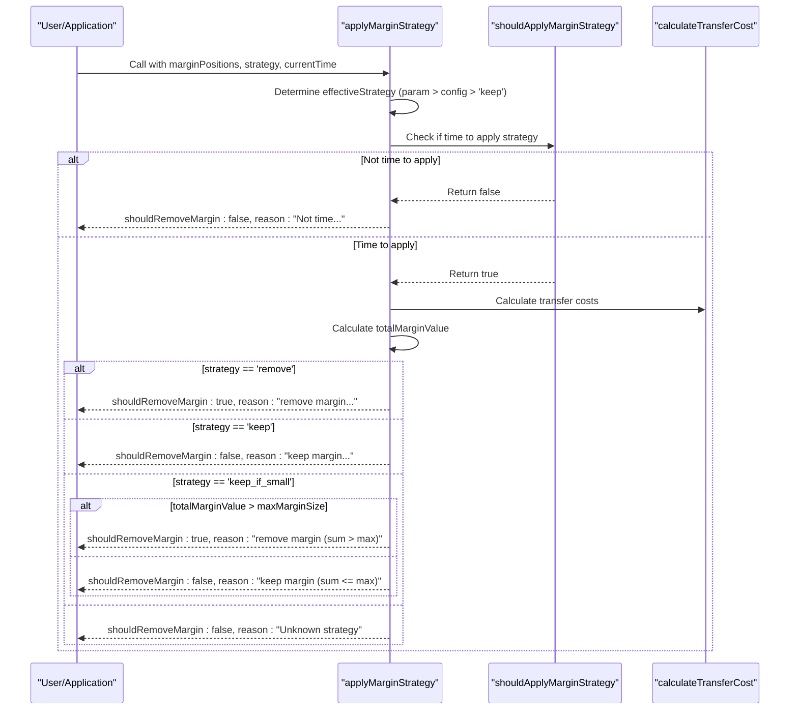
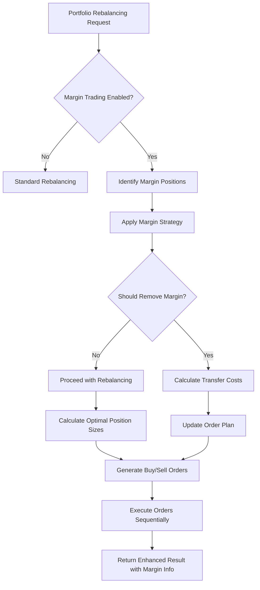

# Margin Trading Support

<cite>
**Referenced Files in This Document**   
- [marginCalculator.ts](file://src/utils/marginCalculator.ts)
- [marginCalculator-enhanced.test.ts](file://src/__tests__/utils/marginCalculator-enhanced.test.ts)
- [index.ts](file://src/balancer/index.ts)
- [types.d.ts](file://src/types.d.ts)
</cite>

## Table of Contents
1. [Introduction](#introduction)
2. [Core Components](#core-components)
3. [Margin Calculator Implementation](#margin-calculator-implementation)
4. [Margin Strategy Application](#margin-strategy-application)
5. [Integration with Balancer](#integration-with-balancer)
6. [Practical Examples](#practical-examples)
7. [Common Pitfalls and Debugging](#common-pitfalls-and-debugging)
8. [Conclusion](#conclusion)

## Introduction
The margin trading functionality in the ETF balancer bot enables risk-aware position management through leverage-based portfolio expansion. The system calculates available buying power based on a configurable multiplier and enforces margin requirements to maintain portfolio stability. At its core, the `MarginCalculator` class implements comprehensive risk assessment, transfer cost calculation, and strategic position management. This documentation details how margin positions are identified, managed, and integrated into the rebalancing workflow, providing practical examples and debugging guidance for various market conditions and configuration scenarios.

## Core Components
The margin trading system consists of three primary components: the `MarginCalculator` class responsible for all margin-related calculations, integration functions within the balancer that apply margin strategies during portfolio rebalancing, and configuration structures that define margin parameters. The system operates by first identifying margin positions in the portfolio, then calculating available margin based on the portfolio's total value and configured multiplier. It validates these positions against maximum margin size limits and applies balancing strategies according to time-based triggers and configuration settings. The integration with the core balancer ensures that margin considerations influence buy/sell decisions during portfolio rebalancing.

**Section sources**
- [marginCalculator.ts](file://src/utils/marginCalculator.ts#L6-L275)
- [index.ts](file://src/balancer/index.ts#L142-L192)
- [types.d.ts](file://src/types.d.ts#L47-L82)

## Margin Calculator Implementation
The `MarginCalculator` class implements risk-aware position management by calculating available buying power and enforcing margin requirements. The `calculateAvailableMargin` method determines available margin as the product of the portfolio's total value and (multiplier - 1), effectively defining the borrowing capacity. For example, with a 2x multiplier and a 100,000 RUB portfolio, the available margin would be 100,000 RUB. The `validateMarginLimits` method checks if the total margin used exceeds the configured maximum margin size (defaulting to 5,000 RUB if not specified), returning validation status and any excess amount. The `checkMarginLimits` method provides a comprehensive risk assessment, calculating usage ratio and categorizing risk level as low (<60% usage), medium (60-80%), or high (>80%). The `calculateTransferCost` method determines costs associated with transferring margin positions, applying a 1% fee to positions exceeding the free threshold while exempting smaller positions from fees.

```mermaid
classDiagram
class MarginCalculator {
+config : MarginConfig
+constructor(config : MarginConfig)
+calculateAvailableMargin(portfolio : Position[]) : number
+validateMarginLimits(marginPositions : MarginPosition[]) : {isValid : boolean; totalMarginUsed : number; maxMarginAllowed : number; exceededAmount? : number}
+checkMarginLimits(portfolio : Position[], marginPositions : MarginPosition[]) : {isValid : boolean; availableMargin : number; usedMargin : number; remainingMargin : number; riskLevel : 'low' | 'medium' | 'high'}
+calculateTransferCost(marginPositions : MarginPosition[]) : {totalCost : number; freeTransfers : number; paidTransfers : number; costBreakdown : Array<{ticker : string; cost : number; isFree : boolean}>}
+shouldApplyMarginStrategy(currentTime : Date, balanceInterval : number, marketCloseTime : string) : boolean
+applyMarginStrategy(marginPositions : MarginPosition[], strategy? : MarginBalancingStrategy, currentTime : Date, balanceInterval : number, marketCloseTime : string) : {shouldRemoveMargin : boolean; reason : string; transferCost : number; timeInfo : {timeToClose : number; timeToNextBalance : number; isLastBalance : boolean}}
+calculateOptimalPositionSizes(portfolio : Position[], desiredWallet : Record<string, number>) : Record<string, {baseSize : number; marginSize : number; totalSize : number}>
}
class MarginConfig {
+multiplier : number
+freeThreshold : number
+maxMarginSize? : number
+strategy? : MarginBalancingStrategy
}
class MarginPosition {
+isMargin : boolean
+marginValue? : number
+leverage? : number
+marginCall? : boolean
}
MarginCalculator --> MarginConfig : "uses"
MarginCalculator --> MarginPosition : "manages"
```

**Diagram sources **
- [marginCalculator.ts](file://src/utils/marginCalculator.ts#L6-L275)
- [types.d.ts](file://src/types.d.ts#L47-L82)

**Section sources**
- [marginCalculator.ts](file://src/utils/marginCalculator.ts#L6-L275)

## Margin Strategy Application
The `applyMarginStrategy` method governs the behavior of margin positions with different configuration options ('keep', 'remove', 'keep_if_small') and includes fallback logic when strategy is undefined. The method first determines the effective strategy by prioritizing the passed strategy parameter, then the configuration strategy, defaulting to 'keep' if neither is specified. The strategy application is time-sensitive, determined by the `shouldApplyMarginStrategy` method which evaluates whether the current time is close enough to market close (Moscow Exchange at 18:45) to warrant action. A strategy is applied when either the time until market close is less than the balance interval or when it's within 15 minutes of market close.

For the 'remove' strategy, the system returns `shouldRemoveMargin: true`, indicating all margin positions should be closed, with transfer costs calculated accordingly. The 'keep' strategy maintains all margin positions regardless of size. The 'keep_if_small' strategy conditionally retains margin positions only if their total value does not exceed the configured `maxMarginSize`. When an unknown strategy is provided, the method defaults to not removing margin with a 'Unknown strategy' reason. The method returns detailed information including the decision rationale, transfer costs, and timing data such as minutes to market close and whether this represents the last balance of the day.



**Diagram sources **
- [marginCalculator.ts](file://src/utils/marginCalculator.ts#L161-L243)
- [marginCalculator-enhanced.test.ts](file://src/__tests__/utils/marginCalculator-enhanced.test.ts#L300-L350)

**Section sources**
- [marginCalculator.ts](file://src/utils/marginCalculator.ts#L161-L243)

## Integration with Balancer
The margin trading functionality integrates with the core balancer through several key functions that influence buy/sell decisions during portfolio rebalancing. The `identifyMarginPositions` function scans the portfolio to detect positions utilizing margin by comparing their total value against the base value derived from dividing by the multiplier. These identified margin positions are then processed by the `applyMarginStrategy` function in the balancer, which coordinates with the `MarginCalculator` to determine whether margin positions should be maintained or removed based on the current strategy and timing conditions.

During the rebalancing process, the `calculateOptimalPositionSizes` method considers the margin multiplier when determining target position sizes, allowing for leveraged portfolio expansion while respecting margin constraints. The integration ensures that margin considerations affect the final order generation, with the system potentially closing margin positions before executing new trades when required by the strategy. The balancer also incorporates margin information into its results, providing visibility into total margin used, individual margin positions, and whether the portfolio remains within margin limits. This integration creates a cohesive workflow where margin management directly influences the execution sequence and sizing of buy/sell orders.



**Diagram sources **
- [index.ts](file://src/balancer/index.ts#L142-L192)
- [marginCalculator.ts](file://src/utils/marginCalculator.ts#L245-L275)

**Section sources**
- [index.ts](file://src/balancer/index.ts#L142-L192)

## Practical Examples
The margin trading system behaves differently under various market conditions and configuration settings. In a scenario with a 100,000 RUB portfolio and a 2x multiplier, the available margin would be 100,000 RUB. With the 'keep_if_small' strategy and a max margin size of 50,000 RUB, if margin positions total 60,000 RUB, the system would trigger removal due to exceeding the limit. Conversely, if the same portfolio has only 30,000 RUB in margin positions, they would be retained. During normal trading hours far from market close, no strategy is applied regardless of configuration. However, at 18:30 with a market close at 18:45 and an hourly balance interval, the system recognizes this as the last balance of the day and applies the configured strategy.

When the strategy parameter is undefined, the system falls back to the configuration strategy, defaulting to 'keep' if not specified. For example, calling `applyMarginStrategy` without a strategy parameter on an account configured with 'remove' will still remove margin positions when timing conditions are met. The transfer cost calculation demonstrates practical economics: a 25,000 RUB margin position incurs a 250 RUB transfer fee (1%), while a 5,000 RUB position transfers freely if the free threshold is set to 10,000 RUB. These examples illustrate how the system balances automated decision-making with configurable risk parameters to manage margin positions effectively across different scenarios.

**Section sources**
- [marginCalculator-enhanced.test.ts](file://src/__tests__/utils/marginCalculator-enhanced.test.ts#L300-L400)
- [testMargin.ts](file://src/balancer/testMargin.ts#L123-L143)

## Common Pitfalls and Debugging
Common pitfalls in the margin trading system include insufficient collateral errors and unexpected position closures. Insufficient collateral typically occurs when the portfolio value declines significantly, reducing available margin below the required level, or when attempting to open positions that exceed the maximum margin size limit. Unexpected position closures happen when the timing conditions for strategy application are met unexpectedly, such as when the balance interval is shorter than anticipated or when market close time is misconfigured.

Debugging guidance involves examining logs from the `marginCalculator` and test scenarios from `src/__tests__/utils/marginCalculator-enhanced.test.ts`. Key log entries include the reason field in the strategy result, which explains why a particular decision was made, and the timeInfo object showing minutes to market close and whether this is considered the last balance. The enhanced test file provides comprehensive scenarios covering edge cases like empty portfolios, zero-value positions, and extreme multiplier values. Monitoring the transfer cost calculation helps identify issues with the free threshold configuration, while checking the risk level output reveals potential over-leveraging. When troubleshooting, verify that the current time, balance interval, and market close time align with expectations, as these directly influence strategy application timing.

**Section sources**
- [marginCalculator-enhanced.test.ts](file://src/__tests__/utils/marginCalculator-enhanced.test.ts#L600-L700)
- [marginCalculator.ts](file://src/utils/marginCalculator.ts#L100-L150)

## Conclusion
The margin trading functionality provides a robust framework for risk-aware position management through systematic calculation of available buying power and enforcement of margin requirements. The `MarginCalculator` class serves as the central component, implementing comprehensive methods for margin calculation, limit validation, and strategic decision-making. The integration with the core balancer ensures that margin considerations directly influence portfolio rebalancing decisions, creating a cohesive system for managing leveraged positions. With configurable strategies ('keep', 'remove', 'keep_if_small') and fallback logic for undefined strategies, the system offers flexibility while maintaining safety through automatic risk assessment and timing-based controls. The extensive test coverage and debugging capabilities enable reliable operation across various market conditions and configuration scenarios.