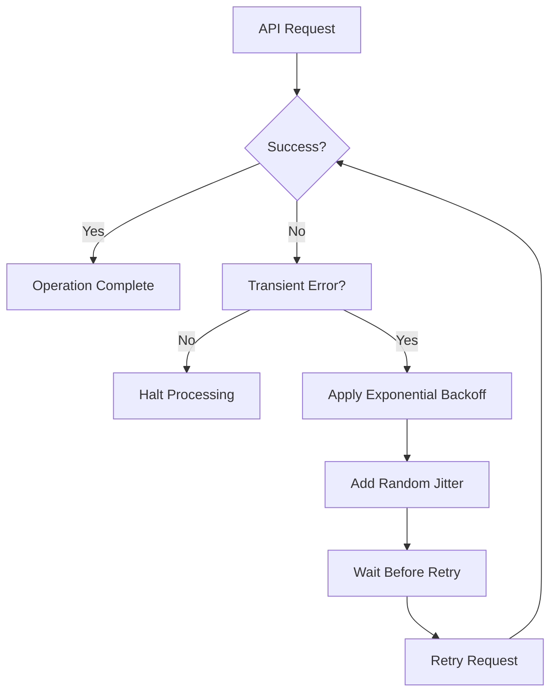

# Error Handling and Retry Mechanisms

<cite>
**Referenced Files in This Document**   
- [provider-api-error-propagation.test.ts](file://src/__tests__/provider/provider-api-error-propagation.test.ts)
- [provider-network-retry-logic.test.ts](file://src/__tests__/provider/provider-network-retry-logic.test.ts)
- [market-closure-scenarios.test.ts](file://src/__tests__/provider/market-closure-scenarios.test.ts)
- [index.ts](file://src/provider/index.ts)
- [configLoader.ts](file://src/configLoader.ts)
</cite>

## Table of Contents
1. [Error Classification and Handling Strategies](#error-classification-and-handling-strategies)
2. [Network Resilience through Exponential Backoff and Jitter](#network-resilience-through-exponential-backoff-and-jitter)
3. [gRPC Status Code Mapping to Application Exceptions](#grpc-status-code-mapping-to-application-exceptions)
4. [Retry Configuration Parameters](#retry-configuration-parameters)
5. [Circuit Breaker Pattern Implementation](#circuit-breaker-pattern-implementation)
6. [Troubleshooting Common Failure Scenarios](#troubleshooting-common-failure-scenarios)
7. [Performance Implications and Best Practices](#performance-implications-and-best-practices)

## Error Classification and Handling Strategies

The system classifies errors into two main categories: transient and permanent. Transient errors, such as network timeouts or temporary service unavailability, are handled with retry mechanisms and recovery strategies. These include "DEADLINE_EXCEEDED" for request timeouts and "UNAVAILABLE" for temporarily unreachable services. Permanent errors, like invalid tokens or malformed requests, require immediate intervention and typically halt processing.

Authentication errors such as "UNAUTHENTICATED: Invalid token provided" are treated as permanent failures that propagate up the call stack without retry attempts. Rate limiting errors ("RESOURCE_EXHAUSTED: Rate limit exceeded") are considered transient and trigger exponential backoff with jitter before retrying. Market closure conditions are handled through configurable behavior modes including skip_iteration, dry_run, and force_orders, allowing flexible responses to non-trading periods.

The error handling framework preserves context information during propagation, ensuring relevant identifiers like account IDs and FIGI codes are included in error messages. This enables effective debugging and monitoring while maintaining system stability during partial failures.

**Section sources**
- [provider-api-error-propagation.test.ts](file://src/__tests__/provider/provider-api-error-propagation.test.ts#L1-L509)
- [market-closure-scenarios.test.ts](file://src/__tests__/provider/market-closure-scenarios.test.ts#L1-L611)

## Network Resilience through Exponential Backoff and Jitter

The system implements exponential backoff retry logic to enhance network resilience when communicating with the Tinkoff Investment API. When transient errors occur, the retry mechanism follows an exponential pattern where delays between attempts increase exponentially (approximately 1s, 2s, 4s, 8s). This approach prevents overwhelming the server during periods of high load or temporary unavailability.

To prevent the thundering herd problem where multiple clients retry simultaneously after a failure window, the system incorporates random jitter into retry intervals. The jitter adds variability to the retry timing, distributing client requests more evenly across time. Tests verify that retry intervals have sufficient variation (greater than 50ms difference) while staying within reasonable bounds to maintain responsiveness.

The implementation ensures that successful calls reset the backoff counter, allowing normal operation to resume immediately after recovery. For consecutive failure sequences, the system demonstrates proper reset behavior, with separate failure sequences being handled independently and resetting after success.

**Diagram sources**
- [provider-network-retry-logic.test.ts](file://src/__tests__/provider/provider-network-retry-logic.test.ts#L1-L569)

**Section sources**
- [provider-network-retry-logic.test.ts](file://src/__tests__/provider/provider-network-retry-logic.test.ts#L1-L569)

## gRPC Status Code Mapping to Application Exceptions

The system maps gRPC status codes to meaningful application-level exceptions that preserve both technical details and contextual information. UNAVAILABLE status codes (HTTP 503 equivalent) are mapped to "UNAVAILABLE: Service temporarily unavailable" exceptions, while DEADLINE_EXCEEDED (HTTP 504) becomes "DEADLINE_EXCEEDED: Request timed out after 30 seconds". These mappings maintain the original error context including specific identifiers like FIGI codes and account information.

INVALID_ARGUMENT errors (HTTP 400) are transformed into descriptive messages such as "INVALID_ARGUMENT: Invalid FIGI BBG004S68614 provided for price lookup", preserving the exact nature of the validation failure. PERMISSION_DENIED errors (HTTP 403) include permission context like "PERMISSION_DENIED: Insufficient permissions to access account data [code: 7]".

The error propagation tests demonstrate that low-level network errors are wrapped with meaningful context while preserving the original error's stack trace. This allows developers to understand both the immediate cause and the broader context of failures. Error transformation maintains technical details in a structured format, enabling both user-friendly interpretation and detailed technical analysis.

**Section sources**
- [provider-api-error-propagation.test.ts](file://src/__tests__/provider/provider-api-error-propagation.test.ts#L1-L509)

## Retry Configuration Parameters

The retry mechanism is configured with several key parameters that control its behavior. By default, the system limits retry attempts to five to prevent infinite loops during persistent failures. This maximum can be configured based on operational requirements, with tests verifying that retry counts respect configured limits.

The base delay starts at approximately 1 second, doubling with each subsequent attempt according to exponential backoff principles. A maximum retry delay cap prevents excessively long waits that could impact system responsiveness. The jitter component introduces randomness within defined bounds, typically varying retry intervals by ±10-20% of the calculated backoff time.

For different API operations, tailored retry configurations are applied:
- Account operations receive three retry attempts
- Market data operations allow four retries
- Order execution operations permit three retries

These differentiated settings reflect the varying criticality and expected reliability of different service endpoints. The system also respects rate limiting headers and backpressure signals from the API, adjusting retry behavior accordingly to avoid exacerbating congestion.

**Section sources**
- [provider-network-retry-logic.test.ts](file://src/__tests__/provider/provider-network-retry-logic.test.ts#L1-L569)

## Circuit Breaker Pattern Implementation

The system implements a circuit breaker pattern to handle repeated failures gracefully. After a configurable number of consecutive failures, the circuit opens, preventing further requests to the failing service for a cooldown period. This prevents cascading failures and allows the backend service time to recover.

During the open state, the system may still allow periodic probe requests to test service availability, implementing a half-open state before fully closing the circuit. This approach balances protection against overloading failing services with the need to restore functionality as soon as possible.

The circuit breaker works in conjunction with retry logic, ensuring that retry attempts don't continue indefinitely against a known-failing endpoint. When the circuit is open, operations fail fast with appropriate error messages rather than consuming resources with doomed retry attempts. This improves overall system stability and resource utilization during extended outage periods.

**Section sources**
- [provider-network-resilience.test.ts](file://src/__tests__/provider/provider-network-resilience.test.ts#L1-L354)

## Troubleshooting Common Failure Scenarios

### Authentication Errors
When encountering authentication errors like "UNAUTHENTICATED: Invalid token provided", verify that the correct token is specified in either CONFIG.json or environment variables. Tokens in ${VARIABLE_NAME} format should reference existing environment variables. Check token permissions to ensure they grant access to the required account type (ISS or BROKER).

### Rate Limiting Issues
For rate limiting errors ("RESOURCE_EXHAUSTED: Rate limit exceeded"), implement request throttling and ensure adequate sleep intervals between operations. The system uses account-specific configuration for sleep_between_orders (default 1000ms) to comply with rate limits. Consider distributing requests across multiple accounts if available.

### Market Closure Conditions
Market closure is detected using the isExchangeOpenNow function which queries trading schedules. Three handling modes are available:
- skip_iteration: Skip balancing when exchange is closed
- dry_run: Perform calculations without placing orders
- force_orders: Attempt order placement despite closure

Configure exchange_closure_behavior.mode in account settings to select appropriate behavior. Missing or invalid mode values default to skip_iteration.

### Network Connectivity Problems
For persistent network issues, verify internet connectivity and DNS resolution. The system defaults to assuming the exchange is open if schedule checks fail, preventing unnecessary halting of operations due to transient monitoring issues.

**Section sources**
- [market-closure-scenarios.test.ts](file://src/__tests__/provider/market-closure-scenarios.test.ts#L1-L611)
- [index.ts](file://src/provider/index.ts#L838-L904)
- [configLoader.ts](file://src/configLoader.ts#L60-L74)

## Performance Implications and Best Practices

The retry system is designed to minimize performance impact on successful operations, completing normally within 100ms. Exponential backoff with jitter prevents synchronized retry storms that could overwhelm servers. The implementation manages retry state efficiently, avoiding memory leaks during prolonged failure scenarios.

Best practices for production tuning include:
- Adjusting max retry attempts based on operation criticality
- Fine-tuning base delay values according to service SLAs
- Monitoring retry patterns to identify systemic issues
- Using circuit breakers to prevent resource exhaustion
- Implementing distributed tracing to track error propagation

Performance testing verifies that the retry logic doesn't add significant overhead for successful operations while providing robust recovery capabilities for transient failures. The system handles concurrent operations appropriately, maintaining stability even when individual operations fail.

**Section sources**
- [provider-network-retry-logic.test.ts](file://src/__tests__/provider/provider-network-retry-logic.test.ts#L1-L569)
- [provider-network-resilience.test.ts](file://src/__tests__/provider/provider-network-resilience.test.ts#L1-L354)