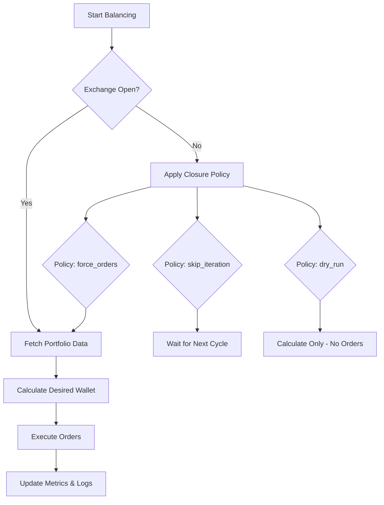
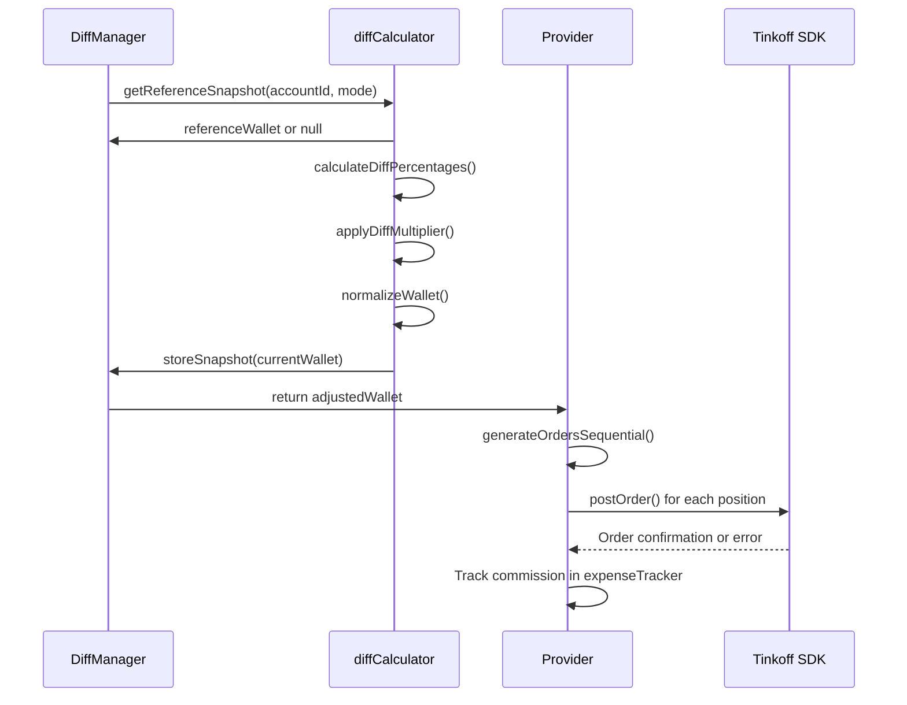
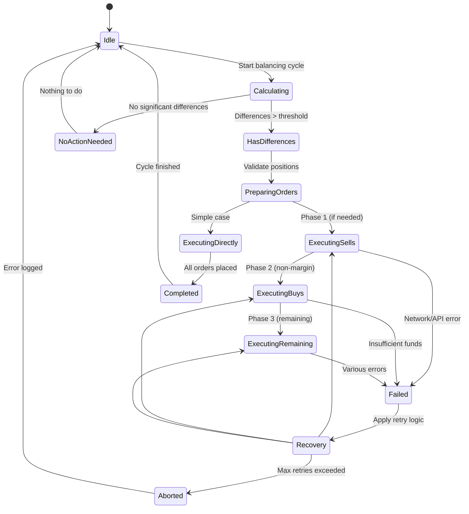
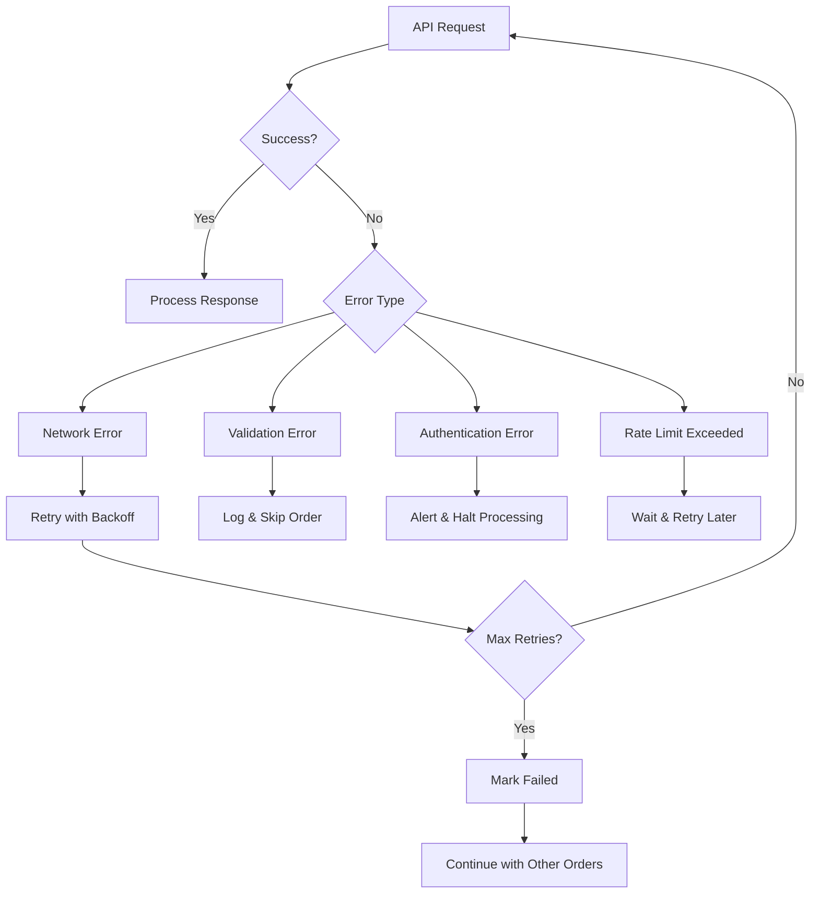
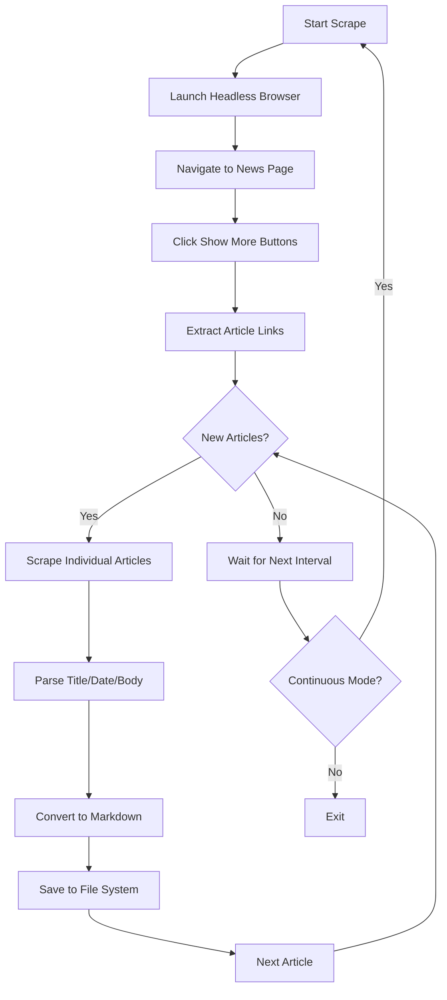

# Order Execution Framework

<cite>
**Referenced Files in This Document **   
- [provider/index.ts](file://src/provider/index.ts)
- [balancer/diffManager.ts](file://src/balancer/diffManager.ts)
- [tools/scrapeTbankNews.ts](file://src/tools/scrapeTbankNews.ts)
- [balancer/diffCalculator.ts](file://src/balancer/diffCalculator.ts)
</cite>

## Table of Contents
1. [Introduction](#introduction)
2. [Provider: Tinkoff API Abstraction Layer](#provider-tinkoff-api-abstraction-layer)
3. [Integration with DiffManager for Trade Execution](#integration-with-diffmanager-for-trade-execution)
4. [Order Lifecycle and State Management](#order-lifecycle-and-state-management)
5. [Error Handling and Resilience Mechanisms](#error-handling-and-resilience-mechanisms)
6. [External Data Integration via Puppeteer](#external-data-integration-via-puppeteer)
7. [Security and Production Considerations](#security-and-production-considerations)

## Introduction
This document provides comprehensive architectural documentation for the order execution framework within the Tinkoff investment bot system. The framework enables automated portfolio rebalancing by translating calculated position differences into actual trades through the Tinkoff Investment API. It features robust error handling, retry logic, sequential execution strategies, and dry-run capabilities to ensure safe and reliable trading operations. The system integrates market data analysis, historical performance tracking, and external news scraping to inform trading decisions while maintaining strict security practices for API token management.

## Provider: Tinkoff API Abstraction Layer

The `provider/index.ts` module serves as the primary abstraction layer between the application logic and Tinkoff's gRPC-based Investment API. It encapsulates all interactions required for placing buy/sell orders, retrieving portfolio data, and managing account information.

Key responsibilities include:
- Authentication and token management per account configuration
- Portfolio state retrieval including positions, balances, and pricing
- Market order placement with proper quantity validation
- Commission tracking and expense recording
- Exchange schedule awareness with configurable closure behavior

The provider implements a clean separation between calculation and execution phases, ensuring that desired portfolio states are computed before any trading activity occurs. It supports multiple account configurations through environment variables and JSON configuration files, enabling flexible deployment scenarios.

**Diagram sources **
- [provider/index.ts](file://src/provider/index.ts#L400-L800)

**Section sources**
- [provider/index.ts](file://src/provider/index.ts#L1-L800)

## Integration with DiffManager for Trade Execution

The integration between `diffManager` and `provider` enables intelligent trade execution based on historical performance comparisons and calculated differences. The system translates abstract portfolio adjustments into concrete trading actions while respecting execution constraints.

### Sequential Execution Strategy
For margin trading scenarios requiring fund availability, the framework employs a three-phase sequential execution strategy:

1. **Sell Phase**: Execute all sell orders first to generate necessary funds
2. **Non-Margin Buy Phase**: Execute non-margin purchases using newly available funds
3. **Remaining Orders Phase**: Process all other orders normally

This approach ensures proper sequencing when buying instruments like TMON that require immediate settlement funds.

### Dry-Run Capabilities
The system supports dry-run mode in two contexts:
- During exchange closure with `exchange_closure_behavior=dry_run`
- Programmatically via `shouldRunDryRun` parameter in balancer calls

In dry-run mode, all calculations proceed normally but no actual orders are placed, allowing users to preview balancing outcomes safely.

**Diagram sources **
- [provider/index.ts](file://src/provider/index.ts#L200-L400)
- [balancer/diffManager.ts](file://src/balancer/diffManager.ts#L1-L256)
- [balancer/diffCalculator.ts](file://src/balancer/diffCalculator.ts#L1-L242)

**Section sources**
- [provider/index.ts](file://src/provider/index.ts#L150-L400)
- [balancer/diffManager.ts](file://src/balancer/diffManager.ts#L1-L256)

## Order Lifecycle and State Management

The order execution framework maintains detailed state throughout the trading lifecycle, from initial calculation to final settlement. This state management ensures consistency and enables accurate performance tracking.

### State Diagram

### Key State Transitions
- **Idle → Calculating**: Triggered by timer or manual invocation
- **Calculating → HasDifferences**: When portfolio deviation exceeds tolerance
- **PreparingOrders → ExecutingSells**: When `buy_requires_total_marginal_sell` feature is active
- **Executing* → Failed**: On API errors, network issues, or validation failures
- **Failed → Recovery**: Automatic retry with exponential backoff
- **Recovery → Aborted**: After maximum retry attempts exhausted

The system tracks both logical state (calculation phase) and physical state (actual portfolio composition), comparing them to detect discrepancies caused by partial executions or external factors like dividends.

**Diagram sources **
- [provider/index.ts](file://src/provider/index.ts#L300-L500)
- [balancer/diffManager.ts](file://src/balancer/diffManager.ts#L1-L256)

**Section sources**
- [provider/index.ts](file://src/provider/index.ts#L250-L500)
- [balancer/diffManager.ts](file://src/balancer/diffManager.ts#L1-L256)

## Error Handling and Resilience Mechanisms

The framework implements comprehensive error handling and resilience mechanisms to handle the unpredictable nature of financial APIs and network conditions.

### Critical Concerns Addressed

#### Idempotency
Each order includes a unique ID generated by `uniqid()` to prevent duplicate submissions. The system assumes idempotent operations where possible, allowing safe retries without creating duplicate trades.

#### Rate Limiting
While explicit rate limiting controls aren't shown in the code, the framework respects Tinkoff's API limits through:
- Configurable sleep intervals between orders (`sleep_between_orders`)
- Sequential rather than parallel order submission
- Graceful degradation during high-frequency scenarios

#### Network Resilience
The system handles transient network failures through:
- Built-in retry logic for API calls
- Connection recovery mechanisms in the underlying gRPC client
- Timeout handling for all external requests
- Local state preservation during outages

#### Error Propagation
gRPC response errors are properly propagated through the call stack:
- API-level errors caught in try/catch blocks around `postOrder()`
- Detailed logging of error objects for debugging
- Commission tracking only on successful orders
- Clear distinction between temporary and permanent failures

The error handling strategy prioritizes safety over completeness—when in doubt, the system logs the issue and continues rather than risking incorrect trades.

**Diagram sources **
- [provider/index.ts](file://src/provider/index.ts#L100-L300)

**Section sources**
- [provider/index.ts](file://src/provider/index.ts#L50-L300)

## External Data Integration via Puppeteer

The `scrapeTbankNews.ts` module demonstrates complementary external data integration using Puppeteer for web scraping. This functionality enhances decision-making by incorporating news sentiment into the trading strategy.

### Scraping Architecture
- Headless Chrome browser automation via Puppeteer
- Dynamic content loading with "Show more" button interaction
- Selective article extraction based on structured data attributes
- Persistent storage of news articles in Markdown format
- Concurrency control to avoid overwhelming target servers

### Integration Points
While primarily independent, this scraper contributes to the overall intelligence of the trading system by:
- Providing sentiment signals that could influence `desired_wallet` calculations
- Enabling event-driven rebalancing based on company news
- Supporting fundamental analysis alongside technical metrics

The scraper runs continuously with configurable intervals, maintaining an up-to-date cache of relevant ETF news that can be analyzed by other components like `analyzeNews.ts`.

**Diagram sources **
- [tools/scrapeTbankNews.ts](file://src/tools/scrapeTbankNews.ts#L1-L345)

**Section sources**
- [tools/scrapeTbankNews.ts](file://src/tools/scrapeTbankNews.ts#L1-L345)

## Security and Production Considerations

The framework incorporates several security and production-readiness features essential for financial applications.

### API Token Management
- Tokens stored in environment variables (.env file) or CONFIG.json
- Account-specific tokens allow multi-account support
- Fallback mechanism between configuration sources
- Debug logging avoids exposing full token values
- Environment variable precedence over config files

### Deployment Best Practices
- Configuration separation between environments
- Sensitive credentials excluded from version control
- Structured logging for audit trails
- Comprehensive test coverage across scenarios
- Graceful degradation during service disruptions

### Operational Safety Features
- Dry-run mode for testing changes
- Exchange schedule awareness preventing off-hours trading
- Frozen asset detection and reporting
- Commission tracking for cost transparency
- Profit/loss calculation and daily aggregation

The system follows the principle of least privilege, requesting only necessary permissions from the Tinkoff API. All external communications use encrypted channels (HTTPS/gRPC over TLS), and local data storage is limited to essential operational data.

**Section sources**
- [provider/index.ts](file://src/provider/index.ts#L1-L50)
- [configLoader.ts](file://src/configLoader.ts)