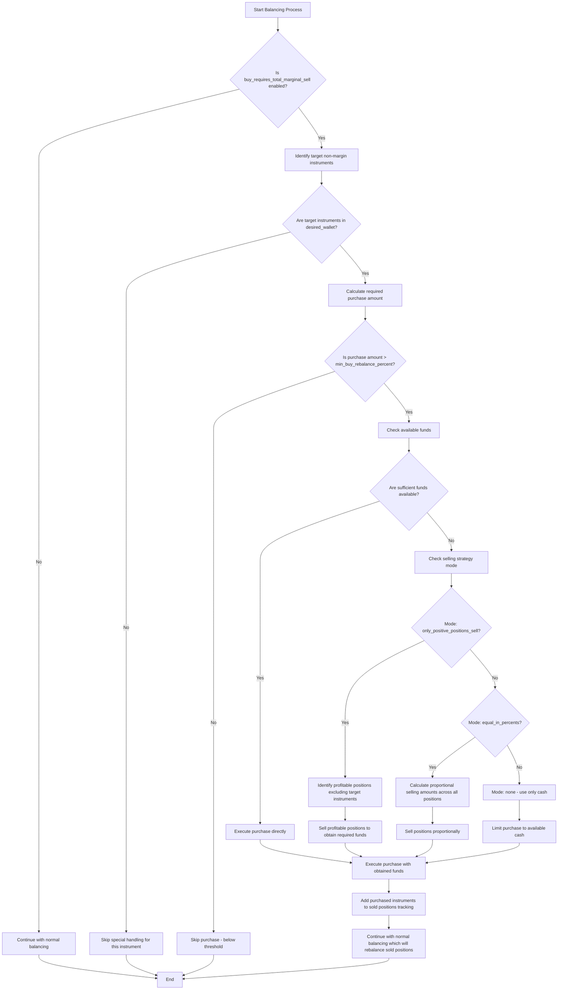
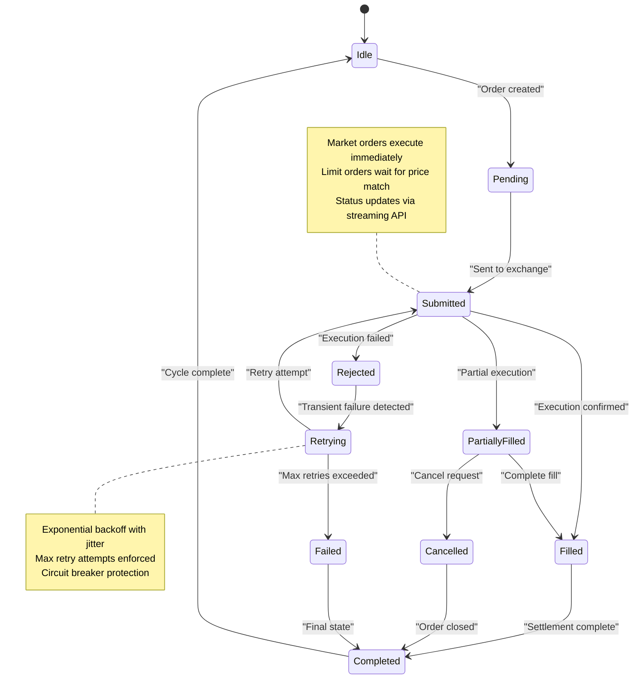
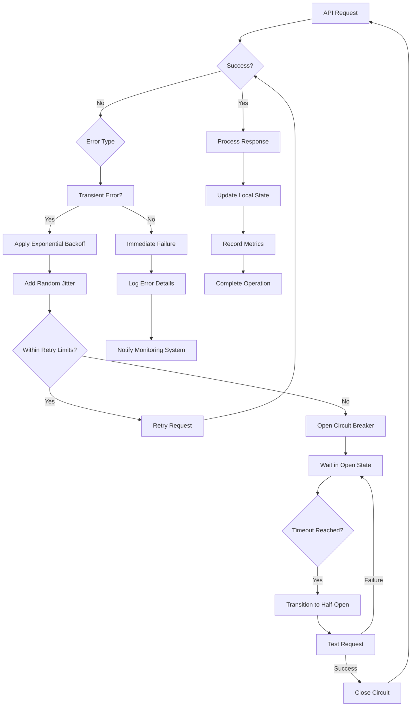

# Order Execution Lifecycle

<cite>
**Referenced Files in This Document**
- [diffManager.ts](file://src/balancer/diffManager.ts)
- [index.ts](file://src/provider/index.ts)
- [provider-order-execution.test.ts](file://src/__tests__/provider/provider-order-execution.test.ts)
</cite>

## Table of Contents
1. [Order Execution Process](#order-execution-process)
2. [State Transitions and Lifecycle](#state-transitions-and-lifecycle)
3. [Idempotency and Request ID Management](#idempotency-and-request-id-management)
4. [Integration with Tinkoff gRPC API](#integration-with-tinkoff-grpc-api)
5. [Error Handling and Recovery](#error-handling-and-recovery)

## Order Execution Process

The order execution process begins with the diffManager computing buy/sell differences based on portfolio rebalancing requirements. The diffManager analyzes the current wallet state against the desired wallet configuration to determine position adjustments. These calculated differences are then passed to the provider module for execution.

The provider orchestrates order placement through the Tinkoff gRPC API, handling market orders for both buying and selling positions. Each order contains essential parameters including accountId, figi, quantity (in lots), direction (buy/sell), orderType (market/limit), and a unique orderId generated via uniqid(). The system respects the sleep_between_orders configuration parameter to avoid rate limiting issues.

For special cases involving non-margin instruments, the system implements sequential order execution through generateOrdersSequential. This function processes orders in three distinct phases: first executing sell orders to raise funds, then executing non-margin buy orders, and finally processing remaining orders. This phased approach ensures that sufficient funds are available before purchasing non-margin instruments like TMON or LQDT.

**Diagram sources**
- [README.buy_requires_total_marginal_sell.md](file://README.buy_requires_total_marginal_sell.md#L0-L222)

**Section sources**
- [diffManager.ts](file://src/balancer/diffManager.ts#L0-L255)
- [index.ts](file://src/provider/index.ts#L85-L283)

## State Transitions and Lifecycle

Orders transition through several states during their lifecycle: pending, submitted, filled, rejected, and retried. When an order is created, it enters the pending state while awaiting execution conditions. Once sent to the exchange, it transitions to submitted status. Successful executions move to filled state, while failed attempts enter rejected state.

Transient failures trigger automatic retry logic with exponential backoff and jitter to prevent thundering herd problems. The system implements circuit breaker patterns to temporarily halt operations during persistent failures, allowing time for recovery before attempting probe requests to re-establish connectivity.

The state diagram illustrates the complete lifecycle including retry mechanisms:

**Diagram sources**
- [provider-order-execution.test.ts](file://src/__tests__/provider/provider-order-execution.test.ts#L0-L771)

**Section sources**
- [index.ts](file://src/provider/index.ts#L119-L159)
- [provider-order-execution.test.ts](file://src/__tests__/provider/provider-order-execution.test.ts#L0-L771)

## Idempotency and Request ID Management

The system ensures idempotency through unique request IDs generated using the uniqid() library. Each order receives a unique orderId that prevents duplicate executions even when retry mechanisms are triggered. This approach guarantees that identical requests produce the same result without unintended side effects.

When network issues or timeouts occur, the system can safely retry operations knowing that the exchange will reject duplicate orderIds. This mechanism protects against scenarios where a successful order response might not be received due to connection problems, preventing accidental double purchases or sales.

The idempotency design also integrates with the expense tracking system, where each executed order creates an expense record containing the orderId, ticker, order type, lots, amount, commission, and timestamp. This ensures accurate accounting regardless of retry attempts.

**Section sources**
- [index.ts](file://src/provider/index.ts#L161-L283)
- [provider-order-execution.test.ts](file://src/__tests__/provider/provider-order-execution.test.ts#L0-L771)

## Integration with Tinkoff gRPC API

The system integrates with Tinkoff's investment services through the tinkoff-sdk-grpc-js package, establishing secure gRPC connections for reliable communication. The provider module creates SDK instances with account-specific tokens, ensuring proper authentication and authorization for each operation.

Key integration points include:
- Account management via users.getAccounts()
- Portfolio data retrieval through operations.getPortfolio()
- Position information using operations.getPositions()
- Order placement with orders.postOrder()
- Market data access via marketData.getLastPrices()
- Trading schedule verification with instruments.getTradingSchedules()

The integration handles various exchange closure behaviors as configured, supporting modes like skip_iteration, force_orders, and dry_run. During market hours, orders are executed normally, while outside trading hours the behavior adapts according to configuration settings.

**Section sources**
- [index.ts](file://src/provider/index.ts#L85-L106)
- [package-lock.json](file://package-lock.json#L7210-L7241)

## Error Handling and Recovery

The system implements comprehensive error handling for various failure scenarios, particularly addressing specific Tinkoff API error codes. For ORDER_NOT_FOUND errors, the system verifies order existence before modification attempts and handles stale references appropriately. When encountering LIMIT_ORDER_SIZE_EXCEEDED errors, the system either splits large orders into smaller chunks or adjusts quantities to comply with exchange limits.

Network resilience features include exponential backoff retry logic with jitter, circuit breakers, and graceful degradation. Transient errors like UNAVAILABLE, DEADLINE_EXCEEDED, and RESOURCE_EXHAUSTED trigger automated retry sequences with increasing intervals. Non-retryable errors such as INVALID_ARGUMENT or PERMISSION_DENIED result in immediate failure reporting.

Practical examples from testing demonstrate both successful and failed order flows. Successful executions show proper commission tracking and expense recording, while failure scenarios validate appropriate error propagation and logging. The system distinguishes between retryable and non-retryable errors, ensuring robust operation under adverse conditions.

**Diagram sources**
- [provider-network-retry-logic.test.ts](file://src/__tests__/provider/provider-network-retry-logic.test.ts#L113-L185)
- [provider-network-resilience.test.ts](file://src/__tests__/provider/provider-network-resilience.test.ts#L113-L141)

**Section sources**
- [provider-order-execution.test.ts](file://src/__tests__/provider/provider-order-execution.test.ts#L0-L771)
- [provider-network-retry-logic.test.ts](file://src/__tests__/provider/provider-network-retry-logic.test.ts#L113-L185)
- [provider-network-resilience.test.ts](file://src/__tests__/provider/provider-network-resilience.test.ts#L113-L141)