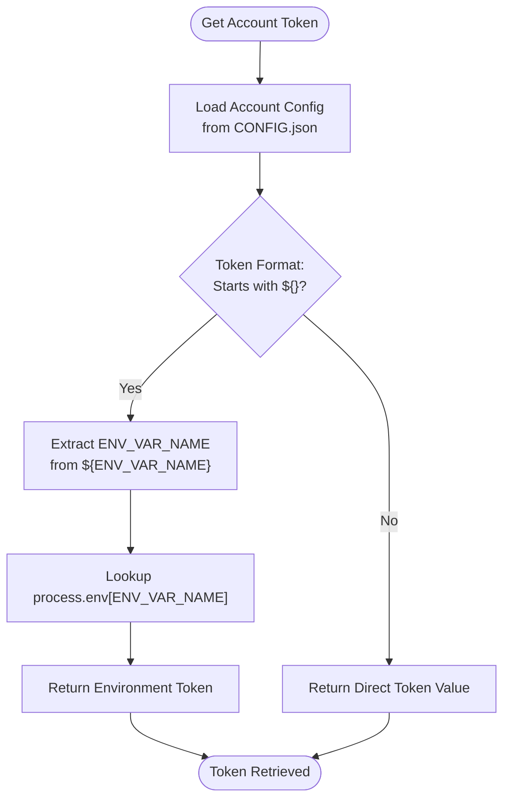
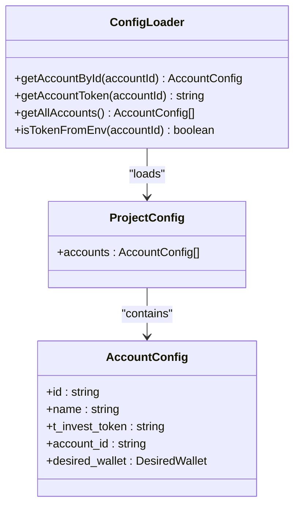
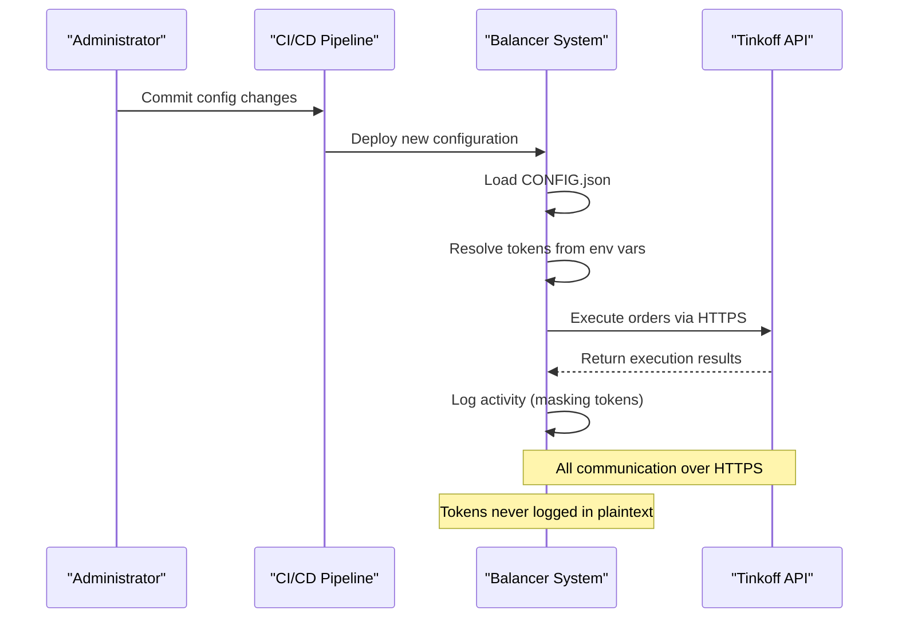

# Security and API Token Management

<cite>
**Referenced Files in This Document**   
- [src/configLoader.ts](file://src/configLoader.ts)
- [README.config.md](file://README.config.md)
- [src/types.d.ts](file://src/types.d.ts)
</cite>

## Table of Contents
1. [Introduction](#introduction)
2. [Token Retrieval Mechanism](#token-retrieval-mechanism)
3. [Multi-Account Token Isolation](#multi-account-token-isolation)
4. [Configuration-Based Token Resolution](#configuration-based-token-resolution)
5. [Encryption and Data Protection](#encryption-and-data-protection)
6. [Token Rotation and Exposure Minimization](#token-rotation-and-exposure-minimization)
7. [Production Deployment Risks and Mitigations](#production-deployment-risks-and-mitigations)

## Introduction
This document details the security practices for API token management within the Tinkoff Invest ETF Balancer Bot, focusing on secure handling during order execution. The system implements a robust configuration-driven approach to prevent hardcoded credentials by retrieving tokens from CONFIG.json with fallback to environment variables (e.g., T_INVEST_TOKEN). It supports multi-account setups through isolated token resolution via the `getTokenForAccount()` function (implemented as `getAccountToken()`), ensuring secure separation between accounts. The design emphasizes defense-in-depth principles including secure storage, transmission over HTTPS/gRPC, audit logging, and restricted token permissions.

**Section sources**
- [src/configLoader.ts](file://src/configLoader.ts#L45-L84)
- [README.config.md](file://README.config.md#L0-L200)

## Token Retrieval Mechanism
The bot securely retrieves API tokens using a hierarchical resolution strategy that prioritizes externalized configuration over embedded secrets. Tokens are first defined in the `t_invest_token` field within `CONFIG.json`. When the value follows the `${ENV_VAR_NAME}` pattern, it is resolved from the corresponding environment variable at runtime. This prevents plaintext credential storage in version-controlled files. The `getAccountToken(accountId)` method encapsulates this logic: if the token string starts with `${` and ends with `}`, it extracts the enclosed environment variable name and returns its value from `process.env`; otherwise, it returns the direct token value. This mechanism ensures sensitive credentials remain outside the codebase while enabling flexible deployment across environments.

**Diagram sources**
- [src/configLoader.ts](file://src/configLoader.ts#L65-L84)

**Section sources**
- [src/configLoader.ts](file://src/configLoader.ts#L65-L84)
- [README.config.md](file://README.config.md#L100-L120)

## Multi-Account Token Isolation
The system supports multiple brokerage accounts through strict token isolation enforced by the `configLoader` singleton. Each account in the `accounts` array of `CONFIG.json` contains a unique `id`, `name`, and `t_invest_token` field, enabling independent authentication contexts. The `getAccountById(accountId)` method locates the correct account configuration, and `getAccountToken(accountId)` resolves the associated token using the environment fallback logic. This design ensures that operations for one account cannot inadvertently access another’s credentials. Account-level token scope is validated during configuration loading, preventing cross-account token reuse and maintaining separation of duties across portfolios.

**Diagram sources**
- [src/configLoader.ts](file://src/configLoader.ts#L45-L63)
- [src/types.d.ts](file://src/types.d.ts#L150-L180)

**Section sources**
- [src/configLoader.ts](file://src/configLoader.ts#L45-L63)
- [src/types.d.ts](file://src/types.d.ts#L150-L180)

## Configuration-Based Token Resolution
The migration from direct environment variable usage to structured configuration-based token resolution enhances both security and maintainability. Previously, tokens were accessed directly via `process.env.T_INVEST_TOKEN`, creating inflexible and error-prone dependencies. Now, `CONFIG.json` serves as the single source of truth, with `t_invest_token` fields referencing environment variables through template syntax (`${T_INVEST_TOKEN}`). This change, documented in list_accounts_token_usage.md, allows centralized management of account metadata alongside secure token references. The `isTokenFromEnv(accountId)` method explicitly identifies whether a token originates from an environment variable, supporting auditing and validation workflows. Configuration validation ensures all required fields—including token definitions—are present before runtime execution.

**Section sources**
- [src/configLoader.ts](file://src/configLoader.ts#L90-L97)
- [README.config.md](file://README.config.md#L150-L180)

## Encryption and Data Protection
While the current implementation relies on environment variables for secret storage, it adheres to recommended practices for protecting tokens at rest and in transit. Tokens stored in `.env` files should be encrypted using platform-specific secret management services or file encryption tools in production deployments. The application communicates with the Tinkoff Invest API over TLS-secured HTTPS/gRPC channels, ensuring confidentiality and integrity during transmission. Sensitive data exposure is minimized by avoiding logging of token values; instead, diagnostic outputs use placeholders like `${ENV}` to indicate token source without revealing contents. Future enhancements could integrate key management systems (KMS) for automatic encryption/decryption of configuration files.

**Section sources**
- [src/configLoader.ts](file://src/configLoader.ts#L70-L75)
- [README.config.md](file://README.config.md#L50-L60)

## Token Rotation and Exposure Minimization
The architecture facilitates secure token rotation by decoupling credential values from application logic. To rotate a token, operators update the corresponding environment variable (e.g., `T_INVEST_TOKEN`) without modifying the `CONFIG.json` structure. Since tokens are loaded once at startup and cached in memory, changes require a service restart to take effect—this behavior should be coordinated with deployment pipelines. Logging mechanisms avoid recording actual token values by using `getRawTokenValue()` only for structural validation and masking sensitive content. Audit trails capture token source (environment vs. direct) and account context without exposing secrets, enabling compliance monitoring while minimizing attack surface.

**Section sources**
- [src/configLoader.ts](file://src/configLoader.ts#L77-L84)
- [src/configLoader.ts](file://src/configLoader.ts#L90-L97)

## Production Deployment Risks and Mitigations
Deploying the bot in production introduces risks related to credential leakage, unauthorized access, and privilege escalation. Key mitigations include: restricting API token permissions to minimum necessary scopes (e.g., read-only market data and limited trading rights); implementing audit logging via `console.log` statements that track token resolution outcomes without exposing values; validating all configuration inputs to prevent injection attacks; and isolating environment variables using containerization or serverless runtimes. Additionally, regular rotation of tokens, combined with monitoring for anomalous trading patterns, helps detect compromise early. The validation routine in `validateAccount()` ensures no account lacks a token definition, reducing misconfiguration risk.

**Diagram sources**
- [src/configLoader.ts](file://src/configLoader.ts#L65-L84)
- [README.config.md](file://README.config.md#L180-L200)

**Section sources**
- [src/configLoader.ts](file://src/configLoader.ts#L200-L250)
- [README.config.md](file://README.config.md#L180-L200)