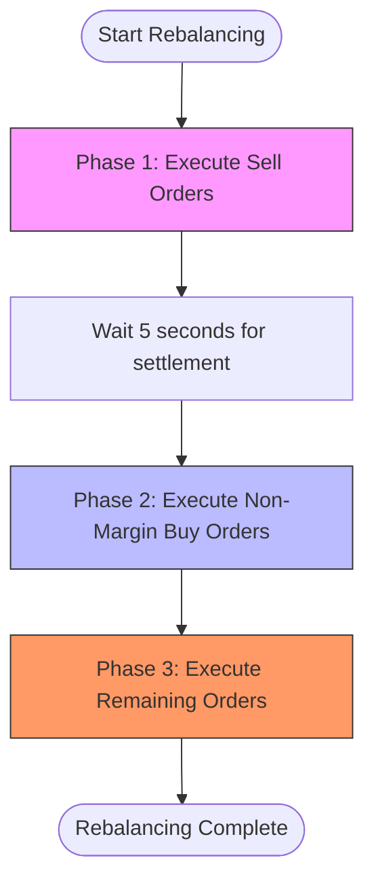
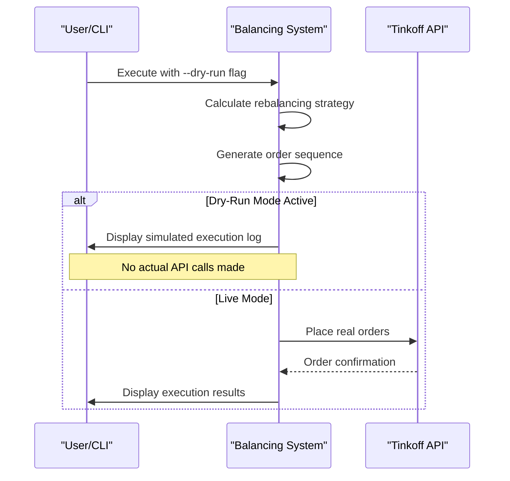

# Sequential Execution and Dry-Run Mode

<cite>
**Referenced Files in This Document**   
- [order-execution-sequences.test.ts](file://src/__tests__/provider/order-execution-sequences.test.ts)
- [index.ts](file://src/provider/index.ts)
- [integration.test.ts](file://src/__tests__/integration/integration.test.ts)
</cite>

## Table of Contents
1. [Introduction](#introduction)
2. [Sequential Order Execution](#sequential-order-execution)
3. [Dry-Run Mode](#dry-run-mode)
4. [Test Validation](#test-validation)
5. [Command-Line Interface Integration](#command-line-interface-integration)

## Introduction
This document details the sequential order execution mechanism and dry-run capabilities within the Tinkoff Invest ETF Balancer Bot. The system ensures portfolio consistency during rebalancing operations by executing orders in a strict sequence that prevents race conditions. Additionally, it provides a dry-run mode for testing and validation purposes without placing actual trades.

**Section sources**
- [order-execution-sequences.test.ts](file://src/__tests__/provider/order-execution-sequences.test.ts#L0-L806)

## Sequential Order Execution
The bot implements a three-phase sequential execution strategy to maintain portfolio integrity during rebalancing:

1. **Phase 1: Sell Orders** - All sell orders are executed first to raise necessary funds
2. **Phase 2: Non-Margin Buy Orders** - Purchases of non-margin instruments (e.g., TMON) follow after fund availability is ensured
3. **Phase 3: Remaining Orders** - All other orders, including margin positions, are processed last

This sequencing prevents race conditions where buy orders might fail due to insufficient funds by ensuring all sales complete before any purchases begin. The `generateOrdersSequential` function enforces this ordering with a mandatory 5-second wait between phases to allow market orders to settle and funds to become available.

**Diagram sources **
- [index.ts](file://src/provider/index.ts#L119-L159)

**Section sources**
- [index.ts](file://src/provider/index.ts#L119-L159)

## Dry-Run Mode
The dry-run mode enables safe testing and validation of rebalancing strategies without executing real trades. When activated via the `--dry-run` flag or exchange closure configuration, the system simulates the entire execution process while skipping actual API calls.

Key characteristics of dry-run mode:
- Mimics real execution logs and output formatting
- Calculates and displays proposed order sequences
- Validates configuration parameters and risk thresholds
- Prevents accidental live trading during debugging sessions
- Supports use cases like configuration tuning and risk assessment

The mode is controlled through command-line flags and can also be automatically triggered when the exchange is closed, based on the `exchange_closure_behavior` configuration setting.

**Diagram sources **
- [index.ts](file://src/provider/index.ts#L85-L106)
- [integration.test.ts](file://src/__tests__/integration/integration.test.ts#L176-L218)

**Section sources**
- [index.ts](file://src/provider/index.ts#L85-L106)
- [integration.test.ts](file://src/__tests__/integration/integration.test.ts#L176-L218)

## Test Validation
Comprehensive test cases in `order-execution-sequences.test.ts` validate the correctness of the sequential execution logic. Tests verify:
- Proper ordering of sell-before-buy operations
- Correct handling of empty order groups
- Appropriate sequencing of margin trading positions
- Error resilience when individual orders fail
- Timing constraints between execution phases

The tests use mocked implementations to track execution order and timing, confirming that sell orders always precede buy orders and that the 5-second inter-phase delay is respected. These validations ensure the system maintains portfolio consistency even under error conditions.

**Section sources**
- [order-execution-sequences.test.ts](file://src/__tests__/provider/order-execution-sequences.test.ts#L0-L806)

## Command-Line Interface Integration
The command-line interface supports the `--dry-run` flag to control execution behavior. When present, the system enters simulation mode, processing all rebalancing calculations while bypassing actual trade placement. The CLI parser validates input types, ensuring boolean values for `dryRun` and string values for account identifiers.

Integration tests demonstrate proper parsing of command-line arguments and correct propagation of the dry-run flag through the execution pipeline. This safeguards against accidental live trading by making dry-run mode explicit and type-validated.

**Section sources**
- [integration.test.ts](file://src/__tests__/integration/integration.test.ts#L176-L301)