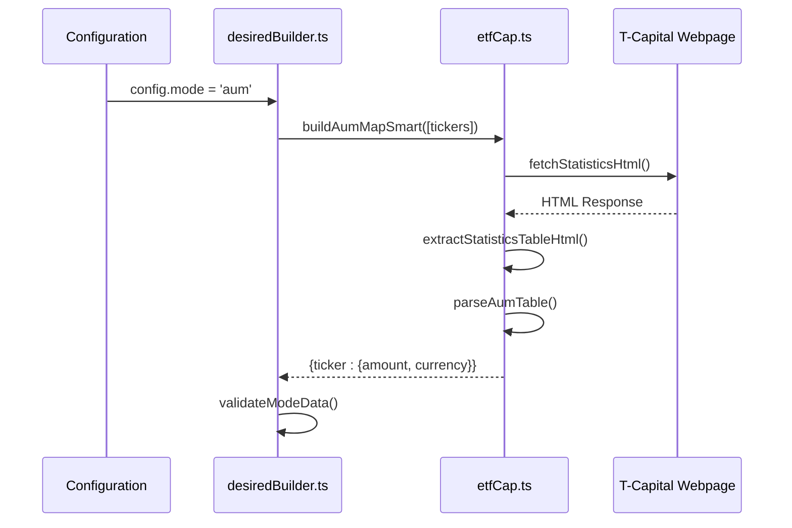
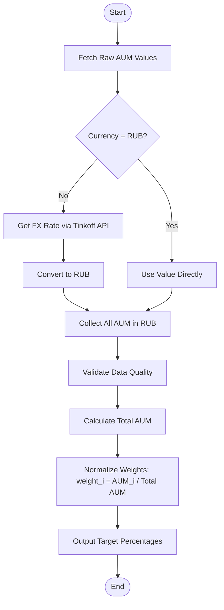
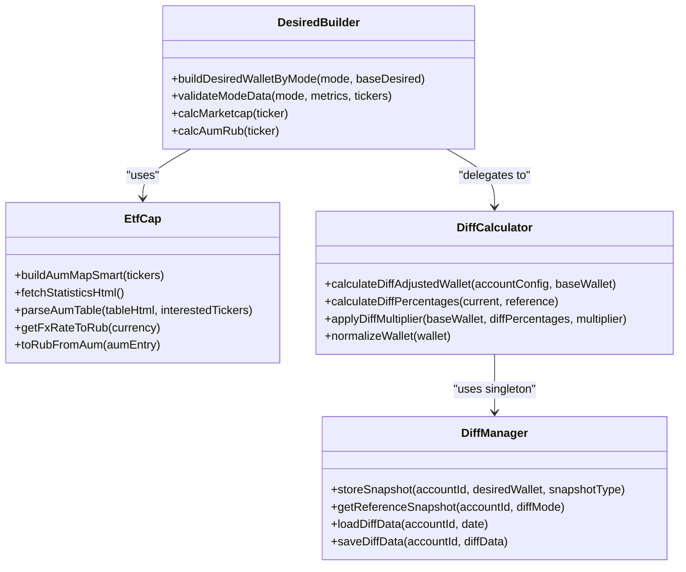

# AUM-Based Rebalancing Mode

<cite>
**Referenced Files in This Document**   
- [etfCap.ts](file://src/tools/etfCap.ts)
- [desiredBuilder.ts](file://src/balancer/desiredBuilder.ts)
- [diffCalculator.ts](file://src/balancer/diffCalculator.ts)
- [diffManager.ts](file://src/balancer/diffManager.ts)
</cite>

## Table of Contents
1. [Introduction](#introduction)
2. [AUM Data Acquisition Process](#aum-data-acquisition-process)
3. [Currency Conversion and Normalization](#currency-conversion-and-normalization)
4. [Weight Calculation and Portfolio Allocation](#weight-calculation-and-portfolio-allocation)
5. [Data Caching and Freshness Management](#data-caching-and-freshness-management)
6. [Practical Example](#practical-example)
7. [Limitations and Considerations](#limitations-and-considerations)

## Introduction
The AUM-based rebalancing mode is a portfolio management strategy that allocates investment weights proportionally to each ETF's Assets Under Management (AUM). This approach leverages the market consensus reflected in capital flows, assuming that larger AUM indicates stronger investor confidence and potentially better performance. The strategy is activated by setting `config.mode = 'aum'` in the configuration file. This document details the implementation of this rebalancing mode, focusing on how AUM data is extracted from T-Capital web pages, processed through currency conversion, normalized into investable percentages, and ultimately used to generate trade recommendations.

**Section sources**
- [etfCap.ts](file://src/tools/etfCap.ts#L1-L694)
- [desiredBuilder.ts](file://src/balancer/desiredBuilder.ts#L1-L383)

## AUM Data Acquisition Process
The AUM data acquisition process begins with the `buildAumMapSmart` function in `etfCap.ts`, which orchestrates the retrieval of AUM figures from the T-Capital statistics webpage. The process starts by fetching the HTML content of the statistics page via an HTTP GET request to `https://t-capital-funds.ru/statistics/`. The request includes specific headers to mimic a legitimate browser session, increasing the likelihood of successful access.

Once the HTML is retrieved, the system parses it to locate the relevant table containing AUM data. This is achieved by searching for tables with header rows that contain keywords such as "СЧА за последний день" (AUM for the last day) or "стоимость чистых активов" (net asset value). After identifying the correct table, the `parseAumTable` function processes its rows to extract AUM values for the requested tickers.

The parsing logic identifies potential ticker symbols by scanning for uppercase text tokens between 3 and 6 characters long. For each identified ticker, the system attempts to extract the corresponding AUM value from the "AUM for the last day" column. If the primary parsing method fails to find a value, a fallback mechanism uses predefined name patterns (e.g., `/пассивный\s+доход/i` for TPAY) to match ETFs by their full names within the table rows. This dual-strategy approach ensures robustness against changes in the webpage's structure.

**Diagram sources**
- [etfCap.ts](file://src/tools/etfCap.ts#L352-L428)
- [etfCap.ts](file://src/tools/etfCap.ts#L218-L281)

**Section sources**
- [etfCap.ts](file://src/tools/etfCap.ts#L352-L428)
- [etfCap.ts](file://src/tools/etfCap.ts#L218-L281)

## Currency Conversion and Normalization
After acquiring raw AUM values, the system must convert all amounts into a common currency (Russian Rubles - RUB) for consistent comparison and calculation. This process is handled by the `toRubFromAum` function, which takes an AUM entry containing both the amount and its original currency.

If the AUM is already in RUB, no conversion is necessary. For USD or EUR amounts, the system retrieves the current exchange rate using the Tinkoff API. The `getFxRateToRub` function queries the instruments service for currency pairs (USDRUB or EURRUB), then fetches the last traded price to determine the conversion rate. This real-time pricing ensures accurate currency translation.

The normalization process occurs in the `buildDesiredWalletByMode` function within `desiredBuilder.ts`. After gathering AUM values in RUB for all requested tickers, the system validates that all required data is present and valid. It then calculates proportional weights by dividing each ETF's AUM by the total AUM of all selected ETFs. These weights are expressed as percentages, forming the basis for the target portfolio allocation.

**Diagram sources**
- [pollEtfMetrics.ts](file://src/tools/pollEtfMetrics.ts#L237-L246)
- [etfCap.ts](file://src/tools/etfCap.ts#L430-L449)
- [desiredBuilder.ts](file://src/balancer/desiredBuilder.ts#L125-L328)

**Section sources**
- [pollEtfMetrics.ts](file://src/tools/pollEtfMetrics.ts#L237-L246)
- [etfCap.ts](file://src/tools/etfCap.ts#L430-L449)
- [desiredBuilder.ts](file://src/balancer/desiredBuilder.ts#L125-L328)

## Weight Calculation and Portfolio Allocation
The core logic for calculating portfolio weights resides in the `buildDesiredWalletByMode` function. When the mode is set to 'aum', this function collects AUM data for all tickers specified in the user's desired wallet configuration. It first attempts to read cached AUM values from local JSON files in the `etf_metrics` directory. If no valid cache entry exists, it proceeds to fetch fresh data from the T-Capital website.

The validation step ensures data integrity by checking that all requested tickers have valid, positive AUM values. If any ticker lacks sufficient data, the process throws a `BalancingDataError`, preventing the creation of an incomplete or inaccurate portfolio.

Once validated, the system calculates weights by summing all individual AUM values to create a total metric. Each ETF's weight is then determined by dividing its AUM by this total and multiplying by 100 to express it as a percentage. The resulting `DesiredWallet` object maps each ticker to its calculated percentage, representing the ideal portfolio distribution.

This target allocation is then passed to the rebalancing engine, which compares it against the current portfolio holdings to generate buy/sell orders that bring the actual portfolio into alignment with the AUM-proportional targets.

**Diagram sources**
- [desiredBuilder.ts](file://src/balancer/desiredBuilder.ts#L125-L328)
- [etfCap.ts](file://src/tools/etfCap.ts#L352-L428)
- [diffCalculator.ts](file://src/balancer/diffCalculator.ts#L159-L241)
- [diffManager.ts](file://src/balancer/diffManager.ts#L255-L255)

**Section sources**
- [desiredBuilder.ts](file://src/balancer/desiredBuilder.ts#L125-L328)
- [diffCalculator.ts](file://src/balancer/diffCalculator.ts#L159-L241)

## Data Caching and Freshness Management
To optimize performance and reduce external API calls, the system implements a comprehensive caching strategy for both AUM and market cap data. Cache files are stored in the project root directory with names like `.aum-cache-{accountId}.json` and `.marketcap-cache-{accountId}.json`.

The cache validity is controlled by a Time-To-Live (TTL) parameter configured in `CONFIG.json` under the `aum_cache.ttl_hours` setting, defaulting to 1 hour if not specified. Before making a network request, the system checks for an existing cache file. If found, it verifies whether the data is still fresh based on the TTL. Only if the cache is missing or expired will the system initiate a new data fetch from the T-Capital website.

When new data is successfully retrieved, it is immediately saved to the cache file with a timestamp, ensuring subsequent requests can utilize the cached values. This mechanism significantly reduces load on the external website and improves the bot's responsiveness, especially during frequent rebalancing cycles.

The caching system also handles partial data scenarios. If the cache contains information for some but not all requested tickers, the system will only fetch data for the missing ones, preserving the valid cached entries and minimizing unnecessary network traffic.

**Section sources**
- [etfCap.ts](file://src/tools/etfCap.ts#L352-L428)
- [etfCap.ts](file://src/tools/etfCap.ts#L100-L150)

## Practical Example
Consider a user who configures their portfolio with three ETFs: TMOS, TITR, and TDIV, setting `config.mode = 'aum'`. The rebalancing process unfolds as follows:

1.  The `buildDesiredWalletByMode` function is called with the mode 'aum' and the base desired wallet.
2.  The system determines the normalized tickers and initiates the AUM collection process.
3.  `buildAumMapSmart` checks the cache but finds no valid entry (or the entry is expired).
4.  It fetches the HTML from `t-capital-funds.ru/statistics/` and parses the AUM table.
5.  Suppose the extracted AUM values are: TMOS = 5.2B RUB, TITR = 1.8B RUB, TDIV = 3.0B RUB.
6.  The total AUM is calculated as 10.0B RUB.
7.  The normalized weights are computed: TMOS = (5.2/10.0)*100 = 52%, TITR = (1.8/10.0)*100 = 18%, TDIV = (3.0/10.0)*100 = 30%.
8.  The resulting desired wallet is `{TMOS: 52, TITR: 18, TDIV: 30}`.
9.  This target is compared to the current holdings by the `diffCalculator`, which generates the necessary buy/sell orders to achieve the 52/18/30 allocation.

This example demonstrates how the strategy dynamically adjusts portfolio weights based on the relative size of each ETF, automatically increasing exposure to funds attracting more capital.

**Section sources**
- [desiredBuilder.ts](file://src/balancer/desiredBuilder.ts#L125-L328)
- [etfCap.ts](file://src/tools/etfCap.ts#L352-L428)

## Limitations and Considerations
While the AUM-based rebalancing strategy offers a data-driven approach to portfolio management, it has several important limitations. The most significant is the potential delay in AUM reporting. Since the data is scraped from a public webpage, its update frequency depends on T-Capital's internal processes, which may not be real-time. This lag means the portfolio could be rebalanced based on stale information, potentially leading to suboptimal trades if market conditions have changed rapidly.

Another critical risk is concentration bias. The strategy inherently favors ETFs experiencing rapid growth in AUM. While this can capture momentum, it also increases exposure to potentially overvalued assets or those riding short-term trends. A sudden influx of capital into a single ETF could cause the portfolio to become overly concentrated, amplifying risk rather than diversifying it.

Furthermore, the reliance on web scraping introduces fragility. Any change to the structure of the T-Capital statistics page could break the parsing logic, causing the AUM data acquisition to fail. Although the code includes fallback mechanisms and error handling, prolonged outages would prevent the rebalancing process from executing correctly until the scraper is updated.

Finally, the strategy does not account for the underlying composition or valuation of the ETFs. Two ETFs with similar AUM might hold vastly different assets with different risk profiles. The model treats AUM as the sole determinant of allocation, ignoring fundamental analysis, expense ratios, or sector exposure, which could lead to an unbalanced portfolio from a risk perspective.

**Section sources**
- [etfCap.ts](file://src/tools/etfCap.ts#L352-L428)
- [desiredBuilder.ts](file://src/balancer/desiredBuilder.ts#L30-L123)