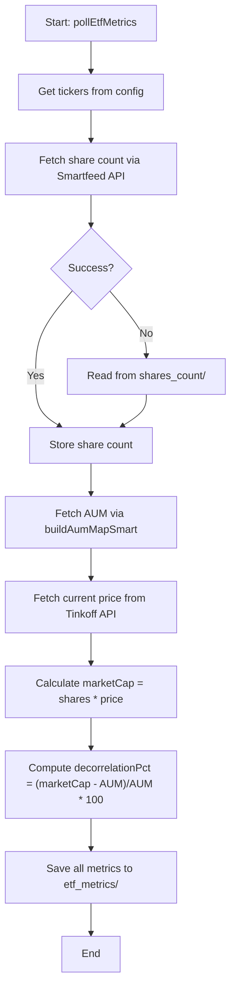
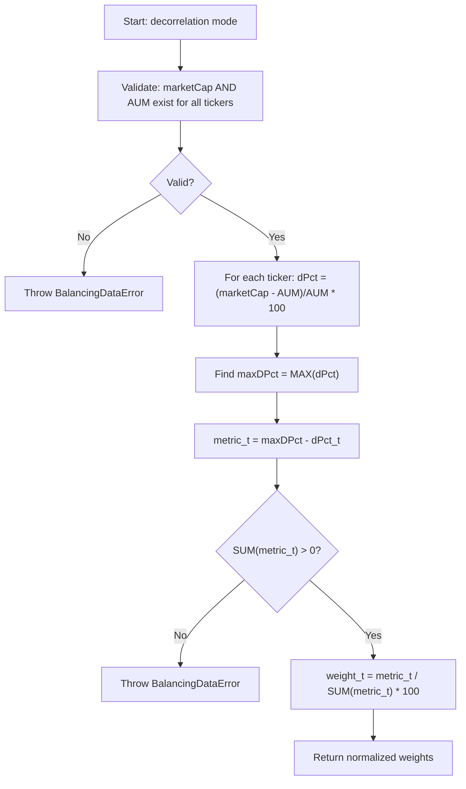

# Decorrelation Rebalancing Mode

<cite>
**Referenced Files in This Document**   
- [pollEtfMetrics.ts](file://src/tools/pollEtfMetrics.ts)
- [desiredBuilder.ts](file://src/balancer/desiredBuilder.ts)
</cite>

## Table of Contents
1. [Introduction](#introduction)
2. [Data Collection Process](#data-collection-process)
3. [Decorrelation Algorithm](#decorrelation-algorithm)
4. [Worked Example](#worked-example)
5. [Fallback Behaviors and Error Handling](#fallback-behaviors-and-error-handling)
6. [Performance and Configuration Considerations](#performance-and-configuration-considerations)

## Introduction
The decorrelation rebalancing mode is an advanced portfolio optimization strategy designed to minimize volatility by reducing exposure to highly correlated assets. When configured with `config.mode = 'decorrelation'`, the system analyzes the relationship between market capitalization (marketCap) and asset under management (AUM) values for ETFs in the portfolio. The core principle is that when marketCap significantly deviates from AUM, the ETF may be overvalued or undervalued, indicating potential correlation risk. This mode calculates target allocations that favor ETFs with marketCap closer to their AUM, thereby promoting a more diversified and stable portfolio composition.

**Section sources**
- [desiredBuilder.ts](file://src/balancer/desiredBuilder.ts#L125-L328)
- [pollEtfMetrics.ts](file://src/tools/pollEtfMetrics.ts#L248-L361)

## Data Collection Process
The data collection for the decorrelation mode is managed by the `pollEtfMetrics.ts` script. This script runs periodically to gather historical price data and fundamental metrics for each ETF in the portfolio. It first attempts to retrieve the number of shares outstanding via the Tinkoff Smartfeed API using brand-specific endpoints. If this fails, it falls back to reading cached share counts from local JSON files in the `shares_count/` directory. Concurrently, it collects AUM data through the `buildAumMapSmart` function, which scrapes financial news feeds for official announcements. Market capitalization is then calculated as the product of the current share price (obtained from the Tinkoff Invest API) and the total number of shares. All collected data—marketCap, AUM, share count, and price—is stored in individual JSON files within the `etf_metrics/` directory, timestamped for freshness. This multi-source approach ensures robustness against temporary API failures or missing data points.

**Diagram sources **
- [pollEtfMetrics.ts](file://src/tools/pollEtfMetrics.ts#L248-L361)

**Section sources**
- [pollEtfMetrics.ts](file://src/tools/pollEtfMetrics.ts#L248-L361)

## Decorrelation Algorithm
The core optimization algorithm is implemented in the `buildDesiredWalletByMode` function within `desiredBuilder.ts`. For the 'decorrelation' mode, it begins by validating that both marketCap and AUM data are available for every ticker in the desired wallet; if not, a `BalancingDataError` is thrown. The algorithm then calculates a decorrelation percentage (`decorrelationPct`) for each ETF using the formula `(marketCap - AUM) / AUM * 100`. A positive value indicates the ETF is potentially overvalued (marketCap > AUM), while a negative value suggests it may be undervalued. To create a distribution metric that favors less overvalued ETFs, the algorithm finds the maximum `decorrelationPct` across all holdings and subtracts each individual `decorrelationPct` from this maximum. This results in higher weights for ETFs with lower overvaluation. These raw weights are then normalized to sum to 100% to produce the final target allocation. The process also generates detailed `PositionMetrics` for reporting, including interpretation labels like 'overvalued', 'undervalued', or 'neutral' based on thresholds.

**Diagram sources **
- [desiredBuilder.ts](file://src/balancer/desiredBuilder.ts#L224-L279)

**Section sources**
- [desiredBuilder.ts](file://src/balancer/desiredBuilder.ts#L125-L328)

## Worked Example
Consider a portfolio with three ETFs: TRUR, TMOS, and TGLD. Suppose the `pollEtfMetrics` script has collected the following data:
- **TRUR**: marketCap = 1.2B RUB, AUM = 1.0B RUB → decorrelationPct = +20%
- **TMOS**: marketCap = 0.9B RUB, AUM = 1.0B RUB → decorrelationPct = -10%
- **TGLD**: marketCap = 0.8B RUB, AUM = 1.0B RUB → decorrelationPct = -20%

The maximum decorrelationPct is +20% (TRUR). The algorithm then computes the distribution metric for each:
- TRUR: 20% - (+20%) = 0
- TMOS: 20% - (-10%) = 30
- TGLD: 20% - (-20%) = 40

The sum of these metrics is 70. The final target weights are calculated by normalizing:
- TRUR: (0 / 70) * 100% ≈ 0%
- TMOS: (30 / 70) * 100% ≈ 43%
- TGLD: (40 / 70) * 100% ≈ 57%

This result shifts the portfolio away from the overvalued TRUR and towards the undervalued TMOS and TGLD, effectively reducing concentration in the most correlated (overheated) asset.

**Section sources**
- [readme.md](file://readme.md#L107-L156)
- [desiredBuilder.ts](file://src/balancer/desiredBuilder.ts#L254-L279)

## Fallback Behaviors and Error Handling
The decorrelation mode implements strict data validation and fallback mechanisms. The primary requirement is that both marketCap and AUM data must be available for every ticker in the portfolio. If either metric is missing or invalid for any ticker, the `validateModeData` function returns a failure, and the `buildDesiredWalletByMode` function throws a `BalancingDataError`. This error halts the rebalancing process to prevent decisions based on incomplete information. There is no automatic fallback to a different mode (like 'manual' or 'marketcap'); instead, the error must be resolved by ensuring data collection completes successfully. The system relies on multiple data sources (local JSON cache, live APIs) to maximize the chance of obtaining complete data, but if all sources fail, the rebalancing operation will not proceed. This conservative approach prioritizes data integrity over execution.

**Section sources**
- [desiredBuilder.ts](file://src/balancer/desiredBuilder.ts#L125-L328)
- [desiredBuilder.test.ts](file://src/__tests__/balancer/desiredBuilder.test.ts#L445-L479)

## Performance and Configuration Considerations
The computational complexity of the decorrelation mode is O(n), where n is the number of ETFs in the portfolio, making it efficient even for large portfolios. However, its performance is heavily dependent on external data sources. The data freshness is critical; stale market prices or delayed AUM updates can lead to suboptimal or misleading allocations. The lookback window for AUM data is determined by the frequency of the `pollEtfMetrics` script (defaulting to hourly), meaning the analysis uses the most recent available AUM figure, which might be days old if no new fund news has been published. Sensitivity to the lookback window is high: a longer window might smooth out noise but could miss recent valuation shifts, while a shorter window increases responsiveness but also volatility in the calculated weights. Users should ensure the polling interval aligns with their trading frequency and monitor the `etf_metrics` directory to verify data timeliness.

**Section sources**
- [pollEtfMetrics.ts](file://src/tools/pollEtfMetrics.ts#L248-L361)
- [desiredBuilder.ts](file://src/balancer/desiredBuilder.ts#L125-L328)