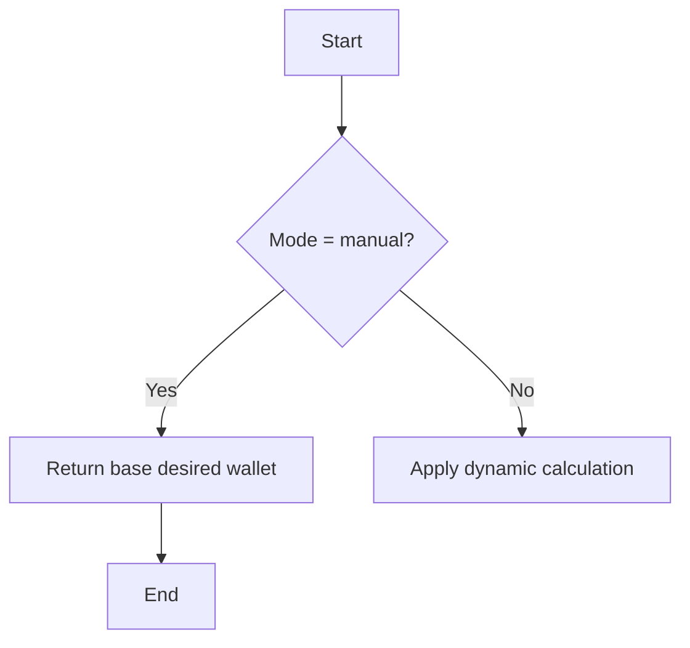
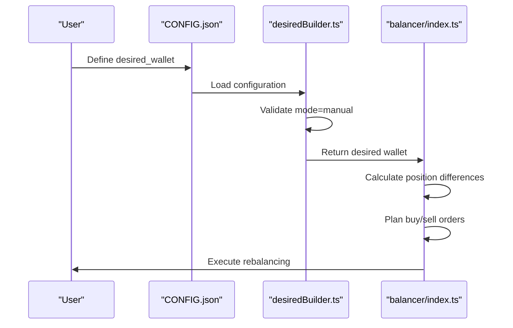

# Manual Rebalancing Mode

<cite>
**Referenced Files in This Document**   
- [CONFIG.example.json](file://CONFIG.example.json)
- [src/balancer/desiredBuilder.ts](file://src/balancer/desiredBuilder.ts)
- [src/balancer/index.ts](file://src/balancer/index.ts)
- [src/configLoader.ts](file://src/configLoader.ts)
</cite>

## Table of Contents
1. [Introduction](#introduction)
2. [Configuration Structure](#configuration-structure)
3. [Manual Mode Implementation](#manual-mode-implementation)
4. [Order Planning and Execution](#order-planning-and-execution)
5. [Example Scenario](#example-scenario)
6. [Lot Size Constraints](#lot-size-constraints)
7. [Common Issues and Mitigation](#common-issues-and-mitigation)

## Introduction
The manual rebalancing mode allows users to define fixed target percentages for each ETF in their portfolio through the CONFIG.json file. This mode operates independently of market dynamics, ensuring that portfolio allocations adhere strictly to user-defined targets. The system uses these static allocations to compute desired positions and generate buy/sell orders accordingly.

**Section sources**
- [CONFIG.example.json](file://CONFIG.example.json#L1-L52)

## Configuration Structure
Users define their desired portfolio allocation in the `desired_wallet` section of CONFIG.json, specifying ticker symbols as keys and percentage allocations as values. The configuration also includes a `desired_mode` parameter set to 'manual' to activate this rebalancing strategy.

```json
{
  "accounts": [
    {
      "id": "account_1",
      "name": "Main Brokerage Account",
      "t_invest_token": "${T_INVEST_TOKEN}",
      "account_id": "BROKER",
      "desired_wallet": {
        "TGLD": 8.33,
        "TRUR": 8.33,
        "TRND": 8.33,
        "TBRU": 8.33,
        "TDIV": 8.33,
        "TITR": 8.33,
        "TLCB": 8.33,
        "TMON": 8.33,
        "TMOS": 8.33,
        "TOFZ": 8.33,
        "TPAY": 8.33
      },
      "desired_mode": "manual",
      "balance_interval": 3600000,
      "sleep_between_orders": 3000
    }
  ]
}
```

The configuration loader validates that all percentage values are between 0 and 100 and that the sum of weights falls within a reasonable range (50-150%) before normalization.

**Section sources**
- [CONFIG.example.json](file://CONFIG.example.json#L1-L52)
- [src/configLoader.ts](file://src/configLoader.ts#L298-L344)

## Manual Mode Implementation
The manual rebalancing mode is implemented in the `buildDesiredWalletByMode` function within desiredBuilder.ts. When `desired_mode` is set to 'manual', the system returns the base desired wallet as-is without applying any dynamic calculations based on market data.



**Diagram sources**
- [src/balancer/desiredBuilder.ts](file://src/balancer/desiredBuilder.ts#L100-L120)

The balancer/index.ts file contains the main logic for processing the rebalancing strategy. It first normalizes the desired percentages to ensure they sum to 100%, then calculates the optimal position sizes based on the current portfolio value.

**Section sources**
- [src/balancer/desiredBuilder.ts](file://src/balancer/desiredBuilder.ts#L100-L120)
- [src/balancer/index.ts](file://src/balancer/index.ts#L232-L249)

## Order Planning and Execution
The order planning process follows a strict sequence: all sell orders are executed before any buy orders. This ensures sufficient funds are available for purchases. The system calculates the number of lots to buy or sell based on the difference between current and desired positions, taking into account lot size constraints.

The execution flow is as follows:
1. Filter out frozen assets
2. Apply margin position management strategy if enabled
3. Normalize desired percentages
4. Calculate optimal position sizes
5. Determine buy/sell quantities in lots
6. Generate orders with proper sequencing



**Diagram sources**
- [src/balancer/desiredBuilder.ts](file://src/balancer/desiredBuilder.ts#L100-L120)
- [src/balancer/index.ts](file://src/balancer/index.ts#L232-L249)

## Example Scenario
Consider a portfolio with the following imbalanced state:

Current Portfolio:
- TRUR: 30% (should be 25%)
- TGLD: 20% (should be 25%)
- TRND: 25% (correct)
- TRAY: 25% (correct)

The rebalancing algorithm would:
1. Identify TRUR as over-allocated by 5%
2. Calculate the amount to sell to bring it to 25%
3. Use proceeds to buy additional TGLD shares
4. Generate sell order for excess TRUR
5. Generate buy order for deficient TGLD

The system ensures that the sell order is executed first to free up funds for the purchase.

**Section sources**
- [src/balancer/index.ts](file://src/balancer/index.ts#L232-L249)

## Lot Size Constraints
The system handles lot size constraints by calculating the maximum number of complete lots that can be bought or sold. For each position, it determines how many lots can be traded before reaching the desired target value. Any unallocated remainder is tracked but cannot be invested due to minimum lot requirements.

When calculating buy/sell quantities:
1. Determine desired value in rubles
2. Divide by lot price to get target lots
3. Round down to nearest whole lot
4. Calculate actual cost based on whole lots
5. Track remainder for potential future allocation

This approach prevents partial lot purchases while maintaining alignment with overall portfolio targets as closely as possible.

**Section sources**
- [src/balancer/index.ts](file://src/balancer/index.ts#L232-L249)

## Common Issues and Mitigation
Several common issues arise in manual rebalancing mode:

### Inability to Reach Exact Targets
Due to minimum lot sizes, it may be impossible to achieve exact percentage targets. The system mitigates this by:
- Prioritizing larger positions where small percentage changes have greater impact
- Accumulating remainders over time for future reallocation
- Normalizing final allocations to ensure they sum to 100%

### Drift Over Time
Portfolio drift occurs when market movements create deviations from target allocations. Strategies to mitigate drift include:
- Regular rebalancing intervals (configurable via balance_interval)
- Setting appropriate thresholds for triggering rebalancing
- Using the diff feature to track cumulative deviations

### Instrument Availability
If an instrument becomes unavailable, the system:
1. Logs the missing instrument
2. Skips adding it to the portfolio
3. Recalculates remaining allocations proportionally
4. Continues with available instruments

These mechanisms ensure robust operation even when market conditions change.

**Section sources**
- [src/balancer/index.ts](file://src/balancer/index.ts#L232-L249)
- [src/balancer/desiredBuilder.ts](file://src/balancer/desiredBuilder.ts#L100-L120)