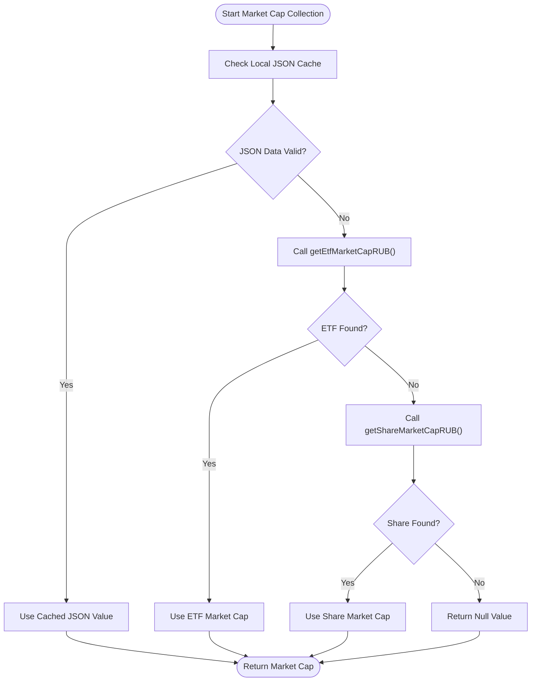
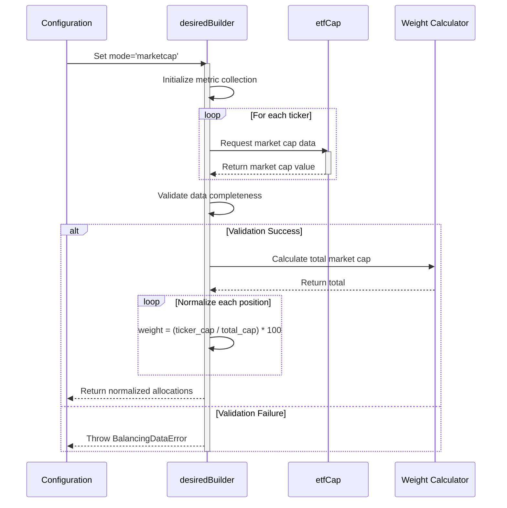
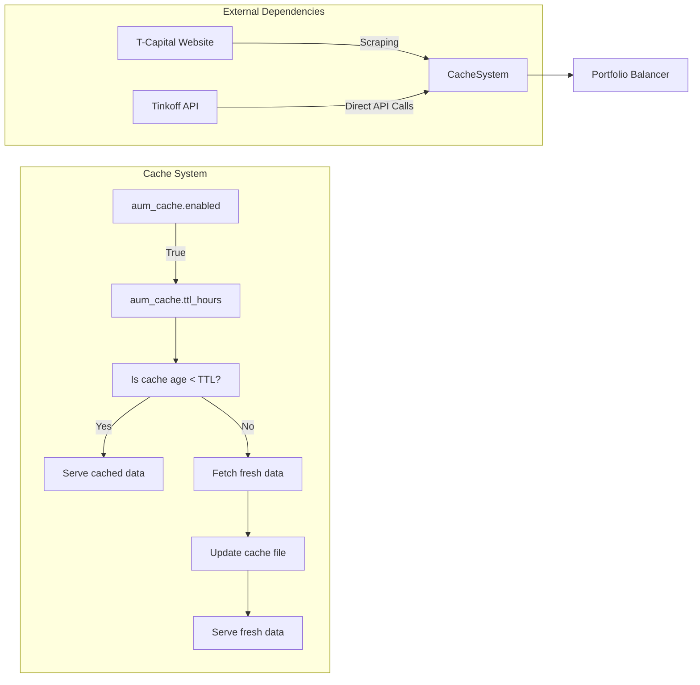
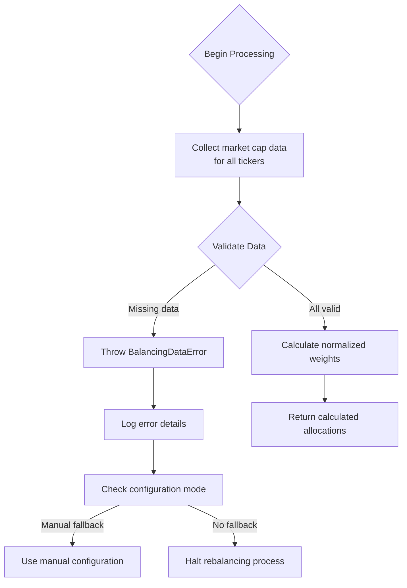

# Market Capitalization Rebalancing Mode

<cite>
**Referenced Files in This Document**   
- [etfCap.ts](file://src/tools/etfCap.ts)
- [desiredBuilder.ts](file://src/balancer/desiredBuilder.ts)
</cite>

## Table of Contents
1. [Introduction](#introduction)
2. [Market Cap Data Acquisition Process](#market-cap-data-acquisition-process)
3. [Allocation Calculation Workflow](#allocation-calculation-workflow)
4. [Caching and Resilience Mechanisms](#caching-and-resilience-mechanisms)
5. [Step-by-Step Example](#step-by-step-example)
6. [Error Handling and Fallbacks](#error-handling-and-fallbacks)
7. [Performance Considerations](#performance-considerations)

## Introduction
The market capitalization rebalancing mode dynamically adjusts ETF portfolio weights based on their relative market capitalizations when configured with `config.mode = 'marketcap'`. This strategy automatically calculates target allocations by fetching real-time market cap data from T-Capital's website through web scraping techniques, then normalizes these values into percentage-based portfolio weights. The system implements robust caching mechanisms and error handling to ensure reliable operation under network instability, making it suitable for automated investment management.

**Section sources**
- [desiredBuilder.ts](file://src/balancer/desiredBuilder.ts#L1-L50)

## Market Cap Data Acquisition Process
The market capitalization data acquisition process begins with the `etfCap.ts` module, which uses Puppeteer-based scraping to extract real-time market cap information from T-Capital's statistics page. The process follows a hierarchical data retrieval strategy:



**Diagram sources**
- [etfCap.ts](file://src/tools/etfCap.ts#L489-L588)
- [desiredBuilder.ts](file://src/balancer/desiredBuilder.ts#L150-L194)

The `getEtfMarketCapRUB` function first attempts to retrieve ETF data through the Tinkoff API, accessing multiple potential data sources including direct instrument lists, detailed ETF cards, and asset-level information. If ETF data is unavailable, the system falls back to share market cap calculation using `getShareMarketCapRUB`. This multi-layered approach ensures comprehensive coverage across different security types.

**Section sources**
- [etfCap.ts](file://src/tools/etfCap.ts#L489-L588)

## Allocation Calculation Workflow
The allocation calculation workflow in `desiredBuilder.ts` transforms raw market cap data into normalized portfolio weights through a systematic process. When `config.mode = 'marketcap'`, the system collects market cap values for all specified tickers and applies normalization algorithms to generate target allocations.



**Diagram sources**
- [desiredBuilder.ts](file://src/balancer/desiredBuilder.ts#L226-L279)

The workflow begins by collecting market cap data for each normalized ticker, validating that all required data points are available and positive. After successful validation, the system calculates the total market capitalization across all positions, then determines individual weights by dividing each ETF's market cap by the total and multiplying by 100 to convert to percentages. This ensures that larger market cap ETFs receive proportionally higher allocations in the portfolio.

**Section sources**
- [desiredBuilder.ts](file://src/balancer/desiredBuilder.ts#L226-L279)

## Caching and Resilience Mechanisms
The system implements sophisticated caching mechanisms to enhance performance and reliability. Both AUM (Asset Under Management) and market cap data utilize file-based caching with configurable time-to-live (TTL) settings, reducing the frequency of external API calls and web scraping operations.



**Diagram sources**
- [etfCap.ts](file://src/tools/etfCap.ts#L376-L408)
- [etfCap.ts](file://src/tools/etfCap.ts#L117-L166)

The AUM caching mechanism checks for existing cache files named `.aum-cache-{accountId}.json` and validates their freshness against the configured TTL (default: 1 hour). If the cache is valid and contains all requested tickers, it serves the cached data immediately. Otherwise, it fetches fresh data from T-Capital's website and updates the cache file. Similarly, market cap data is cached in `.marketcap-cache-{accountId}.json` files, creating a comprehensive local data store that minimizes external dependencies.

**Section sources**
- [etfCap.ts](file://src/tools/etfCap.ts#L376-L408)

## Step-by-Step Example
This example demonstrates the complete transformation from market cap input to target allocations using three hypothetical ETFs: TRUR, TMOS, and TGLD.

```mermaid
flowchart LR
A[Raw Market Caps] --> B[TRUR: 1.5B RUB<br/>TMOS: 2.3B RUB<br/>TGLD: 800M RUB]
B --> C[Calculate Total<br/>1.5B + 2.3B + 0.8B = 4.6B RUB]
C --> D[Normalize Weights]
D --> E[TRUR: (1.5/4.6)*100 = 32.6%]
D --> F[TMOS: (2.3/4.6)*100 = 50.0%]
D --> G[TGLD: (0.8/4.6)*100 = 17.4%]
E --> H[Final Allocations]
F --> H
G --> H
H --> I[Sum: 100%]
```

**Diagram sources**
- [desiredBuilder.ts](file://src/balancer/desiredBuilder.ts#L254-L279)

Starting with market cap values of 1.5 billion RUB for TRUR, 2.3 billion RUB for TMOS, and 800 million RUB for TGLD, the system first calculates the total market capitalization (4.6 billion RUB). It then computes individual weights by dividing each ETF's market cap by the total and converting to percentages. The resulting target allocations are approximately 32.6% for TRUR, 50.0% for TMOS, and 17.4% for TGLD, summing to 100%. This proportional distribution reflects each ETF's relative size in the market, with larger market cap funds receiving greater portfolio weight.

**Section sources**
- [desiredBuilder.ts](file://src/balancer/desiredBuilder.ts#L254-L279)

## Error Handling and Fallbacks
The system implements comprehensive error handling to maintain operational integrity when external data sources are unavailable. When market cap data cannot be retrieved, the system follows a structured validation process that prevents invalid calculations.



**Diagram sources**
- [desiredBuilder.ts](file://src/balancer/desiredBuilder.ts#L194-L226)
- [desiredBuilder.ts](file://src/balancer/desiredBuilder.ts#L226-L254)

The validation process explicitly checks for missing or invalid market cap data, throwing a `BalancingDataError` if any ticker lacks valid positive market cap values. This prevents the system from proceeding with incomplete or erroneous data that could lead to improper portfolio allocations. The error includes detailed information about missing data types and affected tickers, enabling precise troubleshooting. While the current implementation halts processing on data validation failure, this creates a natural safeguard against unreliable market conditions.

**Section sources**
- [desiredBuilder.ts](file://src/balancer/desiredBuilder.ts#L194-L226)

## Performance Considerations
The market capitalization rebalancing system incorporates several performance optimizations to balance data freshness with operational efficiency. The polling frequency and integration resilience are carefully designed to minimize network impact while maintaining timely data access.

The caching mechanism significantly reduces external dependency by storing both AUM and market cap data locally with a default TTL of one hour. This design choice limits HTTP requests to T-Capital's website and API calls to Tinkoff services, preventing rate limiting issues and reducing overall system latency. The file-based cache storage allows rapid data retrieval without requiring additional database infrastructure.

Network resilience is addressed through multiple layers of error handling and fallback strategies. The system attempts data retrieval from multiple sources in sequence: first checking local JSON files, then querying APIs, and finally resorting to web scraping if necessary. Each data collection step includes timeout configurations (10 seconds for HTTP requests) and error catching to prevent cascading failures.

For high-frequency operations, the system could benefit from implementing exponential backoff strategies during network failures and more granular control over polling intervals. Currently, the architecture prioritizes data accuracy over speed, ensuring that portfolio rebalancing decisions are based on reliable market information rather than potentially stale or incomplete data.

**Section sources**
- [etfCap.ts](file://src/tools/etfCap.ts#L117-L166)
- [etfCap.ts](file://src/tools/etfCap.ts#L376-L408)