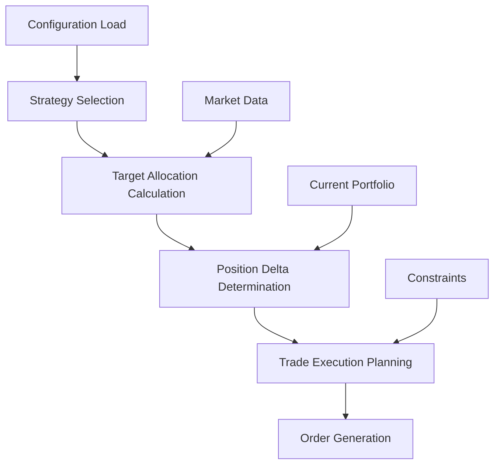
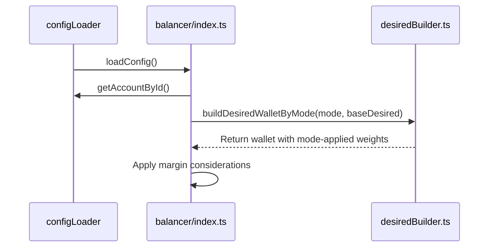
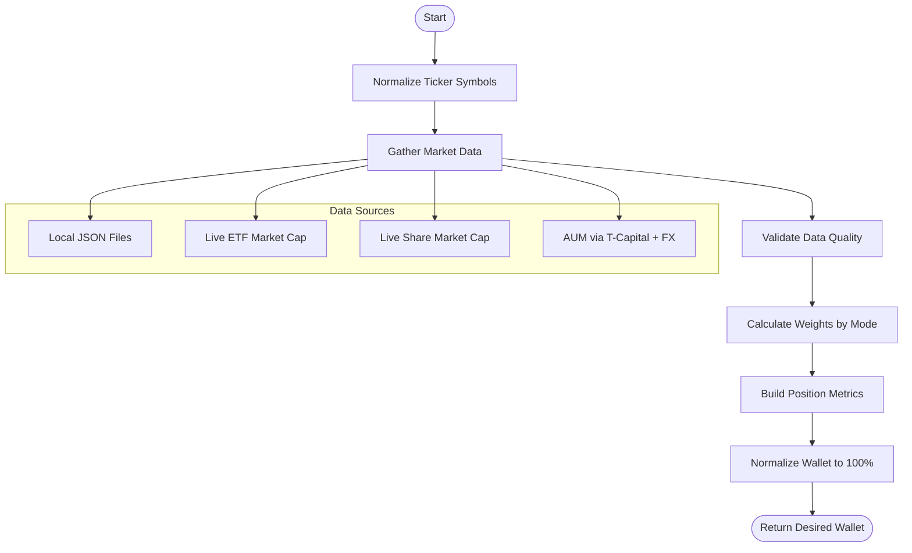
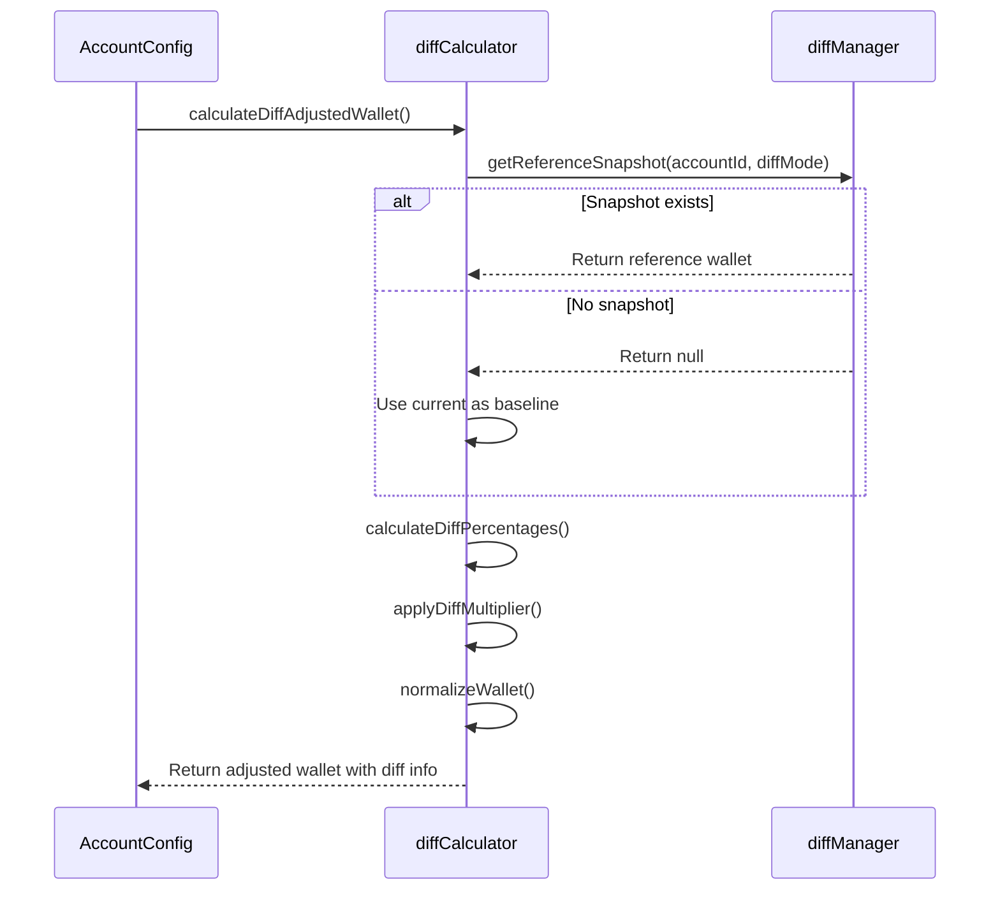
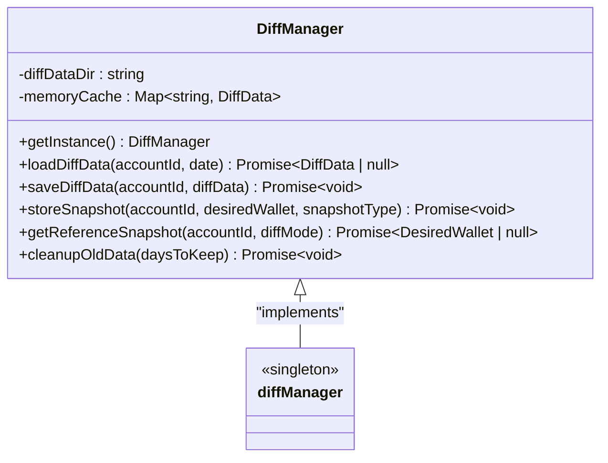
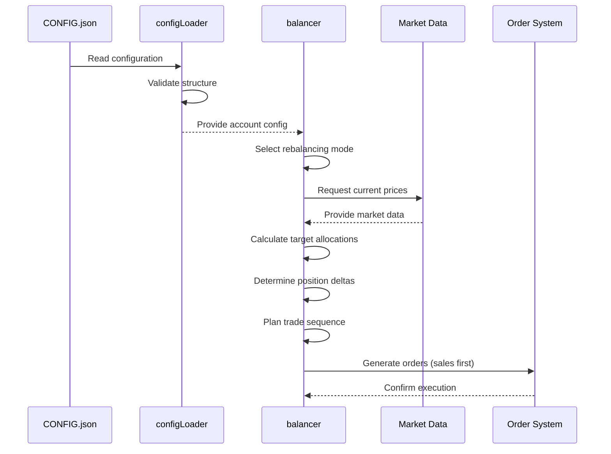

# Portfolio Rebalancing Engine

<cite>
**Referenced Files in This Document **   
- [index.ts](file://src/balancer/index.ts)
- [desiredBuilder.ts](file://src/balancer/desiredBuilder.ts)
- [diffCalculator.ts](file://src/balancer/diffCalculator.ts)
- [diffManager.ts](file://src/balancer/diffManager.ts)
- [configLoader.ts](file://src/configLoader.ts)
- [types.d.ts](file://src/types.d.ts)
- [CONFIG.example.json](file://CONFIG.example.json)
- [CONFIG.test-simple.json](file://test-configs/CONFIG.test-simple.json)
</cite>

## Table of Contents
1. [Introduction](#introduction)
2. [Architecture Overview](#architecture-overview)
3. [Rebalancing Modes and Strategy Selection](#rebalancing-modes-and-strategy-selection)
4. [Target Allocation Calculation](#target-allocation-calculation)
5. [Position Delta Determination](#position-delta-determination)
6. [Trade Execution Orchestration](#trade-execution-orchestration)
7. [Configuration and Data Flow](#configuration-and-data-flow)
8. [Common Issues and Edge Cases](#common-issues-and-edge-cases)
9. [Conclusion](#conclusion)

## Introduction
The Portfolio Rebalancing Engine is a strategy-driven system designed to automatically adjust investment portfolios according to predefined allocation targets. The engine operates by comparing current portfolio holdings with desired allocations, calculating necessary adjustments, and orchestrating optimal trade sequences while respecting various constraints. This document provides a comprehensive analysis of the engine's architecture, focusing on its core components including strategy selection, target calculation, delta computation, and execution planning.

**Section sources**
- [index.ts](file://src/balancer/index.ts#L0-L815)
- [types.d.ts](file://src/types.d.ts#L0-L213)

## Architecture Overview



**Diagram sources **
- [index.ts](file://src/balancer/index.ts#L0-L815)
- [desiredBuilder.ts](file://src/balancer/desiredBuilder.ts#L0-L383)

**Section sources**
- [index.ts](file://src/balancer/index.ts#L0-L815)
- [desiredBuilder.ts](file://src/balancer/desiredBuilder.ts#L0-L383)

## Rebalancing Modes and Strategy Selection

The rebalancing engine supports multiple modes that determine how target allocations are calculated based on configuration settings. These modes include manual, marketcap, aum, decorrelation, and marketcap_aum, each serving different investment strategies.

### Manual Mode
In manual mode, the desired wallet percentages specified in the configuration are used directly without any dynamic adjustment based on market data.

### MarketCap Mode
This mode allocates positions proportionally to their market capitalization values, favoring larger companies or ETFs.

### AUM Mode
Assets Under Management (AUM) mode distributes allocations based on the AUM of each instrument, reflecting the size of managed funds.

### Decorrelation Mode
This sophisticated mode identifies mispriced assets by calculating the percentage difference between market cap and AUM. Positions with higher decorrelation metrics receive greater weight, effectively overweighting undervalued assets and underweighting overvalued ones.

### MarketCap_AUM Mode
A hybrid approach that uses market cap when available, falling back to AUM data if market cap information is missing.

The strategy selection process begins with configuration loading through `configLoader`, which validates account-specific settings and determines the appropriate rebalancing mode based on the `desired_mode` parameter in the CONFIG.json file.



**Diagram sources **
- [configLoader.ts](file://src/configLoader.ts#L0-L344)
- [index.ts](file://src/balancer/index.ts#L0-L815)
- [desiredBuilder.ts](file://src/balancer/desiredBuilder.ts#L0-L383)

**Section sources**
- [index.ts](file://src/balancer/index.ts#L0-L815)
- [desiredBuilder.ts](file://src/balancer/desiredBuilder.ts#L0-L383)
- [configLoader.ts](file://src/configLoader.ts#L0-L344)

## Target Allocation Calculation

The `desiredBuilder.ts` module is responsible for computing target allocations using input strategies and current market data. This process involves several key steps:

1. Normalizing ticker symbols across the portfolio
2. Gathering market data from multiple sources (local JSON files, live API calls)
3. Validating data quality for the selected mode
4. Calculating weights based on the chosen strategy
5. Building position metrics for enhanced reporting

For decorrelation mode specifically, the algorithm follows these steps:
- Calculate decorrelation percentage: (marketCap - AUM) / AUM * 100
- Find the maximum decorrelation percentage among all tickers
- Build distribution metric: metric = max - decorrelationPct
- Assign weights proportional to the distribution metric

The system prioritizes data sources in this order: local JSON files in the etf_metrics directory, followed by live data from T-Capital and exchange APIs. This ensures reliability while maintaining up-to-date information.



**Diagram sources **
- [desiredBuilder.ts](file://src/balancer/desiredBuilder.ts#L0-L383)
- [etfCap.ts](file://src/tools/etfCap.ts)
- [shareCap.ts](file://src/tools/shareCap.ts)

**Section sources**
- [desiredBuilder.ts](file://src/balancer/desiredBuilder.ts#L0-L383)

## Position Delta Determination

The `diffCalculator.ts` module determines position deltas by comparing current allocations with desired targets. This process incorporates diff adjustment functionality that can modify target allocations based on historical performance.

Key features of the diff calculation include:
- Percentage difference calculation between current and reference wallets
- Application of configurable multipliers to amplify or reduce the impact of differences
- Normalization to ensure total allocations sum to 100%
- Support for different reference points (previous iteration or daily baseline)

The diff manager maintains snapshots of portfolio states, allowing for meaningful comparisons over time. For day mode, it attempts to establish a baseline at 00:00, falling back to the current wallet as a baseline if historical data is unavailable.



**Diagram sources **
- [diffCalculator.ts](file://src/balancer/diffCalculator.ts#L0-L241)
- [diffManager.ts](file://src/balancer/diffManager.ts#L0-L255)

**Section sources**
- [diffCalculator.ts](file://src/balancer/diffCalculator.ts#L0-L241)
- [diffManager.ts](file://src/balancer/diffManager.ts#L0-L255)

## Trade Execution Orchestration

The `diffManager.ts` module orchestrates optimal trade sequences while respecting constraints such as order limits and exchange closure rules. As a singleton class, it manages the lifecycle of diff data through memory caching and persistent storage.

Key orchestration features include:
- Memory and disk-based caching of portfolio snapshots
- Timestamp-based organization of historical data
- Iteration tracking for sequential diff calculations
- Daily baseline establishment at 00:00
- Automatic cleanup of old data files

The manager ensures efficient access to historical portfolio states while maintaining data integrity across application restarts. It stores snapshots in a structured format within the diff_data directory, organized by account ID and date.



**Diagram sources **
- [diffManager.ts](file://src/balancer/diffManager.ts#L0-L255)

**Section sources**
- [diffManager.ts](file://src/balancer/diffManager.ts#L0-L255)

## Configuration and Data Flow

The engine's behavior is controlled through JSON configuration files that specify account parameters, desired allocations, and operational constraints. Sample configurations demonstrate various rebalancing modes:

### Manual Mode Configuration
```json
{
  "accounts": [
    {
      "id": "test-account-1",
      "desired_wallet": {
        "TRUR": 25,
        "TMOS": 25,
        "TGLD": 25,
        "RUB": 25
      },
      "desired_mode": "manual"
    }
  ]
}
```

### MarketCap Mode Configuration
```json
{
  "accounts": [
    {
      "id": "env-account",
      "desired_wallet": {
        "TRUR": 40,
        "TMOS": 30,
        "TGLD": 20,
        "TRAY": 10
      },
      "desired_mode": "marketcap"
    }
  ]
}
```

### AUM Mode Configuration
```json
{
  "accounts": [
    {
      "id": "env-not-found-ultra",
      "desired_wallet": {
        "TRUR": 40,
        "TMOS": 35,
        "TGLD": 20
      },
      "desired_mode": "aum"
    }
  ]
}
```

### Decorrelation Mode Configuration
```json
{
  "accounts": [
    {
      "id": "duplicate-token-ultra",
      "desired_wallet": {
        "TRUR": 50,
        "TMOS": 25,
        "TGLD": 15
      },
      "desired_mode": "decorrelation"
    }
  ]
}
```

The complete data flow from configuration load to order execution follows this sequence:
1. Load configuration from CONFIG.json
2. Validate account settings and structure
3. Select rebalancing mode based on configuration
4. Calculate target allocations using market data
5. Determine position deltas considering historical diffs
6. Plan optimal trade sequences respecting constraints
7. Execute orders sequentially (sales first, then purchases)



**Diagram sources **
- [CONFIG.example.json](file://CONFIG.example.json)
- [CONFIG.test-simple.json](file://test-configs/CONFIG.test-simple.json)
- [configLoader.ts](file://src/configLoader.ts#L0-L344)
- [index.ts](file://src/balancer/index.ts#L0-L815)

**Section sources**
- [CONFIG.example.json](file://CONFIG.example.json)
- [CONFIG.test-simple.json](file://test-configs/CONFIG.test-simple.json)
- [configLoader.ts](file://src/configLoader.ts#L0-L344)

## Common Issues and Edge Cases

### Imbalanced Allocations After Execution
Imbalanced allocations can occur due to fractional lot limitations where exact target amounts cannot be achieved with whole lots. The system addresses this by:
- Calculating the closest achievable lot count
- Distributing unallocated remainder funds across positions
- Prioritizing minimum 1 lot for positions with positive target shares

### Fractional Lot Calculations
The engine handles fractional lot edge cases through:
- Truncation of decimal lots (Math.trunc)
- Separate tracking of lot-based and value-based calculations
- Recalculation of financial values after lot determination
- Special handling for new positions requiring minimum 1 lot

### Data Quality Issues
When required market data is missing for specific modes, the system throws a `BalancingDataError` with details about missing data types and affected tickers. This prevents execution with incomplete information.

### Margin Trading Constraints
When margin trading is disabled, the system returns empty arrays for margin positions and applies standard sizing calculations without leverage considerations.

### Exchange Closure Rules
The engine respects exchange closure behavior settings:
- skip_iteration: Skip balancing completely
- force_orders: Attempt to place orders regardless of status
- dry_run: Perform calculations without placing orders

**Section sources**
- [index.ts](file://src/balancer/index.ts#L0-L815)
- [desiredBuilder.ts](file://src/balancer/desiredBuilder.ts#L0-L383)
- [types.d.ts](file://src/types.d.ts#L0-L213)

## Conclusion
The Portfolio Rebalancing Engine provides a robust framework for automated portfolio management through its strategy-driven architecture. By supporting multiple rebalancing modes and incorporating sophisticated features like decorrelation analysis and diff adjustment, the system offers flexibility for various investment approaches. The modular design separates concerns between configuration management, target calculation, delta determination, and execution planning, ensuring maintainability and extensibility. With proper configuration and understanding of its edge cases, the engine can effectively maintain portfolio allocations according to specified investment strategies.

**Section sources**
- [index.ts](file://src/balancer/index.ts#L0-L815)
- [desiredBuilder.ts](file://src/balancer/desiredBuilder.ts#L0-L383)
- [diffCalculator.ts](file://src/balancer/diffCalculator.ts#L0-L241)
- [diffManager.ts](file://src/balancer/diffManager.ts#L0-L255)