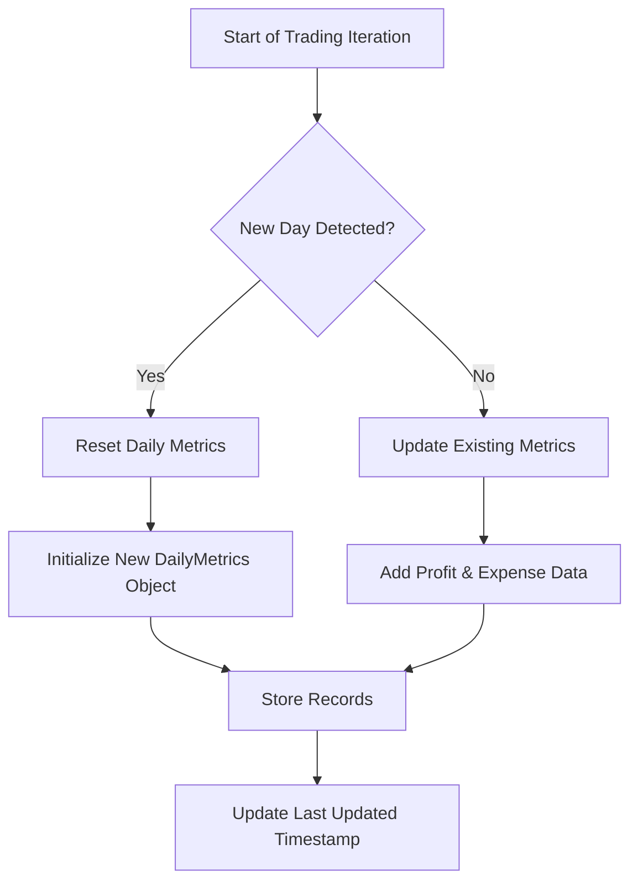
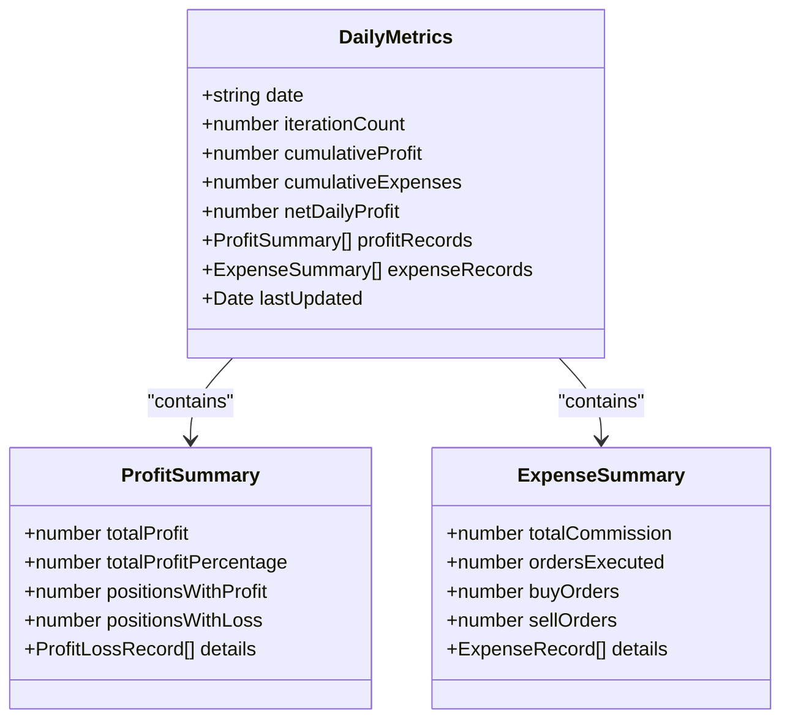
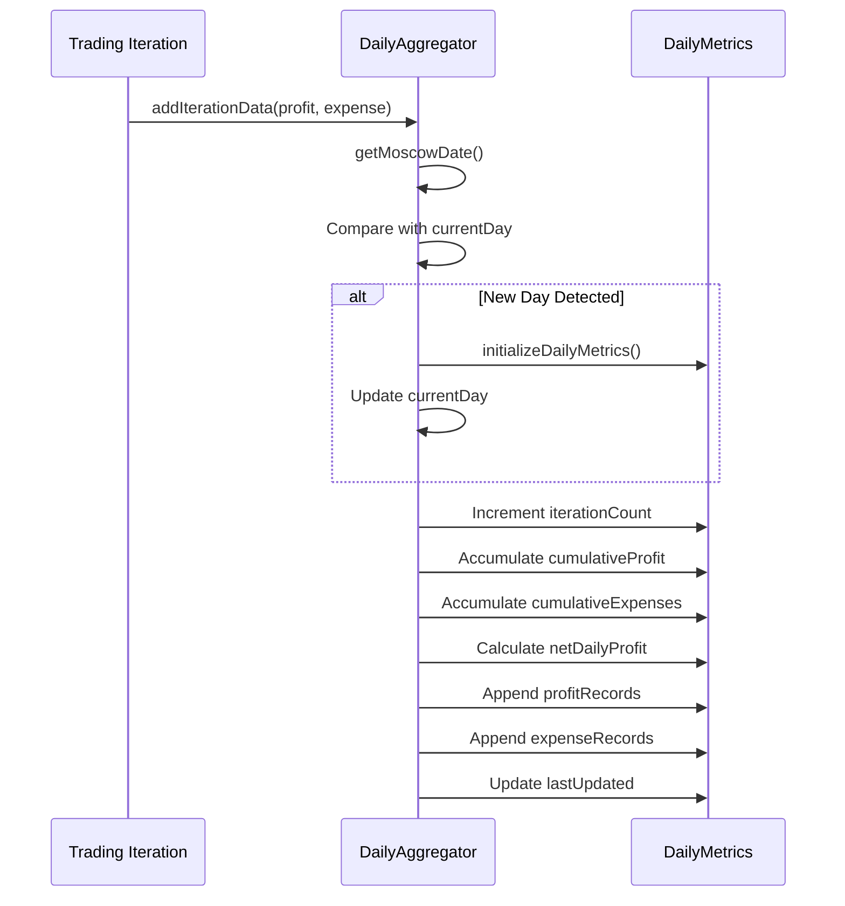
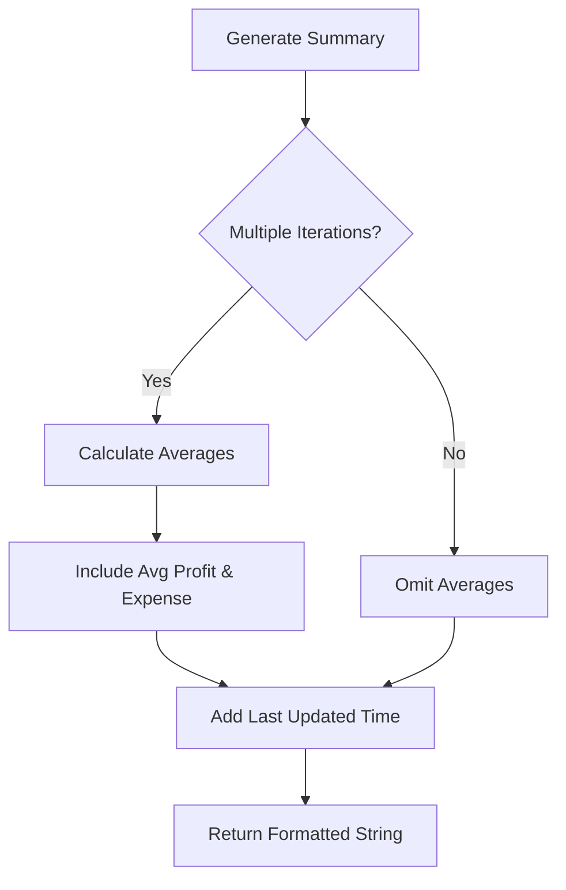
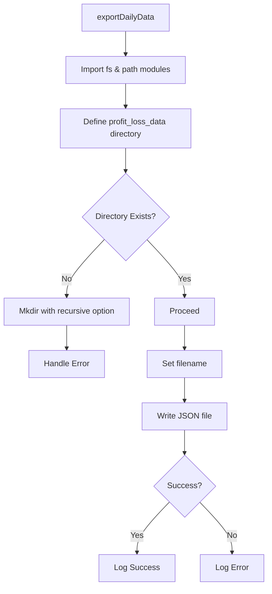

# Daily Aggregation

<cite>
**Referenced Files in This Document **   
- [src/dailyAggregator/index.ts](file://src/dailyAggregator/index.ts)
- [test/dailyAggregator.test.ts](file://test/dailyAggregator.test.ts)
</cite>

## Table of Contents
1. [Introduction](#introduction)
2. [Core Functionality](#core-functionality)
3. [Data Structure and Metrics](#data-structure-and-metrics)
4. [Daily Aggregation Logic](#daily-aggregation-logic)
5. [Time-Series Data Management](#time-series-data-management)
6. [Report Generation and Formatting](#report-generation-and-formatting)
7. [Data Persistence and Export](#data-persistence-and-export)
8. [Integration with External Analytics Tools](#integration-with-external-analytics-tools)
9. [Data Integrity Validation](#data-integrity-validation)
10. [Performance Considerations](#performance-considerations)

## Introduction
The dailyAggregator module serves as a central component for summarizing daily portfolio activity within the Tinkoff Invest ETF Balancer Bot. It collects, aggregates, and processes financial data from trading iterations to provide comprehensive insights into executed trades, associated costs, and performance changes. The module is designed to support long-term analysis by structuring time-series data in a consistent format that enables historical reporting and strategy evaluation.

**Section sources**
- [src/dailyAggregator/index.ts](file://src/dailyAggregator/index.ts#L1-L152)

## Core Functionality
The DailyAggregator class captures key financial metrics after each rebalancing iteration, including profit summaries and expense records. It maintains a running tally of cumulative profits, expenses, and net daily profit while tracking the number of completed iterations. The module automatically detects new trading days based on Moscow timezone (UTC+3) and resets its state accordingly, ensuring accurate daily boundaries for reporting purposes.



**Diagram sources**
- [src/dailyAggregator/index.ts](file://src/dailyAggregator/index.ts#L73-L101)

**Section sources**
- [src/dailyAggregator/index.ts](file://src/dailyAggregator/index.ts#L50-L101)

## Data Structure and Metrics
The module uses the DailyMetrics interface to define its core data structure, which includes both summary statistics and detailed records. Each day's data contains the date in YYYY-MM-DD format (Moscow timezone), iteration count, cumulative profit and expenses, net daily profit, arrays of profit and expense records, and a timestamp of the last update. This structure enables both high-level overview reporting and granular analysis of individual trading activities.



**Diagram sources**
- [src/dailyAggregator/index.ts](file://src/dailyAggregator/index.ts#L6-L15)
- [src/profitCalculator/index.ts](file://src/profitCalculator/index.ts#L15-L21)
- [src/expenseTracker/index.ts](file://src/expenseTracker/index.ts#L14-L20)

**Section sources**
- [src/dailyAggregator/index.ts](file://src/dailyAggregator/index.ts#L6-L15)

## Daily Aggregation Logic
The aggregation process begins with timezone-aware date detection using Moscow time (UTC+3). When addIterationData() is called with profit and expense summaries, the system first checks if a new trading day has begun. If so, it resets all metrics to initialize a fresh daily record. Otherwise, it increments counters and accumulates values from the current iteration. The net daily profit is calculated as the difference between cumulative profit and expenses, providing an immediate view of overall performance.



**Diagram sources**
- [src/dailyAggregator/index.ts](file://src/dailyAggregator/index.ts#L73-L101)

**Section sources**
- [src/dailyAggregator/index.ts](file://src/dailyAggregator/index.ts#L73-L101)

## Time-Series Data Management
The module structures time-series data by maintaining separate daily records that can be exported and archived for long-term analysis. Each day's data is self-contained with complete profit and expense records, enabling retrospective analysis of trading patterns and performance trends. The use of standardized JSON format facilitates easy parsing and integration with external analytics platforms for trend identification and strategy optimization over extended periods.

**Section sources**
- [src/dailyAggregator/index.ts](file://src/dailyAggregator/index.ts#L131-L152)

## Report Generation and Formatting
The dailyAggregator provides multiple formatting options for generating human-readable reports. The formatDailySummary() method produces a concise overview showing key metrics with visual indicators (green/red emojis) reflecting profitability status. For more detailed analysis, formatDetailedDailySummary() includes average profit and expense per iteration when multiple transactions have occurred, along with the exact time of the last update in Moscow time. These formatted outputs are suitable for logging, notifications, or direct presentation to users.



**Diagram sources**
- [src/dailyAggregator/index.ts](file://src/dailyAggregator/index.ts#L103-L129)

**Section sources**
- [src/dailyAggregator/index.ts](file://src/dailyAggregator/index.ts#L103-L129)

## Data Persistence and Export
To ensure data durability, the module supports persistent storage through the exportDailyData() method. This asynchronous function writes the current day's metrics to a JSON file in the 'profit_loss_data' directory, creating the directory if it doesn't exist. Files are named using the date (YYYY-MM-DD.json) and stored in the project's root directory. Custom file paths can be specified, allowing flexible integration with different storage architectures or backup systems.



**Diagram sources**
- [src/dailyAggregator/index.ts](file://src/dailyAggregator/index.ts#L131-L152)

**Section sources**
- [src/dailyAggregator/index.ts](file://src/dailyAggregator/index.ts#L131-L152)

## Integration with External Analytics Tools
While the core module focuses on data collection and basic formatting, its JSON-based export functionality enables seamless integration with external analytics tools. The structured format of the exported data allows for easy ingestion into business intelligence platforms, statistical analysis software, or custom visualization dashboards. The inclusion of detailed profit and expense records provides sufficient granularity for advanced analytics, machine learning models, or compliance reporting requirements.

**Section sources**
- [src/dailyAggregator/index.ts](file://src/dailyAggregator/index.ts#L131-L152)

## Data Integrity Validation
The module incorporates several mechanisms to ensure data integrity. Unit tests validate that aggregation logic correctly handles various scenarios, including profit accumulation, loss processing, and record storage. The deep copy returned by getDailyMetrics() prevents external modification of internal state. Additionally, error handling during file operations ensures that failed exports do not compromise the in-memory data, maintaining consistency even in adverse conditions.

```mermaid
testcase[Test Cases] {
testcase("addIterationData - Correct Aggregation") {
Given two profitable iterations
When data is added
Then cumulative values should match expected totals
}
testcase("addIterationData - Loss Handling") {
Given mixed profit/loss iterations
When data is added
Then net profit calculation should be correct
}
testcase("formatDailySummary - Visual Indicators") {
Given positive net profit
When formatting summary
Then output should contain green emoji indicator
}
}
```

**Section sources**
- [test/dailyAggregator.test.ts](file://test/dailyAggregator.test.ts#L0-L154)

## Performance Considerations
The dailyAggregator is optimized for efficiency in processing large volumes of historical data. By maintaining only the current day's data in memory and exporting completed days to disk, it minimizes memory footprint. The use of simple arithmetic operations and shallow object copying ensures fast execution even with frequent updates. For applications requiring analysis of extensive historical datasets, the modular design allows for external processing without impacting the real-time aggregation performance of the bot.

**Section sources**
- [src/dailyAggregator/index.ts](file://src/dailyAggregator/index.ts#L73-L101)
- [src/dailyAggregator/index.ts](file://src/dailyAggregator/index.ts#L131-L152)