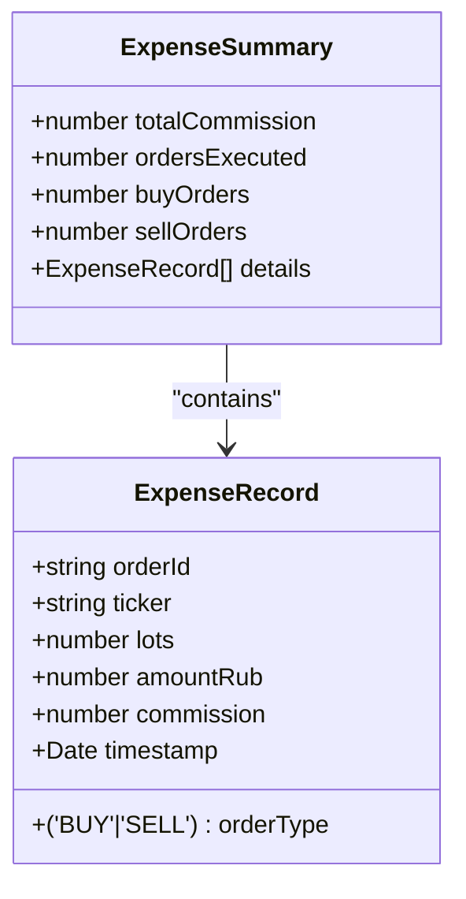
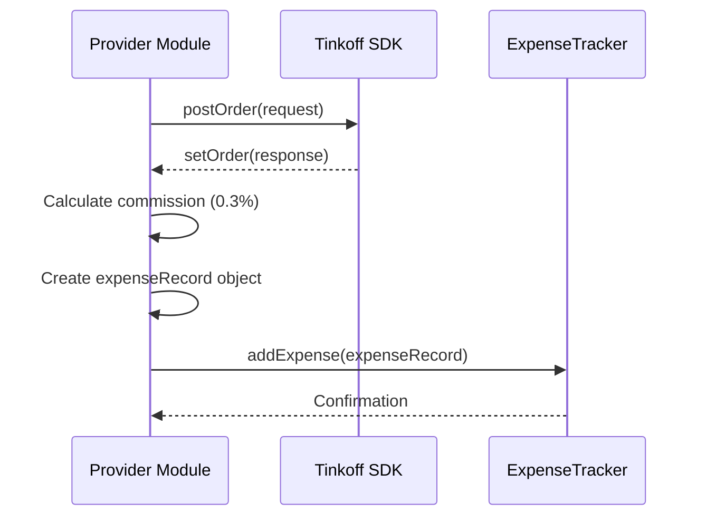
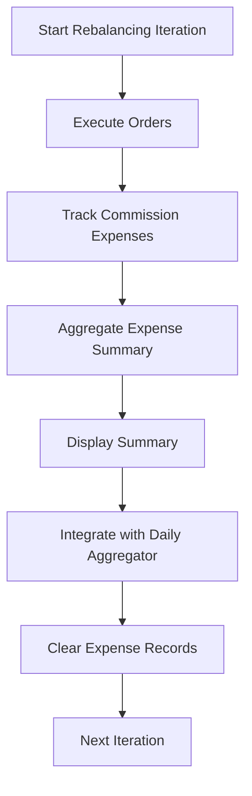
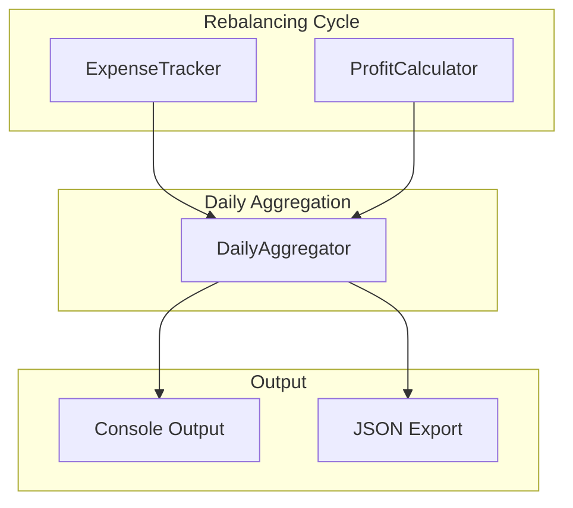

# Expense Tracking

<cite>
**Referenced Files in This Document**   
- [index.ts](file://src/expenseTracker/index.ts)
- [index.ts](file://src/provider/index.ts)
- [index.ts](file://src/dailyAggregator/index.ts)
- [index.ts](file://src/profitCalculator/index.ts)
- [expenseTracker.test.ts](file://test/expenseTracker.test.ts)
</cite>

## Table of Contents
1. [Introduction](#introduction)
2. [Core Components](#core-components)
3. [Expense Data Structure](#expense-data-structure)
4. [Integration with Provider Module](#integration-with-provider-module)
5. [Persistence and Aggregation](#persistence-and-aggregation)
6. [Usage Patterns: Dry-Run vs Live Execution](#usage-patterns-dry-run-vs-live-execution)
7. [Configuration and Customization](#configuration-and-customization)
8. [Reconciliation Methods](#reconciliation-methods)
9. [Accuracy Considerations](#accuracy-considerations)

## Introduction

The expenseTracker module is a critical component of the Tinkoff Invest ETF Balancer Bot, responsible for capturing and managing transaction costs, fees, and other portfolio-related expenses during rebalancing operations. This documentation provides comprehensive insight into how the system tracks real trading costs from executed orders through integration with the provider module, stores expense records, and enables users to analyze cumulative expenses over time.

The module operates as a singleton instance throughout the application lifecycle, ensuring consistent expense tracking across all rebalancing iterations. It captures commission-based expenses from market orders executed via the Tinkoff API and provides formatted summaries that integrate with daily performance reporting. The design emphasizes transparency, accuracy, and ease of reconciliation against actual broker statements.

## Core Components

The expenseTracker module consists of three primary components: the `ExpenseRecord` interface defining individual expense entries, the `ExpenseSummary` interface aggregating multiple expenses, and the `ExpenseTracker` class implementing core functionality. These components work together to capture transaction details, calculate summary statistics, and provide human-readable output formats.

The module integrates seamlessly with the bot's execution workflow, particularly during order processing in the provider module. When market orders are successfully executed, commission expenses are calculated based on transaction value and recorded as expense events. The tracker maintains state within each rebalancing iteration and clears records appropriately to prevent cross-iteration contamination.

**Section sources**
- [index.ts](file://src/expenseTracker/index.ts#L4-L80)

## Expense Data Structure

### Expense Record Schema

The expense tracking system uses a well-defined data structure to capture essential transaction details:

| Field | Type | Description |
|-------|------|-------------|
| orderId | string | Unique identifier for the associated order |
| ticker | string | Financial instrument symbol (e.g., TMOS, TRUR) |
| orderType | 'BUY' \| 'SELL' | Direction of the trade |
| lots | number | Quantity of lots traded |
| amountRub | number | Total transaction value in Russian Rubles |
| commission | number | Calculated commission fee in RUB |
| timestamp | Date | Date and time when expense was recorded |

This structure ensures comprehensive capture of transaction metadata necessary for accurate cost accounting and subsequent analysis.

### Summary Aggregation

The system aggregates individual expense records into summary objects containing both quantitative metrics and detailed breakdowns:



**Diagram sources**
- [index.ts](file://src/expenseTracker/index.ts#L4-L20)

**Section sources**
- [index.ts](file://src/expenseTracker/index.ts#L4-L20)

## Integration with Provider Module

The expenseTracker integrates directly with the provider module to record real trading costs from executed orders. This integration occurs within the `generateOrder` function, which handles the placement of market orders and subsequent expense tracking.

When an order is successfully placed through the Tinkoff API, the system calculates the commission based on standard brokerage rates (0.3% for market orders) and creates an expense record containing all relevant transaction details. The integration follows a precise sequence:

1. Order execution via Tinkoff API
2. Commission calculation based on transaction value
3. Creation of structured expense record
4. Registration with global expenseTracker instance



**Diagram sources**
- [index.ts](file://src/provider/index.ts#L250-L280)

**Section sources**
- [index.ts](file://src/provider/index.ts#L250-L280)

## Persistence and Aggregation

### Iteration-Based Lifecycle Management

The expense tracking system implements a clear lifecycle management strategy tied to rebalancing iterations. At the conclusion of each iteration, expenses are aggregated, reported, and cleared to prepare for the next cycle:



The `clearIterationExpenses()` method resets the internal collection after summary generation, ensuring isolation between consecutive rebalancing cycles.

### Daily Aggregation Pipeline

Expense data flows into the daily aggregation system alongside profit calculations, enabling comprehensive performance reporting:



The daily aggregator combines expense and profit data to calculate net daily performance metrics, providing users with holistic insights into their portfolio's financial health.

**Diagram sources**
- [index.ts](file://src/dailyAggregator/index.ts#L17-L149)
- [index.ts](file://src/expenseTracker/index.ts#L22-L77)
- [index.ts](file://src/profitCalculator/index.ts#L23-L119)

**Section sources**
- [index.ts](file://src/dailyAggregator/index.ts#L17-L149)
- [index.ts](file://src/expenseTracker/index.ts#L22-L77)
- [index.ts](file://src/profitCalculator/index.ts#L23-L119)

## Usage Patterns: Dry-Run vs Live Execution

The expense tracking system behaves differently depending on execution mode, providing valuable feedback while maintaining operational integrity.

### Live Execution Mode

In live execution mode, the system captures actual commission expenses from executed trades. Each successful order placement triggers expense recording with real monetary values. The tracker provides immediate feedback through debug logs and final summary reports displayed in the console output.

### Dry-Run Mode

During dry-run operations (when exchange is closed or configured for simulation), no actual orders are placed, and consequently, no real commissions are incurred. In this mode:
- The `addExpense()` method is not called
- Expense summaries show zero values
- The system accurately reflects the absence of transaction costs
- Users receive clear indication that no expenses were recorded

This behavior ensures that simulated runs do not contaminate expense data with hypothetical values, maintaining the integrity of financial reporting.

**Section sources**
- [index.ts](file://src/provider/index.ts#L750-L850)

## Configuration and Customization

While the current implementation uses a fixed commission rate of 0.3% (standard Tinkoff market order fee), the modular design allows for potential customization through configuration. Although explicit configuration options for custom cost tracking are not currently exposed in the codebase, the architecture supports extension points for:

- Variable commission rates based on account tier
- Different fee structures for BUY vs SELL transactions
- Custom expense categories beyond commissions
- Integration with external fee schedule APIs

The separation of expense calculation logic within the provider module makes it feasible to introduce configuration-driven commission models without modifying the core expenseTracker implementation.

**Section sources**
- [index.ts](file://src/provider/index.ts#L270-L275)

## Reconciliation Methods

The system facilitates reconciliation against actual broker statements through several mechanisms:

### Structured Data Output

Each expense record contains sufficient information to match against broker-provided transaction histories:
- Unique orderId matching Tinkoff order identifiers
- Precise timestamp alignment with trade execution times
- Clear distinction between BUY and SELL operations
- Exact commission amounts calculated at 0.3%

### Comprehensive Reporting

The formatted output provides both summary and detailed views of expenses:

```text
💰 Expense Summary:
  Total Commission: 45.00 RUB
  Orders Executed: 2 (1 buy, 1 sell)

💰 Detailed Expenses:
  🔵 TMOS: BUY 10 lots - Commission: 30.00 RUB
  🔴 TRUR: SELL 5 lots - Commission: 15.00 RUB
  ─────────────────────
  Total Commission: 45.00 RUB
```

Users can export daily metrics to JSON files for long-term storage and external analysis, enabling systematic comparison with official broker statements.

**Section sources**
- [index.ts](file://src/expenseTracker/index.ts#L50-L77)
- [index.ts](file://src/dailyAggregator/index.ts#L130-L152)

## Accuracy Considerations

The expense tracking system maintains high accuracy through several design principles:

### Real-Time Capture
Expenses are recorded immediately upon successful order execution, minimizing timing discrepancies and ensuring complete capture of all transactions.

### Standardized Calculation
Using the published Tinkoff commission rate of 0.3% for market orders ensures consistency with actual billing practices.

### Data Integrity
The system only records expenses for successfully executed orders, preventing phantom charges from failed or rejected transactions.

### Precision Handling
All monetary values are stored as floating-point numbers with appropriate rounding applied only for display purposes, preserving calculation accuracy.

### Debug Verification
Comprehensive debug logging allows developers to verify expense calculations and track the flow of commission data through the system.

Potential limitations include the assumption of a uniform 0.3% rate regardless of account type or volume discounts, and the lack of support for alternative order types that may have different fee structures.

**Section sources**
- [index.ts](file://src/provider/index.ts#L270-L275)
- [index.ts](file://src/expenseTracker/index.ts#L30-L40)