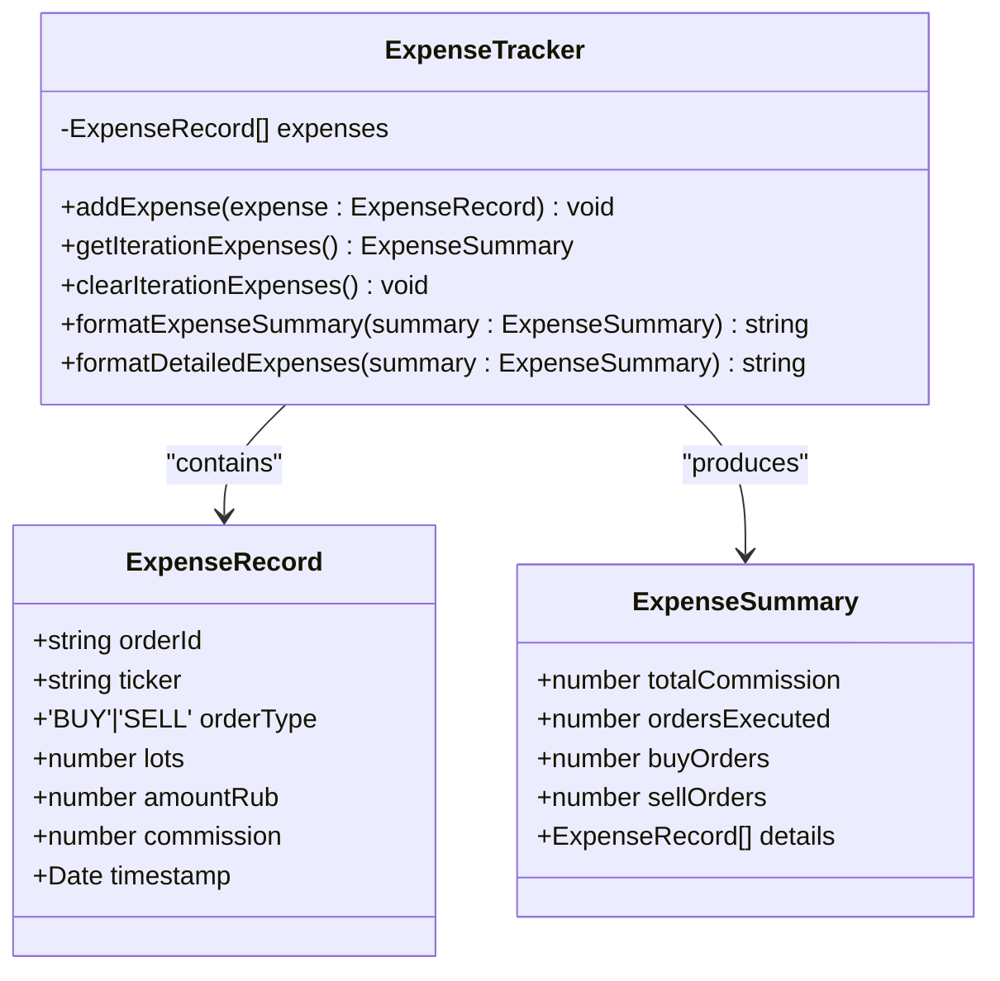
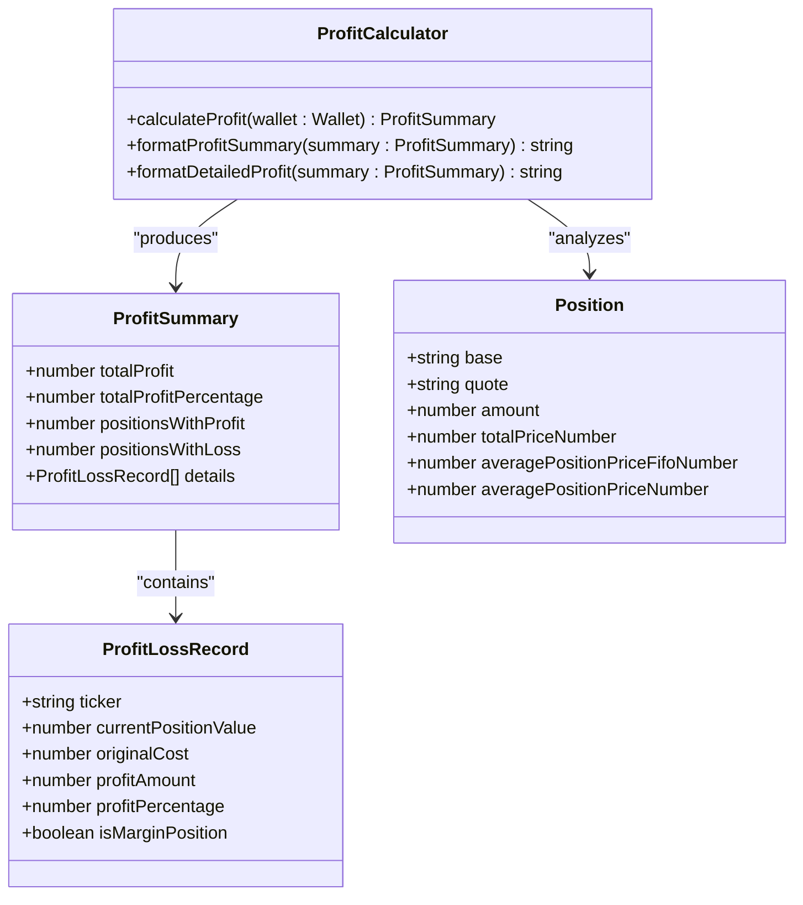
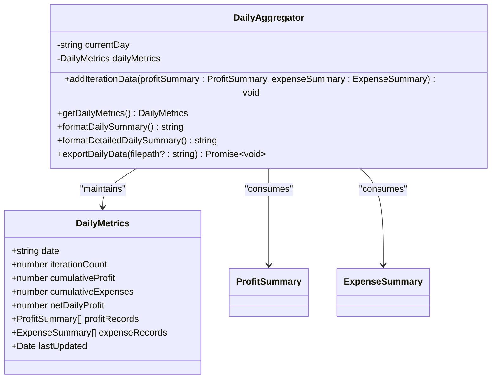
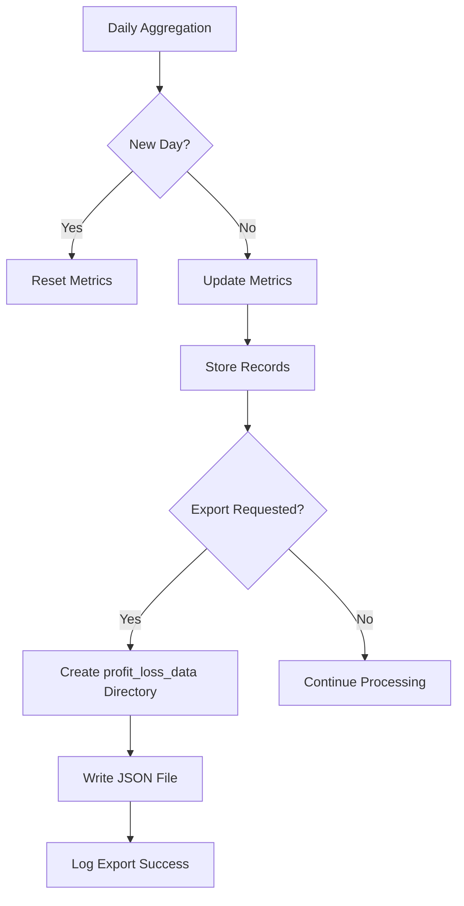

# Monitoring and Reporting

<cite>
**Referenced Files in This Document**   
- [expenseTracker/index.ts](file://src/expenseTracker/index.ts)
- [profitCalculator/index.ts](file://src/profitCalculator/index.ts)
- [dailyAggregator/index.ts](file://src/dailyAggregator/index.ts)
- [types.d.ts](file://src/types.d.ts)
</cite>

## Table of Contents
1. [Introduction](#introduction)
2. [Expense Tracking System](#expense-tracking-system)
3. [Profit Calculation Methodology](#profit-calculation-methodology)
4. [Daily Aggregation and Time-Series Analysis](#daily-aggregation-and-time-series-analysis)
5. [Data Output Formats and Storage](#data-output-formats-and-storage)
6. [Performance Evaluation and Strategy Optimization](#performance-evaluation-and-strategy-optimization)
7. [Integration and Reconciliation](#integration-and-reconciliation)

## Introduction
The monitoring and reporting system in the Tinkoff Invest ETF Balancer Bot provides comprehensive financial tracking capabilities through three core components: expenseTracker, profitCalculator, and dailyAggregator. These modules work together to capture transaction costs, calculate portfolio performance, and generate time-series data for long-term analysis. The system is designed to provide accurate, real-time insights into trading activities while maintaining detailed records for historical evaluation and strategy optimization.

## Expense Tracking System

The expenseTracker module captures all transaction costs and fees associated with trading activities. It maintains a record of each order's commission, which is essential for accurate profit calculation and performance evaluation.

**Diagram sources**
- [expenseTracker/index.ts](file://src/expenseTracker/index.ts#L4-L20)

**Section sources**
- [expenseTracker/index.ts](file://src/expenseTracker/index.ts#L22-L77)

### Transaction Cost Capture
The system captures transaction costs through the `addExpense` method, which records key details including:
- Order ID and ticker symbol
- Order type (BUY/SELL)
- Number of lots executed
- Total amount in RUB
- Commission fee charged
- Timestamp of execution

Each expense is stored in memory during the current iteration and can be retrieved as a summarized report through the `getIterationExpenses` method. The tracker distinguishes between buy and sell orders, providing granular insight into trading activity patterns.

### Data Storage and Lifecycle
Expense records are maintained in an array within the ExpenseTracker instance. At the end of each iteration, the summary data is passed to the dailyAggregator for cumulative tracking, and the individual expense records are cleared via `clearIterationExpenses` to prepare for the next cycle. This design ensures memory efficiency while preserving aggregated cost data for long-term analysis.

## Profit Calculation Methodology

The profitCalculator determines both realized and unrealized gains across the portfolio using FIFO (First-In, First-Out) costing methodology when available, falling back to average cost basis when FIFO data is unavailable.

**Diagram sources**
- [profitCalculator/index.ts](file://src/profitCalculator/index.ts#L6-L21)
- [types.d.ts](file://src/types.d.ts#L6-L31)

**Section sources**
- [profitCalculator/index.ts](file://src/profitCalculator/index.ts#L23-L119)

### Realized and Unrealized Gains Calculation
The profit calculation process follows these steps:
1. For each position in the wallet, skip currency pairs where base equals quote
2. Determine the ticker symbol using normalization
3. Calculate original cost using FIFO price if available, otherwise use average position price
4. Compute current position value from market data
5. Derive profit amount and percentage
6. Track margin positions separately

The system handles both realized gains (from closed positions) and unrealized gains (from open positions) in a single calculation, providing a comprehensive view of portfolio performance.

### Accuracy Considerations
The calculator prioritizes accuracy by:
- Using FIFO costing when available for more precise tax calculations
- Falling back to average cost basis when FIFO data is missing
- Skipping positions without sufficient pricing data
- Properly handling margin positions that may have negative values
- Normalizing ticker symbols for consistent reporting

## Daily Aggregation and Time-Series Analysis

The dailyAggregator consolidates performance data across iterations, creating time-series metrics for daily evaluation and long-term trend analysis.

**Diagram sources**
- [dailyAggregator/index.ts](file://src/dailyAggregator/index.ts#L6-L15)
- [profitCalculator/index.ts](file://src/profitCalculator/index.ts#L15-L21)
- [expenseTracker/index.ts](file://src/expenseTracker/index.ts#L14-L20)

**Section sources**
- [dailyAggregator/index.ts](file://src/dailyAggregator/index.ts#L17-L149)

### Daily Metrics Collection
The aggregator automatically detects new trading days based on Moscow timezone (UTC+3) and resets its metrics accordingly. For each iteration, it:
- Increments the iteration counter
- Accumulates total profit and expenses
- Calculates net daily profit
- Stores detailed profit and expense records
- Updates the last updated timestamp

This ensures clean separation of daily performance data while maintaining continuity within each trading day.

### Time-Series Data Generation
The system generates time-series data by storing complete profit and expense records for each iteration. This enables:
- Historical performance comparison
- Trend analysis over multiple days
- Identification of optimal trading times
- Evaluation of strategy effectiveness under different market conditions

## Data Output Formats and Storage

The monitoring system provides multiple output formats for different use cases, from human-readable summaries to structured data files.

### Formatted Output Methods
Each component provides formatting methods that generate human-readable strings with emoji indicators:

- **ExpenseTracker**: Produces expense summaries showing total commissions, order counts, and detailed breakdowns
- **ProfitCalculator**: Generates profit/loss summaries with color-coded indicators for positive/negative performance
- **DailyAggregator**: Creates comprehensive daily reports including averages per iteration and last update time

These formatted outputs are designed for logging and notification systems, making performance data easily interpretable at a glance.

### Persistent Storage Mechanism
The dailyAggregator includes built-in persistence capabilities through its `exportDailyData` method:

**Diagram sources**
- [dailyAggregator/index.ts](file://src/dailyAggregator/index.ts#L127-L148)

The system exports daily metrics as JSON files in the `profit_loss_data` directory, named by date (YYYY-MM-DD.json). Each file contains complete structured data including:
- Date in Moscow timezone
- Iteration count
- Cumulative profit and expenses
- Net daily profit
- Arrays of profit and expense records
- Last updated timestamp

This structured format enables easy import into external analytics tools for deeper analysis.

## Performance Evaluation and Strategy Optimization

Users can analyze historical performance and optimize strategies using the comprehensive metrics provided by the monitoring system.

### Key Performance Indicators
The system tracks several critical KPIs:
- **Net Daily Profit**: Primary measure of daily performance
- **Commission Efficiency**: Ratio of profits to transaction costs
- **Win Rate**: Percentage of positions with profit vs. loss
- **Average Profit per Iteration**: Consistency of performance
- **Order Execution Frequency**: Trading activity level

These metrics enable users to evaluate strategy effectiveness and identify areas for improvement.

### Strategy Optimization Examples
Based on the collected metrics, users can:
- Adjust rebalancing frequency based on commission impact
- Modify position sizing to improve profit-to-cost ratios
- Identify high-performing assets for increased allocation
- Evaluate the effectiveness of margin trading strategies
- Optimize timing of executions based on daily performance patterns

The time-series nature of the data allows for statistical analysis of performance trends and seasonality effects.

## Integration and Reconciliation

While the current implementation focuses on internal tracking, the structured data output enables integration with external analytics tools and reconciliation processes.

### External Analytics Integration
The JSON export format is compatible with various analytics platforms:
- Import into spreadsheet software (Excel, Google Sheets) for custom analysis
- Load into business intelligence tools (Tableau, Power BI) for visualization
- Process with data science libraries (Python pandas, R) for statistical modeling
- Ingest into database systems for long-term storage and querying

The standardized structure ensures seamless interoperability with external systems.

### Reconciliation Methods
To reconcile against broker statements:
1. Compare daily net profit figures with official statements
2. Verify commission totals match brokerage fees
3. Cross-check position valuations using closing prices
4. Validate transaction counts and types (buy/sell)

The detailed record-keeping in the system supports thorough reconciliation, with the `orderId` field in expense records enabling direct matching with broker transaction IDs when available.

The system's accuracy is enhanced by using FIFO costing methodology and precise Moscow timezone calculations, minimizing discrepancies that could arise from timing or accounting method differences.