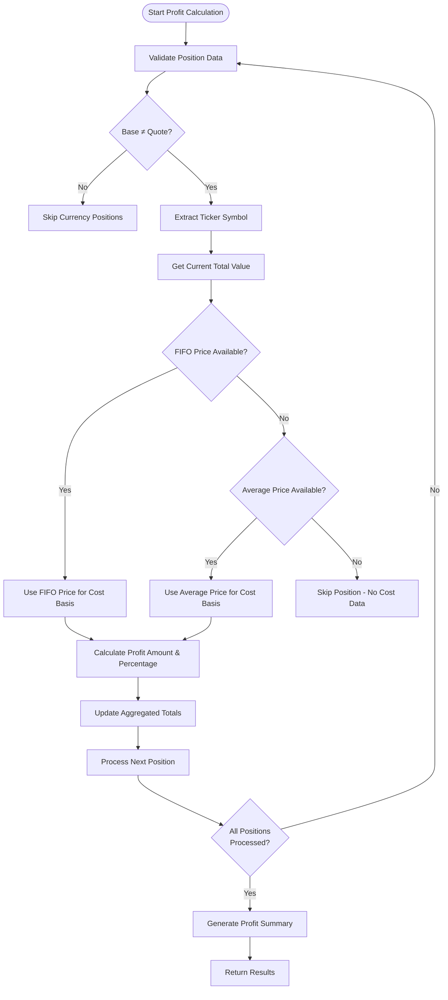
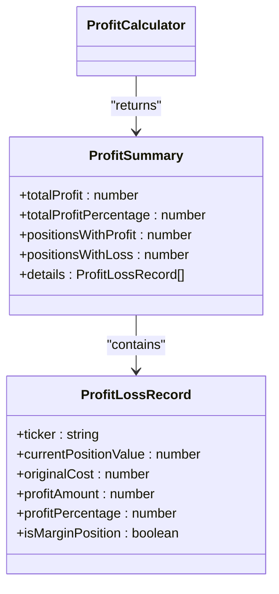

# Profit Calculation

<cite>
**Referenced Files in This Document**   
- [index.ts](file://src/profitCalculator/index.ts)
- [test.ts](file://test/profitCalculator.test.ts)
- [types.d.ts](file://src/types.d.ts)
</cite>

## Table of Contents
1. [Introduction](#introduction)
2. [Profit Calculation Methodology](#profit-calculation-methodology)
3. [Position Data Requirements](#position-data-requirements)
4. [Output Format and Reporting](#output-format-and-reporting)
5. [Edge Case Handling](#edge-case-handling)
6. [Integration with Trading Logic](#integration-with-trading-logic)
7. [Practical Examples](#practical-examples)

## Introduction
The profitCalculator module provides comprehensive profit and loss tracking for investment positions within the Tinkoff Invest ETF Balancer Bot. It calculates both realized and unrealized gains by comparing current market values against historical purchase costs, enabling users to monitor portfolio performance accurately. The module processes position data from the Tinkoff API and integrates with the balancer's transaction logs to provide detailed financial insights across various timeframes.

## Profit Calculation Methodology

The ProfitCalculator class implements a systematic approach to determine profitability by analyzing position data from the user's wallet. For each position, it computes the original cost basis using either FIFO (First-In, First-Out) pricing or average price data, then compares this against the current market value to determine profit or loss.

The calculation follows these steps:
1. Extract position details including ticker symbol, current total value, and quantity
2. Determine original cost using available pricing data (FIFO preferred over average)
3. Calculate profit amount as the difference between current value and original cost
4. Compute profit percentage relative to the original investment
5. Aggregate results across all positions to generate portfolio-level metrics

**Diagram sources**
- [index.ts](file://src/profitCalculator/index.ts#L24-L87)

**Section sources**
- [index.ts](file://src/profitCalculator/index.ts#L24-L87)

## Position Data Requirements

The profit calculator relies on accurate position data from the Tinkoff API, specifically requiring certain fields to perform valid calculations. The system prioritizes data quality and availability, implementing fallback mechanisms when primary data points are missing.

### Required Position Attributes
The following attributes from the Position interface are essential for profit calculation:

<table>
  <tr>
    <th>Attribute</th>
    <th>Description</th>
    <th>Usage in Calculation</th>
  </tr>
  <tr>
    <td>base</td>
    <td>Ticker symbol of the asset</td>
    <td>Identifies the security being analyzed</td>
  </tr>
  <tr>
    <td>quote</td>
    <td>Currency denomination</td>
    <td>Determines if position is currency (base=quote)</td>
  </tr>
  <tr>
    <td>amount</td>
    <td>Quantity held</td>
    <td>Multiplied by price to determine total cost/value</td>
  </tr>
  <tr>
    <td>totalPriceNumber</td>
    <td>Current market value in RUB</td>
    <td>Serves as current position value</td>
  </tr>
  <tr>
    <td>averagePositionPriceFifoNumber</td>
    <td>FIFO purchase price per unit</td>
    <td>Preferred method for determining original cost</td>
  </tr>
  <tr>
    <td>averagePositionPriceNumber</td>
    <td>Average purchase price per unit</td>
    <td>Fallback method when FIFO data unavailable</td>
  </tr>
</table>

The system implements a hierarchical approach to cost basis determination, preferring FIFO pricing which more accurately reflects actual purchase costs, especially for assets acquired through multiple transactions at different prices. When FIFO data is unavailable, the system falls back to average price data. If neither pricing method is available, the position is excluded from profit calculations to maintain accuracy.

**Section sources**
- [index.ts](file://src/profitCalculator/index.ts#L37-L65)
- [types.d.ts](file://src/types.d.ts#L6-L31)

## Output Format and Reporting

The profit calculator generates structured output through two primary formatting methods that present results in human-readable formats suitable for display and analysis.

### Summary Report Structure
The formatProfitSummary method produces a concise overview of portfolio performance:

**Diagram sources**
- [index.ts](file://src/profitCalculator/index.ts#L9-L22)

The formatted output includes:
- Total profit/loss amount in RUB with directional indicator (+/-)
- Overall profit percentage relative to initial investment
- Count of positions currently in profit versus those at a loss
- Visual indicators (🟢/🔴) denoting overall portfolio direction

### Detailed Position Analysis
The formatDetailedProfit method provides granular insights into individual position performance, sorting results by profit amount in descending order. Each entry includes:
- Asset ticker symbol
- Profit/loss amount in RUB with directional sign
- Profit/loss percentage relative to cost basis
- Directional emoji (📈 for gains, 📉 for losses)
- [MARGIN] designation for margin positions

This detailed view enables users to identify top-performing assets and assess the contribution of each holding to overall portfolio returns.

**Section sources**
- [index.ts](file://src/profitCalculator/index.ts#L89-L118)

## Edge Case Handling

The profit calculator implements robust handling of various edge cases to ensure reliable operation under diverse market conditions and data scenarios.

### Special Position Types
The system explicitly handles several special case scenarios:

**Currency Positions**: Positions where base currency equals quote currency (e.g., RUB/RUB) are excluded from profit calculations as they represent cash holdings rather than investments with potential appreciation.

**Missing Cost Data**: When neither FIFO nor average price data is available, the position is skipped entirely to prevent inaccurate calculations. This ensures that only positions with verifiable cost basis contribute to the overall profit summary.

**Margin Positions**: Identified by negative current value (currentPositionValue < 0), these positions are flagged in the output but calculated using the same methodology as regular positions.

### Data Quality Considerations
The implementation includes safeguards against common data issues:
- Zero or negative amounts are handled gracefully
- Missing price data results in exclusion rather than erroneous calculation
- Floating-point precision issues are managed through appropriate rounding
- Invalid or corrupted position records are filtered out during processing

These measures ensure the reliability and accuracy of profit calculations even when dealing with imperfect data from external APIs.

**Section sources**
- [index.ts](file://src/profitCalculator/index.ts#L30-L35)
- [index.ts](file://src/profitCalculator/index.ts#L58-L65)
- [test.ts](file://test/profitCalculator.test.ts#L65-L75)

## Integration with Trading Logic

The profit calculation functionality is deeply integrated with the bot's trading decision-making processes, particularly through the minimum profit threshold feature that governs position closing decisions.

### Minimum Profit Threshold Mechanism
The system supports configurable profit thresholds that determine whether a position can be sold:

- **Positive values** (e.g., 5): Only allow selling positions with at least X% profit
- **Negative values** (e.g., -3): Permit selling with maximum X% loss (stop-loss protection)
- **Zero** (0): Allow selling only at break-even or profit
- **Not specified**: Disable threshold checking

This mechanism prevents premature selling of positions that haven't met target returns while allowing strategic exits at controlled losses.

### Workflow Integration
The profit calculator is invoked at key points in the trading workflow:
1. After receiving updated position data from the Tinkoff API
2. Before and after rebalancing operations
3. During daily aggregation of performance metrics
4. When generating user-facing reports

The calculated profit information feeds into the decision engine that determines optimal trading actions, ensuring that profit targets and risk parameters are respected in automated trading decisions.

**Section sources**
- [index.ts](file://src/profitCalculator/index.ts#L24-L87)
- [readme.md](file://readme.md#L303-L324)

## Practical Examples

### Example 1: Basic Profit Calculation
Consider a position with the following characteristics:
- Ticker: TMOS
- Quantity: 10 shares
- FIFO purchase price: 1,000 RUB/share
- Current total value: 11,000 RUB

Original cost = 1,000 × 10 = 10,000 RUB  
Profit amount = 11,000 - 10,000 = 1,000 RUB  
Profit percentage = (1,000 ÷ 10,000) × 100 = 10%

This would be reported as a gain of 1,000 RUB (10%) in both summary and detailed views.

### Example 2: Portfolio-Level Aggregation
For a portfolio containing:
- TMOS: +1,000 RUB profit (10%)
- TRUR: +500 RUB profit (10%)

Total profit = 1,500 RUB  
Total original cost = 15,000 RUB  
Overall profit percentage = (1,500 ÷ 15,000) × 100 = 10%

The summary would show total profit of +1,500.00 RUB (+10.00%) with 2 positions in profit and 0 in loss.

### Example 3: Threshold-Based Decision Making
With min_profit_percent_for_close_position set to 5:
- Position A: Purchased at 100 RUB, current price 104 RUB → 4% profit → **blocked** from selling
- Position B: Purchased at 100 RUB, current price 106 RUB → 6% profit → **allowed** to sell

This demonstrates how the profit calculator enables intelligent trading decisions based on performance thresholds.

**Section sources**
- [test.ts](file://test/profitCalculator.test.ts#L10-L45)
- [readme.md](file://readme.md#L303-L324)