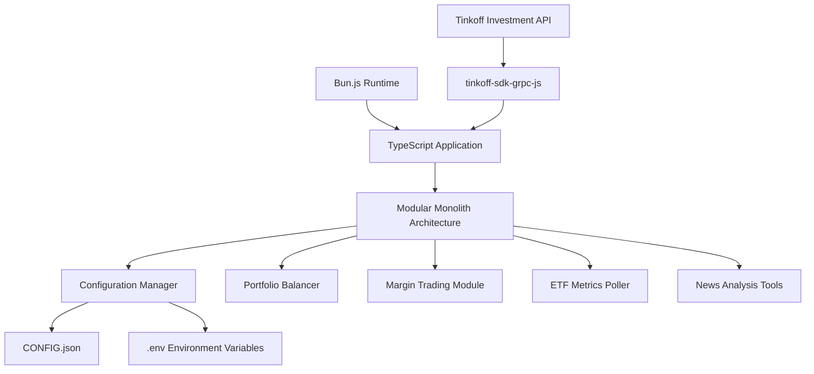
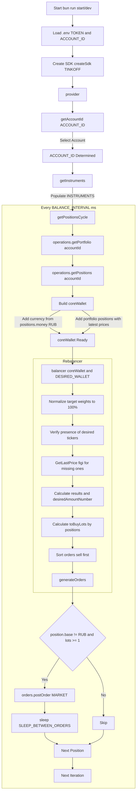
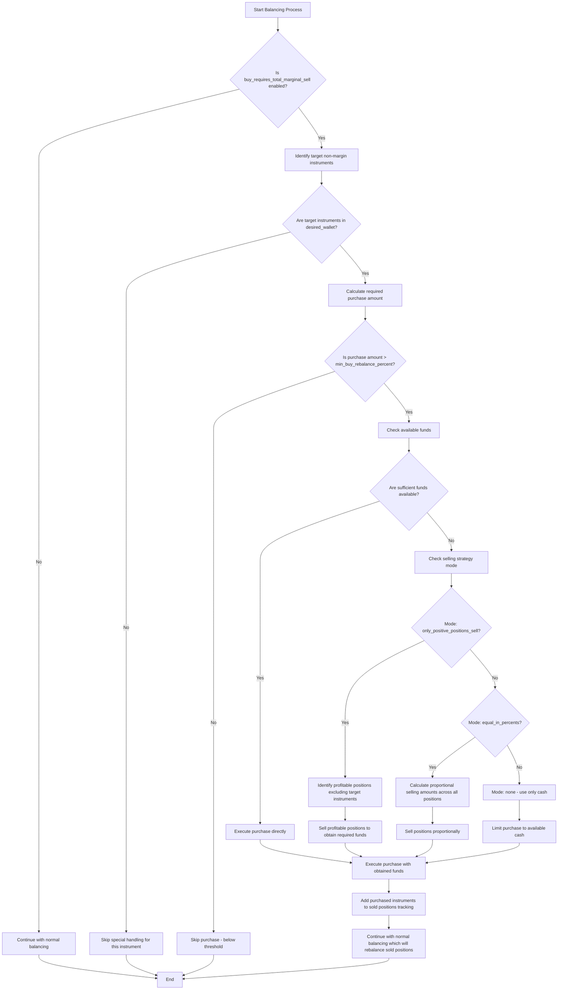

# Overview

<cite>
**Referenced Files in This Document **   
- [src/index.ts](file://src/index.ts)
- [CONFIG.example.json](file://CONFIG.example.json)
- [readme.md](file://readme.md)
- [README.config.md](file://README.config.md)
- [README.buy_requires_total_marginal_sell.md](file://README.buy_requires_total_marginal_sell.md)
- [README.margin_trading.md](file://README.margin_trading.md)
- [EXCHANGE_CLOSURE_IMPLEMENTATION.md](file://EXCHANGE_CLOSURE_IMPLEMENTATION.md)
- [src/configLoader.ts](file://src/configLoader.ts)
- [src/provider/index.ts](file://src/provider/index.ts)
</cite>

## Table of Contents
1. [Introduction](#introduction)
2. [Core Value Proposition](#core-value-proposition)
3. [Architectural Style and Technology Stack](#architectural-style-and-technology-stack)
4. [Primary Use Cases](#primary-use-cases)
5. [System Architecture and Data Flow](#system-architecture-and-data-flow)
6. [Key Features](#key-features)
7. [Prerequisites for Usage](#prerequisites-for-usage)
8. [Real-World Benefits](#real-world-benefits)

## Introduction

The Tinkoff Invest ETF Balancer Bot is an automated portfolio management tool designed to maintain optimal asset allocation across Tinkoff Investment accounts through intelligent, rule-based trading strategies. The system enables investors to automate the complex process of portfolio rebalancing, ensuring their investment portfolios remain aligned with target allocations despite market fluctuations. Built as a modular monolith in TypeScript, the bot integrates with the Tinkoff API via the tinkoff-sdk-grpc-js library, providing a robust foundation for executing sophisticated trading logic while maintaining code organization and testability.

**Section sources**
- [readme.md](file://readme.md#L0-L404)
- [src/index.ts](file://src/index.ts#L0-L65)

## Core Value Proposition

The primary value proposition of the Tinkoff Invest ETF Balancer Bot lies in its ability to automate portfolio rebalancing with precision and intelligence. Rather than requiring manual intervention to adjust holdings when market movements cause deviations from target allocations, the bot continuously monitors portfolio composition and executes trades to restore desired weightings. This automation eliminates emotional decision-making, ensures consistent strategy execution, and saves users significant time and effort. The system's rule-based approach allows for sophisticated trading logic that considers multiple factors including profit thresholds, margin requirements, and market conditions, enabling users to implement advanced investment strategies without constant oversight.

**Section sources**
- [readme.md](file://readme.md#L0-L404)
- [README.config.md](file://README.config.md#L0-L199)

## Architectural Style and Technology Stack

The Tinkoff Invest ETF Balancer Bot follows a modular monolith architecture implemented in TypeScript, leveraging modern JavaScript runtime environments for optimal performance. The application has been successfully migrated to Bun.js, which provides built-in TypeScript support, faster build times (20-30x improvement), fewer dependencies, and better ES module compatibility compared to traditional Node.js setups. The architecture centers around a configuration-driven design where all account settings are managed through a centralized CONFIG.json file, enabling support for multiple Tinkoff Investment accounts with distinct configurations. The system integrates with Tinkoff's investment platform through the tinkoff-sdk-grpc-js library, which facilitates secure communication for retrieving portfolio data, market information, and executing trades.

**Diagram sources **
- [readme.md](file://readme.md#L0-L404)
- [src/index.ts](file://src/index.ts#L0-L65)

**Section sources**
- [readme.md](file://readme.md#L0-L404)
- [README.bunjs.md](file://README.bunjs.md#L0-L40)

## Primary Use Cases

The Tinkoff Invest ETF Balancer Bot serves several key use cases for investors managing Tinkoff portfolios. The primary use case is portfolio rebalancing, where the bot automatically adjusts holdings to maintain user-defined target allocations across various ETFs and financial instruments. A secondary but important use case is margin trading management, allowing users to leverage borrowed funds according to configurable strategies while implementing risk controls. The system also supports expense tracking and performance analysis, providing insights into trading activities and portfolio evolution over time. Additionally, the bot includes tools for scraping and analyzing financial news from T-Bank ETF pages, enabling users to stay informed about relevant market developments that may impact their investments.

**Section sources**
- [readme.md](file://readme.md#L0-L404)
- [README.margin_trading.md](file://README.margin_trading.md#L0-L252)
- [README.poll_etf_metrics.md](file://README.poll_etf_metrics.md#L0-L59)

## System Architecture and Data Flow

The system architecture follows a clear data flow from configuration input to order execution. The process begins with loading configuration from CONFIG.json and environment variables, which define account parameters, target allocations, and trading rules. The bot then initializes the Tinkoff SDK with the appropriate authentication token and establishes connections to various API services for orders, operations, market data, and instruments. During each balancing cycle, the system retrieves the current portfolio state, calculates deviations from target allocations, determines necessary trades, and executes orders according to configured priorities and constraints. The architecture supports both continuous operation and one-time execution modes, with comprehensive logging and error handling throughout the workflow.

**Diagram sources **
- [readme.md](file://readme.md#L0-L404)
- [src/index.ts](file://src/index.ts#L0-L65)
- [src/provider/index.ts](file://src/provider/index.ts#L85-L106)

**Section sources**
- [readme.md](file://readme.md#L0-L404)
- [src/index.ts](file://src/index.ts#L0-L65)
- [src/provider/index.ts](file://src/provider/index.ts#L85-L106)

## Key Features

The Tinkoff Invest ETF Balancer Bot offers several sophisticated features that enhance its utility for investors. Multiple rebalancing modes allow users to choose between manual allocation, market capitalization-based weighting, assets under management (AUM) based allocation, or decorrelation strategies that adjust weights based on the difference between market cap and AUM. The buy requires total marginal sell logic enables strategic purchasing of non-margin instruments by selling other positions according to configurable rules such as only selling profitable positions or proportional selling across holdings. Minimum profit thresholds prevent premature selling by requiring positions to reach specified profit percentages before being closed, helping users capture gains while avoiding emotional selling. The system also implements intelligent exchange closure behavior handling, supporting three modes: skipping iterations when markets are closed, forcing order placement regardless of market status, or performing dry-run calculations without executing trades.

**Diagram sources **
- [README.buy_requires_total_marginal_sell.md](file://README.buy_requires_total_marginal_sell.md#L0-L222)
- [EXCHANGE_CLOSURE_IMPLEMENTATION.md](file://EXCHANGE_CLOSURE_IMPLEMENTATION.md#L0-L172)

**Section sources**
- [README.buy_requires_total_marginal_sell.md](file://README.buy_requires_total_marginal_sell.md#L0-L222)
- [EXCHANGE_CLOSURE_IMPLEMENTATION.md](file://EXCHANGE_CLOSURE_IMPLEMENTATION.md#L0-L172)
- [README.margin_trading.md](file://README.margin_trading.md#L0-L252)

## Prerequisites for Usage

Effective utilization of the Tinkoff Invest ETF Balancer Bot requires several prerequisites. Users must possess basic investing knowledge to understand portfolio allocation concepts and risk management principles. Technical proficiency with JSON is essential for configuring the system through the CONFIG.json file, which defines account parameters, target allocations, and trading rules. Familiarity with command-line interfaces is necessary for installing dependencies, running the bot, and managing configurations through provided CLI commands. Users must also obtain API tokens from their Tinkoff Investment accounts and securely store them in environment variables. The system works exclusively with ruble-denominated stocks and ETFs, and other instruments should not be present on the account for proper operation. Understanding of TypeScript/JavaScript development environments is beneficial for troubleshooting and customization.

**Section sources**
- [readme.md](file://readme.md#L0-L404)
- [README.config.md](file://README.config.md#L0-L199)
- [CONFIG.example.json](file://CONFIG.example.json#L0-L51)

## Real-World Benefits

Users of the Tinkoff Invest ETF Balancer Bot experience significant real-world benefits through automation and enhanced risk management capabilities. Automation eliminates the need for manual portfolio monitoring and adjustment, freeing investors from constantly checking market conditions and executing trades. The rule-based trading system removes emotional decision-making, preventing panic selling during market downturns and impulsive buying during rallies. Margin trading features allow users to amplify returns while implementing safety mechanisms like free transfer thresholds and configurable balancing strategies. The minimum profit threshold feature helps lock in gains by preventing the sale of positions until they reach predetermined profitability levels. Exchange closure behavior options provide flexibility in how the bot responds when markets are closed, whether skipping cycles, performing dry runs for analysis, or attempting to place orders in extended trading sessions. These capabilities collectively enable users to maintain disciplined investment strategies with minimal ongoing effort.

**Section sources**
- [readme.md](file://readme.md#L0-L404)
- [README.margin_trading.md](file://README.margin_trading.md#L0-L252)
- [EXCHANGE_CLOSURE_IMPLEMENTATION.md](file://EXCHANGE_CLOSURE_IMPLEMENTATION.md#L0-L172)