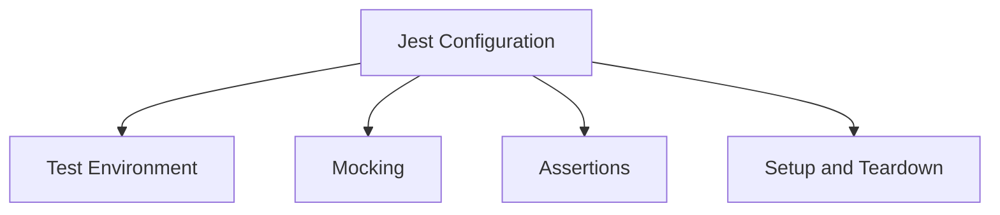
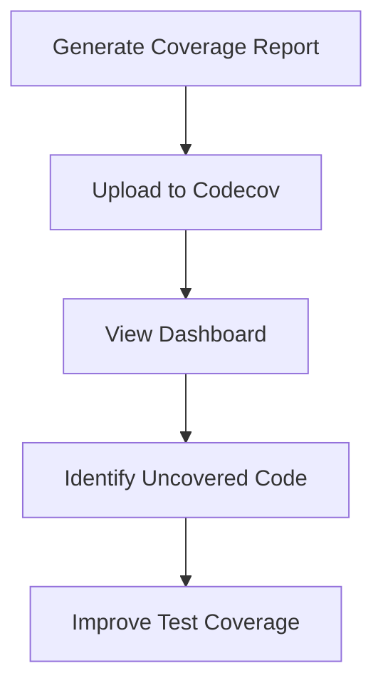

# Testing Strategy

<cite>
**Referenced Files in This Document**   
- [balancer.test.ts](file://src/__tests__/balancer/balancer.test.ts)
- [configLoader.test.ts](file://src/__tests__/configLoader/configLoader.test.ts)
- [provider.test.ts](file://src/__tests__/provider/provider.test.ts)
- [comprehensive-integration.test.ts](file://src/__tests__/integration/comprehensive-integration.test.ts)
- [tinkoff-sdk.ts](file://src/__tests__/__mocks__/tinkoff-sdk.ts)
- [provider.ts](file://src/__tests__/__mocks__/provider.ts)
- [external-deps.ts](file://src/__tests__/__mocks__/external-deps.ts)
- [configurations.ts](file://src/__tests__/__fixtures__/configurations.ts)
- [market-data.ts](file://src/__tests__/__fixtures__/market-data.ts)
- [wallets.ts](file://src/__tests__/__fixtures__/wallets.ts)
- [CONFIG.test.json](file://test-configs/CONFIG.test.json)
</cite>

## Table of Contents
1. [Introduction](#introduction)
2. [Test Pyramid Implementation](#test-pyramid-implementation)
3. [Jest Testing Framework Configuration](#jest-testing-framework-configuration)
4. [Mocking Strategies for External Dependencies](#mocking-strategies-for-external-dependencies)
5. [Test Organization by Feature](#test-organization-by-feature)
6. [Fixtures and Mocks for Reliable Test Execution](#fixtures-and-mocks-for-reliable-test-execution)
7. [Specialized Test Types](#specialized-test-types)
8. [Test Configuration Validation](#test-configuration-validation)
9. [Writing New Tests](#writing-new-tests)
10. [Running Test Suites](#running-test-suites)
11. [Coverage Reports with Codecov](#coverage-reports-with-codecov)

## Introduction
The testing strategy for the Tinkoff Invest ETF Balancer Bot is designed to ensure robustness, reliability, and maintainability of the application. The test suite covers various aspects of the system, including unit tests, integration tests, and end-to-end tests. This document provides a comprehensive overview of the testing approach, infrastructure, and best practices used in the project.

## Test Pyramid Implementation
The test pyramid model is implemented to ensure a balanced and effective testing strategy. The pyramid consists of three main layers: unit tests, integration tests, and end-to-end tests.

### Unit Tests
Unit tests focus on individual functions and components, ensuring they work correctly in isolation. These tests are fast and provide immediate feedback on code changes. Examples include:
- `balancer.test.ts`: Tests for the balancer module, covering core functions like `normalizeDesire`, `addNumbersToPosition`, and `addNumbersToWallet`.
- `configLoader.test.ts`: Tests for the configLoader module, verifying configuration loading, account retrieval, token management, and validation.
- `provider.test.ts`: Tests for the provider module, focusing on account management, order generation, market data, and exchange status.

### Integration Tests
Integration tests verify the interaction between different modules and components. They ensure that the integrated parts of the system work together as expected. Examples include:
- `comprehensive-integration.test.ts`: End-to-end portfolio balancing workflow, multi-account management, performance, and scalability tests.

### End-to-End Tests
End-to-end tests simulate real-world scenarios and user interactions, ensuring the entire system works as intended. These tests cover complex workflows and edge cases, providing confidence in the overall functionality of the application.

## Jest Testing Framework Configuration
Jest is used as the primary testing framework due to its powerful features and ease of use. The configuration includes:
- **Test Environment**: Set up using `bun:test` for compatibility with Bun.js.
- **Mocking**: Utilizes Jest's built-in mocking capabilities to isolate dependencies.
- **Assertions**: Uses `expect` for assertions, providing clear and concise error messages.
- **Setup and Teardown**: Includes `beforeEach` and `afterEach` hooks to set up and clean up test environments.



**Diagram sources**
- [balancer.test.ts](file://src/__tests__/balancer/balancer.test.ts)
- [configLoader.test.ts](file://src/__tests__/configLoader/configLoader.test.ts)
- [provider.test.ts](file://src/__tests__/provider/provider.test.ts)

## Mocking Strategies for External Dependencies
To ensure reliable and isolated tests, external dependencies are mocked using custom mock implementations. This approach prevents real API calls and ensures consistent test results.

### Tinkoff SDK Mock
The Tinkoff SDK is mocked to simulate API responses and control test behavior. Key features include:
- **Controllable Responses**: Allows setting custom responses for specific methods.
- **Error Simulation**: Simulates various error scenarios such as network timeouts, rate limiting, and unauthorized access.
- **Call Tracking**: Tracks method calls and arguments for verification.

```typescript
// Example usage in balancer.test.ts
import { mockTinkoffSDKControls } from '../__mocks__/tinkoff-sdk';

beforeEach(() => {
  mockTinkoffSDKControls.reset();
  mockTinkoffSDKControls.setSuccess();
});
```

### Provider Module Mock
The provider module is mocked to prevent real API calls and ensure consistent test results. Key features include:
- **Controllable Responses**: Allows setting custom responses for specific methods.
- **Error Simulation**: Simulates network timeouts and other errors.
- **Call Tracking**: Tracks method calls and arguments for verification.

```typescript
// Example usage in provider.test.ts
import { mockProviderControls } from '../__mocks__/provider';

beforeEach(() => {
  mockProviderControls.reset();
  mockProviderControls.setSuccess();
});
```

### External Dependencies Mock
External dependencies such as file system, network requests, and environment variables are mocked to ensure isolated tests. Key features include:
- **File System Mock**: Simulates file read/write operations.
- **Network Request Mock**: Simulates HTTP requests using Axios or request-promise.
- **Environment Variables Mock**: Controls environment variable values for testing.

```typescript
// Example usage in configLoader.test.ts
import { mockControls } from '../__mocks__/external-deps';

beforeEach(() => {
  mockControls.fs.reset();
  mockControls.network.reset();
  mockControls.puppeteer.reset();
});
```

**Section sources**
- [tinkoff-sdk.ts](file://src/__tests__/__mocks__/tinkoff-sdk.ts)
- [provider.ts](file://src/__tests__/__mocks__/provider.ts)
- [external-deps.ts](file://src/__tests__/__mocks__/external-deps.ts)

## Test Organization by Feature
Tests are organized by feature to ensure clarity and maintainability. Each feature has its own directory containing relevant test files.

### Balancer
- `balancer.test.ts`: Core functions and edge cases.
- `diffCalculator.test.ts`: Diff calculation and adjustment.
- `margin-trading-position-management.test.ts`: Margin trading position management.
- `margin-trading-strategies.test.ts`: Margin trading strategies.

### ConfigLoader
- `configLoader.test.ts`: Configuration loading and validation.
- `config-error-handling.test.ts`: Error handling scenarios.
- `config-performance-scenarios.test.ts`: Performance scenarios.
- `config-validation-scenarios.test.ts`: Validation scenarios.

### Provider
- `provider.test.ts`: Account management, order generation, market data, and exchange status.
- `provider-api-error-handling.test.ts`: API error handling.
- `provider-network-resilience.test.ts`: Network resilience.
- `provider-order-execution.test.ts`: Order execution sequences.

### Integration
- `comprehensive-integration.test.ts`: End-to-end portfolio balancing workflow.
- `portfolio-rebalancing-workflow.test.ts`: Portfolio rebalancing workflow.
- `news-analysis-pipeline.test.ts`: News analysis pipeline.

**Section sources**
- [balancer.test.ts](file://src/__tests__/balancer/balancer.test.ts)
- [configLoader.test.ts](file://src/__tests__/configLoader/configLoader.test.ts)
- [provider.test.ts](file://src/__tests__/provider/provider.test.ts)
- [comprehensive-integration.test.ts](file://src/__tests__/integration/comprehensive-integration.test.ts)

## Fixtures and Mocks for Reliable Test Execution
Fixtures and mocks are used to ensure reliable and consistent test execution. They provide predefined data and simulated responses, reducing the complexity and variability of tests.

### Fixtures
Fixtures contain predefined data used across multiple test suites. Key fixtures include:
- `configurations.ts`: Valid and invalid configuration data.
- `market-data.ts`: Market data for testing API responses and price calculations.
- `wallets.ts`: Wallet and portfolio data for testing balancing scenarios.

```typescript
// Example usage in balancer.test.ts
import { mockBalancedWallet, mockDesiredWallets } from '../__fixtures__/wallets';
import { mockAccountConfigs } from '../__fixtures__/configurations';
import { mockCurrentPrices } from '../__fixtures__/market-data';
```

### Mocks
Mocks simulate external dependencies and API responses. Key mocks include:
- `tinkoff-sdk.ts`: Mock implementation of Tinkoff SDK.
- `provider.ts`: Mock implementation of provider module.
- `external-deps.ts`: Mock implementations for file system, network requests, and environment variables.

```typescript
// Example usage in balancer.test.ts
import { mockTinkoffSDKControls } from '../__mocks__/tinkoff-sdk';
import { mockProviderControls } from '../__mocks__/provider';
import { mockControls } from '../__mocks__/external-deps';
```

**Section sources**
- [configurations.ts](file://src/__tests__/__fixtures__/configurations.ts)
- [market-data.ts](file://src/__tests__/__fixtures__/market-data.ts)
- [wallets.ts](file://src/__tests__/__fixtures__/wallets.ts)
- [tinkoff-sdk.ts](file://src/__tests__/__mocks__/tinkoff-sdk.ts)
- [provider.ts](file://src/__tests__/__mocks__/provider.ts)
- [external-deps.ts](file://src/__tests__/__mocks__/external-deps.ts)

## Specialized Test Types
Specialized test types cover specific scenarios and edge cases, ensuring comprehensive test coverage.

### Margin Trading Scenarios
Tests for margin trading scenarios ensure the bot handles leveraged positions correctly. Key tests include:
- `margin-trading-position-management.test.ts`: Position management and risk assessment.
- `margin-trading-strategies.test.ts`: Different margin trading strategies.

### Exchange Closure Simulations
Tests for exchange closure simulations ensure the bot behaves appropriately when the exchange is closed. Key tests include:
- `exchangeClosureBehavior.test.ts`: Behavior during exchange closure.
- `isExchangeOpenNow.test.ts`: Verification of exchange status.

### News Analysis Pipelines
Tests for news analysis pipelines ensure the bot can process and analyze news articles effectively. Key tests include:
- `analyzeNews.test.ts`: Basic sentiment analysis.
- `scrapeTbankNews.test.ts`: Web scraping and content extraction.

**Section sources**
- [margin-trading-position-management.test.ts](file://src/__tests__/balancer/margin-trading-position-management.test.ts)
- [margin-trading-strategies.test.ts](file://src/__tests__/balancer/margin-trading-strategies.test.ts)
- [exchangeClosureBehavior.test.ts](file://src/__tests__/exchangeClosureBehavior.test.ts)
- [isExchangeOpenNow.test.ts](file://src/__tests__/provider/isExchangeOpenNow.test.ts)
- [analyzeNews.test.ts](file://src/__tests__/tools/analyzeNews.test.ts)
- [scrapeTbankNews.test.ts](file://src/__tests__/tools/scrapeTbankNews.test.ts)

## Test Configuration Validation
Test configurations validate diverse user setups and ensure the bot works correctly under different conditions. Key configurations include:
- `CONFIG.test.json`: Default test configuration.
- `CONFIG.test-simple.json`: Simple configuration for basic testing.
- `CONFIG.test-manager-comprehensive.json`: Comprehensive configuration for advanced testing.

```json
{
  "accounts": [
    {
      "id": "test-account-1",
      "name": "Test Account 1",
      "t_invest_token": "t.test_token_123",
      "account_id": "123456789",
      "desired_wallet": {
        "TRUR": 25,
        "TMOS": 25,
        "TGLD": 25,
        "RUB": 25
      },
      "desired_mode": "manual",
      "balance_interval": 3600,
      "sleep_between_orders": 1000,
      "margin_trading": {
        "enabled": false,
        "multiplier": 1,
        "free_threshold": 10000,
        "max_margin_size": 0,
        "balancing_strategy": "remove"
      },
      "exchange_closure_behavior": {
        "mode": "skip_iteration",
        "update_iteration_result": false
      }
    }
  ]
}
```

**Section sources**
- [CONFIG.test.json](file://test-configs/CONFIG.test.json)
- [configLoader.test.ts](file://src/__tests__/configLoader/configLoader.test.ts)

## Writing New Tests
When writing new tests, follow these guidelines to ensure consistency and effectiveness:
1. **Isolate Dependencies**: Use mocks to isolate external dependencies.
2. **Use Fixtures**: Leverage existing fixtures for common data.
3. **Cover Edge Cases**: Include tests for edge cases and error scenarios.
4. **Verify Behavior**: Ensure tests verify the expected behavior of the system.
5. **Document Assumptions**: Clearly document any assumptions made in the test.

```typescript
// Example of a new test
describe('New Feature', () => {
  beforeEach(() => {
    // Setup test environment
  });

  afterEach(() => {
    // Clean up test environment
  });

  it('should handle valid input', async () => {
    // Arrange
    const input = { /* valid input */ };

    // Act
    const result = await newFeature(input);

    // Assert
    expect(result).toBe(/* expected output */);
  });

  it('should handle invalid input', async () => {
    // Arrange
    const input = { /* invalid input */ };

    // Act & Assert
    await expect(newFeature(input)).rejects.toThrow(/* expected error */);
  });
});
```

**Section sources**
- [balancer.test.ts](file://src/__tests__/balancer/balancer.test.ts)
- [configLoader.test.ts](file://src/__tests__/configLoader/configLoader.test.ts)
- [provider.test.ts](file://src/__tests__/provider/provider.test.ts)

## Running Test Suites
To run the test suites, use the following commands:

### Run All Tests
```bash
bun test
```

### Run Specific Test Suite
```bash
bun test src/__tests__/balancer/balancer.test.ts
```

### Run Tests with Coverage
```bash
bun test --coverage
```

### Watch Mode
```bash
bun test --watch
```

**Section sources**
- [package.json](file://package.json)

## Coverage Reports with Codecov
Codecov is used to generate and report code coverage metrics. The coverage report helps identify untested code and ensures high test coverage.

### Generate Coverage Report
```bash
bun test --coverage
```

### Upload Coverage to Codecov
```bash
codecov -f coverage-report.json
```

### View Coverage Report
Visit the Codecov dashboard to view detailed coverage reports and identify areas for improvement.



**Diagram sources**
- [codecov.yml](file://codecov.yml)
- [coverage-report.json](file://coverage-report.json)