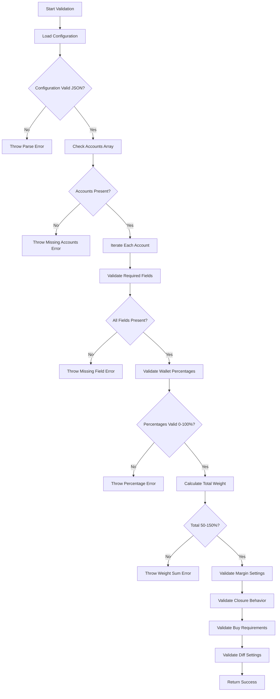
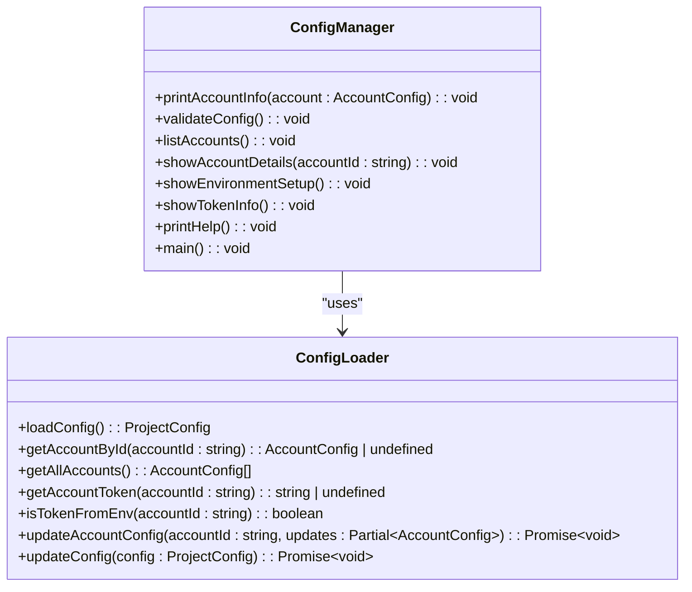

# Configuration Management Tools

<cite>
**Referenced Files in This Document**   
- [configManager.ts](file://src/tools/configManager.ts)
- [configLoader.ts](file://src/configLoader.ts)
- [types.d.ts](file://src/types.d.ts)
- [CONFIG.example.json](file://CONFIG.example.json)
- [configManager.test.ts](file://src/__tests__/tools/configManager.test.ts)
- [configManager-validation.test.ts](file://src/__tests__/tools/configManager-validation.test.ts)
- [configManager-export.test.ts](file://src/__tests__/tools/configManager-export.test.ts)
</cite>

## Table of Contents
1. [Introduction](#introduction)
2. [Core Functionality](#core-functionality)
3. [Configuration Validation and Normalization](#configuration-validation-and-normalization)
4. [Multi-Account Support](#multi-account-support)
5. [Public Methods and Usage](#public-methods-and-usage)
6. [Validation Rules and Schema Compliance](#validation-rules-and-schema-compliance)
7. [Programmatic Configuration Updates](#programmatic-configuration-updates)
8. [Integration with CI/CD Pipelines](#integration-with-cicd-pipelines)
9. [Automated Testing Scenarios](#automated-testing-scenarios)
10. [Error Handling](#error-handling)
11. [Configuration Modes Compatibility](#configuration-modes-compatibility)

## Introduction
The configuration management system in the Tinkoff Invest ETF Balancer Bot provides a comprehensive utility for managing investment account configurations through the `configManager.ts` tool. This CLI-based utility enables users to validate, normalize, and export configuration files programmatically, ensuring schema compliance and supporting complex multi-account setups. The system integrates with environment variables for secure token management and provides extensive validation capabilities to prevent configuration errors before they impact trading operations.

**Section sources**
- [configManager.ts](file://src/tools/configManager.ts#L1-L271)
- [CONFIG.example.json](file://CONFIG.example.json#L1-L52)

## Core Functionality
The configManager.ts utility serves as the primary interface for configuration management in the ETF balancer system. It provides a command-line interface for viewing, validating, and managing multiple account configurations. The tool supports various commands including listing accounts, showing detailed account information, validating configuration integrity, and displaying environment variable setup requirements.

The configuration manager works in conjunction with the configLoader module to provide a complete configuration lifecycle management solution. It handles both direct token specification and environment variable-based token resolution, allowing for flexible deployment scenarios from development to production environments.

```mermaid
flowchart TD
A["User Command\n(npm run config)"] --> B{Command Type}
B --> |list| C[Display Account List]
B --> |show <id>| D[Show Account Details]
B --> |validate| E[Validate Configuration]
B --> |env| F[Show Env Setup]
B --> |tokens| G[Show Token Info]
C --> H[Fetch All Accounts\nvia configLoader]
D --> I[Get Account by ID\nvia configLoader]
E --> J[Run Validation Logic]
F --> K[Analyze Token Sources]
G --> L[Display Token Status]
H --> M[Format & Output]
I --> M
J --> N[Check IDs, Tokens,\nWeights, Schemas]
K --> O[Identify ${VAR} Patterns]
L --> P[Show ✅/❌ Status]
M --> Q[Console Output]
N --> Q
O --> Q
P --> Q
```

**Diagram sources**
- [configManager.ts](file://src/tools/configManager.ts#L1-L271)
- [configLoader.ts](file://src/configLoader.ts#L1-L345)

**Section sources**
- [configManager.ts](file://src/tools/configManager.ts#L1-L271)

## Configuration Validation and Normalization
The configuration management system implements comprehensive validation rules to ensure CONFIG.json schema compliance. When validating configurations, the system checks for required fields, proper data types, and logical consistency across all account settings. The validation process includes checking that all accounts have unique IDs, tokens are properly formatted, and wallet weight distributions fall within acceptable ranges.

For normalization, the system automatically resolves environment variable references in token fields, converting patterns like "${T_INVEST_TOKEN}" to their actual values from process.env. The validator also enforces percentage bounds on portfolio allocations, ensuring individual weights are between 0-100% and the total sum remains within reasonable limits (50-150%) before automatic normalization to 100%.



**Diagram sources**
- [configLoader.ts](file://src/configLoader.ts#L150-L340)
- [configManager.ts](file://src/tools/configManager.ts#L50-L100)

**Section sources**
- [configLoader.ts](file://src/configLoader.ts#L150-L340)

## Multi-Account Support
The configuration management system is designed to handle multiple investment accounts through a unified interface. Each account is identified by a unique ID and can have independent settings for rebalancing intervals, trading modes, and portfolio allocations. The configManager tool provides specific commands to list all configured accounts and display details for individual accounts by their ID.

Account isolation is maintained through unique identifiers and separate token management, allowing users to manage both sandbox and live accounts simultaneously. The system validates that account IDs are unique across the configuration and provides clear feedback when duplicates are detected. Token management supports both direct specification and environment variable references, enabling secure handling of credentials across different accounts.

**Section sources**
- [configManager.ts](file://src/tools/configManager.ts#L120-L150)
- [types.d.ts](file://src/types.d.ts#L102-L135)

## Public Methods and Usage
The configManager.ts utility exposes several public methods through its command-line interface, accessible via npm run config [command]. The available commands include:

- **list**: Displays a summary of all configured accounts with basic information
- **show <account_id>**: Shows detailed information about a specific account
- **validate**: Validates the entire configuration for schema compliance and potential issues
- **env**: Displays the required environment variable setup for token management
- **tokens**: Shows current token status and resolution information
- **help**: Displays usage instructions and command reference

These methods provide programmatic access to configuration data and validation results, enabling integration with external tools and automation scripts.



**Diagram sources**
- [configManager.ts](file://src/tools/configManager.ts#L1-L271)
- [configLoader.ts](file://src/configLoader.ts#L1-L345)

**Section sources**
- [configManager.ts](file://src/tools/configManager.ts#L1-L271)

## Validation Rules and Schema Compliance
The system enforces strict validation rules to maintain CONFIG.json schema compliance. For each account, the following fields are required: id, name, t_invest_token, account_id, and desired_wallet. The desired_wallet object must contain valid ticker symbols as keys and numeric percentages as values, with each percentage between 0 and 100.

Additional validation rules apply to specific configuration sections:
- **Margin trading**: Enabled flag must be boolean, multiplier must be positive number
- **Exchange closure behavior**: Mode must be one of skip_iteration, force_orders, or dry_run
- **Buy requires total marginal sell**: Configuration must follow specified structure with valid modes
- **Diff settings**: Mode must be off, iteration, or day; multiplier must be 0-100

The system also validates cross-field constraints, such as ensuring environment variable tokens resolve to actual values and warning when diff_multiplier is set but diff mode is 'off'.

**Section sources**
- [configLoader.ts](file://src/configLoader.ts#L150-L340)
- [configManager-validation.test.ts](file://src/__tests__/tools/configManager-validation.test.ts#L1-L875)

## Programmatic Configuration Updates
While the primary interface is command-line based, the underlying configLoader module provides programmatic methods for updating configurations. The updateAccountConfig method allows modifying specific account settings while maintaining validation integrity. Similarly, updateConfig enables wholesale replacement of the entire configuration after validation.

These programmatic interfaces support automated configuration management workflows, such as adjusting portfolio allocations based on market conditions or updating rebalancing intervals according to trading strategies. The update operations include automatic backup creation and transactional semantics to prevent partial writes.

**Section sources**
- [configLoader.ts](file://src/configLoader.ts#L250-L280)

## Integration with CI/CD Pipelines
The configuration management tools are designed to integrate seamlessly with CI/CD pipelines. The validation command can be incorporated into pre-deployment checks to ensure configuration correctness before releasing updates. Exit codes provide machine-readable success/failure indicators, with non-zero codes returned for validation failures.

In pipeline scenarios, the env command helps generate appropriate .env file templates, while the tokens command verifies that required environment variables are available in the deployment environment. These capabilities enable robust configuration testing and validation as part of automated deployment processes.

**Section sources**
- [configManager.ts](file://src/tools/configManager.ts#L1-L271)
- [configManager.test.ts](file://src/__tests__/tools/configManager.test.ts#L1-L515)

## Automated Testing Scenarios
The configuration management system includes comprehensive test coverage for various scenarios. Test cases validate correct parsing of environment variable tokens, detection of missing environment variables, and proper handling of malformed token syntax. Performance tests verify that validation scales appropriately with large numbers of accounts.

Testing scenarios include edge cases such as empty configurations, duplicate account IDs, and invalid percentage distributions. The test suite also covers error handling for configuration loading failures and unknown error types, ensuring graceful degradation when problems occur.

```mermaid
flowchart TD
A[Start Test Suite] --> B[Setup Mock Environment]
B --> C[Configure Test Fixtures]
C --> D{Test Category}
D --> |Validation| E[Test Schema Compliance]
D --> |Token Management| F[Test Env Var Resolution]
D --> |Error Handling| G[Test Failure Cases]
D --> |Performance| H[Test Large Configurations]
E --> I[Check Required Fields]
E --> J[Validate Percentage Bounds]
E --> K[Test Weight Sums]
F --> L[Verify ${VAR} Parsing]
F --> M[Test Missing Env Vars]
F --> N[Check Direct Tokens]
G --> O[Simulate File Not Found]
G --> P[Test Invalid JSON]
G --> Q[Handle Unknown Errors]
H --> R[Create 100+ Accounts]
H --> S[Measure Validation Time]
H --> T[Verify Memory Usage]
I --> U[Assert Expected Results]
J --> U
K --> U
L --> U
M --> U
N --> U
O --> U
P --> U
Q --> U
R --> U
S --> U
T --> U
U --> V[Report Test Results]
```

**Diagram sources**
- [configManager.test.ts](file://src/__tests__/tools/configManager.test.ts#L1-L515)
- [configManager-validation.test.ts](file://src/__tests__/tools/configManager-validation.test.ts#L1-L875)

**Section sources**
- [configManager.test.ts](file://src/__tests__/tools/configManager.test.ts#L1-L515)

## Error Handling
The configuration management system implements comprehensive error handling for invalid configurations. Validation errors provide specific messages identifying the problematic field and account, making it easy to diagnose and fix issues. The system distinguishes between different error types, providing appropriate messages for missing fields, invalid data types, and logical inconsistencies.

For runtime errors during configuration loading, the system catches exceptions and provides user-friendly error messages before exiting with an appropriate status code. Warnings are issued for non-critical issues like weight sums deviating from 100%, allowing users to make informed decisions about configuration adjustments.

**Section sources**
- [configManager.ts](file://src/tools/configManager.ts#L50-L100)
- [configLoader.ts](file://src/configLoader.ts#L150-L340)

## Configuration Modes Compatibility
The configuration management system supports multiple configuration modes including simple, comprehensive, and ultimate setups. The validation logic adapts to the specific requirements of each mode, ensuring that only relevant configuration sections are validated for the active mode.

For simple configurations, the system focuses on core trading parameters and portfolio allocations. Comprehensive setups include additional validation for margin trading and advanced rebalancing strategies. Ultimate configurations incorporate all available features with corresponding validation rules, providing a complete check of the entire configuration surface.

**Section sources**
- [configLoader.ts](file://src/configLoader.ts#L150-L340)
- [types.d.ts](file://src/types.d.ts#L102-L135)