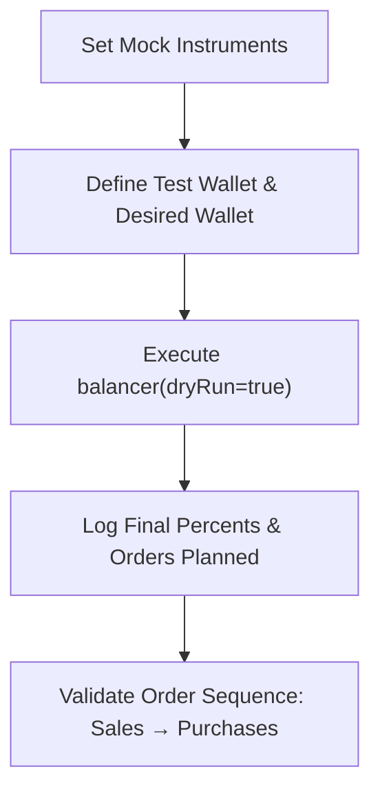
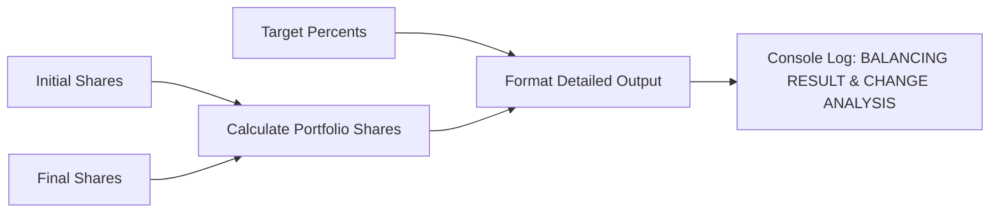

# Debugging and Testing Utilities

<cite>
**Referenced Files in This Document**   
- [src/tools/debugBalancer.ts](file://src/tools/debugBalancer.ts)
- [src/tools/verifyBalancerFix.ts](file://src/tools/verifyBalancerFix.ts)
- [src/tools/testBalancerLogic.ts](file://src/tools/testBalancerLogic.ts)
- [src/tools/demoDetailedOutput.ts](file://src/tools/demoDetailedOutput.ts)
- [test_balancer_logic.ts](file://test_balancer_logic.ts)
</cite>

## Table of Contents
1. [Introduction](#introduction)
2. [debugBalancer.ts: Step-by-Step Rebalancing Inspection](#debugbalancerts-step-by-step-rebalancing-inspection)
3. [verifyBalancerFix.ts: Validation of Balancing Logic Fixes](#verifybalancerfixts-validation-of-balancing-logic-fixes)
4. [testBalancerLogic.ts: Programmatic Scenario Testing](#testbalancerlogicts-programmatic-scenario-testing)
5. [demoDetailedOutput.ts: Human-Readable Balancing Reports](#demodetailedoutputts-human-readable-balancing-reports)
6. [Practical Usage Examples](#practical-usage-examples)
7. [Development Workflow Integration](#development-workflow-integration)
8. [Conclusion](#conclusion)

## Introduction
This document provides comprehensive guidance on the debugging and testing utilities within the Tinkoff Invest ETF Balancer Bot. These tools are designed to support developers in validating, troubleshooting, and verifying the correctness of portfolio rebalancing logic. The utilities enable step-by-step inspection of calculations, validation against known test cases, isolated scenario testing, and generation of human-readable reports. Each tool serves a distinct purpose in ensuring robustness and accuracy in automated investment decisions.

## debugBalancer.ts: Step-by-Step Rebalancing Inspection

The `debugBalancer.ts` utility enables granular inspection of the rebalancing process by analyzing instrument availability, price data retrieval, and configuration alignment. It systematically verifies each ETF defined in the desired wallet against the Tinkoff API's instrument list and market data endpoints.

Key functionalities include:
- Normalization of ticker symbols using `normalizeTicker` and comparison via `tickersEqual`
- Verification of instrument presence in the global `INSTRUMENTS` array
- Fetching and validation of last prices through `getLastPrice`
- Detailed logging of processing status for each ETF (SUCCESS, FAILED_INSTRUMENT, FAILED_PRICE)
- Summary reporting with counts of successful and failed instruments
- Recommendations based on detected issues

It supports dry-run diagnostics before actual balancing operations, helping identify misconfigurations or connectivity issues early.

**Section sources**
- [src/tools/debugBalancer.ts](file://src/tools/debugBalancer.ts#L1-L288)

## verifyBalancerFix.ts: Validation of Balancing Logic Fixes

The `verifyBalancerFix.ts` script is specifically designed to validate fixes applied to the core balancing logic. It addresses historical issues where only a subset of configured ETFs were being processed due to incorrect handling of new positions with zero initial holdings.

This utility confirms that:
- All 12 configured ETFs are recognized and processed
- Newly created positions receive appropriate `toBuyLots` values
- Final percentage allocations are correctly calculated even for zero-amount positions
- Market data access (FIGI, lot size, pricing) functions properly across all ETFs

It includes expected behavior documentation and success criteria, making it ideal for regression testing after code changes. The script outputs verification steps and expected outcomes, enabling quick confirmation of fix effectiveness.

**Section sources**
- [src/tools/verifyBalancerFix.ts](file://src/tools/verifyBalancerFix.ts#L1-L75)

## testBalancerLogic.ts: Programmatic Scenario Testing

The `testBalancerLogic.ts` file allows developers to isolate and test specific rebalancing scenarios programmatically. It simulates portfolio states and validates normalization logic independently of external dependencies.

Features include:
- Simulation of original desired wallet configurations with custom percentages
- Testing of `normalizeDesire` function to ensure correct distribution logic
- Verification that total allocation sums to exactly 100% post-normalization
- Detection of double-normalization bugs or miscalculations
- Console-based output of normalized shares and error checks

Additionally, the standalone `test_balancer_logic.ts` script demonstrates end-to-end dry-run execution using mock instruments and predefined portfolios. It logs current and target portfolio states, planned orders, and enforces proper sequencing (sales before purchases).



**Diagram sources**
- [test_balancer_logic.ts](file://test_balancer_logic.ts#L56-L102)

**Section sources**
- [src/tools/testBalancerLogic.ts](file://src/tools/testBalancerLogic.ts#L1-L69)
- [test_balancer_logic.ts](file://test_balancer_logic.ts#L56-L102)

## demoDetailedOutput.ts: Human-Readable Balancing Reports

The `demoDetailedOutput.ts` utility generates clear, formatted reports of balancing operations for improved readability and analysis. It illustrates how portfolio shares evolve from current to target states.

Report features:
- Clear formatting: `TICKER: diff: before% -> after% (target%)`
- Sorting of tickers by final share percentage (descending)
- Calculation of percentage point changes (`diff`)
- Display of RUB balance, including negative values under margin trading
- Change analysis section categorizing actions as increases, no changes, or already balanced

The script uses simulated data (`initialShares`, `targetPercents`, `finalShares`) to demonstrate output format consistency and clarity. This aids both development and user-facing communication of rebalancing results.



**Diagram sources**
- [src/tools/demoDetailedOutput.ts](file://src/tools/demoDetailedOutput.ts#L64-L126)

**Section sources**
- [src/tools/demoDetailedOutput.ts](file://src/tools/demoDetailedOutput.ts#L1-L135)

## Practical Usage Examples

### Troubleshooting Misallocations
Use `debugBalancer.ts` when certain ETFs are unexpectedly excluded from rebalancing:
```bash
bun run debug:balancer
```
Check if instruments are missing or price fetching fails—common causes of skipped assets.

### Validating Configuration Changes
After modifying `CONFIG.json`, run `verifyBalancerFix.ts` to confirm all ETFs remain accessible:
```bash
bun run verify:balancer:fix
```
Ensure all 12 ETFs show valid prices and allocations (~8.33% each in equal-weighted setup).

### Reproducing Edge Cases
Simulate edge conditions like zero-holdings or extreme market shifts using `testBalancerLogic.ts`. Modify input wallets to test boundary behaviors such as:
- Single large position needing partial sale
- Multiple new ETF additions requiring simultaneous purchase
- Currency-only (RUB) rebalancing under margin constraints

### Interpreting Logs
All tools use consistent emoji-based logging:
- ✅ Success / Expected outcome
- ❌ Failure / Missing data
- 🔍 Diagnostic search
- 📊 Data display
- ⚙️ Process initiation

Set breakpoints in IDE at key stages (e.g., after `getLastPrice`, during `normalizeDesire`) to inspect runtime values.

## Development Workflow Integration

Integrate these utilities into standard development practices:

| Tool | When to Use | Command |
|------|-------------|---------|
| `debugBalancer.ts` | Pre-deployment check, issue triage | `bun run debug:balancer` |
| `verifyBalancerFix.ts` | After logic updates, CI/CD gates | `bun run verify:balancer:fix` |
| `testBalancerLogic.ts` | Unit test validation, bug reproduction | `bun run test:balancer:logic` |
| `demoDetailedOutput.ts` | UX review, stakeholder demos | `bun run demo:detailed:output` |

Combine with existing test suites located in `src/__tests__` for full coverage. Leverage fixture files in `__fixtures__` to simulate real-world configurations and market data.

## Conclusion

These debugging and testing utilities form a critical layer in maintaining the reliability and transparency of the ETF rebalancing system. By providing targeted diagnostics, validation scripts, isolated logic tests, and readable output demonstrations, they empower developers to confidently implement, verify, and troubleshoot complex financial algorithms. Their integration into daily workflows ensures high fidelity between configuration intent and execution outcome.