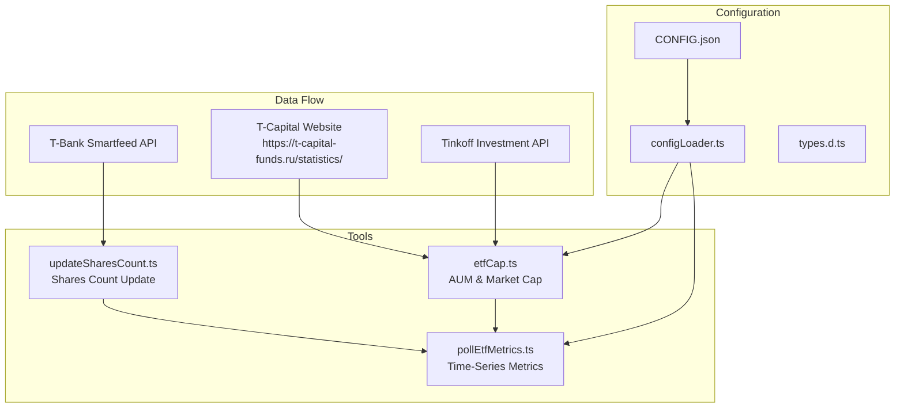
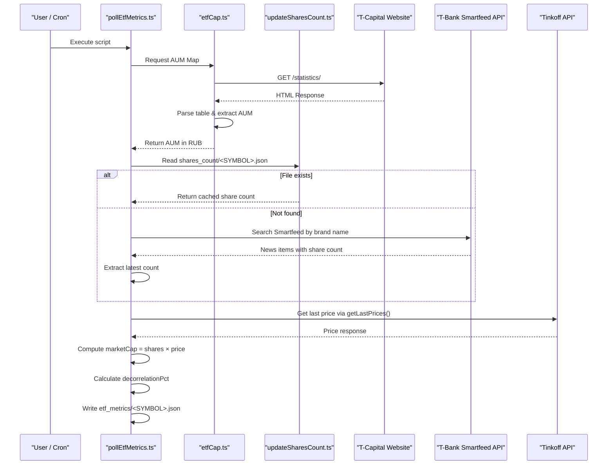
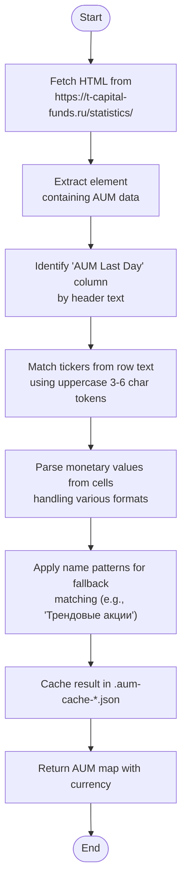
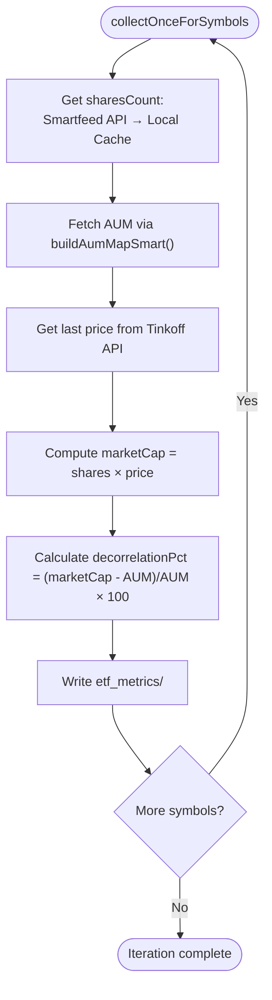
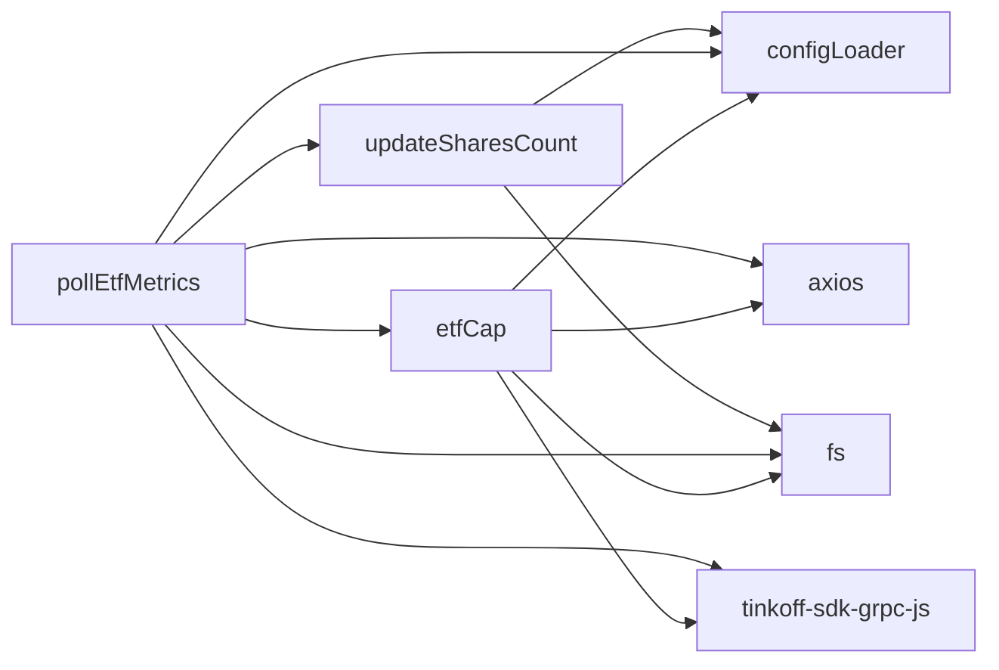

# ETF Metrics Collection

<cite>
**Referenced Files in This Document **   
- [etfCap.ts](file://src/tools/etfCap.ts)
- [pollEtfMetrics.ts](file://src/tools/pollEtfMetrics.ts)
- [updateSharesCount.ts](file://src/tools/updateSharesCount.ts)
- [configLoader.ts](file://src/configLoader.ts)
- [types.d.ts](file://src/types.d.ts)
- [README.poll_etf_metrics.md](file://README.poll_etf_metrics.md)
- [CONFIG.example.json](file://CONFIG.example.json)
</cite>

## Table of Contents
1. [Introduction](#introduction)
2. [Project Structure](#project-structure)
3. [Core Components](#core-components)
4. [Architecture Overview](#architecture-overview)
5. [Detailed Component Analysis](#detailed-component-analysis)
6. [Dependency Analysis](#dependency-analysis)
7. [Performance Considerations](#performance-considerations)
8. [Troubleshooting Guide](#troubleshooting-guide)
9. [Conclusion](#conclusion)

## Introduction
This document provides comprehensive documentation for the ETF metrics collection tools within the Tinkoff Invest ETF Balancer Bot. The system enables automated data gathering for Exchange Traded Funds (ETFs) through web scraping and API integration, supporting portfolio rebalancing decisions with accurate, time-series financial metrics. Two primary tools—`etfCap.ts` and `pollEtfMetrics.ts`—form the backbone of this functionality, enabling retrieval of critical data such as Assets Under Management (AUM), market capitalization, share count, price, and decorrelation metrics.

The tools are designed to operate both independently and as part of an integrated pipeline, supporting standalone execution via command-line arguments or scheduled operation using cron jobs. They incorporate robust error handling, caching mechanisms, and network resilience strategies to ensure reliable performance despite external dependencies like website structure changes or rate limiting.

Key capabilities include:
- Scraping AUM data from T-Capital's statistics page using HTML parsing
- Fetching real-time ETF pricing and instrument metadata via Tinkoff SDK
- Collecting share count data from T-Bank Smartfeed news API
- Computing market capitalization and decorrelation percentages
- Caching results to minimize redundant network requests
- Supporting integration with portfolio rebalancing logic based on metric deviations

These tools collectively enable quantitative analysis of ETF valuation discrepancies between market price and underlying asset value, which is essential for informed trading decisions.

## Project Structure



**Diagram sources**
- [etfCap.ts](file://src/tools/etfCap.ts#L30-L35)
- [pollEtfMetrics.ts](file://src/tools/pollEtfMetrics.ts#L25-L30)
- [updateSharesCount.ts](file://src/tools/updateSharesCount.ts#L20-L25)

**Section sources**
- [etfCap.ts](file://src/tools/etfCap.ts)
- [pollEtfMetrics.ts](file://src/tools/pollEtfMetrics.ts)
- [updateSharesCount.ts](file://src/tools/updateSharesCount.ts)

## Core Components

The ETF metrics collection system consists of three core components: `etfCap.ts`, `pollEtfMetrics.ts`, and `updateSharesCount.ts`. These modules work together to collect, process, and store key financial indicators for ETF instruments offered by T-Capital.

`etfCap.ts` serves as the foundation for retrieving fundamental data including AUM from T-Capital’s public statistics page and market capitalization via the Tinkoff API. It implements intelligent HTML parsing to extract AUM values even when ticker-based matching fails, falling back to pattern-based identification using known ETF names.

`pollEtfMetrics.ts` orchestrates the periodic collection of time-series data by combining inputs from multiple sources: share counts from local cache or Smartfeed API, AUM from `etfCap.ts`, and pricing data from Tinkoff. It computes derived metrics such as decorrelation percentage, which measures the deviation between market capitalization and AUM—a key signal for potential overvaluation or undervaluation.

`updateSharesCount.ts` maintains up-to-date share count information by scanning news articles published on T-Bank’s platform. It parses markdown-formatted news files to detect announcements containing updated total share figures, ensuring downstream systems have access to current issuance data.

Together, these components form a resilient pipeline that supports both real-time queries and long-term trend analysis, feeding into broader portfolio management and rebalancing workflows.

**Section sources**
- [etfCap.ts](file://src/tools/etfCap.ts#L1-L50)
- [pollEtfMetrics.ts](file://src/tools/pollEtfMetrics.ts#L1-L50)
- [updateSharesCount.ts](file://src/tools/updateSharesCount.ts#L1-L50)

## Architecture Overview



**Diagram sources**
- [pollEtfMetrics.ts](file://src/tools/pollEtfMetrics.ts#L100-L200)
- [etfCap.ts](file://src/tools/etfCap.ts#L300-L400)
- [updateSharesCount.ts](file://src/tools/updateSharesCount.ts#L50-L100)

## Detailed Component Analysis

### etfCap.ts: AUM and Market Capitalization Collection

The `etfCap.ts` module is responsible for fetching and processing two critical financial metrics: Assets Under Management (AUM) from T-Capital’s website and market capitalization using instrument data from the Tinkoff API.

#### AUM Data Retrieval Process


**Diagram sources**
- [etfCap.ts](file://src/tools/etfCap.ts#L150-L300)

The AUM extraction begins with an HTTP GET request to T-Capital’s statistics page, using a realistic User-Agent header to avoid bot detection. Upon receiving the HTML, it strips scripts and styles before searching for tables. The correct table is identified by checking headers for phrases like "СЧА за последний день" (AUM for last day). For each row, tickers are detected as uppercase alphanumeric sequences of 3–6 characters, then matched against the requested list.

When direct ticker matching fails (e.g., due to layout changes), the system uses predefined name patterns (stored in `ETF_TICKER_NAME_PATTERNS`) to identify rows by descriptive text. This dual-strategy approach enhances resilience against UI modifications on the target site.

Currency conversion is supported through `getFxRateToRub()`, which queries the Tinkoff API for USD/RUB and EUR/RUB exchange rates, allowing all AUM values to be normalized into rubles for consistent comparison.

#### Market Capitalization Calculation
Market cap is computed as `numShares × lastPriceRUB`. The module attempts to retrieve `numShares` from multiple sources in order of reliability:
1. ETF list response (`instruments.etfs`)
2. Detailed ETF info (`instruments.etfBy`)
3. Asset-level metadata (`instruments.getAssetBy`)

If `numShares` remains unavailable and AUM is known, it derives the value as `Math.round(aumRUB / lastPriceRUB)`, providing a reasonable estimate when official data is missing.

Caching is implemented at two levels:
- AUM data is cached per-account in `.aum-cache-<accountId>.json`
- Market cap data is stored in `.marketcap-cache-<accountId>.json`

Both caches respect TTL settings defined in the project configuration under `aum_cache.ttl_hours`.

**Section sources**
- [etfCap.ts](file://src/tools/etfCap.ts#L30-L694)
- [types.d.ts](file://src/types.d.ts#L135-L145)

### pollEtfMetrics.ts: Time-Series Metrics Collection

The `pollEtfMetrics.ts` module collects time-series data for ETFs by aggregating inputs from multiple sources and writing structured JSON output for historical analysis.

#### Execution Modes and Arguments
The tool supports flexible execution patterns:
- **Standalone mode**: Run once and exit (`--once`)
- **Continuous polling**: Loop with configurable interval (`--interval=MS`)
- **Symbol selection**: Accept comma-separated tickers or use `desired_wallet` from config

Default behavior reads desired tickers from the first account’s `desired_wallet` configuration, enabling seamless integration without manual input.

#### Data Aggregation Workflow


**Diagram sources**
- [pollEtfMetrics.ts](file://src/tools/pollEtfMetrics.ts#L100-L250)

The module first attempts to retrieve share count via the T-Bank Smartfeed API by mapping tickers to branded fund names (e.g., TPAY → "Пассивный доход"). It searches recent news items for entries titled "Количество паев" or similar, extracting numeric values with unit awareness (supporting "млн", "тыс").

On failure, it falls back to reading precomputed values from `shares_count/<SYMBOL>.json`, which is maintained by `updateSharesCount.ts`. This layered approach ensures continuity even if the API becomes temporarily unavailable.

Decorrelation percentage is calculated as `(marketCap - AUM) / AUM * 100`. Negative values indicate undervaluation (market price below intrinsic value), while positive values suggest overvaluation—critical signals for rebalancing logic.

Output files are written to `etf_metrics/<SYMBOL>.json` with the following schema:
```json
{
  "symbol": "TRUR",
  "timestamp": "ISO8601",
  "sharesCount": 1799100000,
  "price": 9.13,
  "marketCap": 16420000000,
  "aum": 16419859877.94,
  "decorrelationPct": 0.001,
  "sharesSearchUrl": "...",
  "figi": "...",
  "uid": "..."
}
```

This format enables easy ingestion into analytics pipelines and visualization tools.

**Section sources**
- [pollEtfMetrics.ts](file://src/tools/pollEtfMetrics.ts#L1-L404)
- [README.poll_etf_metrics.md](file://README.poll_etf_metrics.md#L1-L60)

### Configuration and Integration

#### Configuration Options
The system uses a hierarchical configuration model loaded via `configLoader.ts`, with support for environment variable interpolation (e.g., `${T_INVEST_TOKEN}`).

Relevant configuration fields include:
- `aum_cache.enabled`: Enables/disables caching of AUM and market cap data
- `aum_cache.ttl_hours`: Cache lifetime in hours (default: 1)
- Account-level `desired_wallet`: Defines default tickers for metric collection

Example from `CONFIG.example.json`:
```json
{
  "aum_cache": {
    "enabled": true,
    "ttl_hours": 1
  },
  "accounts": [{
    "id": "account_1",
    "desired_wallet": {
      "TGLD": 8.33,
      "TRUR": 8.33
    }
  }]
}
```

#### Scheduling via Cron
The tools can be integrated into Unix cron for regular execution:

```bash
# Run every hour
0 * * * * cd /path/to/repo && bun run poll:metrics >> logs/poll_metrics.log 2>&1

# Daily at midnight
0 0 * * * cd /path/to/repo && npx ts-node --transpile-only src/tools/etfCap.ts TRUR,TMOS --once
```

Using `bun run poll:metrics` leverages Bun’s fast startup time, reducing overhead in frequent executions.

#### Error Handling and Resilience
Both tools implement comprehensive error handling:
- Network timeouts (10s for `axios` calls)
- Graceful degradation when selectors change
- Try-catch blocks around external API calls
- Warning logs instead of crashes on cache failures
- Fallback strategies for missing data

For example, if T-Capital modifies their HTML structure, `extractStatisticsTableHtml()` will still attempt to parse the first available table, preventing complete failure.

Rate limiting is mitigated through:
- Configurable polling intervals
- Local caching to reduce external requests
- Sequential rather than parallel symbol processing

**Section sources**
- [configLoader.ts](file://src/configLoader.ts#L1-L344)
- [types.d.ts](file://src/types.d.ts#L135-L145)
- [CONFIG.example.json](file://CONFIG.example.json#L1-L52)

## Dependency Analysis



**Diagram sources**
- [etfCap.ts](file://src/tools/etfCap.ts#L1-L20)
- [pollEtfMetrics.ts](file://src/tools/pollEtfMetrics.ts#L1-L20)
- [updateSharesCount.ts](file://src/tools/updateSharesCount.ts#L1-L20)

The dependency graph reveals a modular architecture where `pollEtfMetrics.ts` acts as the orchestrator, depending on both `etfCap.ts` and `updateSharesCount.ts` for data acquisition. Both tools rely on `configLoader.ts` for account and token resolution, ensuring secure credential handling.

External dependencies include:
- `axios`: For HTTP requests to T-Capital and T-Bank APIs
- `tinkoff-sdk-grpc-js`: For instrument metadata and pricing
- `fs`: For reading/writing cache and metric files
- `dotenv`: For loading environment variables

Circular dependencies are avoided, and each module exposes clear entry points (`buildAumMapSmart`, `collectOnceForSymbols`) suitable for testing and reuse.

## Performance Considerations

The tools are optimized for reliability over speed, given their typical usage in scheduled batch operations rather than real-time systems.

Key performance characteristics:
- **Latency**: ~2–5 seconds per iteration depending on network conditions
- **I/O Bound**: Primarily limited by external API response times
- **Memory Usage**: Low (<50MB), no large in-memory datasets
- **Scalability**: Linear with number of symbols; processes one at a time

Caching significantly improves performance during repeated runs:
- AUM cache reduces need for HTML parsing
- Market cap cache avoids redundant API calls
- TTL-based invalidation balances freshness and efficiency

For high-frequency use cases, consider:
- Increasing `--interval` to reduce load
- Pre-warming caches during off-peak hours
- Monitoring log output for unexpected delays

The use of `bun` instead of `ts-node` in production (`bun run poll:metrics`) eliminates TypeScript compilation overhead, resulting in faster startup.

## Troubleshooting Guide

Common issues and solutions:

**Selector Changes on T-Capital Website**
- **Symptom**: Empty AUM results, console shows "no tables found"
- **Solution**: Update `headerText.includes()` checks in `extractStatisticsTableHtml()` or enhance fallback logic

**Missing Share Count Data**
- **Symptom**: `sharesCount` null in output despite recent news
- **Solution**: Verify news file naming convention (`news/SYMBOL/*.md`) and content format ("Всего паев 1.7 млн")

**Authentication Failures**
- **Symptom**: "No token found" error
- **Solution**: Ensure `T_INVEST_TOKEN` is set in `.env` or `CONFIG.json`

**Cache Corruption**
- **Symptom**: Stale or malformed data being used
- **Solution**: Delete `.aum-cache-*.json` and `.marketcap-cache-*.json` files

**Rate Limiting by T-Bank API**
- **Symptom**: 429 responses from Smartfeed API
- **Solution**: Increase polling interval beyond 5 minutes

**Network Resilience Strategies**
- Use exponential backoff in future enhancements
- Implement retry logic for transient failures
- Monitor uptime with external health checks
- Maintain offline fallback datasets when possible

Always check logs prefixed with `[etfCap]` or `[pollEtfMetrics]` for diagnostic messages.

**Section sources**
- [etfCap.ts](file://src/tools/etfCap.ts#L50-L100)
- [pollEtfMetrics.ts](file://src/tools/pollEtfMetrics.ts#L20-L70)

## Conclusion

The ETF metrics collection system provides a robust foundation for quantitative portfolio management by integrating data from multiple sources into actionable insights. Through careful design, it achieves resilience against common web scraping challenges while maintaining clean separation of concerns.

Key strengths include:
- Dual-source verification for critical metrics
- Intelligent fallback mechanisms
- Configurable caching for performance
- Clear integration points with rebalancing logic
- Comprehensive error handling and logging

Future improvements could include:
- Parallel symbol processing for faster collection
- Webhook-based triggering instead of polling
- Database storage for long-term trend analysis
- Alerting on significant decorrelation events

By leveraging these tools, users can make data-driven investment decisions based on accurate, up-to-date ETF valuations, enhancing the overall effectiveness of automated portfolio balancing strategies.