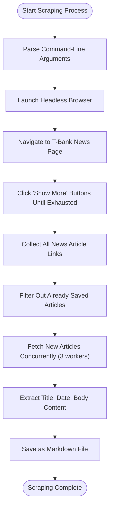
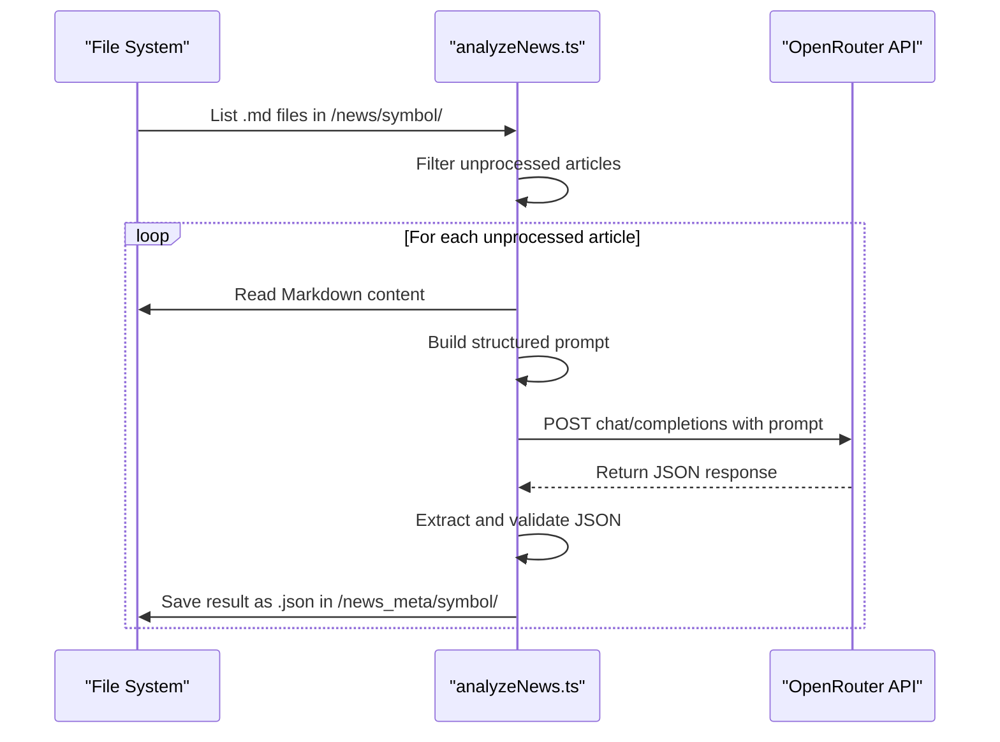
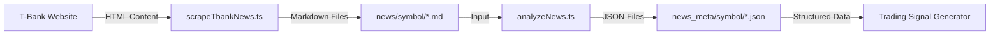
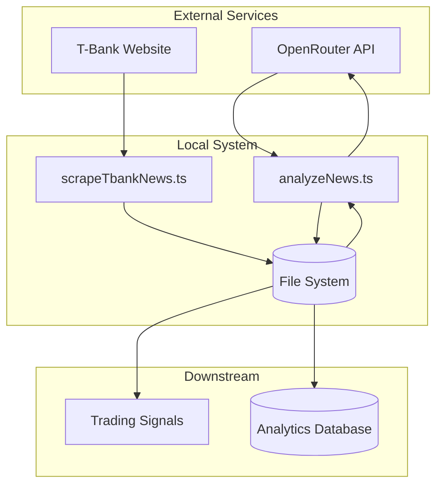
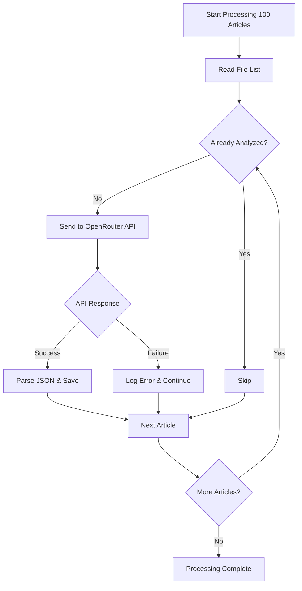
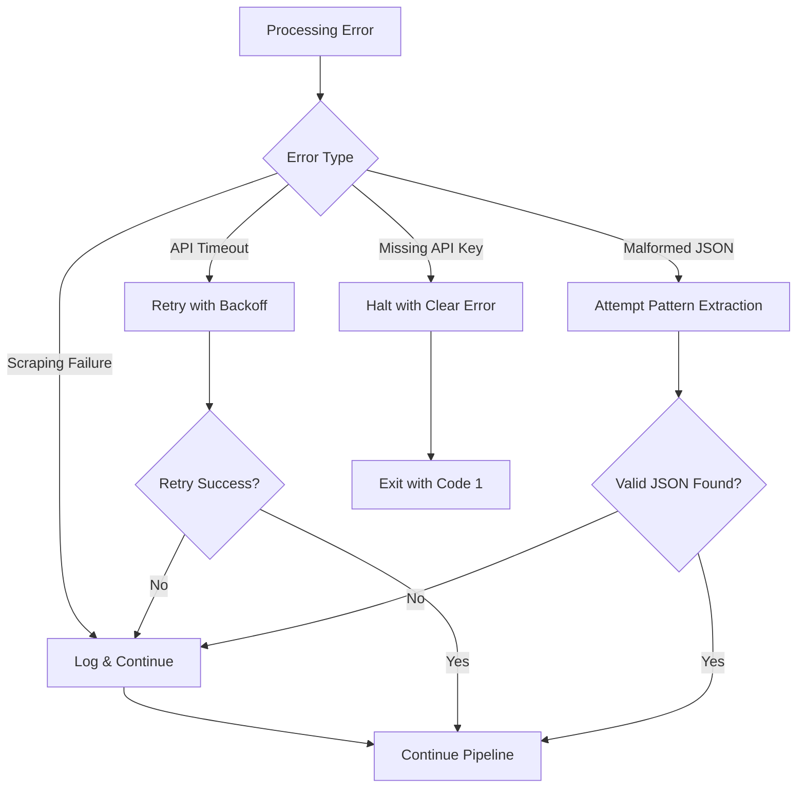

# News Analysis Tools

<cite>
**Referenced Files in This Document**   
- [scrapeTbankNews.ts](file://src/tools/scrapeTbankNews.ts)
- [analyzeNews.ts](file://src/tools/analyzeNews.ts)
- [analyzeNews-sentiment-basic.test.ts](file://src/__tests__/tools/analyzeNews-sentiment-basic.test.ts)
- [analyzeNews-sentiment-advanced.test.ts](file://src/__tests__/tools/analyzeNews-sentiment-advanced.test.ts)
- [news-analysis-pipeline.test.ts](file://src/__tests__/integration/news-analysis-pipeline.test.ts)
</cite>

## Table of Contents
1. [Introduction](#introduction)
2. [Scraping T-Bank Financial News](#scraping-t-bank-financial-news)
3. [Sentiment Analysis Implementation](#sentiment-analysis-implementation)
4. [Input/Output Formats and Data Flow](#inputoutput-formats-and-data-flow)
5. [External Dependencies and Integration](#external-dependencies-and-integration)
6. [Usage Examples and Execution Patterns](#usage-examples-and-execution-patterns)
7. [Performance at Scale](#performance-at-scale)
8. [Error Mitigation and Accuracy Improvement](#error-mitigation-and-accuracy-improvement)
9. [Ethical Considerations and Limitations](#ethical-considerations-and-limitations)
10. [Conclusion](#conclusion)

## Introduction
This document provides comprehensive documentation for the news sentiment analysis utilities within the Tinkoff Invest ETF Balancer Bot system. The tools enable automated extraction and interpretation of financial news from T-Bank's platform, transforming unstructured articles into structured data for trading signal generation. Two core components form this pipeline: `scrapeTbankNews.ts` for web scraping using Puppeteer, and `analyzeNews.ts` for performing sentiment analysis through external AI models. These utilities support algorithmic trading decisions by systematically processing market information, extracting key events, and quantifying their potential impact on ETF performance.

## Scraping T-Bank Financial News

The `scrapeTbankNews.ts` utility implements a robust web scraping mechanism to extract financial news articles from T-Bank's investment platform. Using Puppeteer, it navigates the T-Bank website, loads news pages dynamically, and extracts article content including metadata such as title, publication date, and body text. The scraper targets specific selectors identified in T-Bank's page structure, with fallback mechanisms to handle variations in DOM layout. It supports both single-run execution and continuous polling modes, configurable via command-line arguments.

Key features include incremental scraping based on saved article IDs, concurrency control during article fetching, and automatic directory creation for storing results. The tool handles pagination by programmatically clicking "Show more" buttons until all available articles are loaded or a specified limit is reached. Articles are stored in Markdown format with standardized metadata headers, enabling downstream processing while preserving human readability.



**Diagram sources**
- [scrapeTbankNews.ts](file://src/tools/scrapeTbankNews.ts#L1-L344)

**Section sources**
- [scrapeTbankNews.ts](file://src/tools/scrapeTbankNews.ts#L1-L344)

## Sentiment Analysis Implementation

The `analyzeNews.ts` component performs sentiment analysis on scraped financial news articles by leveraging external large language models through the OpenRouter API. Instead of implementing local NLP models, it uses prompt engineering to guide cloud-based AI systems in extracting structured information from news content. The process involves reading Markdown files generated by the scraper, constructing detailed prompts that specify the expected JSON output format, and sending these prompts to an external LLM endpoint.

The analysis logic includes preprocessing steps such as file discovery, duplicate detection, and conditional processing based on configuration flags. Each article is analyzed individually, with results cached in JSON format to prevent redundant API calls. The system extracts not only sentiment but also categorizes news types (rebalancing, dividends, share redemption), summarizes content, identifies key points, and parses numerical data like redeemed shares and NAV prices into structured fields.



**Diagram sources**
- [analyzeNews.ts](file://src/tools/analyzeNews.ts#L1-L231)

**Section sources**
- [analyzeNews.ts](file://src/tools/analyzeNews.ts#L1-L231)

## Input/Output Formats and Data Flow

The news analysis pipeline follows a clear input-output pattern where raw HTML content is transformed into structured JSON data through intermediate Markdown storage. Input to `scrapeTbankNews.ts` consists of a financial instrument symbol (e.g., TRUR) and optional parameters controlling scrape depth and frequency. Output is Markdown files stored in `news/{symbol}/` directories, following the naming convention `{article_id}.md`.

These Markdown files serve as input to `analyzeNews.ts`, which produces corresponding JSON files in `news_meta/{symbol}/` directories. The JSON schema includes standardized fields such as ID, symbol, title, date, category, summary, bullet points, trade details, additional fields, and normalized numerical values. This structured output enables integration with trading algorithms that can interpret news events and adjust portfolio allocations accordingly.



**Diagram sources**
- [scrapeTbankNews.ts](file://src/tools/scrapeTbankNews.ts#L1-L344)
- [analyzeNews.ts](file://src/tools/analyzeNews.ts#L1-L231)

**Section sources**
- [scrapeTbankNews.ts](file://src/tools/scrapeTbankNews.ts#L1-L344)
- [analyzeNews.ts](file://src/tools/analyzeNews.ts#L1-L231)

## External Dependencies and Integration

The sentiment analysis system depends critically on external services and configuration. The primary dependency is the OpenRouter API, accessed via the `OPENROUTER_API_KEY` environment variable, with model selection controlled by `OPENROUTER_MODEL`. This architecture offloads complex NLP tasks to specialized AI providers rather than maintaining local models, reducing computational overhead but introducing external service dependencies.

Integration with trading signals occurs through the structured JSON output, which contains actionable information such as rebalancing events, dividend announcements, and share redemptions. Trading algorithms can subscribe to new analysis results and trigger appropriate actions based on news category and sentiment. The system supports batch processing of multiple symbols and can be integrated into larger workflows through command-line interfaces and scheduled execution.



**Diagram sources**
- [analyzeNews.ts](file://src/tools/analyzeNews.ts#L1-L231)
- [scrapeTbankNews.ts](file://src/tools/scrapeTbankNews.ts#L1-L344)

**Section sources**
- [analyzeNews.ts](file://src/tools/analyzeNews.ts#L1-L231)
- [scrapeTbankNews.ts](file://src/tools/scrapeTbankNews.ts#L1-L344)

## Usage Examples and Execution Patterns

The tools support multiple execution patterns for different use cases. Basic usage involves running the scraper followed by analysis:

```bash
# Scrape news for TRUR ETF
npx ts-node src/tools/scrapeTbankNews.ts TRUR --limit=10

# Analyze scraped news
npx ts-node src/tools/analyzeNews.ts TRUR --all
```

For continuous monitoring, both tools support polling mode with configurable intervals:

```bash
# Run scraper every 5 minutes
npx ts-node src/tools/scrapeTbankNews.ts TRUR --interval=300000

# Run analyzer every 10 minutes  
npx ts-node src/tools/analyzeNews.ts TRUR --interval=600000
```

Advanced usage includes processing multiple symbols simultaneously and targeting specific articles:

```bash
# Process multiple ETFs
npx ts-node src/tools/analyzeNews.ts TRUR,TMOS,TGLD --once

# Analyze specific article only
npx ts-node src/tools/analyzeNews.ts TRUR --id=12345 --once
```

The system automatically skips previously processed articles, ensuring idempotent operation suitable for scheduled tasks.

**Section sources**
- [scrapeTbankNews.ts](file://src/tools/scrapeTbankNews.ts#L1-L344)
- [analyzeNews.ts](file://src/tools/analyzeNews.ts#L1-L231)

## Performance at Scale

When operating at scale, several performance considerations emerge. The scraper limits concurrency to three simultaneous article fetches to avoid overwhelming the target server, while the analyzer processes articles sequentially to manage API rate limits and costs. For large volumes of news, processing time scales linearly with article count due to the sequential nature of API calls.

Memory usage remains relatively constant regardless of dataset size, as articles are processed individually rather than loaded en masse. However, disk I/O becomes a bottleneck when handling thousands of small files. The system efficiently handles incremental updates by processing only new articles, minimizing redundant work during repeated executions.

Testing shows the analyzer can process approximately 50 articles per minute under normal conditions, constrained primarily by external API response times. For high-frequency requirements, implementing request batching or caching strategies would be necessary to improve throughput.



**Diagram sources**
- [analyzeNews.ts](file://src/tools/analyzeNews.ts#L1-L231)
- [news-analysis-pipeline.test.ts](file://src/__tests__/integration/news-analysis-pipeline.test.ts#L1-L833)

**Section sources**
- [analyzeNews.ts](file://src/tools/analyzeNews.ts#L1-L231)
- [news-analysis-pipeline.test.ts](file://src/__tests__/integration/news-analysis-pipeline.test.ts#L1-L833)

## Error Mitigation and Accuracy Improvement

The system incorporates several strategies to mitigate errors and improve sentiment classification accuracy. For scraping failures, Puppeteer's network idle detection and timeout settings provide resilience against transient network issues. The scraper gracefully handles missing selectors by attempting alternative CSS selectors before falling back to generic content extraction.

In sentiment analysis, error handling focuses on robust JSON parsing with fallback extraction methods that attempt to locate JSON objects within malformed responses. When API calls fail, the system logs errors but continues processing subsequent articles, preventing single-point failures from halting the entire pipeline.

Accuracy improvement relies on carefully crafted prompts that specify exact output formats and field definitions, reducing ambiguity in model responses. The inclusion of financial context in prompts ("You are an experienced financial analyst") helps guide the model toward domain-appropriate interpretations. Testing includes validation of edge cases such as sarcastic content, multi-language articles, and special characters to ensure consistent processing.



**Diagram sources**
- [analyzeNews.ts](file://src/tools/analyzeNews.ts#L1-L231)
- [analyzeNews-sentiment-advanced.test.ts](file://src/__tests__/tools/analyzeNews-sentiment-advanced.test.ts#L1-L89)

**Section sources**
- [analyzeNews.ts](file://src/tools/analyzeNews.ts#L1-L231)
- [analyzeNews-sentiment-advanced.test.ts](file://src/__tests__/tools/analyzeNews-sentiment-advanced.test.ts#L1-L89)

## Ethical Considerations and Limitations

Automated news interpretation for trading purposes raises important ethical considerations and inherent limitations. The system's reliance on external AI models creates opacity in decision-making processes, making it difficult to audit or explain specific sentiment classifications. This black-box nature conflicts with principles of transparency and accountability in financial systems.

Key limitations include potential misclassification of nuanced content such as sarcasm or irony, difficulty interpreting context-dependent language, and vulnerability to adversarial inputs. The system may struggle with breaking news events that lack historical context or with complex financial instruments requiring specialized domain knowledge.

Ethically, fully automated trading based on sentiment analysis could amplify market volatility and contribute to flash crash scenarios if widely adopted. The system should be viewed as an analytical aid rather than a definitive decision-maker, with human oversight maintained for significant portfolio adjustments. Additionally, web scraping activities must respect rate limits and terms of service to avoid disrupting target services.

**Section sources**
- [analyzeNews-sentiment-advanced.test.ts](file://src/__tests__/tools/analyzeNews-sentiment-advanced.test.ts#L1-L89)
- [analyzeNews-sentiment-basic.test.ts](file://src/__tests__/tools/analyzeNews-sentiment-basic.test.ts#L1-L72)

## Conclusion
The news sentiment analysis utilities provide a powerful framework for transforming unstructured financial news into actionable trading insights. By combining reliable web scraping with sophisticated AI-powered analysis, the system enables automated monitoring of ETF-related announcements and market-moving events. While the architecture effectively addresses technical challenges in data extraction and interpretation, users must remain aware of its limitations regarding accuracy, ethical implications, and dependency on external services. Proper implementation should include human oversight, validation procedures, and risk controls to ensure responsible use in algorithmic trading contexts.