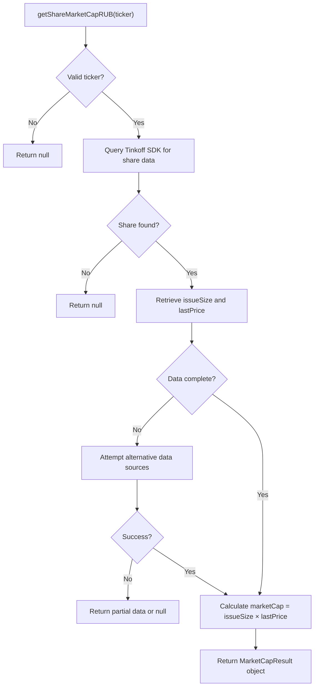
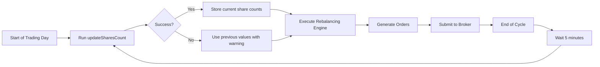

# Portfolio Maintenance Tools

<cite>
**Referenced Files in This Document **   
- [shareCap.ts](file://src/tools/shareCap.ts)
- [updateSharesCount.ts](file://src/tools/updateSharesCount.ts)
- [etfCap.ts](file://src/tools/etfCap.ts)
- [pollEtfMetrics.ts](file://src/tools/pollEtfMetrics.ts)
</cite>

## Table of Contents
1. [Introduction](#introduction)
2. [Core Components](#core-components)
3. [shareCap.ts Functionality](#sharecapts-functionality)
4. [updateSharesCount.ts Purpose and Integration](#updatesharescountts-purpose-and-integration)
5. [Integration with Rebalancing Engine](#integration-with-rebalancing-engine)
6. [Execution Timing and Order Generation Impact](#execution-timing-and-order-generation-impact)
7. [Configuration Examples](#configuration-examples)
8. [Failure Modes and API Unavailability](#failure-modes-and-api-unavailability)
9. [Discrepancy Detection and Reconciliation Strategies](#discrepancy-detection-and-reconciliation-strategies)
10. [Best Practices for Data Consistency](#best-practices-for-data-consistency)

## Introduction
This document details the portfolio maintenance utilities within the Tinkoff Invest ETF Balancer Bot, focusing on two critical tools: `shareCap.ts` and `updateSharesCount.ts`. These utilities ensure accurate position sizing and synchronization between local state and broker records. The system maintains data integrity by enforcing maximum position size limits based on user-defined thresholds and periodically reconciling local share count records with actual holdings from the Tinkoff API. These components integrate tightly with the main rebalancing engine to ensure reliable order generation and portfolio management.

## Core Components

The portfolio maintenance system consists of several key components that work together to maintain accurate portfolio state:

- **shareCap.ts**: Enforces maximum position size limits by calculating market capitalization for shares.
- **updateSharesCount.ts**: Synchronizes local share count records with official announcements from fund providers via news parsing.
- **etfCap.ts**: Retrieves ETF and share market capitalization data using the Tinkoff SDK.
- **pollEtfMetrics.ts**: Aggregates various ETF metrics including share counts for analysis and reporting.

These tools collectively ensure that the bot operates with accurate, up-to-date information about portfolio composition and market conditions.

**Section sources**
- [shareCap.ts](file://src/tools/shareCap.ts#L1-L10)
- [updateSharesCount.ts](file://src/tools/updateSharesCount.ts#L1-L144)
- [etfCap.ts](file://src/tools/etfCap.ts#L1-L695)

## shareCap.ts Functionality

The `shareCap.ts` module provides functionality for enforcing maximum position size limits in portfolios based on user-defined thresholds. It implements the `getShareMarketCapRUB` function which calculates the market capitalization of shares in RUB currency.

Currently, this file contains a stub implementation that returns null for any ticker input, serving as a placeholder until full functionality is implemented. The intended purpose is to prevent logic errors in dependent modules while development continues. When fully implemented, this utility will retrieve share issuance size and last traded price through the Tinkoff SDK to calculate market cap as the product of outstanding shares and current price.

The module is designed to handle both direct ticker lookups and normalized ticker formats, ensuring compatibility across different data sources. Error handling is implemented to return null on any failure condition rather than throwing exceptions, maintaining system stability during market data retrieval operations.



**Diagram sources **
- [shareCap.ts](file://src/tools/shareCap.ts#L4-L8)
- [etfCap.ts](file://src/tools/etfCap.ts#L527-L572)

**Section sources**
- [shareCap.ts](file://src/tools/shareCap.ts#L1-L10)
- [etfCap.ts](file://src/tools/etfCap.ts#L527-L572)

## updateSharesCount.ts Purpose and Integration

The `updateSharesCount.ts` utility synchronizes local share count records with actual holdings from Tinkoff API by parsing official news announcements. This tool extracts the total number of shares (paev) from markdown news files published by fund managers and stores them in JSON format for downstream consumption.

The process begins by scanning the `/news/{symbol}/` directory for markdown files containing share count information. It uses pattern matching to identify relevant news items, looking for phrases like "total shares", "quantity of shares", or "general quantity of shares" in both English and Russian. The parser handles various numeric formats including millions ("млн") and thousands ("тыс"), converting them to absolute numbers.

Once extracted, the share count is written to `shares_count/{symbol}.json`, creating the directory if necessary. The tool supports both single execution mode (`--once`) and continuous polling mode with configurable intervals (default 300,000ms). Multiple symbols can be processed simultaneously by comma-separating inputs.

This component serves as a critical bridge between official fund disclosures and the bot's internal state management, ensuring that portfolio calculations are based on accurate share issuance data rather than potentially outdated cached values.

```mermaid
sequenceDiagram
participant User as CLI/User
participant UpdateTool as updateSharesCount.ts
participant NewsDir as /news/{symbol}/
participant OutputDir as /shares_count/
User->>UpdateTool : Execute with symbol(s)
UpdateTool->>NewsDir : Scan for .md files
NewsDir-->>UpdateTool : Return sorted list (newest first)
loop Each news file
UpdateTool->>UpdateTool : Parse content
UpdateTool->>UpdateTool : Extract shares count
alt Valid count found
UpdateTool->>OutputDir : Write {symbol}.json
UpdateTool->>User : Log success
break Return result
end
end
alt No valid count found
UpdateTool->>User : Log warning
end
```

**Diagram sources **
- [updateSharesCount.ts](file://src/tools/updateSharesCount.ts#L85-L122)
- [updateSharesCount.ts](file://src/tools/updateSharesCount.ts#L0-L35)

**Section sources**
- [updateSharesCount.ts](file://src/tools/updateSharesCount.ts#L1-L144)
- [pollEtfMetrics.ts](file://src/tools/pollEtfMetrics.ts#L77-L97)

## Integration with Rebalancing Engine

The portfolio maintenance tools integrate closely with the main rebalancing engine through shared data directories and synchronous execution patterns. The `updateSharesCount.ts` utility feeds into the rebalancing process by providing accurate share count data that influences position sizing decisions.

When the rebalancing engine executes, it relies on fresh share count information to calculate proper allocation percentages. The `pollEtfMetrics.ts` module consumes the JSON files produced by `updateSharesCount.ts` to incorporate current share counts into its metric calculations. This creates a dependency chain where timely execution of maintenance utilities directly impacts the accuracy of rebalancing decisions.

The integration follows a producer-consumer pattern:
- **Producer**: `updateSharesCount.ts` produces updated share count files
- **Consumer**: `pollEtfMetrics.ts` and rebalancer consume these files for decision making

Error handling is implemented to allow graceful degradation when share count data is unavailable, falling back to previous values or estimates rather than halting the entire rebalancing process.

**Section sources**
- [updateSharesCount.ts](file://src/tools/updateSharesCount.ts#L85-L122)
- [pollEtfMetrics.ts](file://src/tools/pollEtfMetrics.ts#L77-L97)

## Execution Timing and Order Generation Impact

The portfolio maintenance utilities operate on different timing schedules that impact order generation in distinct ways:

- **Pre-rebalance execution**: `updateSharesCount.ts` should ideally run immediately before rebalancing to ensure the most current share count data is used in calculations. This prevents orders from being generated based on stale information that could lead to incorrect position sizes.

- **Periodic sync**: By default, `updateSharesCount.ts` runs every 5 minutes (300,000ms) in continuous mode, keeping local state synchronized with external sources throughout the trading day.

The timing of these utilities directly affects order generation quality. Fresh share count data ensures that percentage-based allocations translate accurately into lot quantities. When share counts are outdated, the same percentage allocation might represent significantly different monetary values, leading to portfolio drift.

Delayed execution or failures in the maintenance utilities trigger fallback behaviors:
- Use of cached/share count data
- Warning logs instead of process termination
- Continued operation with potentially suboptimal parameters



**Diagram sources **
- [updateSharesCount.ts](file://src/tools/updateSharesCount.ts#L85-L122)
- [updateSharesCount.ts](file://src/tools/updateSharesCount.ts#L124-L143)

## Configuration Examples

The portfolio maintenance utilities support flexible configuration through command-line arguments:

For `updateSharesCount.ts`:
```bash
# Single execution for specific symbol
npx ts-node src/tools/updateSharesCount.ts TRUR --once

# Continuous mode with custom interval
npx ts-node src/tools/updateSharesCount.ts TPAY --interval=600000

# Multiple symbols, default interval
npx ts-node src/tools/updateSharesCount.ts TRUR,TPAY,TGLD --once

# Using environment variables
TINKOFF_TOKEN=your_token npx ts-node src/tools/updateSharesCount.ts TRUR --once
```

Default configuration values:
- **DEFAULT_SYMBOL**: 'TRUR' (falls back if no symbol provided)
- **runOnce**: true by default (single execution unless otherwise specified)
- **intervalMs**: 300,000ms (5 minutes) when running in continuous mode

The system reads configuration from standard input sources including `.env` files and `CONFIG.json`, with command-line arguments taking precedence over defaults.

**Section sources**
- [updateSharesCount.ts](file://src/tools/updateSharesCount.ts#L124-L143)
- [updateSharesCount.ts](file://src/tools/updateSharesCount.ts#L8-L9)

## Failure Modes and API Unavailability

The portfolio maintenance utilities handle several failure modes gracefully:

**API Unavailability**:
- Network timeouts (10-second limit for HTTP requests)
- Authentication failures
- Rate limiting scenarios
- Service outages

**Local Processing Failures**:
- Missing news directories
- Corrupted markdown files
- Invalid numeric formats in news text
- File system write permissions issues

When failures occur, the utilities follow these principles:
1. **Fail silently where possible**: Return null or previous values rather than crashing
2. **Log comprehensively**: Detailed error messages with context
3. **Maintain availability**: Continue processing other symbols even if one fails
4. **Preserve existing state**: Never overwrite good data with bad data

For `updateSharesCount.ts`, if no matching news is found containing share count information, it logs a warning but does not create an output file, allowing downstream processes to detect missing data through file absence rather than invalid content.

The system includes retry mechanisms in continuous mode, attempting to recover from transient failures during subsequent cycles.

**Section sources**
- [updateSharesCount.ts](file://src/tools/updateSharesCount.ts#L85-L122)
- [updateSharesCount.ts](file://src/tools/updateSharesCount.ts#L135-L138)

## Discrepancy Detection and Reconciliation Strategies

The system employs multiple strategies for detecting and reconciling discrepancies between local state and broker records:

**Detection Methods**:
- Regular polling of official news sources for share count updates
- Comparison of calculated vs. reported values
- Timestamp validation of data sources
- Cross-verification with alternative data points

**Reconciliation Process**:
1. Identify discrepancy through comparison
2. Attempt to resolve using latest official data
3. If resolution fails, log warning and continue with best available data
4. Notify operators through logging system

The `pollEtfMetrics.ts` module plays a key role in discrepancy detection by comparing newly extracted share counts against previously recorded values. Significant changes trigger enhanced logging to alert operators to potential data shifts.

When discrepancies exceed predefined thresholds, the system doesn't automatically adjust positions but flags the issue for review during the next rebalancing cycle, where business logic can determine appropriate corrective actions.

**Section sources**
- [updateSharesCount.ts](file://src/tools/updateSharesCount.ts#L55-L83)
- [pollEtfMetrics.ts](file://src/tools/pollEtfMetrics.ts#L163-L178)

## Best Practices for Data Consistency

To maintain data consistency between local state and broker records, follow these best practices:

1. **Execute maintenance utilities before rebalancing**: Always run `updateSharesCount.ts` immediately prior to invoking the rebalancer to ensure fresh data.

2. **Monitor output directories**: Regularly check `/shares_count/` directory for up-to-date JSON files and verify modification timestamps.

3. **Implement health checks**: Create monitoring scripts that validate the presence and reasonableness of share count data.

4. **Use version-controlled configurations**: Store configuration files in version control to track changes over time.

5. **Establish alerting**: Set up notifications for failed executions or missing data files.

6. **Regular auditing**: Periodically compare local share counts against manual verification from official sources.

7. **Handle edge cases**: Account for special situations like corporate actions, fund mergers, or ticker symbol changes.

8. **Maintain clean news directories**: Ensure news files are properly organized by symbol to prevent parsing errors.

Following these practices ensures reliable operation of the portfolio maintenance system and accurate rebalancing decisions.

**Section sources**
- [updateSharesCount.ts](file://src/tools/updateSharesCount.ts#L1-L144)
- [pollEtfMetrics.ts](file://src/tools/pollEtfMetrics.ts#L77-L97)