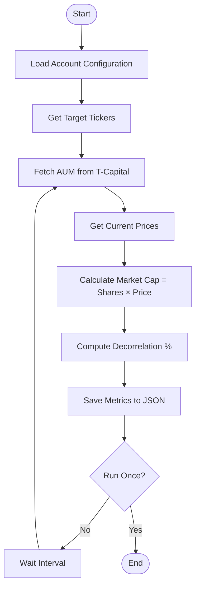
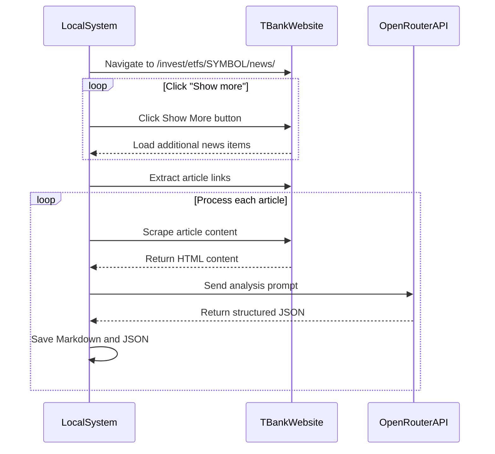
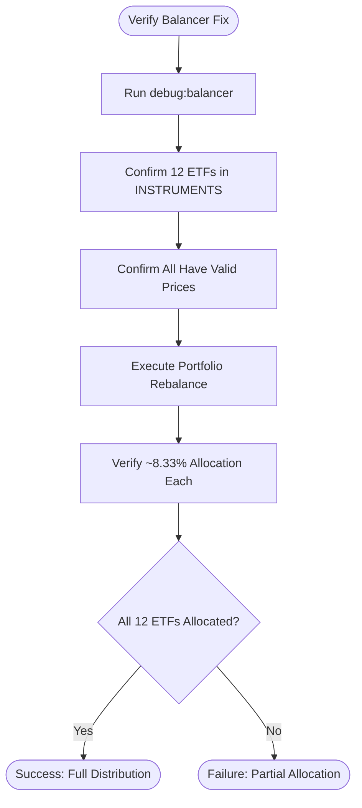

# Tools and Utilities

<cite>
**Referenced Files in This Document**   
- [configManager.ts](file://src/tools/configManager.ts)
- [etfCap.ts](file://src/tools/etfCap.ts)
- [pollEtfMetrics.ts](file://src/tools/pollEtfMetrics.ts)
- [analyzeNews.ts](file://src/tools/analyzeNews.ts)
- [scrapeTbankNews.ts](file://src/tools/scrapeTbankNews.ts)
- [debugBalancer.ts](file://src/tools/debugBalancer.ts)
- [verifyBalancerFix.ts](file://src/tools/verifyBalancerFix.ts)
</cite>

## Table of Contents
1. [Configuration Management](#configuration-management)
2. [ETF Metrics Collection](#etf-metrics-collection)
3. [News Sentiment Analysis](#news-sentiment-analysis)
4. [Debugging Aids](#debugging-aids)
5. [Data Sources and Scraping Methodologies](#data-sources-and-scraping-methodologies)
6. [Performance Characteristics and Rate Limiting](#performance-characteristics-and-rate-limiting)

## Configuration Management

The `configManager.ts` utility provides a command-line interface for managing configuration settings across multiple Tinkoff investment accounts. It enables users to list, validate, and inspect account configurations stored in CONFIG.json.

Key features include:
- Displaying account information including name, ID, token status, rebalancing interval, and target portfolio weights
- Validating configuration integrity by checking for duplicate account IDs and tokens
- Supporting both environment variable-based and directly specified API tokens
- Providing detailed token information and environment setup guidance

Command-line usage:
```
npm run config list                    # List all configured accounts
npm run config show <account_id>      # Show details for specific account
npm run config validate               # Validate configuration integrity
npm run config env                    # Show environment variable setup
npm run config tokens                 # Show token resolution status
```

The tool helps prevent configuration errors by validating that desired weight percentages sum to approximately 100% and identifying potential security issues with token management.

**Section sources**
- [configManager.ts](file://src/tools/configManager.ts#L10-L99)

## ETF Metrics Collection

### etfCap Utility

The `etfCap.ts` tool collects ETF market capitalization data by combining information from the Tinkoff API and T-Capital's website. It calculates market cap as the product of share price and number of shares outstanding.

Key functionalities:
- Fetches ETF instrument data (FIGI, lot size, number of shares) via Tinkoff's gRPC API
- Retrieves last traded prices from market data endpoints
- Scrapes Assets Under Management (AUM) data from T-Capital's statistics page
- Implements multi-level caching for both AUM and market cap data
- Normalizes ticker symbols and handles various API response formats

The tool prioritizes data accuracy by attempting to retrieve share count from multiple API endpoints (etfs, etfBy, getAssetBy) before falling back to deriving it from AUM and price data.

### pollEtfMetrics Utility

The `pollEtfMetrics.ts` script continuously monitors ETF metrics through periodic data collection. It integrates multiple data sources to provide comprehensive ETF analysis:

- Collects share count data from T-Bank's Smartfeed API using brand-specific news feeds
- Falls back to local cache (`shares_count/<symbol>.json`) when API data is unavailable
- Calculates market capitalization as shares × current price
- Computes decorrelation percentage: `(marketCap - AUM) / AUM * 100`
- Stores results in JSON format under `etf_metrics/` directory

The utility runs in two modes:
- One-time execution: `bun run tools/pollEtfMetrics.ts SYMBOL --once`
- Continuous polling: Configurable interval (default: 1 hour)



**Section sources**
- [etfCap.ts](file://src/tools/etfCap.ts#L352-L451)
- [pollEtfMetrics.ts](file://src/tools/pollEtfMetrics.ts#L248-L361)

## News Sentiment Analysis

### scrapeTbankNews Utility

The `scrapeTbankNews.ts` tool uses Puppeteer to extract news articles from T-Bank's investment platform. It navigates fund news pages, clicks "Show more" buttons to load historical content, and saves articles as Markdown files.

Key scraping methodology:
- Launches headless Chrome browser with appropriate user agent
- Navigates to fund-specific news URL (`/invest/etfs/SYMBOL/news/`)
- Automatically clicks "Show more" buttons until target link count reached
- Extracts article title, date, and body text using multiple selector strategies
- Saves content in structured Markdown format with metadata
- Implements concurrency limits to avoid overwhelming the server

The scraper handles pagination through cursor-based navigation and maintains a record of processed news items to avoid duplicates.

### analyzeNews Utility

The `analyzeNews.ts` tool processes scraped news articles using OpenRouter's AI models to extract structured financial insights. It sends article content to LLM endpoints and parses the JSON responses.

Processing workflow:
1. Reads Markdown news files from `news/SYMBOL/` directory
2. Constructs prompt with financial analysis instructions
3. Calls OpenRouter API with configured model (default: qwen/qwen3-235b-a22b-2507)
4. Extracts structured JSON containing summary, trades, and key figures
5. Saves analysis results as JSON in `news_meta/SYMBOL/` directory

The analysis extracts critical information such as:
- Rebalancing events with buy/sell trades
- Dividend distributions
- Share redemption details
- Portfolio changes with weight adjustments
- Numerical data normalized to standard units



**Section sources**
- [scrapeTbankNews.ts](file://src/tools/scrapeTbankNews.ts#L122-L307)
- [analyzeNews.ts](file://src/tools/analyzeNews.ts#L50-L183)

## Debugging Aids

### debugBalancer Utility

The `debugBalancer.ts` tool diagnoses issues in the portfolio balancing process by verifying instrument availability and price data accessibility. It systematically checks each ETF in the desired portfolio against the Tinkoff API.

Diagnostic capabilities:
- Validates that all configured ETFs exist in the instruments list
- Confirms that last price data can be retrieved for each ETF
- Displays detailed instrument information (FIGI, lot size, currency)
- Identifies missing or inaccessible instruments
- Provides recommendations for resolving connectivity issues

The tool outputs a comprehensive summary showing successful vs. failed ETF processing, helping identify why certain funds might be excluded from rebalancing operations.

### verifyBalancerFix Utility

The `verifyBalancerFix.ts` script confirms the effectiveness of fixes to the portfolio balancer logic. It specifically addresses an issue where new positions with zero initial holdings were not being properly allocated.

Verification focuses on:
- Ensuring all 12 configured ETFs are processed (not just 3)
- Confirming proper allocation (~8.33% each) across the entire portfolio
- Validating that new positions receive minimum lot purchases
- Checking final value calculations for zero-amount positions

The verification process involves running the debug balancer and examining actual balancing results to confirm uniform distribution across all target ETFs.



**Section sources**
- [debugBalancer.ts](file://src/tools/debugBalancer.ts#L33-L192)
- [verifyBalancerFix.ts](file://src/tools/verifyBalancerFix.ts#L1-L74)

## Data Sources and Scraping Methodologies

### T-Capital Website (t-capital-funds.ru)

The primary source for Assets Under Management (AUM) data, accessed via HTTP requests to `/statistics/`. The scraping methodology includes:

- Direct HTML fetching with axios
- Robust table extraction using header pattern matching
- Multiple parsing strategies for different ticker patterns
- Currency conversion using exchange rates from Tinkoff API
- Intelligent fallback mechanisms when direct ticker matches fail

### T-Bank News Platform (tbank.ru/invest)

Accessed through both direct web scraping and API consumption:

1. **Web Scraping Approach**:
   - Uses Puppeteer for browser automation
   - Handles dynamic content loading via "Show more" button interaction
   - Implements scroll-to-bottom and explicit waits
   - Extracts content using multiple selector fallbacks
   - Preserves article structure while removing navigation elements

2. **Smartfeed API Approach**:
   - Consumes JSON API at `/api/invest/smartfeed-public/v1/feed/api/brands/`
   - Maps ETF tickers to brand names (e.g., TPAY → "Пассивный доход")
   - Processes news items with additional fields containing share count
   - Handles cursor-based pagination for historical data
   - Includes rate limiting and error recovery

Both approaches implement intelligent normalization of numerical values, handling various formatting conventions (thousands separators, decimal markers, unit suffixes).

**Section sources**
- [etfCap.ts](file://src/tools/etfCap.ts#L352-L428)
- [scrapeTbankNews.ts](file://src/tools/scrapeTbankNews.ts#L208-L307)
- [pollEtfMetrics.ts](file://src/tools/pollEtfMetrics.ts#L154-L224)

## Performance Characteristics and Rate Limiting

### Caching Strategy

Both `etfCap.ts` and `pollEtfMetrics.ts` implement multi-layer caching to minimize external requests:

- **AUM Cache**: Stored in `.aum-cache-<accountId>.json` with configurable TTL (default: 1 hour)
- **Market Cap Cache**: Stored in `.marketcap-cache-<accountId>.json` 
- **Shares Count Cache**: Maintained in `shares_count/<symbol>.json`

Cache validation checks timestamp age against configured TTL, reducing redundant website scraping.

### Rate Limiting Considerations

External interactions are designed with respect for service limitations:

- **T-Capital Website**: 
  - 10-second timeout on HTTP requests
  - Conservative polling frequency (hourly by default)
  - Error handling for failed requests without retries

- **T-Bank Platform**:
  - Headless browser with realistic user agent
  - 2-second delay between "Show more" clicks
  - Limited concurrency (3 parallel scrapers)
  - 5-minute default polling interval for news scraping

- **Tinkoff API**:
  - Token-based authentication with environment variable support
  - Error handling for rate limit responses
  - Graceful degradation when data is unavailable

### Performance Optimization

Key performance features:
- Parallel processing where applicable
- Efficient data structure usage (Sets for deduplication)
- Minimal memory footprint through streaming operations
- Configurable polling intervals to balance freshness vs. load
- Comprehensive error handling to prevent cascading failures

The tools prioritize reliability over speed, implementing defensive programming practices to handle transient network issues and API changes.

**Section sources**
- [etfCap.ts](file://src/tools/etfCap.ts#L352-L428)
- [pollEtfMetrics.ts](file://src/tools/pollEtfMetrics.ts#L248-L361)
- [scrapeTbankNews.ts](file://src/tools/scrapeTbankNews.ts#L122-L307)