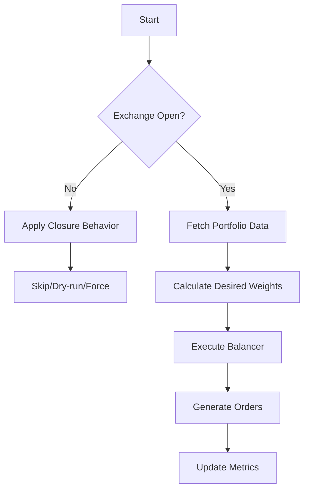
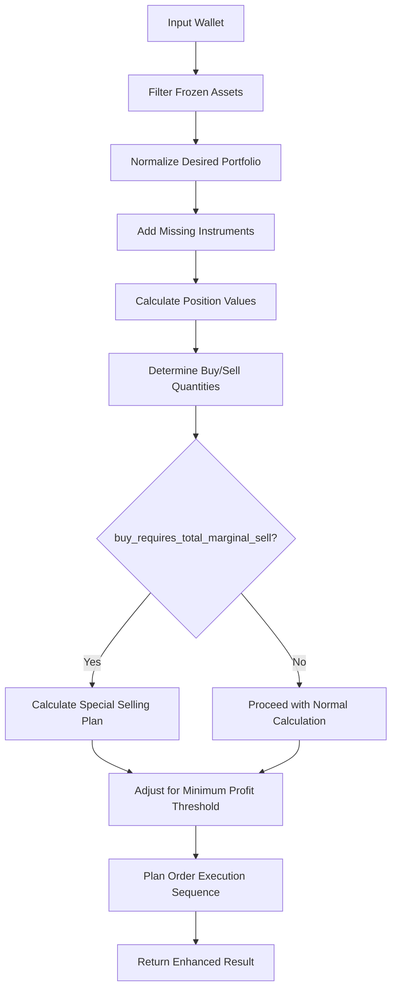

# Troubleshooting Guide

<cite>
**Referenced Files in This Document**   
- [debug_with_logs.ts](file://debug_with_logs.ts)
- [src/tools/debugBalancer.ts](file://src/tools/debugBalancer.ts)
- [src/provider/index.ts](file://src/provider/index.ts)
- [src/balancer/index.ts](file://src/balancer/index.ts)
- [src/utils/marginCalculator.ts](file://src/utils/marginCalculator.ts)
</cite>

## Table of Contents
1. [Introduction](#introduction)
2. [Authentication Failures](#authentication-failures)
3. [Configuration Errors](#configuration-errors)
4. [API Rate Limits](#api-rate-limits)
5. [Order Execution Failures](#order-execution-failures)
6. [Unexpected Rebalancing Behavior](#unexpected-rebalancing-behavior)
7. [Debugging Utilities and Logging](#debugging-utilities-and-logging)
8. [Best Practices for Testing and Experimentation](#best-practices-for-testing-and-experimentation)

## Introduction
This guide provides comprehensive troubleshooting procedures for common issues encountered when using the Tinkoff Invest ETF Balancer Bot. The document is organized by issue categories, including authentication failures, configuration errors, API rate limits, order execution problems, and unexpected rebalancing behavior. For each category, diagnostic steps, log analysis techniques, and resolution procedures are provided. Additionally, guidance on enabling verbose logging, interpreting debug output from components like provider and balancer, and utilizing debugging utilities such as `debug_with_logs.ts` and test scripts to isolate problematic components are included.

**Section sources**
- [src/provider/index.ts](file://src/provider/index.ts#L85-L106)
- [src/balancer/index.ts](file://src/balancer/index.ts#L286-L813)

## Authentication Failures
Authentication failures typically occur due to missing or invalid API tokens. These issues prevent the bot from accessing the Tinkoff Investment API and result in immediate termination during startup.

### Diagnostic Steps
1. Check if the error message contains "No token found for account"
2. Verify that either `T_INVEST_TOKEN` environment variable is set or a token is specified in `CONFIG.json`
3. Confirm that the token has appropriate permissions for the requested account type (ISS or BROKER)

### Log Analysis Techniques
When authentication fails, the following log pattern appears:
```
Error: No token found for account <account_id>. Please set token in CONFIG.json or T_INVEST_TOKEN in .env
```

The system attempts to retrieve the token first from the account configuration in `CONFIG.json`, then falls back to the `T_INVEST_TOKEN` environment variable.

### Resolution Procedures
1. Set the `T_INVEST_TOKEN` environment variable with a valid API token
2. Alternatively, add the token directly to the account configuration in `CONFIG.json` using the `t_invest_token` field
3. Ensure the token has the necessary scopes enabled in the Tinkoff API portal
4. Restart the application after making configuration changes

**Section sources**
- [src/provider/index.ts](file://src/provider/index.ts#L95-L103)

## Configuration Errors
Configuration errors arise from malformed JSON files, incorrect field names, or invalid values in the configuration. These can lead to runtime exceptions or unexpected behavior.

### Common Issues
- Missing required fields in account configurations
- Invalid data types for numeric fields
- Incorrect ticker symbols in desired portfolios
- Malformed JSON syntax in configuration files

### Diagnostic Steps
1. Validate JSON syntax using standard tools
2. Check for presence of required fields: `id`, `name`, `account_id`, `desired_wallet`
3. Verify that all tickers in `desired_wallet` exist in the Tinkoff instrument list
4. Confirm numeric fields have appropriate values (positive numbers, reasonable percentages)

### Log Analysis Techniques
Configuration-related errors often produce messages indicating missing accounts:
```
Error: No accounts found in CONFIG.json
```

Or specific account lookup failures:
```
Error: Account with id '<account_id>' not found in CONFIG.json
```

### Resolution Procedures
1. Use `CONFIG.example.json` as a template for proper structure
2. Validate JSON format using online validators or IDE tools
3. Ensure all account IDs referenced in environment variables exist in the configuration
4. Cross-reference ticker symbols with official Tinkoff ETF listings
5. Test configuration with validation scripts before deployment

**Section sources**
- [src/balancer/index.ts](file://src/balancer/index.ts#L29-L45)
- [src/provider/index.ts](file://src/provider/index.ts#L75-L83)

## API Rate Limits
API rate limiting occurs when the application exceeds the allowed number of requests to the Tinkoff Investment API within a given time window. This can cause temporary service disruptions.

### Diagnostic Steps
1. Monitor for HTTP 429 (Too Many Requests) responses
2. Check logs for failed API calls with retry patterns
3. Analyze request frequency against documented rate limits
4. Identify components making excessive API calls

### Log Analysis Techniques
Rate limit issues may manifest as repeated API call failures followed by retries:
```
Error placing order
[Error details]
Retrying in X seconds...
```

The provider component includes built-in retry logic that can indicate rate limiting through repeated failure patterns.

### Resolution Procedures
1. Implement exponential backoff in retry logic
2. Cache API responses where possible to reduce redundant calls
3. Optimize polling intervals in configuration
4. Distribute API calls evenly across time windows
5. Monitor actual usage against Tinkoff's published rate limits

**Section sources**
- [src/provider/index.ts](file://src/provider/index.ts#L370-L375)

## Order Execution Failures
Order execution failures occur when the system cannot complete buy or sell operations through the Tinkoff API. These can stem from various causes including insufficient funds, market conditions, or technical issues.

### Common Scenarios
- Insufficient available funds for purchases
- Attempting to trade during market closure
- Invalid lot sizes or quantities
- Frozen assets preventing position adjustments

### Diagnostic Steps
1. Check RUB balance availability before purchase attempts
2. Verify market status using exchange schedule APIs
3. Confirm position lot sizes match exchange requirements
4. Identify frozen assets that may block trades

### Log Analysis Techniques
Key indicators of order execution issues include:
- Messages about blocked/frozen positions
- Warnings about insufficient RUB balance
- Exchange closure notifications
- Lot size validation errors

The system logs detailed information about frozen assets:
```
❄️ FROZEN ASSETS DETECTED:
   - <ticker>: <amount> units (<blocked_lots> lots blocked) - Value: <value> RUB
   Total Frozen Value: <total_frozen> RUB (<percentage>% of portfolio)
```

### Resolution Procedures
1. Wait for frozen assets to become available
2. Adjust desired portfolio weights to reflect available capital
3. Schedule trades during active market hours
4. Ensure sufficient RUB liquidity for intended purchases
5. Handle partial fills gracefully in subsequent balancing cycles

**Section sources**
- [src/provider/index.ts](file://src/provider/index.ts#L240-L279)
- [src/balancer/index.ts](file://src/balancer/index.ts#L300-L305)

## Unexpected Rebalancing Behavior
Unexpected rebalancing behavior refers to situations where the bot produces different results than anticipated based on the configured desired portfolio.

### Common Causes
- Instrument not found in INSTRUMENTS array
- Price fetching failures for specific ETFs
- Margin trading strategy interference
- Minimum profit threshold blocking sales
- Special selling plans altering execution order

### Diagnostic Steps
1. Use `debugBalancer.ts` to analyze instrument availability
2. Verify price data retrieval for all configured ETFs
3. Check margin strategy application timing
4. Review minimum profit thresholds for closing positions
5. Examine special selling plan calculations

### Log Analysis Techniques
Critical diagnostic information includes:
- Summary of successful vs failed ETF processing
- Details about missing instruments
- Price fetch success/failure rates
- Margin strategy decisions
- Special selling plan calculations

The debug output shows clear success/failure summaries:
```
📊 SUMMARY:
===========
Total ETFs configured: <total>
✅ Successful: <successful> (<list>)
❌ Failed - Instrument not found: <count>
❌ Failed - Price fetch failed: <count>
```

### Resolution Procedures
1. Run `bun run poll:metrics` to collect fresh ETF metrics
2. Verify etf_metrics/*.json files exist for all tickers
3. Check internet connection for live API calls
4. Consider changing desired_mode to 'manual' or 'default'
5. Adjust min_profit_percent_for_close_position settings
6. Validate instrument availability through Tinkoff API

**Section sources**
- [src/tools/debugBalancer.ts](file://src/tools/debugBalancer.ts#L33-L192)
- [src/balancer/index.ts](file://src/balancer/index.ts#L500-L550)

## Debugging Utilities and Logging
The system provides several utilities to aid in debugging and understanding component behavior.

### Enabling Verbose Logging
Verbose logging can be enabled by setting the DEBUG environment variable:
```bash
process.env.DEBUG = 'bot:balancer';
```

This enables detailed debug output from the balancer component, showing step-by-step calculations and decision points.

### Using debug_with_logs.ts
The `debug_with_logs.ts` script provides a standalone testing environment for the balancer with full debug output:
- Sets up a test wallet with sample positions
- Defines a desired portfolio configuration
- Initializes global instrument data
- Executes the balancer with debug mode enabled
- Outputs planned orders and intermediate calculations

### Interpreting Debug Output
Key components of debug output include:
- Portfolio state before and after balancing
- Individual position calculations
- Order planning and execution phases
- Margin strategy decisions
- Final percentage allocations

The provider component logs detailed iteration results:
```
🎯 BALANCING RESULT FOR ACCOUNT: <name> (<id>)
Mode used: <mode>
Format: TICKER: diff: before% -> after% (target%)
```

### Debugging Specific Components
#### Provider Component
The provider handles API interactions and orchestration:


**Diagram sources**
- [src/provider/index.ts](file://src/provider/index.ts#L341-L820)

#### Balancer Component
The balancer calculates optimal portfolio allocations:


**Diagram sources**
- [src/balancer/index.ts](file://src/balancer/index.ts#L286-L813)

**Section sources**
- [src/tools/debugBalancer.ts](file://src/tools/debugBalancer.ts#L247-L282)
- [debug_with_logs.ts](file://debug_with_logs.ts#L0-L84)

## Best Practices for Testing and Experimentation
Safe experimentation and incremental testing are crucial for maintaining portfolio integrity while developing and tuning the balancer.

### Dry-Run Mode
The system supports dry-run mode which simulates balancing without executing actual trades:
- Set `exchange_closure_behavior.mode` to 'dry_run'
- Or pass `dryRun: true` parameter to balancer function
- Review planned orders without financial impact
- Validate calculation accuracy before live execution

### Incremental Testing Approach
1. Start with simple portfolio configurations
2. Gradually introduce complexity (margin trading, special rules)
3. Test one feature at a time
4. Validate results against expectations
5. Document findings and adjust parameters accordingly

### Using Test Scripts
Several test scripts are available to isolate and verify component functionality:
- `debugBalancer.ts` - Comprehensive ETF availability testing
- Integration tests in `__tests__/integration/` directory
- Component-specific unit tests
- Mocked provider environments for isolated testing

### Safe Experimentation Guidelines
1. Always backup current configuration before changes
2. Test new configurations in dry-run mode first
3. Monitor results over multiple cycles before accepting as stable
4. Keep detailed records of configuration changes and outcomes
5. Use version control for configuration files to track changes
6. Limit initial experiments to small portfolio segments

**Section sources**
- [src/balancer/index.ts](file://src/balancer/index.ts#L750-L770)
- [src/provider/index.ts](file://src/provider/index.ts#L450-L470)