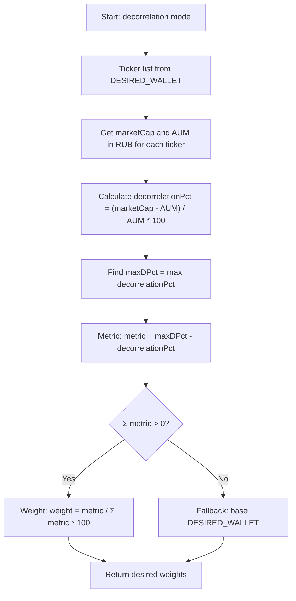
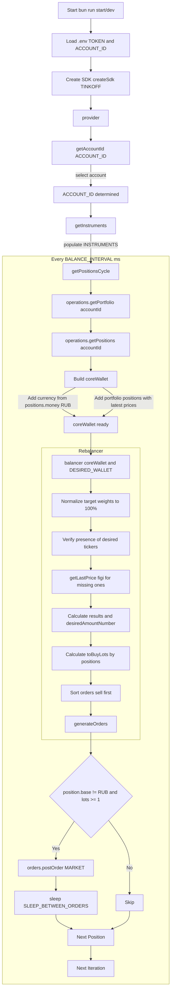

```
████████╗██╗███████╗██████╗ ██████╗
╚══██╔══╝██║██╔════╝██╔══██╗██╔══██╗
   ██║   ██║█████╗  ██████╔╝██████╔╝
   ██║   ██║██╔══╝  ██╔══██╗██╔══██╗
   ██║   ██║███████╗██████╔╝██████╔╝
   ╚═╝   ╚═╝╚══════╝╚═════╝ ╚═════╝
```

# TIEBB - Tinkoff Invest ETF Balancer Bot

[](https://github.com/suenot/deep-tinkoff-invest-api/actions/workflows/test.yml)
[](https://codecov.io/gh/suenot/deep-tinkoff-invest-api)
[](LICENSE)
[](.qoder/repowiki/en/content/)

An automated trading bot for portfolio management and rebalancing on Tinkoff Invest accounts.

## 📋 Table of Contents

- [About](#about)
- [Key Features](#key-features)
- [Quick Start](#quick-start)
- [Installation](#installation)
- [Configuration](#configuration)
- [Usage](#usage)
- [Documentation](#documentation)
- [Data Sources](#data-sources)

## About

Tinkoff Invest ETF Balancer Bot is an intelligent automated portfolio management system designed to maintain optimal asset allocation across Tinkoff Investment accounts. The bot automates the complex process of portfolio rebalancing, ensuring your investments remain aligned with target allocations despite market fluctuations.

This project participates in the [Tinkoff Invest Robot Contest](https://github.com/Tinkoff/invest-robot-contest).

**Application name:** suenot

### ⚠️ Disclaimer

The platform operates in test mode (beta version), software/algorithmic errors are possible, models do not guarantee profitability and may trade at a loss. Users fully accept responsibility for using this product.

### Requirements

**IMPORTANT**: Works only with ruble-denominated stocks and funds. No other instruments should be present in the account for proper operation.

## Key Features

### 🤖 Automatic Portfolio Rebalancing
- Maintains target asset allocation
- Multiple rebalancing modes:
  - **manual** - manual weight distribution
  - **marketcap** - based on market capitalization
  - **aum** - based on assets under management (AUM)
  - **decorrelation** - adaptive strategy based on the difference between capitalization and AUM

### 📊 Multi-Account Support
- Unlimited number of accounts
- Individual settings for each account
- Secure token storage in environment variables
- Automatic configuration validation

### 💰 Margin Trading
- Support for margin instruments
- Configurable risk management strategies
- Minimum profit thresholds for closing positions

### 📈 Advanced Features
- **Buy Requires Total Marginal Sell** - strategy for buying non-margin instruments by selling other positions
- **Minimum Profit Threshold** - protection against premature sales
- **Exchange Closure Behavior** - intelligent behavior when market is closed
- **Sequential Order Execution** - sequential order execution

### 📰 Analysis Tools
- ETF metrics collection (capitalization, AUM)
- T-Bank ETF news parser
- Expense and profit tracking
- Detailed rebalancing reports

## Quick Start

### 🚀 Installation with Bun.js (Recommended)

```bash
# Install Bun.js
curl -fsSL https://bun.sh/install | bash
export PATH="$HOME/.bun/bin:$PATH"

# Clone repository
git clone https://github.com/suenot/tinkoff-invest-etf-balancer-bot.git
cd tinkoff-invest-etf-balancer-bot

# Install dependencies
bun install

# Configure settings
cp .env-example .env
cp CONFIG.example.json CONFIG.json

# Edit configuration files
# Add your tokens to .env
# Set up desired portfolios in CONFIG.json

# Run the bot
bun run start
```

**Advantages of Bun.js:**
- ⚡ Built-in TypeScript support (no ts-node needed)
- 🚀 20-30x faster build times
- 📦 Fewer dependencies
- 🔄 Modern ES modules

## Installation

### System Requirements
- Bun.js 1.0+ (recommended) or Node.js 18+
- Tinkoff Invest API token
- Ruble account with stocks/ETFs

### Getting a Token

1. Go to [Tinkoff Invest settings](https://www.tinkoff.ru/invest/settings)
2. Create a new token with necessary permissions
3. Store the token in a secure location

## Configuration

### 🆕 Multi-Account System

Configuration is stored in `CONFIG.json` and supports multiple accounts with individual settings.

#### Example .env configuration:
```bash
T_INVEST_TOKEN_1=your_first_token_here
T_INVEST_TOKEN_2=your_second_token_here
OPENROUTER_API_KEY=your_api_key_here  # Optional for AI analysis
```

#### Example CONFIG.json:
```json
{
  "accounts": [
    {
      "name": "account_1",
      "token_env_var": "T_INVEST_TOKEN_1",
      "account_id": "your_account_id",
      "balance_interval": 60000,
      "rebalance_mode": "manual",
      "desired_wallet": {
        "TMOS": 25,
        "RUB": 25,
        "TBRU": 25,
        "TRUR": 25
      },
      "min_profit_percent_for_close_position": 5,
      "margin_trading": {
        "enabled": true,
        "free_transfer_threshold": 5
      }
    }
  ]
}
```

### Configuration Management

```bash
# View all accounts
bun run config list

# View specific account details
bun run config show account_1

# Validate configuration
bun run config validate

# Set up environment variables
bun run config env
```

## Usage

### Main Commands

```bash
# Run bot (continuous mode)
bun run start

# Development mode with debug logs
bun run dev

# One-time run
bun run dev -- --once

# List available accounts
bun run accounts

# Check configuration
bun run config validate
```

### Rebalancing Modes

#### Manual
Classic rebalancing with fixed weights:
```json
"desired_wallet": {
  "TMOS": 25,  // 25% Tinkoff iMOEX
  "RUB": 25,   // 25% Rubles
  "TBRU": 25,  // 25% Tinkoff Bonds
  "TRUR": 25   // 25% Tinkoff Perpetual Portfolio
}
```

#### Decorrelation
Adaptive strategy based on the difference between market capitalization and AUM:



### Balancing Example


1000 rubles were balanced into:
- 20% Tinkoff iMOEX (TMOS)
- 20% Rubles
- 20% Tinkoff Perpetual
- 20% VTB Stocks

## Documentation

### 📚 Main Documentation
- [📖 Wiki](.qoder/repowiki/en/content/Overview.md) - complete project documentation
- [⚙️ Configuration Guide](README.config.md)
- [🎯 Bun.js Migration](README.bunjs.md)

### 🔧 Advanced Features
- [Buy Requires Total Marginal Sell](README.buy_requires_total_marginal_sell.md)
- [Margin Trading](README.margin_trading.md)
- [Minimum Profit Threshold](README.min_profit_percent_for_close_position.md)
- [Exchange Closure Behavior](EXCHANGE_CLOSURE_IMPLEMENTATION.md)

### 📊 Monitoring and Tools
- [ETF Metrics Collection](README.poll_etf_metrics.md)
- [Detailed Balancing Output](README.detailed_balancing_output.md)
- [T-Bank News Parser](#t-bank-etf-news-parser)

## Workflow Diagram



## T-Bank ETF News Parser

The script fetches news from `https://www.tbank.ru/invest/etfs/TRUR/news/`, clicks "Show more" until the limit (or specified limit), opens each news item and saves the content to `news/<SYMBOL>/<id>.md`.

### Default run (TRUR):
```bash
bun run scrape:tbank:news
```

### Custom run:
```bash
npx ts-node --transpile-only ./src/tools/scrapeTbankNews.ts <SYMBOL> [--limit=N] [--first-limit=N] [--once] [--interval=MS]
```

Where:
- `--limit=N` — total news limit for current run
- `--first-limit=N` — limit only for first run (when folder is empty)
- `--once` — one-time run (no cycling)
- `--interval=MS` — cycle run frequency in milliseconds (default 300000 = 5 minutes)

### Examples:
```bash
# 10 TRUR news items
bun run scrape:tbank:news -- TRUR --limit=10 --once

# First run: fetch only ~300 news items
bun run scrape:tbank:news -- TRUR --first-limit=300 --once

# Cyclically every 10 minutes
bun run scrape:tbank:news -- TRUR --limit=50 --interval=600000
```

## Data Sources

- **AUM (Assets Under Management)** - https://t-capital-funds.ru/statistics/
- **Number of shares, capitalization** - https://www.tbank.ru/invest/etfs/TDIV@/news/
- **Full fund name + ticker** - https://investfunds.ru/funds/7067/

## Testing

```bash
# Run tests
bun test

# Tests with coverage
bun test:coverage

# Watch mode
bun test:watch
```

## Additional Notes

Originally, a [bot with associative data structure](https://github.com/suenot/deep-tinkoff-invest) was being prepared for the contest, but due to time constraints, a simpler task was chosen.

## Contributing

Contributions are welcome! See [CONTRIBUTING.md](CONTRIBUTING.md) for details.

## License

This project is licensed under the Apache License 2.0 License - see the [LICENSE](LICENSE) file for details.
