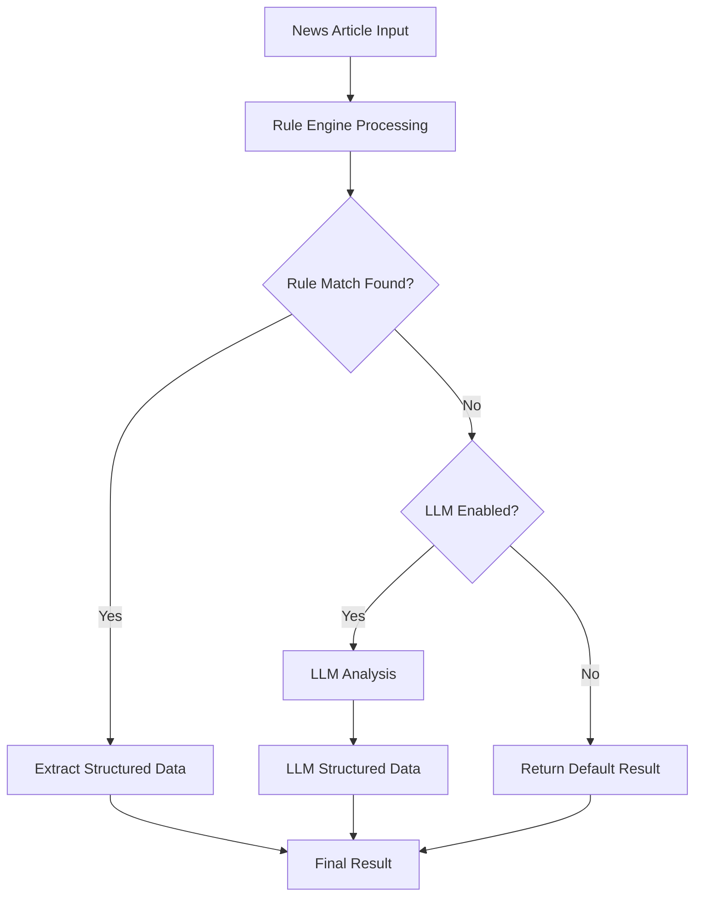

# Hybrid News Analysis System

A sophisticated news analysis system that combines rule-based pattern matching with Large Language Model (LLM) fallback capabilities for processing financial news.

## 🎯 Overview

The Hybrid News Analysis system optimizes for performance, cost efficiency, and reliability by:

- **Prioritizing rule-based processing** for common news scenarios (dividends, redemptions, trading tables)
- **Falling back to LLM analysis** only when rules fail to match or when explicitly enabled
- **Providing comprehensive monitoring** and performance tracking
- **Maintaining backward compatibility** with existing news analysis workflows

## 🏗️ Architecture



### Core Components

| Component | Responsibility | Input | Output |
|-----------|---------------|-------|---------|
| **Rule Engine** | Pattern matching for common news types | Raw news content | Structured data or null |
| **LLM Processor** | Fallback analysis for complex content | Raw news content | Structured data |
| **Coordinator** | Orchestrates rule-based → LLM flow | News articles | Final analysis results |
| **Configuration Manager** | Controls LLM enablement and rule sets | Config flags | Runtime behavior |
| **Monitor** | Tracks performance and provides insights | Processing results | Statistics and reports |

## 🚀 Quick Start

### Basic Usage

```typescript
import { HybridNewsAnalysis, createNewsContent } from './hybridNewsAnalysis';

// Create analyzer instance
const analyzer = new HybridNewsAnalysis();

// Create news content
const news = createNewsContent(
  'news-001',
  'TRUR',
  'Дивидендные выплаты',
  'Фонд TRUR объявляет о выплате дивидендов в размере 10 рублей...',
  '2023-12-01'
);

// Analyze news
const result = await analyzer.analyzeNews(news);

console.log(`Category: ${result.category}`);
console.log(`Method: ${result.processingMethod}`);
console.log(`Confidence: ${result.confidence}`);
```

### With Custom Configuration

```typescript
const analyzer = new HybridNewsAnalysis({
  enabled: true,
  llmFallback: {
    enabled: true,        // Enable LLM fallback
    confidenceThreshold: 0.7,
    maxRetries: 3,
    timeoutMs: 30000
  },
  rules: {
    enabled: true,
    confidenceThreshold: 0.6,
    strictMode: false
  },
  monitoring: {
    enabled: true,
    logLevel: 'info'
  }
});
```

## 📊 Processing Methods

| Method | Description | Use Case |
|--------|-------------|----------|
| `RULE_BASED` | Pure rule-based processing | High-confidence patterns |
| `LLM_FALLBACK` | LLM after rule failure | Complex or unusual content |
| `LLM_VALIDATION` | LLM validates rule results | Medium-confidence rules |
| `LLM_FORCED` | Skip rules, use LLM directly | Manual override scenarios |

### Force Specific Processing Method

```typescript
// Force LLM processing
const llmResult = await analyzer.analyzeWithMethod(
  news,
  ProcessingMethod.LLM_FORCED
);

// Use rules with LLM validation
const validatedResult = await analyzer.analyzeWithMethod(
  news,
  ProcessingMethod.LLM_VALIDATION
);
```

## 🔧 Configuration

### Environment Variables

| Variable | Description | Default |
|----------|-------------|---------|
| `HYBRID_ANALYSIS_ENABLED` | Enable/disable hybrid analysis | `true` |
| `HYBRID_LLM_FALLBACK_ENABLED` | Enable LLM fallback | `false` |
| `HYBRID_LLM_CONFIDENCE_THRESHOLD` | LLM confidence threshold | `0.7` |
| `HYBRID_RULES_CONFIDENCE_THRESHOLD` | Rules confidence threshold | `0.7` |
| `HYBRID_LOG_LEVEL` | Logging level | `info` |
| `OPENROUTER_API_KEY` | OpenRouter API key for LLM | - |
| `OPENROUTER_MODEL` | LLM model to use | `openrouter/auto` |

### Runtime Configuration

```typescript
// Update configuration at runtime
analyzer.updateConfig({
  llmFallback: { enabled: false },
  rules: { confidenceThreshold: 0.8 }
});

// Get current configuration
const config = analyzer.getConfig();
```

## 📋 Rule-Based Processing

### Built-in Rules

The system includes pre-configured rules for:

- **Dividends**: Detection of dividend announcements and payment information
- **Share Redemption**: Parsing of share buyback and redemption news
- **Rebalancing**: Extraction of trading operations and portfolio changes
- **Fund Updates**: General fund management and policy changes

### Adding Custom Rules

```typescript
const customRule = {
  name: 'my_custom_rule',
  pattern: /special pattern/i,
  category: NewsCategory.OTHER,
  priority: 5,
  extractor: (content, match) => ({
    category: NewsCategory.OTHER,
    summary: 'Custom rule matched',
    bullets: ['Custom bullet point']
  }),
  validator: (data) => ({
    isValid: true,
    errors: [],
    warnings: []
  })
};

analyzer.addCustomRule(customRule);
```

## 📈 Monitoring and Performance

### Performance Statistics

```typescript
// Get performance stats
const stats = analyzer.getPerformanceStats();
console.log(`Rule success rate: ${stats.ruleBasedSuccessRate * 100}%`);
console.log(`Average processing time: ${stats.averageProcessingTime}ms`);
console.log(`API calls: ${stats.totalApiCalls}`);
console.log(`Estimated cost: $${stats.estimatedCost}`);

// Print detailed report
analyzer.printPerformanceReport();
```

### Health Monitoring

```typescript
// Check system health
const health = analyzer.getHealthStatus();
console.log(`Status: ${health.status}`); // 'healthy', 'warning', or 'error'
console.log(`Message: ${health.message}`);

// Get recommendations
health.recommendations.forEach(rec => {
  console.log(`💡 ${rec}`);
});
```

### Export Metrics

```typescript
// Export as JSON
const jsonMetrics = analyzer.exportMetrics('json');

// Export as CSV
const csvMetrics = analyzer.exportMetrics('csv');

// Clear metrics
analyzer.clearMetrics();
```

## 🔄 Integration with Existing Code

The hybrid analysis system is designed to be backward compatible with existing `analyzeNews.ts` workflows.

### Gradual Migration

1. **Phase 1**: Enable hybrid analysis with LLM fallback disabled
   ```bash
   export HYBRID_ANALYSIS_ENABLED=true
   export HYBRID_LLM_FALLBACK_ENABLED=false
   ```

2. **Phase 2**: Enable LLM fallback for better coverage
   ```bash
   export HYBRID_LLM_FALLBACK_ENABLED=true
   ```

3. **Phase 3**: Fine-tune confidence thresholds based on performance data

### Legacy Mode

If you need to disable hybrid analysis entirely:

```bash
export HYBRID_ANALYSIS_ENABLED=false
```

This will fall back to the original LLM-only processing.

## 📝 Output Format

```typescript
interface HybridAnalysisResult {
  processingMethod: ProcessingMethod;
  category: NewsCategory;
  confidence: number;
  extractedData: {
    id: string;
    symbol: string;
    title: string;
    date: string;
    category: NewsCategory;
    summary: string;
    bullets: string[];
    trades: TradeData[];
    additionalFields: Record<string, string>;
    numbers: {
      redeemedShares?: number;
      redeemedAmountRub?: number;
      totalShares?: number;
      navPriceRub?: number;
    };
  };
  processingTimeMs: number;
  fallbackUsed: boolean;
  metadata: {
    ruleMatches: RuleMatch[];
    llmUsed: boolean;
    apiCalls: number;
    errors: string[];
    validationResults: ValidationResult[];
  };
}
```

## 🎛️ Advanced Features

### Batch Processing

```typescript
const newsArray = [news1, news2, news3];
const results = await analyzer.analyzeMultipleNews(newsArray);
```

### Rule Management

```typescript
// List available rules
const rules = analyzer.getAvailableRules();

// Remove a rule
analyzer.removeRule('dividend_detection');

// Get rule by name
const ruleEngine = analyzer.getRuleEngine();
const rule = ruleEngine.getRuleByName('dividend_detection');
```

### Recent Processing History

```typescript
// Get last 10 processed items
const recent = analyzer.getRecentMetrics(10);

// Get processing stats for last 2 hours
const recentStats = analyzer.getPerformanceStats(2);
```

## 🔍 Troubleshooting

### Common Issues

1. **High LLM fallback rate**: Consider improving rule patterns
2. **Slow processing**: Check LLM timeout settings and API latency
3. **Low confidence scores**: Review and adjust confidence thresholds
4. **API errors**: Verify OpenRouter API key and model availability

### Debug Mode

Enable debug logging:

```bash
export HYBRID_LOG_LEVEL=debug
```

### Performance Optimization

1. **Rule Optimization**: Add rules for frequently encountered patterns
2. **LLM Usage**: Enable only when necessary for cost control
3. **Caching**: Consider implementing result caching for similar content
4. **Batch Processing**: Use batch mode for processing multiple articles

## 📜 License

This hybrid analysis system is part of the tinkoff-invest-etf-balancer-bot project and follows the same license terms.

## 🤝 Contributing

When contributing to the hybrid analysis system:

1. Add tests for new rules and functionality
2. Update documentation for new features
3. Follow the existing code style and patterns
4. Consider backward compatibility
5. Add performance benchmarks for significant changes